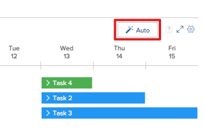

# Atribuir automaticamente tarefas e problemas não atribuídos nas áreas de Agendamento

>[!IMPORTANT]
>  
>A funcionalidade de Agendamento descrita neste artigo foi descontinuada e removida do Adobe Workfront a partir da versão 23.1 em janeiro de 2023.   
>  
>  Este artigo também será removido logo após a versão 23.1, no início de 2023. Nesse momento, recomendamos que você atualize todos os marcadores adequadamente. 
> 
> Agora você pode usar o Balanceador de Carga de Trabalho para agendar o trabalho de seus recursos. 
>  
> Para obter informações sobre como programar recursos usando o Balanceador de Carga de Trabalho, consulte a seção [O Balanceador de Carga de Trabalho](../../resource-mgmt/workload-balancer/workload-balancer.md). 

<!-- 

>[!CAUTION] 
> 
> 
> The information in this article refers to the Adobe Workfront's Scheduling tools. The Scheduling areas have been removed from the Preview environment and will be removed from the Production environment in **January 2023**.  
>  Instead, you can schedule resources in the Workload Balancer.  
> 
>*  For information about scheduling resources using the Workload Balancer, see the section [The Workload Balancer](../../resource-mgmt/workload-balancer/workload-balancer.md). 
> 
>*  For more information about the deprecation and removal of the Scheduling tools, see [Deprecation of Resource Scheduling tools in Adobe Workfront](../../resource-mgmt/resource-mgmt-overview/deprecate-resource-scheduling.md). 
-->

Ao usar as ferramentas de Agendamento, você pode permitir que a Adobe Workfront analise as atribuições de trabalho atuais em todos os usuários disponíveis e proponha atribuições lógicas e inteligentes para quaisquer tarefas ou problemas que ainda não tenham sido atribuídos. Você pode modificar quaisquer atribuições propostas antes de finalizá-las.

O Workfront observa as tarefas e os problemas disponíveis na área Não atribuído dentro do intervalo de datas selecionado no momento e propõe atribuições para cada item de uma só vez. Você pode criar um filtro para limitar o número de itens disponíveis na área Não atribuído.

O administrador do sistema determina como a Workfront calcula a disponibilidade de recursos no nível do sistema (considerando horas e a disponibilidade do FTE). Dependendo dessa configuração em todo o sistema, a disponibilidade dos recursos é calculada usando o cronograma padrão ou o agendamento do usuário. Para obter mais informações, consulte [Configure como o Workfront calcula a hora do recurso e a disponibilidade do FTE para a área de Agendamento](../../resource-mgmt/resource-scheduling/calculate-hours-fte-scheduling-area.md).

## Requisitos de acesso

Você deve ter o seguinte acesso para executar as etapas neste artigo:

<table style="table-layout:auto"> 
 <col> 
 <col> 
 <tbody> 
  <tr> 
   <td role="rowheader">Plano Adobe Workfront*</td> 
   <td> 
Qualquer Um
 </td> 
  </tr> 
  <tr> 
   <td role="rowheader">Licença da Adobe Workfront*</td> 
   <td> 
Trabalho ou superior
 </td> 
  </tr> 
  <tr> 
   <td role="rowheader">Nível de acesso*</td> 
   <td> 
Visualizar ou aumentar o acesso a Projetos, Tarefas e Problemas
 
<strong>Nota</strong>

Caso ainda não tenha acesso, pergunte ao administrador do Workfront se ele definiu restrições adicionais em seu nível de acesso. Para obter informações sobre como um administrador do Workfront pode alterar seu nível de acesso, consulte <a href="../../administration-and-setup/add-users/configure-and-grant-access/create-modify-access-levels.md" class="MCXref xref">Criar ou modificar níveis de acesso personalizados</a>.
 </td>
</tr> 
  <tr> 
   <td role="rowheader">Permissões de objeto</td> 
   <td> 
Contribua com permissões ou mais para projetos, tarefas e problemas para os quais você atualiza atribuições
 
Para obter informações sobre como solicitar acesso adicional, consulte <a href="../../workfront-basics/grant-and-request-access-to-objects/request-access.md" class="MCXref xref">Solicitar acesso a objetos </a>.
 </td> 
  </tr> 
 </tbody> 
</table>

*Para descobrir qual plano, tipo de licença ou acesso você tem, entre em contato com o administrador da Workfront.

## Pré-requisitos {#prerequisites}

O Workfront usa um algoritmo proprietário para determinar propostas de atribuição. Para facilitar os melhores resultados, verifique se as seguintes informações estão corretas no Workfront:

* Informações sobre tarefas e emissões, incluindo:

   * Atribuições de função\
      Nenhuma proposta é feita para tarefas e problemas que não são atribuídos a uma função.
   * Horas planejadas\
      Se uma tarefa ou problema não tiver horas planejadas, a Workfront assumirá 4 horas planejadas por dia de trabalho ao atribuir o trabalho automaticamente. Estas horas não são automaticamente atribuídas ao item de trabalho; são usadas apenas para garantir distribuições de atribuições mais realistas.
   * Datas de Início Planejadas e Datas de Conclusão Planejadas

* Informações do usuário, incluindo:

   * Atribuições de função primária e secundária no perfil do usuário
   * Informações sobre a equipe do projeto

## Configurar limites de função

Os limites de função controlam o número de usuários, com uma função específica, que podem receber trabalho automaticamente. Os limites de função funcionam por projeto para garantir que as tarefas baseadas em função não sejam distribuídas entre um grande número de usuários.

Os seguintes cenários descrevem como os limites de função se aplicam aos projetos:

* **Cenário 1**: Se não houver usuários atribuídos à equipe do projeto, o sistema usará o limite de funções para atribuir tarefas.\
   Por exemplo, você tem um projeto sem usuários atribuídos à equipe do projeto. Este projeto tem 10 tarefas de gerenciamento de projeto que precisam ser atribuídas e você definiu um limite de função 1 para a função do Gerenciador de projetos. O sistema atribui todas as 10 tarefas a 1 gerente de projeto porque o limite de função está definido como 1.

* **Cenário 2**: Se o limite de função for maior que o número de usuários atribuídos à equipe do projeto, usuários adicionais serão atribuídos a tarefas.\
   Por exemplo, você tem um projeto com um gravador atribuído à equipe do projeto. Este projeto tem 12 tarefas de gravador que precisam ser atribuídas e você tem um limite de função de 2 definido para a função de Gravador. O sistema atribui todas as 12 tarefas entre o autor da equipe do projeto e um autor adicional porque o limite de função é definido como 2.

* **Cenário 3**: Se o limite de função for menor que o número de usuários atribuídos à equipe do projeto, o limite de função será substituído.\
   Por exemplo, você tem um projeto com 4 designers atribuídos à equipe do projeto. Este projeto tem 8 tarefas do designer que precisam ser atribuídas e você definiu um limite de função 2 para a função do Designer. O sistema atribui todas as 8 tarefas entre cada um dos 4 designers de equipe de projeto, mesmo que o limite de função esteja definido como 2.

Para definir limites para atribuições de função de cargo:

1. Vá para a linha do tempo de agendamento para vários projetos ou para um projeto individual:

   * **Para vários projetos**:  Clique no botão **Menu principal** ícone  no canto superior direito do Workfront, clique em **Recursos > Balanceador de carga de trabalho**, em seguida selecione **Agendamento** no menu suspenso superior esquerdo.
   * **Para um projeto individual**: Vá para um projeto e clique no botão **Balanceador de Carga de Trabalho** no painel esquerdo e selecione **Agendamento** no menu suspenso superior esquerdo.

1. Clique no botão **Configurações** ícone .\
   

1. Na seção Agendamento automatizado de recursos , clique em no **Limite** coluna em linha com o item na **Função** e insira um número positivo.\
   O Workfront salva as alterações automaticamente.

   >[!NOTE]
   >
   >Todos os membros atuais da equipe do projeto são qualificados automaticamente para todo o trabalho recomendado, independentemente do limite de função definido.

   

1. (Opcional) Clique no botão **Mostrando** na parte superior da coluna Limite e selecione as opções de exibição desejadas.
1. Para voltar à área de agendamento de recursos, clique em **Retornar ao agendamento**.

## Atribuir tarefas e problemas automaticamente

Você pode atribuir tarefas e problemas a usuários na linha do tempo do agendamento, seja na guia Agendamento (ao agendar recursos para vários projetos) ou na guia Pessoal (ao agendar recursos para um projeto individual).

Para permitir que o Workfront proponha atribuições automaticamente para tarefas e problemas na área Não atribuído:

1. Vá para a linha do tempo de agendamento para vários projetos ou para um projeto individual:

   * **Para vários projetos**:  Clique no botão **Menu principal** ícone  no canto superior direito do Workfront, clique em **Recursos > Balanceador de carga de trabalho**, em seguida selecione **Agendamento** no menu suspenso superior esquerdo.
   * **Para um projeto individual**: Vá para um projeto e clique no botão **Balanceador de Carga de Trabalho** no painel esquerdo e selecione **Agendamento** no menu suspenso superior esquerdo.

1. (Opcional) Crie um filtro para personalizar o conteúdo exibido na área Não atribuído da linha do tempo de programação.\
   Para obter mais informações sobre como criar um filtro, consulte [Filtrar informações na área Agendamento](../../resource-mgmt/resource-scheduling/filter-scheduling-area.md#creating-and-modifying-filters-on-the-scheduling-tab-for-projects) em [Filtrar informações na área Agendamento](../../resource-mgmt/resource-scheduling/filter-scheduling-area.md) [Filtrar informações na área Agendamento](../../resource-mgmt/resource-scheduling/filter-scheduling-area.md)

   >[!TIP]
   >
   >Para garantir que o Workfront atribua trabalho aos usuários mais qualificados:
   >
   >* Filtre apenas as informações que afetam quais tarefas são exibidas na área Não atribuído (como Portfolio, Programas e Projetos).
   >* Recomendamos que você não filtre informações que afetam quais usuários estão disponíveis para atribuir na linha do tempo de agendamento. Isso impede que a Workfront visualize todos os possíveis destinatários, o que pode resultar em atribuições menos satisfatórias.

1. (Opcional) Modifique o intervalo de datas exibido na linha do tempo do agendamento, conforme descrito em [Ajuste o intervalo de datas das áreas de Agendamento](../../resource-mgmt/resource-scheduling/get-started-resource-scheduling.md#adjusting-the-date-range-for-which-data-is-displayed) em [Introdução ao Agendamento de recursos](../../resource-mgmt/resource-scheduling/get-started-resource-scheduling.md). O Workfront faz atribuições somente para tarefas e problemas dentro do intervalo de datas visível na linha do tempo de programação.

1. Clique no botão **Automático** no canto superior direito da linha do tempo de agendamento.\
   \
   A Workfront propõe atribuições para cada tarefa ou emissão na **Não atribuído** área.

   >[!TIP]
   >
   >Tarefas e problemas já devem ser atribuídos a uma função para que uma atribuição seja proposta. Para garantir melhores resultados, as tarefas e os problemas devem conter as informações descritas em [Pré-requisitos](#prerequisites).

   As atribuições propostas são diferenciadas com um outline pontilhado em cada tarefa ou problema, da seguinte maneira:\
   **Atribuição de tarefa proposta:**

   **Atribuição de tarefa existente:**

1. (Opcional) É possível modificar qualquer atribuição proposta ou existente antes de finalizar as atribuições:

   >[!NOTE]
   >
   >Se você modificar uma atribuição existente, ela será alterada para um estado proposto.

   * Para atribuir um item a um usuário diferente:

      * Arraste a tarefa ou o problema do usuário proposto para a linha de um usuário diferente que você deseja atribuir.

         <!--      
        <MadCap:conditionalText data-mc-conditions="QuicksilverOrClassic.Draft mode">      
        (NOTE: lists in this article need to be reformatted and maybe split - too many levels in)      
        </MadCap:conditionalText>      
        -->

         Um máximo de 10 tarefas por dia é exibido para um determinado usuário. Você pode expandir a lista para exibir todas as tarefas atribuídas a esse usuário no momento. (Após fazer atribuições na linha do tempo de programação, mais de 10 tarefas podem ser exibidas temporariamente.)\
         À medida que você arrasta um item, as seguintes informações são exibidas antes de liberar a tarefa ou o problema e concluir a atribuição:

         * Um indicador de queda é exibido na linha do usuário. Isso permite ver onde um item está sendo atribuído antes de fazer a atribuição.
         * Se as alocações de usuário estiverem ativadas na linha do tempo de programação, os indicadores de sobrealocação vermelhos serão exibidos se a conclusão da atribuição resultar em sobrealocação do usuário.\
            Para obter mais informações sobre indicadores de atribuição excessiva, consulte [Indicadores de atribuição](../../resource-mgmt/resource-scheduling/manage-allocations-scheduling-areas.md#understanding-allocation-indicators).

         * Os usuários que não estão qualificados para receber a atribuição estão esmaecidos.
      * Expanda a tarefa ou problema que deseja atribuir, clique na seta suspensa na **Atribuições** , comece a digitar o nome do usuário que deseja atribuir e clique no nome do usuário na lista suspensa.\
         
   * Para adiar a criação de uma atribuição, arraste qualquer tarefa ou problema que ainda não esteja pronto para atribuir de volta à **Não atribuído** área.

1. Clique no botão **Fazer Atribuições** na parte superior da linha do tempo de programação para finalizar quaisquer atribuições propostas.\
   Ou\
   Clique em **Cancelar** para devolver todas as atribuições propostas às suas posições anteriores.
