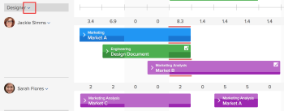

# Introdução ao Agendamento de recursos

>[!IMPORTANT]
>  
>A funcionalidade de Agendamento descrita neste artigo foi descontinuada e removida do Adobe Workfront a partir da versão 23.1 em janeiro de 2023.   
>  
>  Este artigo também será removido logo após a versão 23.1, no início de 2023. Nesse momento, recomendamos que você atualize todos os marcadores adequadamente. 
> 
> Agora você pode usar o Balanceador de Carga de Trabalho para agendar o trabalho de seus recursos. 
>  
> Para obter informações sobre como programar recursos usando o Balanceador de Carga de Trabalho, consulte a seção [O Balanceador de Carga de Trabalho](../../resource-mgmt/workload-balancer/workload-balancer.md). 

<!--  

>[!CAUTION] 
> 
> 
> The information in this article refers to the Adobe Workfront's Scheduling tools. The Scheduling areas have been removed from the Preview environment and will be removed from the Production environment in **January 2023**.   
>  Instead, you can schedule resources in the Workload Balancer.  
> 
>*  For information about scheduling resources using the Workload Balancer, see the section [The Workload Balancer](../../resource-mgmt/workload-balancer/workload-balancer.md). 
> 
>*  For more information about the deprecation and removal of the Scheduling tools, see [Deprecation of Resource Scheduling tools in Adobe Workfront](../../resource-mgmt/resource-mgmt-overview/deprecate-resource-scheduling.md). 
-->

<!--

(NOTE: LINKED TO THE PRODUCT FROM: ALL SCHEDULING TOOLS: GLOBAL, TEAM, PROJECT STAFFING *** LINKED TO LOTS OF ARTICLES, AS WELL!) 

(NOTE: Alina: this article should be divided in multiple articles, but CAREFULLY because some sections are linked to the UI)

-->

Ao usar a funcionalidade de agendamento de recursos no Adobe Workfront, é possível atribuir tarefas e problemas mais facilmente aos usuários apropriados. Você pode determinar quais usuários são capazes de concluir a tarefa ou o problema, levando em consideração a função de trabalho e a disponibilidade do usuário.

As seções a seguir fornecem mais detalhes sobre o uso das áreas de Agendamento no Workfront.

## Pré-requisitos para usar as ferramentas de agendamento no Workfront

>[!IMPORTANT]
>
>Os pré-requisitos documentados neste artigo se aplicam apenas às áreas de Agendamento do Workfront. Para obter informações sobre as práticas recomendadas para usar o Balanceador de Carga de Trabalho, consulte [Visão Geral do Balanceador de Carga de Trabalho](../../resource-mgmt/workload-balancer/overview-workload-balancer.md).

Para usar com sucesso a funcionalidade de agendamento de recursos no Workfront, primeiro verifique se você, seus projetos e suas tarefas e problemas atendem aos seguintes pré-requisitos:

* [Pré-requisitos do usuário](#user-prerequisites)
* [Pré-requisitos do projeto](#project-prerequisites)
* [Pré-requisitos de tarefa e emissão](#task-and-issue-prerequisites)

### Pré-requisitos do usuário {#user-prerequisites}

Você pode usar as ferramentas de agendamento de recursos disponíveis na guia Agendamento, na guia Pessoal ou na guia Trabalho em quando cada uma das seguintes condições for atendida:

**Ao programar recursos como o gerenciador de recursos (na guia Scheduling ):**

* Você é designado como um Gerenciador de Recursos para os projetos para os quais deseja gerenciar recursos.

   Para obter mais informações sobre a designação de gerentes de recursos para um projeto, consulte o artigo [Designar Gerentes de Recursos para um projeto ou modelo](../../manage-work/projects/planning-a-project/designate-resource-managers-for-projects-and-templates.md).

* Você é um usuário com uma licença de Plano.

Por padrão, os usuários são exibidos na linha do tempo de agendamento somente quando têm uma função de trabalho definida no sistema (a função de trabalho primária ou uma função de trabalho secundária) e essa função de trabalho corresponde à função de trabalho atribuída a uma tarefa ou problema que está visível atualmente na **Não atribuído** na linha do tempo de programação. Você pode desativar essa funcionalidade para permitir que tarefas e problemas sejam atribuídos a qualquer usuário, independentemente de esse usuário ter uma função definida em seu perfil de usuário que corresponda à atribuição de função da tarefa ou problema que está sendo atribuído a ele. Para obter mais informações, consulte o artigo [Permitir atribuições de usuários independentemente da função e associação de grupo nas áreas de Programação](../../resource-mgmt/resource-scheduling/assignments-regardless-of-role-or-group-scheduling-areas.md).

Por padrão, as atribuições só podem ser feitas a usuários que tenham uma função definida em seu perfil de usuário que corresponda à atribuição de função da tarefa ou problema que está sendo atribuído a eles.

**Ao programar recursos como membro da equipe do projeto (na guia Pessoal em um projeto):**

* Você tem permissões para Exibir, Contribuir ou Gerenciar o projeto
* Você tem uma licença de Plano ou Trabalho

<!--
<note type="note">  If Workfront has not removed the Use New Scheduling Area option from your Scheduling settings, users must have a Plan license and Manage permissions to the project to view the Scheduling timeline. For more information about the removal of the Use New Scheduling Area option, see the article
<a href="../../product-announcements/announcements/announcement-archive/replace-flash-tools.md" class="MCXref xref">Replacement of Flash-based tools in Adobe Workfront</a>.
</note>
-->

**Ao programar recursos como membro da equipe (na guia Trabalhar em):**

* Você é membro da equipe\
   Todos os membros da equipe são exibidos na linha do tempo do agendamento. Tarefas e problemas que são atribuídos à equipe e não atribuídos a um usuário são exibidos na área Não atribuído. As tarefas e os problemas que são atribuídos à equipe e a um usuário na equipe são exibidos na linha do usuário ao qual são atribuídos.

### Pré-requisitos do projeto {#project-prerequisites}

Os pré-requisitos do projeto descritos nesta seção aplicam-se somente ao agendar recursos como o gerenciador de recursos da linha do tempo de agendamento.

Os projetos que você está gerenciando devem estar em um dos seguintes status (ou em um status que seja igual a um desses status) para que os itens de trabalho desses projetos sejam exibidos na linha do tempo de programação: Planejamento, Atual ou Aprovado. Por padrão, somente os projetos no status Atual são exibidos.

Para obter mais informações sobre os status do projeto, consulte o artigo [Criar ou editar um status](../../administration-and-setup/customize-workfront/creating-custom-status-and-priority-labels/create-or-edit-a-status.md).

<!--

(NOTE: [! I assume this doesn't apply when using the Staffing tab on a single project? The project can be in whatever status?]) 

-->

### Pré-requisitos de tarefa e emissão {#task-and-issue-prerequisites}

Para ser mais eficaz ao usar as ferramentas de agendamento de recursos no Workfront, verifique se as tarefas e os problemas no sistema têm os seguintes critérios definidos:

* Durações
* Datas de Início Planejadas
* Horas planejadas\
   As Horas Planejadas são necessárias para modificar as alocações de usuários, conforme descrito no artigo [Gerenciar alocações de usuários nas áreas de Agendamento](../../resource-mgmt/resource-scheduling/manage-allocations-scheduling-areas.md).

   >[!NOTE]
   >
   >O campo Horas Planejadas no cartão Agendamento de Recursos mostra realmente a soma de todos os valores de workPerDay, não as Horas Planejadas na tarefa. Os valores de workPerDay são calculados dividindo o valor de Horas Planejadas pela Duração da Tarefa. Para durações diferentes de zero, os valores normalmente correspondem às Horas Planejadas da tarefa, embora algumas pequenas discrepâncias devido ao arredondamento possam ocorrer. Quando uma Duração é de 0 Dias, as Horas Planejadas exibem 0 Horas.

* Atribuições de Função

## Exibir informações nas áreas de Agendamento

* [Localize e exiba informações nas áreas de Agendamento](#locate-and-view-information-in-the-scheduling-areas)
* [Exibir atribuições e detalhes de recursos](#view-resource-assignments-and-details)
* [Minimizar tarefas e problemas nas áreas de Agendamento](#minimize-tasks-and-issues-on-the-scheduling-areas)
* [Ajuste o intervalo de datas das áreas de Agendamento](#adjust-the-date-range-of-the-scheduling-areas)

### Localize e exiba informações nas áreas de Agendamento {#locate-and-view-information-in-the-scheduling-areas}

Dependendo de onde deseja programar recursos, você pode acessar a linha do tempo Agendar nas seguintes áreas do Workfront:

* Para vários projetos, na área Agendamento
* Para um projeto na seção Agendamento
* Para uma equipe, na seção Programação

1. Vá para a linha do tempo de agendamento para vários projetos, para um projeto individual ou para uma equipe:

   * **Para vários projetos**:  Clique no botão **Menu principal** ícone  no canto superior direito do Workfront, clique em **Recursos > Balanceador de carga de trabalho**, em seguida selecione **Agendamento** no menu suspenso superior esquerdo.
   * **Para um projeto individual**: Vá para um projeto e clique no botão **Balanceador de Carga de Trabalho** no painel esquerdo e selecione **Agendamento** no menu suspenso superior esquerdo.
   * **Para uma equipe**: Clique no botão **Menu principal** ícone  no canto superior direito do Workfront, em seguida, clique em **Equipes**, selecione um grupo, clique em **Balanceador de Carga de Trabalho** no painel esquerdo e selecione **Agendamento** no menu suspenso superior esquerdo.

1. (Opcional) Clique no botão **Tela cheia** , localizado no canto superior direito da linha do tempo de agendamento.\
   \
   A linha do tempo de agendamento é exibida no modo de tela cheia. Ao visualizar a linha do tempo de agendamento no modo de tela cheia, a linha do tempo de agendamento ocupa toda a tela; todas as outras informações estão ocultas (incluindo informações sobre qualquer equipe ou projeto, a Barra de navegação global e as informações do navegador).

1. (Opcional) Para sair do modo de tela cheia, siga um destes procedimentos:

   * Clique no botão **Tela cheia** ícone .
   * Pressione a tecla Esc.

### Exibir atribuições e detalhes de recursos {#view-resource-assignments-and-details}

Você pode exibir as atribuições de recursos atuais e outros detalhes sobre tarefas individuais e problemas na linha do tempo de programação.

1. Vá para a linha do tempo de agendamento para vários projetos, para um projeto individual ou para uma equipe:

   * **Para vários projetos**:  Clique no botão **Menu principal** ícone  no canto superior direito do Workfront, clique em **Recursos > Balanceador de carga de trabalho**, em seguida selecione **Agendamento** no menu suspenso superior esquerdo.
   * **Para um projeto individual**: Vá para um projeto e clique no botão **Balanceador de Carga de Trabalho** no painel esquerdo e selecione **Agendamento** no menu suspenso superior esquerdo.
   * **Para uma equipe**: Clique no botão **Menu principal** ícone  no canto superior direito do Workfront, em seguida, clique em **Equipes**, selecione um grupo, clique em **Balanceador de Carga de Trabalho** no painel esquerdo e selecione **Agendamento** no menu suspenso superior esquerdo.

1. (Opcional) Para personalizar o conteúdo exibido na linha do tempo do agendamento, crie um filtro, conforme descrito em [Filtrar informações na área Agendamento](../../resource-mgmt/resource-scheduling/filter-scheduling-area.md).
1. Expanda uma tarefa ou problema para exibir as seguintes informações:

   * **Projeto:** O nome e o link para o projeto onde a tarefa reside.

   * **Datas:** As datas de Início em e Vencimento em associadas à tarefa.

   * **Horas Planejadas:** O número de Horas Planejadas associado à tarefa.\
      As Horas Planejadas são exibidas somente se a tarefa for atribuída a um usuário ou função de trabalho.

   * **Ícone do antecessor:** Qualquer antecessor associado à tarefa. O ícone antecessor é exibido somente se houver antecessores associados à tarefa. O ícone do antecessor é verde quando o antecessor é concluído e a tarefa está pronta para ser trabalhada.

   * **Atribuições:** Qualquer atribuição de usuário ou função de trabalho associada à tarefa. As atribuições de função de trabalho são exibidas entre parênteses ao lado da atribuição de usuário.\
      Atribuições de equipe não são exibidas.\
      Se você tiver acesso do Contribute à tarefa ou edição, poderá modificar as horas em que os usuários são alocados em cada dia dentro da duração da tarefa ou emissão. Para obter mais informações sobre modificação de alocações de usuários, consulte o artigo [Gerenciar alocações de usuários nas áreas de Agendamento](../../resource-mgmt/resource-scheduling/manage-allocations-scheduling-areas.md).

### Minimizar tarefas e problemas nas áreas de Agendamento {#minimize-tasks-and-issues-on-the-scheduling-areas}

Minimizar tarefas e problemas permite visualizar atribuições de usuários para um grande número de usuários em uma única tela.\
Todas as tarefas e problemas na linha do tempo de agendamento são minimizados por padrão.

Quando tarefas e problemas são minimizados, você pode:

* Exibir duração da tarefa
* Exibir cor do projeto
* Atribuir tarefas da área Não atribuído a usuários na linha do tempo de agendamento

Quando tarefas e problemas são minimizados, não é possível:

* Exibir nomes de tarefas
* Arrastar tarefas já atribuídas a um usuário e reatribuí-las
* Expandir tarefas para exibir detalhes

Se você ativar a configuração Mostrar totais para horas diárias planejadas , quando tarefas e problemas forem minimizados, você só poderá:

* Visualizar o total de Horas Planejadas diárias para cada usuário.

Ao minimizar tarefas e problemas conforme descrito nesta seção, essas alterações são exibidas somente para você. Tarefas e problemas permanecem minimizados até que você os expanda ou até terminar sua sessão do navegador. (Atualizar a página não reverte tarefas minimizadas e problemas para um estado expandido.)

Na linha do tempo de programação, é possível minimizar tarefas e problemas exibidos para usuários individuais, para funções de cargo ou para todos os usuários.

* [Minimizar tarefas e problemas para usuários individuais](#minimize-tasks-and-issues-for-individual-users)
* [Minimizar tarefas e problemas para uma função de trabalho](#minimize-tasks-and-issues-for-a-job-role)
* [Minimizar tarefas e problemas para todos os usuários](#minimize-tasks-and-issues-for-all-users)

#### Minimizar tarefas e problemas para usuários individuais {#minimize-tasks-and-issues-for-individual-users}

1. Clique no sinal de interpolação ao lado do usuário na linha do tempo de programação cujas tarefas e problemas você deseja minimizar.\
   \
   A maneira como as tarefas e o problema são exibidos depende das seguintes configurações:

   * Se você ativar a variável **Mostrar totais para horas diárias planejadas** são aplicáveis as seguintes condições:

      * Somente Horas Planejadas para a exibição do usuário
      * Tarefas e problemas estão ocultos
   * Se você ativar a variável **Mostrar totais para horas diárias planejadas** tarefas e problemas para o usuário são minimizados.\
      

#### Minimizar tarefas e problemas para uma função de trabalho {#minimize-tasks-and-issues-for-a-job-role}

Você pode minimizar tarefas e problemas para todos os usuários associados a uma função de trabalho específica.

1. Clique no sinal de interpolação ao lado da função de trabalho na linha do tempo de programação que contém os usuários cujas tarefas e problemas você deseja minimizar.\
   \
   Tarefas e problemas para todos os usuários associados a essa função são minimizados se você desabilitar o **Mostrar totais para horas diárias planejadas** configuração.\
   Tarefas e problemas são ocultos e somente as Horas Planejadas para os usuários são exibidas se você habilitar essa configuração.\
   

#### Minimizar tarefas e problemas para todos os usuários {#minimize-tasks-and-issues-for-all-users}

1. Clique em **Recolher Tudo** na parte superior da área Usuários e funções .\
   \
   Ou\
   Clique no sinal de interpolação ao lado de qualquer usuário ou função de trabalho na linha do tempo de agendamento enquanto mantém a tecla Shift pressionada.\
   \
   Tarefas e problemas para todos os usuários e funções são minimizados se você desativar o **Mostrar totais para horas diárias planejadas** e tarefas e problemas estarão ocultos se você ativá-los.\
   Se a variável **Mostrar totais para horas diárias planejadas** está ativada somente nas Horas Planejadas para a exibição dos usuários. Tarefas e problemas permanecem minimizados para a área Não atribuído.\
   

### Ajuste o intervalo de datas das áreas de Agendamento {#adjust-the-date-range-of-the-scheduling-areas}

Por padrão, 14 dias consecutivos (incluindo finais de semana) são exibidos na linha do tempo do agendamento, começando com o dia atual.

Use qualquer uma das seguintes opções para modificar o intervalo de datas no qual os dados são exibidos na linha do tempo de programação:

* **Opções de intervalo de datas:** Clique no intervalo de datas atual e selecione o número de semanas a serem exibidas na linha do tempo. Pode apresentar Dia (dia único), 1 semana (7 dias), 2 semanas (14 dias), 3 semanas (21 dias), 4 semanas (28 dias) ou 6 semanas (42 dias).\
   Considere o seguinte ao ajustar o intervalo de datas da linha do tempo de programação:

   * As opções de intervalo de datas selecionadas são preservadas na próxima vez que você visitar a linha do tempo de agendamento.

      <!--   
     
(NOTE: [! Not sure if this is going to apply to all 3 scheduling areas...]) 
   
     -->

   * Ao visualizar a linha do tempo de agendamento na exibição Dia, as alocações de usuário não são exibidas.\
      

* **Calendário:** Clique no intervalo de datas atual e, em seguida, clique no dia anterior ou posterior ao dia atual. A hora entre o dia atual e o dia selecionado é o novo intervalo.\
   

* **Hoje:** Clique nessa opção para exibir o dia atual. O dia atual é exibido na extremidade esquerda do intervalo de datas.\
   Clique nas setas para a esquerda e para a direita para exibir as datas passadas ou futuras.

   >[!NOTE]
   >
   >O período selecionado é preservado ao atualizar a página.

   

* **Arrastar e soltar o intervalo de datas:** Arraste o intervalo de datas na parte superior da linha do tempo do agendamento.\
   

## Definir configurações nas áreas de Agendamento

Determinadas informações são exibidas por padrão na linha do tempo de Agendamento. Você também pode definir suas configurações para exibir informações adicionais.

Para obter informações sobre como definir suas configurações na linha do tempo de Agendamento, consulte os seguintes artigos:

[Definir configurações nas áreas de Agendamento](../../resource-mgmt/resource-scheduling/configure-settings-scheduling-areas.md)

[Permitir atribuições de usuários independentemente da função e associação de grupo nas áreas de Programação](../../resource-mgmt/resource-scheduling/assignments-regardless-of-role-or-group-scheduling-areas.md)

[Atribuir automaticamente tarefas e problemas não atribuídos nas áreas de Agendamento](../../resource-mgmt/resource-scheduling/automatically-assign-items-scheduling-areas.md)

## Filtrar informações nas áreas de Agendamento

Você pode definir o que é exibido na linha do tempo de agendamento criando um filtro.

Para obter mais informações, consulte o artigo [Filtrar informações na área Agendamento](../../resource-mgmt/resource-scheduling/filter-scheduling-area.md).

## Modificar atribuições e alocações de usuários

* [Modificar atribuições de usuário](#modify-user-assignments)
* [Modificar alocações de usuário](#modify-user-allocations)

### Modificar atribuições de usuário {#modify-user-assignments}

Você pode modificar atribuições de usuários na guia Agendamento (ao agendar recursos para projetos) usando a ferramenta de troca ou modificando tarefas e problemas diretamente da linha do tempo de agendamento. Você pode modificar atribuições de usuários na guia Trabalhar em (ao agendar recursos para equipes) modificando tarefas e problemas diretamente da linha do tempo de agendamento.

Para obter mais informações, consulte o artigo [Atribuir manualmente tarefas e problemas não atribuídos nas áreas de Agendamento](../../resource-mgmt/resource-scheduling/manually-assign-items-scheduling-areas.md).

### Modificar alocações de usuário {#modify-user-allocations}

Você pode determinar como as Horas Planejadas para uma tarefa ou problema são alocadas aos usuários. As Horas Planejadas podem ser divididas das seguintes maneiras:

* Entre usuários que estão atribuídos à tarefa ou ocorrência.
* Durante a duração da tarefa ou emissão.

Para obter mais informações, consulte o artigo [Gerenciar alocações de usuários nas áreas de Agendamento](../../resource-mgmt/resource-scheduling/manage-allocations-scheduling-areas.md).
