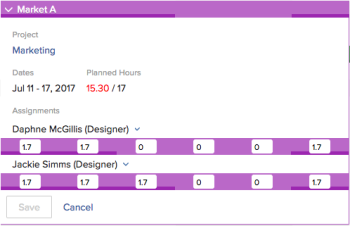

# Gerenciar alocações de usuários nas áreas de Agendamento

>[!IMPORTANT]
>  
>A funcionalidade de Agendamento descrita neste artigo foi descontinuada e removida do Adobe Workfront a partir da versão 23.1 em janeiro de 2023.   
>  
>  Este artigo também será removido logo após a versão 23.1, no início de 2023. Nesse momento, recomendamos que você atualize todos os marcadores adequadamente. 
> 
> Agora você pode usar o Balanceador de Carga de Trabalho para agendar o trabalho de seus recursos. 
>  
> Para obter informações sobre como programar recursos usando o Balanceador de Carga de Trabalho, consulte a seção [O Balanceador de Carga de Trabalho](../../resource-mgmt/workload-balancer/workload-balancer.md). 

<!--  

>[!CAUTION] 
> 
> 
> The information in this article refers to the Adobe Workfront's Scheduling tools. The Scheduling areas have been removed from the Preview environment and will be removed from the Production environment in **January 2023**.   
>  Instead, you can schedule resources in the Workload Balancer.  
> 
>*  For information about scheduling resources using the Workload Balancer, see the section [The Workload Balancer](../../resource-mgmt/workload-balancer/workload-balancer.md). 
> 
>*  For more information about the deprecation and removal of the Scheduling tools, see [Deprecation of Resource Scheduling tools in Adobe Workfront](../../resource-mgmt/resource-mgmt-overview/deprecate-resource-scheduling.md). 

-->

As alocações de usuários são quantidades de horas que indicam o tempo que um usuário deve gastar em um determinado dia para concluir um item de trabalho. Eles estão incluídos nas Horas Planejadas do item de trabalho.

Este artigo descreve como atualizar alocações diárias por hora para usuários atribuídos a tarefas ou problemas usando a área Agendamento de Recursos. Para obter informações sobre o gerenciamento de alocações gerais para usuários e funções de jobs para tarefas, consulte [Gerenciar horas de alocação de usuários e funções em tarefas](../../manage-work/tasks/assign-tasks/manage-allocation-hours-on-tasks.md). Não é possível atualizar as alocações gerais de usuários e funções de trabalho para problemas.

Você pode exibir alocações de usuários nas seguintes áreas do Adobe Workfront:

* Na seção Agendamento da área Recursos.
* Na seção Agendamento de um projeto (ao agendar recursos para um único projeto).
* Na seção Schedule de uma equipe (ao agendar recursos para uma equipe).

## Requisitos de acesso

Você deve ter o seguinte:

<table style="table-layout:auto"> 
 <col> 
 <col> 
 <tbody> 
  <tr> 
   <td role="rowheader">Plano Adobe Workfront*</td> 
   <td> 
Qualquer Um
 </td> 
  </tr> 
  <tr> 
   <td role="rowheader">Licença da Adobe Workfront*</td> 
   <td> 
Trabalho ou superior
 </td> 
  </tr> 
  <tr> 
   <td role="rowheader">Nível de acesso*</td> 
   <td> 
Visualizar ou aumentar o acesso a Projetos, Tarefas e Problemas
 
<b>Nota</b>

Caso ainda não tenha acesso, pergunte ao administrador do Workfront se ele definiu restrições adicionais em seu nível de acesso. Para obter informações sobre como um administrador do Workfront pode alterar seu nível de acesso, consulte <a href="../../administration-and-setup/add-users/configure-and-grant-access/create-modify-access-levels.md" class="MCXref xref">Criar ou modificar níveis de acesso personalizados</a>.
 </td>
</tr> 
  <tr> 
   <td role="rowheader">Permissões de objeto</td> 
   <td> 
Contribuir com permissões para projetos, tarefas e problemas
 
Para obter informações sobre como solicitar acesso adicional, consulte <a href="../../workfront-basics/grant-and-request-access-to-objects/request-access.md" class="MCXref xref">Solicitar acesso a objetos </a>.
 </td> 
  </tr> 
 </tbody> 
</table>

*Para descobrir qual plano, tipo de licença ou acesso você tem, entre em contato com o administrador da Workfront.

## Alocações de usuários nas áreas de Agendamento

Antes de começar a alocar tempo para os usuários, conforme descrito neste artigo, familiarize-se com o funcionamento da programação de recursos no Workfront, conforme descrito em [Introdução ao Agendamento de recursos](../../resource-mgmt/resource-scheduling/get-started-resource-scheduling.md).

Você pode agendar recursos para trabalhar em tarefas e problemas de uma equipe individual da qual você é membro, para um projeto individual em que você é membro da equipe do projeto ou para vários projetos em que é o gerente de recursos.

As seções a seguir descrevem como ativar e gerenciar alocações de usuários no Workfront:

* [Usar as áreas de Agendamento para atribuir trabalho](#use-the-scheduling-areas-to-assign-work)
* [Alocações definidas nas caixas Editar tarefa ou Editar ocorrência em comparação às áreas de Agendamento](#allocations-set-on-the-edit-task-or-the-edit-issue-boxes-vs-in-the-scheduling-areas)
* [Indicadores de atribuição](#allocation-indicators)
* [Alocação padrão para Horas Planejadas](#default-allocation-for-planned-hours)
* [Quem pode visualizar e modificar alocações?](#who-can-view-and-modify-allocations)
* [Considerações de fuso horário nas áreas de Agendamento](#time-zone-considerations-in-the-scheduling-areas)

### Usar as áreas de Agendamento para atribuir trabalho {#use-the-scheduling-areas-to-assign-work}

Ao atribuir um novo trabalho aos usuários na linha do tempo de Agendamento, você pode determinar como as Horas Planejadas para uma tarefa ou problema são alocadas aos usuários.\
Para obter mais informações sobre Horas Planejadas, consulte [Visão geral das Horas Planejadas](../../manage-work/tasks/task-information/planned-hours.md).

As Horas Planejadas podem ser divididas das seguintes maneiras:

* Entre usuários que estão atribuídos à tarefa ou ocorrência
* Durante a duração da tarefa ou do problema\
   Por exemplo, uma tarefa relacionada a vendas pode exigir mais trabalho até o fim da duração da tarefa. Você pode planejar essa distribuição desigual de horas em sua tarefa.

>[!TIP]
>
>Ao agendar recursos para vários projetos a partir das áreas de Agendamento, nem todos os usuários e itens de trabalho são exibidos na linha do tempo de Agendamento. Para obter informações sobre quais informações são exibidas na linha do tempo do Agendamento, consulte [Introdução ao Agendamento de recursos](../../resource-mgmt/resource-scheduling/get-started-resource-scheduling.md).

### Alocações definidas nas caixas Editar tarefa ou Editar ocorrência em comparação às áreas de Agendamento {#allocations-set-on-the-edit-task-or-the-edit-issue-boxes-vs-in-the-scheduling-areas}

Você pode modificar as alocações de usuários para uma tarefa ou problema nos seguintes locais no Workfront:

* A linha do tempo do agendamento\
   A linha do tempo de Agendamento está localizada nas seguintes áreas:

   * Na seção Agendamento da área Recursos.
   * Na seção Agendamento de um projeto (ao agendar recursos para um único projeto).
   * Na seção Schedule de uma equipe (ao agendar recursos para uma equipe).

   Ao modificar as alocações de usuários na linha do tempo de Agendamento (conforme descrito na seção [Modificar alocações de usuário](#modify-user-allocations) (neste artigo), é possível definir alocações para cada usuário na tarefa ou emissão, bem como para cada dia dentro da duração da tarefa ou emissão.\
   

* A caixa de diálogo Editar tarefa ou Editar problema.\
   Ao modificar as alocações de usuários de uma caixa de diálogo Editar Tarefa ou Ocorrência (conforme descrito em [Gerenciar porcentagem de alocação de usuário ou função em tarefas](../../manage-work/tasks/assign-tasks/manage-allocation-percentage-on-tasks.md)), você pode definir alocações para a tarefa ou emissão somente como um todo para cada usuário. Se quiser gerenciar essas alocações por dia, você deve modificar as alocações na linha do tempo de Programação, conforme descrito na [Modificar alocações de usuário](#modify-user-allocations) neste artigo.

   >[!IMPORTANT]
   >
   >Ao modificar as alocações de usuários de uma caixa de diálogo Editar Tarefa ou Ocorrência , as alocações configuradas anteriormente na linha do tempo Agendamento são substituídas. Além disso, qualquer alteração feita nas alocações na linha do tempo de Agendamento não é refletida em uma caixa de diálogo Editar Tarefa ou Ocorrência .

Recomendamos o gerenciamento de alocações de usuários a partir da linha do tempo de Agendamento, em vez da opção Editar Tarefa ou Problema, para se beneficiar das seguintes vantagens:

* Você pode ver claramente quando os usuários são superalocados usando indicadores de alocação, conforme descrito na [Indicadores de atribuição](#allocation-indicators) seção.
* Você pode alocar mais tempo para um usuário em vez de outro.\
   Os indicadores de alocação fornecem uma representação visual de como um usuário é alocado em comparação a outros usuários, conforme descrito na [Indicadores de atribuição](#allocation-indicators) seção.

* Você pode alocar mais tempo para trabalhar em um dia em outro.\
   Os indicadores de alocação fornecem uma representação visual de como os usuários estão alocados em um determinado dia, conforme descrito em [Indicadores de atribuição](#allocation-indicators).

* Você pode executar todas as responsabilidades de recursos em um local, na linha do tempo de Agendamento.

### Indicadores de atribuição {#allocation-indicators}

Vários indicadores visuais estão disponíveis para fornecer informações rápidas sobre o nível de alocação de um usuário para trabalhar em um determinado dia.

O administrador do sistema determina como a Workfront calcula a disponibilidade do usuário no nível do sistema (considerando horas e a disponibilidade do FTE). Dependendo dessa configuração em todo o sistema, a disponibilidade do usuário é calculada usando o agendamento padrão ou o agendamento do usuário. Para obter mais informações, consulte [Configure como o Workfront calcula a hora do recurso e a disponibilidade do FTE para a área de Agendamento](../../resource-mgmt/resource-scheduling/calculate-hours-fte-scheduling-area.md).

* **Sombreamento de alocação**
A alocação é exibida visualmente em tarefas atribuídas aos usuários no formato de sombreamento. O sombreamento mais escuro indica as horas alocadas como uma porcentagem do FTE (Equivalente de Tempo Total) dos usuários atribuídos em um determinado dia. (Para obter mais informações sobre como configurar o FTE no Workfront, consulte [Configure como o Workfront calcula a hora do recurso e a disponibilidade do FTE para a área de Agendamento](../../resource-mgmt/resource-scheduling/calculate-hours-fte-scheduling-area.md).)\
   Por exemplo, um único usuário é atribuído a uma tarefa que tem uma quantidade de 4 Horas Planejadas e uma Duração de 1 dia. O FTE para o usuário é definido no sistema como 1 (o que significa que o usuário está agendado para trabalhar no status de tempo integral ou em vez de 40 horas por semana ou 8 horas por dia). O sombreamento para a tarefa em um determinado dia ocupa metade do espaço vertical da tarefa, indicando que o usuário recebe metade de seu FTE (4 horas) nesse dia.\
   \
   A tarefa ou problema exibe a alocação cumulativa em todos os usuários atribuídos ao item de trabalho. Você pode expandir um item de trabalho para exibir mais detalhes, incluindo quem está atribuído ao item de trabalho e quantas horas cada usuário está atribuído.\
   O sombreamento não é exibido nas tarefas na variável **Não atribuído** na linha do tempo de Agendamento.\
   

* **Totais diários para cada dia de cada usuário:** Você pode exibir o total de Horas Planejadas alocadas a um determinado usuário em cada dia. Essas informações são exibidas na parte superior da linha de cada usuário na linha do tempo de Agendamento. Essas informações não são exibidas por padrão. Você pode ativar isso conforme descrito em [Habilitar alocações de usuário](#enable-user-allocations). Tarefas de projetos com qualquer um dos seguintes status são incluídas ao determinar os totais diários: Atual, Planejamento ou Aprovado.\
   

* **Indicadores de atribuição excessiva**
Quando o número total de Horas Planejadas atribuídas a um usuário em um determinado dia excede o número de horas que o usuário trabalha em um dia (em todas as tarefas), esse usuário é considerado superalocado nesse dia.\
   Quando um usuário tem alocação excessiva, uma barra vermelha é exibida, descrevendo cada tarefa no dia.\
   As tarefas de projetos com qualquer um dos seguintes status são incluídas ao determinar a atribuição excessiva de um usuário: Atual, Planejamento ou Aprovado.\
   O número de horas que um usuário trabalha em um dia é definido por meio do campo FTE no perfil de cada usuário, conforme descrito em [Configure como o Workfront calcula a hora do recurso e a disponibilidade do FTE para a área de Agendamento](../../resource-mgmt/resource-scheduling/calculate-hours-fte-scheduling-area.md).\
   \
   Ao ativar a variável **Mostrar totais para horas diárias planejadas** e **Mostrar realce da alocação de recursos** em suas configurações, o número total diário de Horas Planejadas é exibido em vermelho quando o usuário está sobrealocado. As horas são exibidas ao décimo mais próximo por padrão (por exemplo, 1,3).\
   

### Alocação padrão para Horas Planejadas {#default-allocation-for-planned-hours}

O Workfront tenta distribuir Horas Planejadas entre os usuários e dias atribuídos da seguinte maneira:

* Quando vários usuários são atribuídos a uma tarefa ou problema, as horas são divididas uniformemente entre os usuários.\
   A distribuição reflete quaisquer atribuições avançadas que já foram feitas na tarefa.\
   Para obter mais informações sobre atribuições avançadas, consulte [Criar atribuições avançadas](../../manage-work/tasks/assign-tasks/create-advanced-assignments.md).

* Quando a Duração da tarefa ou do problema se estende por vários dias, as Horas Planejadas são distribuídas igualmente entre os dias e entre todos os usuários atribuídos à tarefa, com base no cronograma do usuário.
* Quando as Horas Planejadas de uma tarefa abrangem vários dias, um usuário que visualiza a tarefa de um fuso horário diferente pode ver uma diferença na duração da tarefa ou na Data Inicial Planejada ou na Data de Conclusão Planejada.

As horas são exibidas à centena mais próxima por padrão (por exemplo, 1,33). Você pode rolar a tela para a direita para ver mais.\

### Quem pode visualizar e modificar alocações? {#who-can-view-and-modify-allocations}

Os seguintes tipos de usuários podem exibir ou modificar as alocações de usuários no Workfront:

* **Gerentes de recursos:** Você pode exibir e modificar alocações de usuários para tarefas e problemas em qualquer projeto para o qual você seja o Gerenciador de Recursos. Você pode fazer isso na linha do tempo de Agendamento na área Pessoas ou na guia Pessoal de um projeto.\
   Para obter informações sobre como os Gerentes de Recursos podem fazer alterações em tarefas e problemas em projetos, consulte [Atribuir manualmente tarefas e problemas não atribuídos nas áreas de Agendamento](../../resource-mgmt/resource-scheduling/manually-assign-items-scheduling-areas.md).

* **Usuários do Plano e Trabalho:** Você pode exibir alocações para qualquer tarefa e problema atribuído usando o novo calendário Meu trabalho ou o calendário Trabalhando em uma equipe da qual você é membro.\
   Além de visualizar alocações, você pode modificar suas alocações se tiver acesso do Contribute às tarefas e problemas.

   <!--
  <MadCap:conditionalText data-mc-conditions="QuicksilverOrClassic.Draft mode">
  (NOTE: Article is conditioned to classic.)
  </MadCap:conditionalText>
  -->

### Considerações de fuso horário nas áreas de Agendamento  {#time-zone-considerations-in-the-scheduling-areas}

Em casos raros, os usuários que visualizam a linha do tempo de Programação podem ver inconsistências em que as Horas Planejadas de uma tarefa não são iguais ao total de horas alocadas de dias individuais. Isso pode ocorrer quando a configuração de fuso horário do sistema operacional de um usuário é tal que a Data inicial planejada ou a Data de conclusão planejada diferem de outro usuário.

Por exemplo, se a Data de conclusão planejada de uma tarefa estiver definida como 11:00 em 3/11/18, MST, um usuário na Austrália que visualize a tarefa veria a Data de conclusão planejada como 1:00 em 4/11/18, no dia seguinte. Se o usuário na Austrália alocar horas em 04/11/18, essas horas alocadas não estarão visíveis para o usuário no MST. No entanto, essas horas são sempre consideradas nas Horas Planejadas do projeto.

## Habilitar alocações de usuário {#enable-user-allocations}

A funcionalidade de alocação de usuário é desativada por padrão na linha do tempo de Agendamento. Antes de usar a funcionalidade de alocação de usuário descrita nesta seção, primeiro você deve ativá-la.

>[!NOTE]
>
>As alocações de usuário podem ser ativadas somente quando a linha do tempo de Agendamento estiver configurada para usar as Datas planejadas. Se a linha do tempo de Agendamento estiver configurada para usar Datas projetadas, as alocações de usuário não poderão ser exibidas. Para obter mais informações sobre como configurar a linha do tempo de Agendamento para usar as Datas Planejadas ou Projetadas, consulte &quot;Configurando Datas Projetadas para Exibir na Linha do Tempo de Agendamento&quot; em [Definir configurações nas áreas de Agendamento](../../resource-mgmt/resource-scheduling/configure-settings-scheduling-areas.md).

Para ativar as alocações de usuários na linha do tempo de Agendamento:

1. Vá para a linha do tempo de agendamento para vários projetos, para um projeto individual ou para uma equipe:

   * **Para vários projetos**:  Clique no botão **Menu principal** ícone  no canto superior direito do Workfront, clique em **Recursos > Balanceador de carga de trabalho**, em seguida selecione **Agendamento** no menu suspenso superior esquerdo.
   * **Para um projeto individual**: Vá para um projeto e clique no botão **Balanceador de Carga de Trabalho** no painel esquerdo e selecione **Agendamento** no menu suspenso superior esquerdo.
   * **Para uma equipe**: Clique no botão **Menu principal** ícone  no canto superior direito do Workfront, em seguida, clique em **Equipes**, selecione um grupo, clique em **Balanceador de Carga de Trabalho** no painel esquerdo e selecione **Agendamento** no menu suspenso superior esquerdo.

   

1. Clique no botão **Configurações** na linha do tempo Agendamento .\
   \
   A caixa de diálogo Configurações de agendamento de recursos é exibida.\
   

1. Habilite uma ou ambas as opções a seguir para mostrar as alocações de usuário na linha do tempo de Agendamento:

   <table style="table-layout:auto"> 
    <col> 
    <col> 
    <tbody> 
     <tr> 
      <td role="rowheader">Mostrar destaques da alocação de recursos</td> 
      <td> 
Exibir sombreamento da alocação de usuários em tarefas e problemas na linha do tempo de Agendamento. 
 
Essa opção é desativada por padrão.
 </td> 
     </tr> 
     <tr> 
      <td role="rowheader">Mostrar os totais de Horas planejadas diárias</td> 
      <td>Exibe o número total de Horas Planejadas que são alocadas a cada usuário para cada dia na linha do tempo Programação. As Horas Planejadas são exibidas até o décimo mais próximo (por exemplo, 1,3). Essa opção é desativada por padrão.</td> 
     </tr> 
    </tbody> 
   </table>

1. (Opcional) Na seção **Incluir problemas** selecione se deseja que os problemas sejam exibidos na linha do tempo de Agendamento.\
   Essa opção é desativada por padrão.

1. Clique em **Retornar ao agendamento**.\
   As alocações de usuários agora são exibidas na linha do tempo de Agendamento.\
   

## Modificar alocações de usuário {#modify-user-allocations}

Você pode modificar as alocações de usuários para uma tarefa ou problema na linha do tempo de Agendamento (conforme descrito nesta seção) ou na caixa de diálogo Editar Tarefa ou Problema. Para obter mais informações, consulte [Alocações definidas nas caixas Editar tarefa ou Editar ocorrência em comparação às áreas de Agendamento](#allocations-set-on-the-edit-task-or-the-edit-issue-boxes-vs-in-the-scheduling-areas).

Por padrão, os usuários são alocados para uma tarefa ou edição uniformemente entre os designados e entre os dias na duração, conforme descrito em [Alocação padrão para Horas Planejadas](#default-allocation-for-planned-hours).

Para modificar as alocações de usuários para uma tarefa ou problema na linha do tempo de Agendamento:

1. Vá para a linha do tempo de agendamento para vários projetos, para um projeto individual ou para uma equipe:

   * **Para vários projetos**:  Clique no botão **Menu principal** ícone  no canto superior direito do Workfront, clique em **Recursos > Balanceador de carga de trabalho**, em seguida selecione **Agendamento** no menu suspenso superior esquerdo.
   * **Para um projeto individual**: Vá para um projeto e clique no botão **Balanceador de Carga de Trabalho** no painel esquerdo e selecione **Agendamento** no menu suspenso superior esquerdo.
   * **Para uma equipe**: Clique no botão **Menu principal** ícone  no canto superior direito do Workfront, em seguida, clique em **Equipes**, selecione um grupo, clique em **Balanceador de Carga de Trabalho** no painel esquerdo e selecione **Agendamento** no menu suspenso superior esquerdo.

   

1. Certifique-se de que as alocações de usuários estejam ativadas na linha do tempo de Agendamento, conforme descrito na [Habilitar alocações de usuário](#enable-user-allocations) neste artigo.
1. Expanda a tarefa onde deseja gerenciar alocações de usuários.\
   Por padrão, as Horas Planejadas são divididas uniformemente entre os usuários atribuídos e os dias da duração da tarefa. As horas não são adicionadas aos fins de semana (sábados e domingos). Para obter mais informações, consulte o [Alocação padrão para Horas Planejadas](#default-allocation-for-planned-hours) neste artigo.

1. Clique no campo para o usuário cujas horas você deseja ajustar em um determinado dia.

   >[!NOTE]
   >
   >Para manter a distribuição original após modificar horas, clique em **Cancelar**.

1. Especifique o número ajustado de horas.
1. Clique em **Salvar**.\
   Você pode salvar suas alterações somente quando o número total de horas da tarefa for igual ao número de Horas Planejadas originais. Esse número é exibido na variável **Horas Planejadas** na tarefa. O número é exibido em vermelho quando o total não é igual ao número total de Horas Planejadas.\
   

## Critérios que redefinem alocações de usuários

O Workfront redefine as alocações de usuários que você edita manualmente na linha do tempo de Agendamento quando várias ações ocorrem nas tarefas ou no projeto. Geralmente, o Workfront redefine as alocações de usuários sempre que a linha do tempo do projeto é recalculada se o número de Horas Planejadas nas tarefas e problemas tiver sido alterado nesse processo.\
Para obter mais informações sobre o recálculo da linha do tempo de projetos, consulte [Recalcular linhas do tempo do projeto](../../manage-work/projects/manage-projects/recalculate-project-timeline.md).

Alguns dos critérios mais comuns que podem redefinir alocações de usuários na linha do tempo de Agendamento são:

* Adicionar uma tarefa a uma iteração.\
   Como as iterações têm datas fixas, as datas das tarefas e as alocações são recalculadas.\
   Para obter informações sobre como as iterações podem afetar as datas da tarefa, consulte [Adicionar histórias a uma iteração existente](../../agile/use-scrum-in-an-agile-team/iterations/add-stories-to-existing-iteration.md).

* Alterando o Tipo de duração de uma tarefa para Esforço orientado.
* Alterar o Tipo de duração de uma tarefa para Atribuição calculada quando mais de 1 pessoa estiver atribuída.\
   Para obter informações sobre a Duração da Tarefa, consulte [Visão Geral da Duração da Tarefa e do Tipo de Duração](../../manage-work/tasks/taskdurtn/task-duration-and-duration-type.md).

* Alteração das datas de início e conclusão planejada do projeto.\
   Para obter informações sobre as datas planejadas do projeto, consulte [Visão geral da data de início planejada do projeto](../../manage-work/projects/planning-a-project/project-planned-start-date.md) e [Definir a data de conclusão planejada do projeto](../../manage-work/projects/planning-a-project/project-planned-completion-date.md).

   Para obter informações sobre a Data de Conclusão Planejada da tarefa, consulte [Visão geral da data de conclusão planejada da tarefa](../../manage-work/tasks/task-information/task-planned-completion-date.md).

* Alterar as datas de uma tarefa antecessora se a Restrição de Tarefa for uma restrição flexível.\
   Por exemplo, assim que possível ou o mais tarde possível.\
   Para obter informações sobre a Restrição de Tarefa, consulte [Visão geral da restrição de tarefa](../../manage-work/tasks/task-constraints/task-constraint-overview.md).

* Alterar a quantidade de Horas Planejadas de tarefas ou problemas.

   Para obter informações sobre as Horas Planejadas no Workfront, consulte [Visão geral das Horas Planejadas](../../manage-work/tasks/task-information/planned-hours.md).
