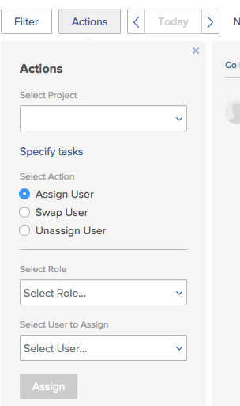
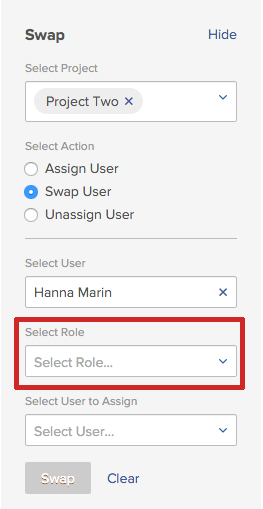

# Modificar várias atribuições de usuários para tarefas nas áreas de Agendamento

>[!IMPORTANT]
>  
>A funcionalidade de Agendamento descrita neste artigo foi descontinuada e removida do Adobe Workfront a partir da versão 23.1 em janeiro de 2023.   
>  
>  Este artigo também será removido logo após a versão 23.1, no início de 2023. Nesse momento, recomendamos que você atualize todos os marcadores adequadamente. 
> 
> Agora você pode usar o Balanceador de Carga de Trabalho para agendar o trabalho de seus recursos. 
>  
> Para obter informações sobre como programar recursos usando o Balanceador de Carga de Trabalho, consulte a seção [O Balanceador de Carga de Trabalho](../../resource-mgmt/workload-balancer/workload-balancer.md). 

<!--   

>[!CAUTION] 
> 
> 
> The information in this article refers to the Adobe Workfront's Scheduling tools. The Scheduling areas have been removed from the Preview environment and will be removed from the Production environment in **January 2023**.  
>  Instead, you can schedule resources in the Workload Balancer.  
> 
>*  For information about scheduling resources using the Workload Balancer, see the section [The Workload Balancer](../../resource-mgmt/workload-balancer/workload-balancer.md). 
> 
>*  For more information about the deprecation and removal of the Scheduling tools, see [Deprecation of Resource Scheduling tools in Adobe Workfront](../../resource-mgmt/resource-mgmt-overview/deprecate-resource-scheduling.md). 

This article refers to modifying user assignments for multiple tasks using the Scheduling area of Adobe Workfront. Also see the following articles for modifying assignments on multiple tasks in other areas:

* For information about modifying assignments on multiple tasks in a task list, see [Modify multiple user assignments in a task list](../../manage-work/tasks/assign-tasks/modify-multiple-assignments-in-task-list.md). 
* For information about scheduling resources using the new Workload Balancer, see the section [The Workload Balancer](../../resource-mgmt/workload-balancer/workload-balancer.md).
-->
Você pode atribuir usuários a várias tarefas ao mesmo tempo ao usar o Agendador de Recursos.

>[!NOTE]
>
>Este artigo se aplica somente ao agendar recursos para vários projetos (na seção Agendamento ) ou para um único projeto (na seção Agendamento ); não é possível gerenciar atribuições de usuários para várias tarefas, conforme descrito nesta seção, ao agendar recursos para uma equipe (na seção Agendar ).

## Requisitos de acesso

Você deve ter o seguinte:

<table style="table-layout:auto"> 
 <col> 
 <col> 
 <tbody> 
  <tr> 
   <td role="rowheader">Plano Adobe Workfront*</td> 
   <td> 
Qualquer Um
 </td> 
  </tr> 
  <tr> 
   <td role="rowheader">Visão geral das licenças do Adobe Workfront*</td> 
   <td> 
Trabalho ou superior
 </td> 
  </tr> 
  <tr> 
   <td role="rowheader">Nível de acesso*</td> 
   <td> 
Visualizar ou aumentar o acesso a Projetos, Tarefas e Problemas
 
<b>OBSERVAÇÃO</b> Caso ainda não tenha acesso, pergunte ao administrador do Workfront se ele definiu restrições adicionais em seu nível de acesso. Para obter informações sobre como um administrador do Workfront pode alterar seu nível de acesso, consulte <a href="../../administration-and-setup/add-users/configure-and-grant-access/create-modify-access-levels.md" class="MCXref xref">Criar ou modificar níveis de acesso personalizados</a>.
 </td> 
  </tr> 
  <tr> 
   <td role="rowheader">Permissões de objeto</td> 
   <td> 
Contribua com permissões ou mais para projetos, tarefas e problemas para os quais você atualiza atribuições
 
Para obter informações sobre como solicitar acesso adicional, consulte <a href="../../workfront-basics/grant-and-request-access-to-objects/request-access.md" class="MCXref xref">Solicitar acesso a objetos </a>.
 </td> 
  </tr> 
 </tbody> 
</table>

*Para descobrir qual plano, tipo de licença ou acesso você tem, entre em contato com o administrador da Workfront.

## Considerações para fazer várias atribuições nas áreas de Agendamento

Você pode gerenciar rapidamente as atribuições de usuários de várias tarefas e problemas em um ou mais projetos (as alterações são refletidas na linha do tempo do agendamento).

Você pode atribuir um usuário a todas as tarefas atribuídas atualmente a uma função de trabalho, trocar atribuições de usuário entre usuários ou cancelar a atribuição de um usuário de todas as tarefas.

Por exemplo:

* Um gerente de recursos é responsável por fazer atribuições de usuários em um novo projeto. O projeto foi criado originalmente como um modelo e as funções do trabalho já estão atribuídas às várias tarefas no projeto. O gerenciador de recursos deseja atribuir um usuário específico a todas as tarefas que estão atribuídas a uma função de trabalho no momento.
* 45 tarefas em 3 projetos diferentes são atribuídas a Jackie Simms. Jackie deixa a organização e agora o gerente de recursos precisa reatribuir suas tarefas a outro usuário.

>[!NOTE]
>
>Considere as seguintes limitações ao gerenciar atribuições de usuários para várias tarefas:
>
>* Ao agendar recursos para vários projetos, os projetos que você está gerenciando devem estar em um dos seguintes status (ou em um status que seja igual a um desses status): Planejamento, Atual ou Aprovado. Para obter mais informações sobre os status do projeto, consulte [Criar ou editar um status](../../administration-and-setup/customize-workfront/creating-custom-status-and-priority-labels/create-or-edit-a-status.md).
>* Ao programar recursos para um único projeto, o status do projeto não afeta a disponibilidade dessa funcionalidade.
>* Você pode fazer alterações de recursos para usuários com as seguintes licenças: Planejar, trabalhar e revisar. Não é possível fazer alterações de recursos para usuários com uma licença de Solicitação.
>

## Gerenciar atribuições de usuário para um ou mais projetos

1. Vá para a linha do tempo de agendamento para vários projetos ou para um projeto individual:

   * **Para vários projetos**:  Clique no botão **Menu principal** ícone  no canto superior direito do Workfront, clique em **Recursos > Balanceador de carga de trabalho**, em seguida selecione **Agendamento** no menu suspenso superior esquerdo.
   * **Para um projeto individual**: Vá para um projeto e clique no botão **Balanceador de Carga de Trabalho** no painel esquerdo e selecione **Agendamento** no menu suspenso superior esquerdo.

1. Clique em **Ações**.\
   

1. No **Selecionar projeto** , dependendo de você estar exibindo a linha do tempo de agendamento para vários projetos (na guia Agendamento ) ou para um projeto individual (na guia Pessoal ), siga um destes procedimentos:

   * **Para vários projetos:** Comece digitando o nome do projeto em que deseja fazer alterações de atribuição e clique no nome quando ele for exibido na lista suspensa. Ou clique na seta suspensa para escolher entre uma lista de projetos. Repita esse processo para fazer alterações de atribuição em vários projetos.\
      Deixe este campo em branco para fazer alterações de atribuição em todos os projetos para os quais você é o gerente de recursos.

      >[!NOTE]
      >
      >Os projetos estão disponíveis para seleção somente se:
      >
      >   
      >   
      >   * Você é designado como o gerente de recursos no projeto\
         >     Para obter mais informações, consulte [Designar Gerentes de Recursos para um projeto ou modelo](../../manage-work/projects/planning-a-project/designate-resource-managers-for-projects-and-templates.md).
      >   
      >   * O projeto está em um dos seguintes status (ou em um status que é igual a um desses status): Planejamento, Atual ou Aprovado\
         >     Para obter mais informações sobre os status do projeto, consulte [Criar ou editar um status](../../administration-and-setup/customize-workfront/creating-custom-status-and-priority-labels/create-or-edit-a-status.md).
      >   
      >   * Você é um usuário com uma licença de Plano.

   * **Para um projeto individual:** O **Selecionar projeto** não é possível modificar o campo. O **Selecionar projeto** sempre contém o nome do projeto que você está visualizando.

1. (Opcional) Clique em **Especificar tarefas** para modificar alterações de atribuição em tarefas individuais. Quando você especifica tarefas individuais, quaisquer projetos selecionados na variável **Selecionar projeto** são ignoradas.\
   No **Selecionar Tarefas** , comece a digitar o nome da tarefa onde deseja fazer alterações de atribuição. Repita essa etapa para fazer alterações de atribuição em tarefas adicionais.\
   Se deixar esse campo em branco, todas as tarefas nos projetos selecionados na Etapa 3 serão afetadas.\
   Quando você faz alterações de atribuição em tarefas individuais, as alterações são aplicadas a todas as subtarefas para as tarefas especificadas. As alterações também são aplicadas a todos os problemas associados às tarefas se os problemas estiverem configurados para serem exibidos na linha do tempo do agendamento, conforme descrito em [Você pode definir várias configurações para personalizar como e quais informações são exibidas na linha do tempo do agendamento.](../../resource-mgmt/resource-scheduling/configure-settings-scheduling-areas.md#configuring-issues-to-display-on-the-scheduling-timeline) em [Definir configurações nas áreas de Agendamento](../../resource-mgmt/resource-scheduling/configure-settings-scheduling-areas.md).

1. Continue com qualquer uma das seguintes seções:

   * [Atribuir um usuário](#assign-a-user)
   * [Trocar um usuário](#swap-a-user)
   * [Cancelar atribuição de um usuário](#unassign-a-user)

### Atribuir um usuário {#assign-a-user}

Você pode atribuir um usuário a todas as tarefas atribuídas atualmente a uma função específica nos projetos selecionados.

Ao atribuir um usuário dessa forma, ele não é atribuído aos seguintes tipos de tarefas:

* Atribuições em tarefas já atribuídas a um usuário
* Tarefas concluídas

Para atribuir um usuário a tarefas em todos os projetos ou tarefas selecionados:

1. Selecionar **Atribuir usuário** no **Selecionar ação** seção.\
   

1. No **Selecionar função** , clique na seta suspensa para escolher em uma lista de funções. Somente as funções atribuídas atualmente às tarefas nos projetos especificados são exibidas.\
   Quando você atribui um usuário, ele substitui as funções selecionadas aqui.

1. No **Selecionar usuário a ser atribuído** , clique na seta suspensa para escolher em uma lista de usuários.\
   Se a variável **Limitar atribuições a usuários com uma função correspondente** estiver ativada na área Configurações , os usuários estarão disponíveis para selecionar somente se tiverem a função selecionada atribuída a eles em suas configurações do usuário (como Função primária ou Outra função). Se essa opção estiver desativada, você pode começar a digitar o nome de outro usuário que deseja atribuir, mesmo que esse usuário não tenha uma função correspondente definida no sistema. A opção é ativada por padrão.\
   Para obter mais informações sobre essa opção, consulte [Permitir atribuições de usuários independentemente da função e associação de grupo nas áreas de Programação](../../resource-mgmt/resource-scheduling/assignments-regardless-of-role-or-group-scheduling-areas.md). Por padrão, as atribuições só podem ser feitas a usuários que tenham uma função definida em seu perfil de usuário que corresponda à atribuição de função da tarefa ou problema que está sendo atribuído a eles.

1. Clique em **Atribuir**.\
   Você pode fazer no máximo 1.000 atribuições em uma única ação. Se as seleções feitas fizerem mais de 1.000 alterações de atribuição, você deverá reajustar as seleções e tentar novamente.

### Trocar um usuário {#swap-a-user}

Você pode trocar as atribuições de tarefa de um usuário pelas atribuições de tarefa de outro usuário nos projetos selecionados ou para as tarefas selecionadas.

Ao trocar as atribuições de tarefa de um usuário, conforme descrito nesta seção, as atribuições já marcadas como Concluído não serão trocadas.

Para trocar as atribuições de tarefa de um usuário pelas atribuições de tarefa de outro usuário:

1. Selecionar **Trocar usuário** no **Selecionar ação** seção.\
   

1. No **Selecionar usuário** , clique na seta suspensa para escolher em uma lista de usuários (ou comece a digitar o nome do usuário que deseja trocar e clique no nome quando ele for exibido na lista suspensa).\
   Os usuários são exibidos somente quando são atribuídos a uma ou mais tarefas incompletas nos projetos especificados.

1. (Condicional) A variável **Selecionar uma Função** O campo é exibido somente quando o usuário selecionado é atribuído a várias tarefas com diferentes funções. (Para exibir a função de trabalho definida na tarefa para um usuário, consulte o **Função do destinatário** na caixa de diálogo Atribuição avançada da tarefa, conforme descrito em [Criar atribuições avançadas](../../manage-work/tasks/assign-tasks/create-advanced-assignments.md)).\
   No **Selecionar uma Função** selecione a função para determinar o tipo de tarefa que deseja trocar. Somente as tarefas para as quais o usuário está atribuído com esta função serão atribuídas ao novo usuário.\
   Por exemplo, Hanna Marin é atribuída a 5 tarefas no projeto. Em duas das tarefas, seu trabalho é definido como &quot;Engenheiro&quot;. Nas 3 restantes tarefas, sua função é definida como &quot;Designer&quot;. Se você selecionar Designer no campo Selecionar função , significa que deseja alterar as atribuições em todas as 3 tarefas de Hanna, onde sua função de trabalho é definida como &quot;Designer&quot;. As 2 tarefas em que a sua função é definida como &quot;Engenheira&quot; permanecem inalteradas.\
   

1. No **Selecionar usuário a ser atribuído** , clique na seta suspensa para escolher em uma lista de usuários. Os usuários só estarão disponíveis para atribuir se suas funções (conforme definido em suas configurações de usuário) corresponderem às funções do trabalho atribuído ao usuário que você está substituindo.\
   Se a variável **Limitar atribuições a usuários com uma função correspondente** estiver ativada na área Configurações , os usuários estarão disponíveis para atribuir somente se suas funções (conforme definido em suas configurações de usuário) corresponderem às funções do trabalho atribuído ao usuário que você estiver substituindo. Se essa opção estiver desativada, você pode começar a digitar o nome de outro usuário que deseja atribuir, mesmo que esse usuário não tenha uma função correspondente definida no sistema. A opção é ativada por padrão.\
   Para obter mais informações sobre essa opção, consulte [Permitir atribuições de usuários independentemente da função e associação de grupo nas áreas de Programação](../../resource-mgmt/resource-scheduling/assignments-regardless-of-role-or-group-scheduling-areas.md). Por padrão, as atribuições só podem ser feitas a usuários que tenham uma função definida em seu perfil de usuário que corresponda à atribuição de função da tarefa ou problema que está sendo atribuído a eles.\
   Se o usuário que você está substituindo for atribuído em várias funções em tarefas nos projetos selecionados e você selecionar mais de uma função no **Selecionar uma Função** , o **Selecionar usuário a ser atribuído** mostra somente usuários que têm todas as funções especificadas.

1. Clique em **Trocar**.\
   Você pode fazer no máximo 1.000 atribuições em uma única ação. Se as seleções feitas fizerem mais de 1.000 alterações de atribuição, você deverá reajustar as seleções e tentar novamente.

### Cancelar atribuição de um usuário {#unassign-a-user}

Você pode cancelar a atribuição de um usuário de todas as tarefas às quais o usuário está atribuído nos projetos selecionados ou para as tarefas selecionadas. Ao cancelar a atribuição de um usuário, qualquer tarefa atribuída a esse usuário será revertida para o estado da atribuição antes de ele ser atribuído.

Se um usuário tiver uma função primária definida no sistema e você cancelar a atribuição do usuário, a tarefa será automaticamente atribuída à função principal do usuário quando você cancelar a atribuição do usuário. Ou é atribuído à função que foi atribuída antes de o usuário ser atribuído.

Se um usuário não tiver uma função primária definida no sistema e você cancelar a atribuição do usuário, a tarefa entrará em um estado não atribuído quando você cancelar a atribuição do usuário.

As tarefas marcadas como Concluído não podem ser desatribuídas.

Para cancelar a atribuição de um usuário de tarefas em todos os projetos selecionados ou para as tarefas selecionadas:

1. Selecionar **Cancelar atribuição de usuário** no **Selecionar ação** seção.\
   

1. No **Selecionar usuário** , clique na seta suspensa para escolher em uma lista de usuários (ou comece a digitar o nome do usuário que deseja cancelar a atribuição e clique no nome quando ele for exibido na lista suspensa). Você pode cancelar a atribuição de apenas um usuário por vez.
1. (Condicional) A variável **Selecionar uma Função** O campo é exibido somente quando o usuário selecionado é atribuído a várias tarefas com diferentes funções. (Para ver qual função de trabalho está definida na tarefa para um usuário, consulte o **Função do destinatário** na caixa de diálogo Atribuição avançada da tarefa, conforme descrito em [Criar atribuições avançadas](../../manage-work/tasks/assign-tasks/create-advanced-assignments.md)).\
   No **Selecionar uma Função** selecione a função para determinar o tipo de tarefas que deseja cancelar a atribuição. Somente as tarefas em que o usuário é atribuído com esta função não serão atribuídas.\
   Por exemplo, Hanna Marin é atribuída a 5 tarefas em um projeto. Em duas tarefas, seu trabalho é definido como Engenheiro. Nas 3 restantes tarefas, sua função é definida como Designer. Se você selecionar Designer no campo Selecionar função , significa que deseja cancelar a atribuição de Hanna em todas as 3 tarefas em que sua função de trabalho é definida como Designer. As 2 tarefas em que seu cargo é definido como Engenheiro permanecerão inalteradas.\
   

1. Clique em **Cancelar atribuição**.\
   Você pode fazer no máximo 1.000 atribuições em uma única ação. Se as seleções feitas fizerem mais de 1.000 alterações de atribuição, você deverá reajustar as seleções e tentar novamente.
