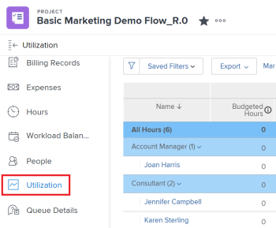

# Exibir informações de utilização de recursos

<!-- Audited: 01/2024 -->

<!--

(NOTE:&nbsp;this is linked to the UI from the Utilization report. ALWAYS keep this information. DO NOT DELETE!!)

-->

Você pode exibir a utilização de seus recursos no relatório de Utilização.

<!--

(NOTE: Vazgen's response about these hours ie below and he asked us to NOT document them:

It queries Assignments first to get the tasks, issues, projects to display in the view. And then from those gets the hours.

In some cases, like for Planned Hours, it takes them from Assignments

But Budgeted Hours come from projects.

And Actual Hours are their own object - Hour)

-->

<!--

This report displays information about the assignments on work items for projects in your environment, like Planned, Actual, and Budgeted Hours, FTE, or Cost.&nbsp;These are hours,&nbsp;FTE, or costs associated with the assignments and not with the tasks and issues themselves.(PRIVATE NOTE:&nbsp;Vazgen's response about these hours: It queries Assignments first to get the tasks, issues, projects to display in the view. And then from those gets the hours. In some cases, like for Planned Hours, it takes them from Assignments; But Budgeted Hours come from projects. And Actual Hours are their own object - Hour.)

-->

## Requisitos de acesso

+++ Expanda para visualizar os requisitos de acesso para a funcionalidade neste artigo.

Você deve ter o seguinte para acessar o relatório de Utilização:

<table style="table-layout:auto"> 
 <col> 
 <col> 
 <tbody> 
  <tr> 
   <td role="rowheader">plano do Adobe Workfront</td> 
   <td>
Novo: Qualquer um

       
Ou

       
Atual: Pro ou superior
 </td> 
  </tr> 
  <tr> 
   <td role="rowheader">Licença do Adobe Workfront</td> 
   <td>
Novo: Padrão

       
Ou

       
Atual: Plano
 </td> 
  </tr> 
  <tr> 
   <td role="rowheader">Configurações de nível de acesso</td> 
   <td> 
Visualize ou tenha acesso superior ao seguinte:
 
    <ul> 
     <li> 
Gerenciamento de recursos 
 </li> 
     <li> 
Projetos
 </li> 
     <li> 
Portfólios
 </li> 
     <li> 
Programas
 </li> 
     <li> 
Dados financeiros, se você quiser exibir informações por Custo
 </li> 
    </ul> </td> 
  </tr> 
  <tr> 
   <td role="rowheader">Permissões de objeto</td> 
   <td> 
Visualize o acesso a projetos, portfólios e programas para acessar a seção Utilização na área Recursos
 
  
 
Gerenciar acesso a um projeto para acessar a seção Utilização do projeto
 
  </td> 
  </tr> 
 </tbody> 
</table>

Para obter mais detalhes sobre as informações nesta tabela, consulte [Requisitos de acesso na documentação do Workfront](/help/quicksilver/administration-and-setup/add-users/access-levels-and-object-permissions/access-level-requirements-in-documentation.md).

+++

<!--

You must have View access to the projects you want to view utilization information for as described in this section. If you are still unable to access this information, contact your Workfront administrator. (NOTE:&nbsp;replaced with above table)

-->

<!--

<h2>Prerequisites for accessing utilization information</h2>

(NOTE: drafted, replaced with above table)

To access utilization information as described in this section, ensure that the following conditions are met:

<ul>
<li>You have at least&nbsp;View access to the project, program, or portfolio for which you want to view the utilization information.</li>
<li>Your Workfront administrator must grant you at least View access to&nbsp;Financial&nbsp;Data in your Access Level to be able to view cost and revenue information in the Utilization report. The Workfront administrator must enable both View Role Billing & Cost Rates as well as View User Billing &&nbsp;Cost Rates when they grant you the View access to Financial Data. For information about granting access to&nbsp;Financial&nbsp;Data, see <a href="../../administration-and-setup/add-users/configure-and-grant-access/grant-access-financial.md" class="MCXref xref">Grant access to financial data</a>. </li>
<li>

(NOTE:&nbsp;drafted. No longer the case.) 

The Utilization tab is included on any layout template that is assigned to you and that is applied to either the projects you view or to the Reporting area. 

The Utilization section is included on any layout template that is assigned to you and that is applied to either the projects you view or to the Resourcing area. 

</li>
<li>

The Utilization tab is available by default in the Reporting area if the system administrator has not assigned a custom layout template to you. 

The Utilization section is available by default in the Resourcing area if the system administrator has not assigned a custom layout template to you. 

</li>
</ul>

-->

## Visão Geral do relatório de Utilização {#overview-of-the-utilization-report}

O relatório de Utilização permite visualizar o andamento, o custo ou a receita de um projeto, programa ou portfólio em um único relatório. Você também pode comparar a receita com o custo.

Você pode exibir o relatório de Utilização na área Recursos para exibir a utilização em vários projetos, ou pode exibi-la no nível de um projeto para exibir a utilização dos recursos individuais (funções de cargo e usuários) associados a esse projeto.

Para obter informações sobre como acessar e usar o relatório de Utilização, consulte a seção [Rastrear progresso, custo e receita com o relatório de Utilização](#track-progress-cost-and-revenue-with-the-utilization-report) neste artigo.

### Rastrear horas (progresso) {#track-hours-progress}

É possível rastrear o progresso visualizando como as horas orçadas e planejadas se comparam às horas reais.

Ao rastrear o progresso de um projeto, programa ou portfólio, o progresso em relação a tarefas e problemas é incluído no relatório de Utilização.

As seguintes informações estão disponíveis no relatório de Utilização ao rastrear Horas:

<table style="table-layout:auto"> 
 <col> 
 <col> 
 <thead> 
  <tr> 
   <th><strong>Título Da Coluna Ao Exibir Horas</strong> </th> 
   <th><strong>Função</strong> </th> 
  </tr> 
 </thead> 
 <tbody> 
  <tr> 
   <td scope="col"><strong>Horas orçadas</strong> </td> 
   <td scope="col"> 
O total de horas orçadas nos projetos incluídos. Você pode exibir o total de horas orçadas para a vida geral dos projetos incluídos, ou pode exibir o total de horas orçadas somente para o intervalo de datas especificado (você pode especificar uma semana ou mês individual). 
 
As horas orçadas são preenchidas com base nas informações disponíveis na área de orçamento de recursos do Business Case ou do Planejador de recursos<em>.</em>
 
As Horas Orçadas são exibidas no relatório de Utilização em qualquer uma das seguintes linhas:
 
    <ul> 
     <li> As horas orçadas são resumidas por função de trabalho e por usuário individual no relatório de Utilização, da seguinte maneira: <strong>Usuário Individual:</strong> As horas orçadas são resumidas para cada usuário no relatório de utilização. Essas horas orçadas estão associadas às tarefas e problemas aos quais o usuário está atribuído nos projetos incluídos. (Você pode expandir a linha da função de trabalho correspondente para exibir uma lista de usuários com essa função de trabalho.) <strong>Função:</strong> as horas orçadas são resumidas por função de trabalho no relatório de utilização. As horas orçadas aparecem em uma função de trabalho específica como resultado de qualquer um dos seguintes cenários:
     <ul>
     <li>A função de trabalho é definida como a função de trabalho principal do usuário atribuído à tarefa ou problema ao qual as Horas orçadas estão associadas. </li> 
       <li>Quando você exibe informações de utilização para um único projeto, a função de trabalho do usuário atribuído às horas é usada independentemente de não haver atribuição na tarefa ou problema, outro usuário é atribuído sem atribuição de função de trabalho, outro usuário é atribuído com uma função de trabalho diferente ou outra equipe é atribuída.</li> 
       <li>Quando você exibe informações de utilização de vários projetos, programas ou portfólios, a função de trabalho do usuário atribuído às horas é usada somente quando a função é atribuída em uma tarefa ou problema em um projeto. </li> 
       <li>A função de trabalho é atribuída à tarefa ou problema que tem Horas orçadas associadas e o usuário atribuído à tarefa ou problema não tem uma função de trabalho definida no sistema.</li> 
      </ul></li> 
    </ul> 
    <ul> 
     <li> 
<strong>Horas Não Alocadas</strong>: as Horas Orçadas são exibidas no relatório de utilização na seção Horas Não Alocadas quando as Horas Orçadas são associadas a uma tarefa ou problema e não há nenhum usuário ou função atribuída à tarefa ou problema. Esta seção aparece somente quando há horas no projeto que correspondem a esta descrição e ao exibir o relatório de Utilização por ou de um projeto. 
 
Esta seção aparece somente quando há horas no projeto que correspondem a esta descrição e ao exibir o relatório de Utilização por ou de um projeto. 
 </li> 
    </ul> 
Para obter mais informações sobre horas orçadas, consulte <a href="/help/quicksilver/manage-work/projects/project-finances/budgeted-labor-cost.md#locate-the-budgeted-hours-of-a-project">Localizar as Horas Orçadas de um projeto</a> em <a href="/help/quicksilver/manage-work/projects/project-finances/budgeted-labor-cost.md">Entender o Custo de Mão de Obra Orçado e as Horas Orçadas dos projetos</a>.
 </td> 
  </tr> 
  <tr> 
   <td scope="col"><strong>Horas planejadas</strong> </td> 
   <td scope="col">

As Horas Planejadas nos projetos incluídos que estão associadas com as atribuições em cada tarefa e problema. Você pode exibir o total de horas planejadas de todas as atribuições no projeto durante a vida geral dos projetos incluídos, ou pode exibir o total de horas planejadas somente para o intervalo de datas especificado (você pode especificar uma semana ou mês individual).

<strong>DICA </strong>

As horas planejadas de itens que têm uma Duração de 0 não são consideradas. 

As Horas Planejadas no relatório de Utilização consideram se as Horas Planejadas foram realocadas na duração de uma tarefa ou problema. 

Quando a alocação diária do usuário para horas tiver sido modificada usando o Balanceador de Carga de Trabalho, os dados no relatório de Utilização poderão ser afetados se as datas selecionadas no relatório de Utilização contiverem apenas uma parte da Duração de uma tarefa ou problema. 

Para obter informações sobre como modificar alocações para usuários, consulte <a href="../workload-balancer/manage-user-allocations-workload-balancer.md">Gerenciar alocações de usuários no Balanceador de Carga de Trabalho</a>.

As Horas Planejadas são exibidas no relatório de Utilização em qualquer uma das seguintes linhas:

<ul>

<li>As Horas Planejadas são resumidas por função de trabalho e por usuário individual no relatório de utilização, da seguinte forma: 
<ul>

<li><strong>Usuário Individual</strong>: as Horas Planejadas são resumidas para cada usuário no relatório de utilização. Essas horas planejadas estão associadas às tarefas e problemas aos quais o usuário está atribuído nos projetos incluídos. (Você pode expandir a linha da função de trabalho correspondente para exibir uma lista de usuários com essa função de trabalho.)

<li><strong>Função de trabalho</strong>: as horas planejadas são resumidas por função de trabalho no relatório de utilização de um único projeto. As horas planejadas aparecem em uma função de trabalho específica como resultado de qualquer um dos seguintes cenários:  
<ul>

<li>A função de trabalho é definida como a função de trabalho principal do usuário atribuído à tarefa ou problema ao qual as Horas planejadas estão associadas.

<li>Quando você exibe informações de utilização para um único projeto, as horas associadas a uma função de trabalho não são exibidas para a função de trabalho nos seguintes cenários:   
<ul>

<li>Não há atribuição na tarefa ou problema

<li>Um usuário é atribuído sem atribuição de função de trabalho

<li>Um usuário recebe uma função de trabalho diferente

<li>Uma equipe é atribuída à tarefa ou ao problema
</li>   
</ul>

<li>Quando você exibe informações de utilização de vários projetos, programas ou portfólios, a função de trabalho do usuário atribuído às horas é usada somente quando a função é atribuída em uma tarefa ou problema em um projeto. As horas das funções de trabalho não são exibidas separadamente ao exibir o relatório de Utilização para vários projetos.

<li>A função de trabalho é atribuída à tarefa ou problema que tem Horas planejadas associadas, e o usuário atribuído à tarefa ou problema não tem uma função de trabalho definida no sistema.
</li>  
</ul>

<li><strong>Horas Não Alocadas</strong>: as Horas Planejadas são exibidas no relatório de utilização na seção Horas Não Alocadas quando as Horas Planejadas estão associadas a uma tarefa ou problema e não há nenhum usuário ou função atribuída à tarefa ou problema. Essa seção aparece somente quando há horas no projeto que correspondem a essa descrição e ao exibir o relatório de Utilização de um único projeto.  Para obter mais informações sobre as horas planejadas, consulte <a href="../../manage-work/tasks/task-information/planned-hours.md">visão geral das Horas Planejadas</a>.
</li> 
</ul>
</li> 
</ul> </td> 
  </tr> 
  <tr> 
   <td><strong>Horas efetivas</strong> </td> 
   <td> 
 O total de horas registradas nas tarefas, problemas, e no projeto para os projetos incluídos. Você pode exibir o total de horas reais para a vida geral dos projetos incluídos, ou pode exibir o total de horas reais somente para o intervalo de datas especificado (você pode especificar uma semana ou mês individual). 
 
<strong>Aviso:</strong> o relatório de utilização inclui horas registradas no projeto, tarefas filhas, problemas e tarefas pai que tenham pelo menos uma atribuição. Não inclui horas registradas em tarefas pai sem atribuições. Recomendamos que você não use tarefas pai como tarefas de trabalho e atribua somente tarefas filho aos seus recursos. 
 
As Horas Reais são exibidas no relatório de utilização em qualquer uma das seguintes linhas:
 
    <ul> 
     <li> As horas efetivas são resumidas por função de trabalho e por usuário individual no relatório de utilização de um projeto, da seguinte forma: <strong>Usuário individual:</strong> as horas efetivas são exibidas no relatório de utilização na linha do usuário que registrou as horas. (Você pode expandir a linha da função de trabalho correspondente para exibir uma lista de usuários com essa função de trabalho que registraram horas.) <strong>Função:</strong> as horas efetivas registradas pelos usuários associados a essas funções são resumidas no relatório de utilização na linha da função de trabalho correspondente. As horas efetivas aparecem em uma função de trabalho específica como resultado de qualquer um dos seguintes cenários: 
      <ul> 
       <li>A função de trabalho é definida como a função de trabalho principal do usuário que registrou as horas</li> 
       <li>Não há atribuição na tarefa ou problema</li> 
       <li>Outro usuário é atribuído sem atribuição de função de trabalho</li> 
       <li>Outro usuário recebe uma função de trabalho diferente</li> 
       <li> 
Uma equipe é atribuída
 </li> 
      </ul></li>  
     
Se o usuário que registra as horas não tiver uma função de trabalho associada ao seu perfil, a função de trabalho usada para o relatório de Utilização será a função de trabalho atribuída à tarefa ou problema em que as horas são registradas ou a função de trabalho associada ao Proprietário Principal da tarefa ou problema. 
 
     <li><strong>Outras Horas:</strong> As Horas Efetivas são exibidas no relatório de utilização na seção Outras Horas, na linha do usuário que fez logon nas horas. As horas aparecem nesta seção quando o usuário que registrou as horas não tem uma função de trabalho definida no sistema. Esta seção aparece somente quando há horas no projeto que correspondem a esta descrição. </li> 
    </ul> </td> 
  </tr> 
  <tr> 
   <td><strong>Variação do orçamento (para Horas)</strong> </td> 
   <td> 
O total de horas orçadas menos o total de horas reais dos projetos incluídos. Você pode exibir a variação orçada total para a vida geral dos projetos incluídos ou pode exibir a variação orçada total somente para o intervalo de datas especificado (você pode especificar uma semana ou mês individual). 
 
Se o valor for positivo, será exibido em verde. Isso indica que o total de horas orçadas é maior que as horas reais.
 
Se o valor for negativo, ele será exibido em vermelho. Isso indica que o total de horas orçadas é inferior às horas reais.
 
  
 </td> 
  </tr> 
  <tr> 
   <td><strong>Variação planejada (para horas)</strong> </td> 
   <td> 
O total de horas planejadas menos o total de horas reais nos projetos incluídos. Você pode exibir a variação planejada total para a vida geral dos projetos incluídos, ou pode exibir a variação planejada total somente para o intervalo de datas especificado (você pode especificar uma semana ou mês individual).
 
Se o valor for positivo, será exibido em verde. Isso indica que o total de horas planejadas é maior que as horas reais.
 
Se o valor for negativo, ele será exibido em vermelho. Isso indica que o total de horas planejadas é inferior às horas reais.
 </td> 
  </tr> 
 </tbody> 
</table>

### Rastrear custo {#track-cost}

Você pode rastrear o custo visualizando como o Custo Orçado e o Custo Planejado se comparam aos Custos Reais.

Ao rastrear o custo de um projeto, programa ou portfólio, as informações no relatório de Utilização vêm das tarefas. As informações de custo das tarefas estão sempre disponíveis no relatório de Utilização. O custo de tarefas é calculado com base no tipo de custo da tarefa. Para obter informações sobre o tipo de custo das tarefas, consulte [Como o Workfront calcula os Tipos de Custo para tarefas](/help/quicksilver/manage-work/projects/project-finances/track-costs.md#how-workfront-calculates-cost-types-for-tasks) em [Rastrear custos](/help/quicksilver/manage-work/projects/project-finances/track-costs.md).

Você pode exibir informações sobre custo no relatório de Utilização das seguintes maneiras:

* Para uma determinada semana ou mês, ou para o projeto, programa ou portfólio geral
* Por função ou indivíduo, para projetos

A moeda no relatório de utilização é determinada pela moeda definida no projeto. Para obter informações sobre como ajustar a moeda de um projeto, consulte [Alterar a moeda do projeto](../../manage-work/projects/project-finances/change-project-currency.md).

As seguintes informações estão disponíveis no relatório de Utilização ao rastrear custos:

<table style="table-layout:auto"> 
 <col> 
 <col> 
 <thead> 
  <tr> 
   <th><strong>Título da Coluna ao Exibir Custo</strong> </th> 
   <th> 
<strong>Função</strong> 
 </th> 
  </tr> 
 </thead> 
 <tbody> 
  <tr> 
   <td scope="col"><strong>Custo Orçado</strong> </td> 
   <td scope="col"> 
O Custo orçado nos projetos incluídos. Você pode exibir o Custo Orçado total para a vida geral dos projetos incluídos, ou pode exibir o Custo Orçado total somente para o intervalo de datas especificado (você pode especificar uma semana ou mês individual).
 
Como o Custo Orçado no Relatório de Utilização está focado no custo por função, o cálculo é o mesmo que o Custo de Mão-de-Obra Orçado em outras áreas do Workfront. Para obter informações sobre como o Custo do Trabalho Orçado é calculado, consulte <a href="../../manage-work/projects/project-finances/budgeted-labor-cost.md" class="MCXref xref">Entender o Custo do Trabalho Orçado e as Horas Orçadas dos projetos</a>.
 </td> 
  </tr> 
  <tr> 
   <td scope="col"><strong>Custo planejado</strong> </td> 
   <td scope="col"> 
O custo total planejado nos projetos incluídos. Você pode exibir o custo total planejado para a vida geral dos projetos incluídos, ou pode exibir o custo total planejado somente para o intervalo de datas especificado (você pode especificar uma semana ou mês individual).
 
Observe que para as exibições semana, mês e trimestral, os custos planejados são calculados como uma média do período escolhido quando as taxas de custo para funções de cargo ou usuários são efetivas por data.

Para obter informações sobre como o Custo Planejado do projeto é calculado, consulte <a href="/help/quicksilver/manage-work/projects/project-finances/track-costs.md#how-workfront-calculates-planned-budgeted-and-actual-costs">Como a Workfront calcula os Custos Planejados, Orçados e Efetivos</a> em <a href="/help/quicksilver/manage-work/projects/project-finances/track-costs.md">Rastrear custos</a>.
 </td>
  </tr> 
  <tr> 
   <td scope="col"><strong>Custo Efetivo</strong> </td> 
   <td scope="col"> 
O custo real total dos projetos incluídos. Você pode exibir o Custo Real total para a vida geral dos projetos incluídos, ou pode exibir o Custo Real total apenas para o intervalo de datas especificado (você pode especificar uma semana ou mês individual).
 
Para obter informações sobre como o Custo Efetivo do projeto é calculado, consulte <a href="/help/quicksilver/manage-work/projects/project-finances/track-costs.md#how-workfront-calculates-planned-budgeted-and-actual-costs">Como a Workfront calcula os Custos Planejados, Orçados e Efetivos</a> em <a href="/help/quicksilver/manage-work/projects/project-finances/track-costs.md">Rastrear custos</a>.
 </td>
  </tr> 
  <tr> 
   <td><strong>Variação do orçamento (para custo)</strong> </td> 
   <td scope="col"> 
O custo orçado total menos o custo real total nos projetos incluídos. Você pode exibir a variação orçada total para a vida geral dos projetos incluídos ou pode exibir a variação orçada total somente para o intervalo de datas especificado (você pode especificar uma semana ou mês individual).
 
Se o valor for positivo, será exibido em verde. Isso indica que o custo orçado total é maior que o custo real.
 
Se o valor for negativo, ele será exibido em vermelho. Isso indica que o custo orçado total é menor que o custo real.
 </td>
  </tr> 
  <tr> 
   <td><strong>Variação planejada (para custo)</strong> </td> 
   <td> 
O custo planejado total menos o custo real total nos projetos incluídos. Você pode exibir a variação planejada total para a vida geral dos projetos incluídos, ou pode exibir a variação planejada total somente para o intervalo de datas especificado (você pode especificar uma semana ou mês individual). 
 
Se o valor for positivo, será exibido em verde. Isso indica que o custo total planejado é maior que o custo real.
 
Se o valor for negativo, ele será exibido em vermelho. Isso indica que o Custo Planejado total é menor que o Custo Efetivo.
 </td> 
  </tr> 
 </tbody> 
</table>

### Rastrear receita {#track-revenue}

É possível rastrear a receita verificando como a receita orçada e planejada se compara à receita real.

Ao rastrear a receita de um projeto, programa ou portfólio, a receita somente das tarefas é incluída no relatório de Utilização.

As informações na tabela a seguir estão disponíveis no relatório de Utilização ao rastrear a Receita.

Para obter informações sobre os campos específicos e como a Workfront os calcula, consulte também [Rastrear custos](../../manage-work/projects/project-finances/track-costs.md) e [Visão geral de faturamento e receita](../../manage-work/projects/project-finances/billing-and-revenue-overview.md).

<table style="table-layout:auto"> 
 <col> 
 <col> 
 <thead> 
  <tr> 
   <th><strong>Título Da Coluna Ao Exibir Receita</strong> </th> 
   <th> <strong>Função</strong></th> 
  </tr> 
 </thead> 
 <tbody> 
  <tr> 
   <td scope="col"><strong>Receita Orçada</strong> </td> 
   <td scope="col"> 
O total de Horas Orçadas multiplicado pela Taxa de Cobrança da Função nos projetos incluídos. Você pode exibir a receita orçada total para a vida geral dos projetos incluídos, ou pode exibir a receita orçada total somente para o intervalo de datas especificado (você pode especificar uma semana ou mês individual).
 </td> 
  </tr> 
  <tr> 
   <td scope="col"><strong>Receita Planejada</strong> </td> 
   <td scope="col"> 
Receita Planejada no relatório de Utilização é a receita associada às Horas Planejadas alocadas aos recursos atribuídos às tarefas no projeto.
 
O Workfront calcula a Receita Planejada do projeto para o relatório de Utilização usando a seguinte fórmula:
 
<code>Project Planned Revenue = SUM (All Tasks Planned Revenue)</code> 
 
   
<b>OBSERVAÇÃO</b>
   
A Receita Planejada do projeto exibida no relatório de Utilização é diferente da Receita Planejada exibida na área Detalhes do Projeto e nos relatórios do projeto. 
 
A Receita planejada na área Detalhes do projeto reflete a receita da tarefa, bem como a Receita fixa do projeto. A Receita Planejada no Relatório de Utilização exibe a Receita Planejada associada somente às tarefas no projeto. 
 
     
Example: </b>">  
      
Se o projeto tiver uma tarefa com 10 horas, atribuída a um Consultor com uma taxa horária de US$ 20, e o projeto tiver uma Receita Fixa de US$ 100, o relatório de Utilização exibirá US$ 200 para a Receita Planejada (a Receita Planejada associada às horas na tarefa). A seção Detalhes do Projeto exibe US$ 300 (a Receita Planejada da tarefa e a Receita Fixa do projeto). 
 
     
 
Para obter mais informações sobre a tarefa e a Receita Planejada do projeto fora do relatório de Utilização, consulte <a href="../../manage-work/projects/project-finances/billing-and-revenue-overview.md" class="MCXref xref">Visão Geral de Faturamento e Receita</a>.
 
 
A maneira como o relatório de Utilização calcula e exibe a Receita Planejada dos projetos incluídos leva em consideração o Tipo de Receita definido na tarefa. 
 
Dependendo do Tipo de Receita de cada tarefa no projeto, os seguintes cenários existem: 
 
<strong>Receita Fixa:</strong> Independentemente das atribuições de tarefa, a receita na tarefa é sempre calculada usando o Valor Fixo especificado na tarefa.
 
<b>IMPORTANTE</b>

Ao contrário de outras áreas do Workfront, o relatório de Utilização calcula a Receita Planejada para tarefas de Receita Fixa dividindo a Receita Fixa igualmente pelo número de Horas Planejadas na tarefa. 
 
Por exemplo, uma tarefa tem uma receita de US$ 200. Se houver 4 horas planejadas na tarefa, cada hora será de US$ 50. Ele é distribuído no nível de usuário e função. Essa distribuição é exclusiva do relatório de Utilização.
 
<b>OBSERVAÇÃO</b>

Se você tiver uma tarefa de Receita Fixa e não houver Horas Planejadas para a tarefa, a Receita não será exibida no Relatório de Utilização porque não há como distribuí-la para as horas. Se você tiver Horas Planejadas em tarefas com Receita Fixa e nenhuma atribuição, a Receita será exibida como Receita Não Alocada. 
 
<strong>Função por hora:</strong> a receita na tarefa é calculada usando a taxa de cobrança definida para uma função específica, multiplicada pelo número de Horas planejadas associadas a essa função. O Workfront usa a seguinte fórmula:
 
<code>Receita Planejada por Hora da Função = SUM(Horas Planejadas da função em todas as tarefas) * Taxa de Cobrança da Função</code>

<b>OBSERVAÇÃO:</b> a taxa horária de cobrança na fórmula considera quaisquer alterações de data de efetivação da taxa.
   
<strong>Horas por Usuário:</strong> a receita da tarefa é calculada usando a taxa de cobrança definida para um usuário específico, multiplicada pelo número de Horas Planejadas associadas a esse usuário. O Workfront usa a seguinte fórmula:
 
<code>Receita planejada por hora do usuário = SUM(Horas planejadas de usuários em todas as tarefas) * Taxa de cobrança do usuário</code> 
 
<b>OBSERVAÇÃO:</b> a taxa horária de cobrança na fórmula considera quaisquer alterações de data de efetivação da taxa.
 
<b>Horas por Valor da Hora de Função ou Horas de Usuário mais Taxa Fixa</b> 
 
<b>IMPORTANTE</b>

Ao contrário de outras áreas do Workfront, o relatório de Utilização calcula a Receita Planejada dividindo a Receita Fixa igualmente pelo número de Horas Planejadas na tarefa. 
 
Os seguintes casos existem: 

<ul>
<li> 
<strong>Horas por Valor da Hora da Função mais Taxa Fixa:</strong> A receita da tarefa é calculada usando a taxa de cobrança definida para uma função específica, multiplicada pelo número de Horas Planejadas associadas à função. Além disso, um valor fixo que é especificado na tarefa é adicionado à taxa de funções. O Workfront usa a seguinte fórmula:
 
<code>Horas por Valor da Hora da Função mais Receita Fixa Planejada = [SUM(Horas Planejadas da função em todas as tarefas) * Taxa de Cobrança da Função] + SUM(Valor Máximo ou Fixo da tarefa / Horas Planejadas da tarefa)</code> 
 </li>
<li> 
<strong>Horas por Valor da Hora do Usuário mais Taxa Fixa:</strong> A taxa de cobrança definida para um usuário específico, multiplicada pelo número de Horas Planejadas desse usuário na tarefa. Além disso, uma quantidade fixa especificada na tarefa é adicionada à taxa de usuários. O Workfront usa a seguinte fórmula:
 
<code>Horas por Valor de Hora do Usuário mais Receita Fixa Planejada = [SUM(Horas Planejadas do usuário em todas as tarefas) * Taxa de Cobrança do Usuário] + SUM(Valor Limite ou Valor Fixo da tarefa / Horas Planejadas da tarefa)</code> 
 </li>
</ul> 
<b>Função ou Usuário por Hora com Limite</b> 
 
<b>IMPORTANTE</b>

Ao contrário de outras áreas do Workfront, se a Receita planejada exceder o limite, a quantia acima do Valor do limite será considerada Receita fixa. A Receita Planejada é calculada dividindo a Receita Fixa igualmente pelo número de Horas Planejadas na tarefa e, em seguida, adicionando a isso a Quantia Máxima e a receita horária da função ou do usuário.  
 
Os seguintes casos existem: 

<ul>
<li> 
<strong>A hora da função com limite:</strong> as tarefas são cobradas por hora como na hora da função, mas têm um valor máximo de limite que pode ser especificado. O Workfront usa a seguinte fórmula:
 
<code>Horas por hora da função com Receita Planejada de Limite = [SUM(Horas Planejadas da função em todas as tarefas e problemas) * Taxa de Cobrança da Função] + Quantidade de Limite da tarefa + SUM(Quantia acima da Quantidade de Limite / Horas Planejadas da tarefa)</code> 
 </li>
<li> 
<strong>A hora do usuário com limite:</strong> as tarefas são cobradas por hora como na hora do usuário, mas têm um valor máximo de limite que pode ser especificado. O Workfront usa a seguinte fórmula: 
 
<code>Horas por Usuário c/ Receita Planejada de Limite = [SUM(Horas Planejadas do usuário em todas as tarefas) * Taxa de Cobrança do Usuário] + Quantidade de Limite da tarefa + SUM(Quantia acima da Quantidade de Limite / Horas Planejadas da tarefa)</code> 
 </li>
</ul> 
Para obter mais informações sobre qual função ou usuário é considerado ao calcular a Receita Planejada, consulte <a href="../../manage-work/projects/project-finances/billing-and-revenue-overview.md" class="MCXref xref">Visão Geral de Faturamento e Receita</a>.
 </td>
</tr> 
  <tr> 
   <td><strong>Receita atual</strong> </td>
   <td> 
Receita Efetiva é a receita associada às Horas Efetivas das tarefas e do projeto. Para obter mais informações sobre a Receita Efetiva, consulte <a href="/help/quicksilver/manage-work/projects/project-finances/billing-and-revenue-overview.md#track-revenue-amounts">Rastrear valores de receita</a> em <a href="/help/quicksilver/manage-work/projects/project-finances/billing-and-revenue-overview.md">Visão geral de faturamento e receita</a>.

A maneira como o relatório de Utilização calcula a Receita Real dos projetos incluídos difere, dependendo do Tipo de Receita definido na tarefa, da seguinte maneira:
 
<strong>Receita Fixa:</strong> Independentemente das atribuições de tarefa, a receita na tarefa é sempre calculada usando o Valor Fixo especificado na tarefa.
 
<b>IMPORTANTE</b>

Ao contrário de outras áreas do Workfront, o relatório de Utilização calcula a Receita Real dividindo a Receita Fixa igualmente pelo número de horas registradas na tarefa. 
 
 
 
Por exemplo, uma tarefa tem uma Receita Efetiva de US$ 200. Se houver 4 horas reais na tarefa, cada hora será de US$ 50. Ele é distribuído no nível de usuário e função. Essa distribuição é exclusiva do relatório de Utilização.
 
<b>OBSERVAÇÃO</b>

Se você tiver uma tarefa de Receita Fixa e não houver Horas Reais na tarefa, a Receita Real não será exibida no Relatório de Utilização porque não há como distribuir horas. 
 
<strong>Função por hora:</strong> a receita na tarefa é calculada usando a taxa de cobrança definida para uma função específica, multiplicada pelo número de Horas efetivas.
 
O Workfront usa a seguinte fórmula:
 
<code>Receita atual por hora da função = SUM(Horas atuais da função em todas as tarefas) * Taxa de cobrança da função</code> 
 
<b>OBSERVAÇÃO:</b> a taxa horária de cobrança na fórmula considera quaisquer alterações de data de efetivação da taxa.
 
<strong>Horas por Usuário:</strong> a receita da tarefa é calculada usando a taxa de cobrança definida para um usuário específico, multiplicada pelo número de horas registradas na tarefa desse usuário. O Workfront usa a seguinte fórmula:
 
<code>Receita Real por Hora do Usuário = SUM(Horas Reais do Usuário em Todas as Tarefas) * Taxa de Cobrança do Usuário</code>
 
<b>OBSERVAÇÃO:</b> a taxa horária de cobrança na fórmula considera quaisquer alterações de data de efetivação da taxa.
 
<b>Horas por Valor da Hora do Usuário e da Função Corrigida</b> 
 
<b>IMPORTANTE</b>

Ao contrário de outras áreas do Workfront, o relatório de Utilização calcula a Receita Real dividindo a Receita Fixa igualmente pelo número de horas registradas na tarefa. 
 
Os seguintes casos existem: 

<ul>
<li> 
<strong>Função por hora mais taxa fixa:</strong> A taxa de cobrança definida para uma função específica, multiplicada pelo número de horas registradas na tarefa de um usuário com essa função. Além disso, um valor fixo que é especificado na tarefa é adicionado à taxa de funções. 
 
O Workfront usa a seguinte fórmula:
 
<code>Horas por Hora da Função mais Receita Fixa Efetiva = [SUM(Horas Efetivas da função em todas as tarefas) * Taxa de Cobrança da Função] + SUM(Valor Máximo ou Fixo da tarefa / Horas Efetivas da tarefa)</code> 
 </li>
<li> 
<strong>Horas por Valor da Hora do Usuário mais Taxa Fixa:</strong> A taxa de cobrança definida para um usuário específico, multiplicada pelo número de horas registradas na tarefa desse usuário. Além disso, uma quantidade fixa especificada na tarefa é adicionada à taxa de usuários. 
 
O Workfront usa a seguinte fórmula:
 
<code>Horas por Valor da Hora do Usuário mais Receita Fixa Efetiva = [SUM(Horas Efetivas da função em todas as tarefas) * Taxa de Cobrança do Usuário] + SUM(Valor Máximo ou Fixo da tarefa / Horas do Usuário da tarefa)</code> 
 </li>
</ul> 
<b>Função ou Usuário por Hora com Limite</b> 
 
<b>IMPORTANTE</b>

Ao contrário de outras áreas do Workfront, se a Receita planejada exceder o limite, a quantia acima do Valor do limite será considerada Receita fixa. A Receita Planejada é calculada dividindo a Receita Fixa igualmente pelo número de Horas Planejadas na tarefa e, em seguida, adicionando a isso a Quantia Máxima e a receita horária da função ou do usuário.  
 
Os seguintes casos existem:

<ul>
<li> 
<strong>A hora da função com limite:</strong> as tarefas são cobradas por hora como na hora da função, mas têm um valor máximo de limite que pode ser especificado. O Workfront usa a seguinte fórmula:
 
<code>Hora da Função c/ Receita Efetiva do Limite = [SUM(Horas Efetivas da função em todas as tarefas e problemas) * Taxa de Cobrança da Função] + Quantidade Limite da tarefa + SUM(Quantia acima do Valor Limite / Horas Efetivas da tarefa)</code>
 </li>
<li> 
<strong>A hora do usuário com limite:</strong> as tarefas são cobradas por hora como na hora do usuário, mas têm um valor máximo de limite que pode ser especificado.
 
 O Workfront usa a seguinte fórmula:
 
<code>Horas por Valor de Hora do Usuário c/ Receita Efetiva Limite = [SUM(Horas Efetivas da função em todas as tarefas e problemas) * Taxa de Cobrança do Usuário] + Quantidade Limite da tarefa + SUM(Quantia acima da Quantidade Limite / Horas Efetivas da tarefa)</code> 
 </li>
</ul>

<strong>Receita do projeto</strong>: a receita associada às horas registradas no projeto é calculada levando-se em conta o valor de Cobrança por Hora da função de trabalho principal do usuário que registra o tempo. Não recomendamos registrar tempo no projeto. 

<b>OBSERVAÇÃO</b>

Se o usuário não estiver associado a uma função de trabalho ou se o Faturamento por hora da função principal for zero, o Workfront calculará a Receita real usando o valor de Faturamento por hora para o usuário. Se o usuário não tiver um valor de Cobrança por hora em seu perfil, a Receita atual será zero. 

</td> 
  </tr> 
  <tr> 
   <td><strong>Variação do orçamento (para Receita)</strong> </td> 
   <td> 
A receita real total menos a receita orçada nos projetos incluídos. Você pode exibir a variação orçada total durante a vida geral dos projetos incluídos ou pode exibir a variação orçada total somente para o intervalo de datas especificado (você pode especificar uma semana ou mês individual).
 
Se o valor for positivo, será exibido em verde. Isso indica que a receita orçada total é maior que a receita real.
 
Se o valor for negativo, ele será exibido em vermelho. Isso indica que a receita orçada total é inferior à receita real.
 </td>
  </tr> 
  <tr> 
   <td><strong>Variação planejada (para receita)</strong> </td> 
   <td> 
A receita real total menos a receita planejada total nos projetos incluídos. Você pode exibir a variação planejada total durante a vida geral dos projetos incluídos ou pode exibir a variação planejada total somente para o intervalo de datas especificado (você pode especificar uma semana ou mês individual). 
 
Se o valor for positivo, será exibido em verde. Isso indica que a receita planejada total é maior que a receita real.
 
Se o valor for negativo, ele será exibido em vermelho. Isso indica que a Receita Total Planejada é inferior à Receita Efetiva.
 </td>
  </tr> 
 </tbody> 
</table>

<!--Note from the table about Actual revenue: 
     
Actual Revenue is displayed in the Utilization report only after the task is marked as Complete or Done (or a status that equates with Complete).

    -->

<!--More notes from the table: 
     
(NOTE:&nbsp;the note below is duplicated in this article: /Content/Manage work/Projects/Project Finances/billing-and-revenue-overview.html and in the glossary)

   -->

### Comparar Receita com Custos Planejados e Efetivos {#compare-revenue-against-planned-and-actual-costs}

Você pode exibir o Custo Planejado ou o Custo Efetivo juntamente com a Receita Planejada. A Margem (%) também é exibida (a margem é calculada como Receita - Custo / Receita).

As seguintes informações estão disponíveis no relatório de Utilização ao comparar a Receita com os Custos Planejados e Reais:

<table style="table-layout:auto"> 
 <col> 
 <col> 
 <thead> 
  <tr> 
   <th><strong>Título da Coluna ao Exibir Receita vs Custo (Planejado)</strong> </th> 
   <th> <strong>Função</strong></th> 
  </tr> 
 </thead> 
 <tbody> 
  <tr> 
   <td scope="col"><strong>Custo planejado</strong> </td> 
   <td scope="col"> O custo total planejado nos projetos incluídos. Você pode exibir o custo total planejado para a vida geral dos projetos incluídos, ou pode exibir o custo total planejado somente para o intervalo de datas especificado (você pode especificar uma semana ou mês individual). </td> 
  </tr> 
  <tr> 
   <td scope="col"><strong>Receita Planejada</strong> </td> 
   <td scope="col"> 
Receita planejada é a receita associada às Horas planejadas das tarefas. 
 
A maneira como o relatório de Utilização calcula e exibe a Receita Planejada para os projetos incluídos difere, dependendo do Tipo de Receita definido na tarefa, conforme descrito na seção <a href="#track-revenue" class="MCXref xref">Rastrear receita</a> deste artigo.
 </td> 
  </tr> 
  <tr> 
   <td scope="col"><strong>Margem</strong> </td> 
   <td scope="col"> 
A porcentagem de Margem é calculada da seguinte maneira:
 
<code>Planned Revenue - Planned Cost / Planned Revenue * 100. </code>
 
<b>Nota</b>

Se a Receita planejada for igual a 0, a Margem será exibida como 0. 
 </td>
</tr> 
  <tr> 
   <td scope="col"> 
<strong>Título da Coluna ao Exibir Receita vs Custo (Efetivo)</strong> 
  </td> 
   <td scope="col">
<strong>Função</strong>
</td> 
  </tr> 
  <tr> 
   <td scope="col"><strong>Custo Efetivo</strong> </td> 
   <td scope="col"> 
O custo real total dos projetos incluídos. Você pode exibir o Custo Real total para a vida geral dos projetos incluídos, ou pode exibir o Custo Real total apenas para o intervalo de datas especificado (você pode especificar uma semana ou mês individual).
 </td> 
  </tr> 
  <tr> 
   <td scope="col"><strong>Receita atual</strong> </td> 
   <td> 
Receita Efetiva é a receita associada às Horas Efetivas das tarefas.
 
A Receita Real é exibida no relatório de Utilização somente depois que a tarefa é marcada como Concluída ou Concluída (ou um status que equivale a Concluída).
 
A maneira como o relatório de Utilização calcula a Receita Real dos projetos incluídos difere, dependendo do Tipo de Receita definido na tarefa, conforme descrito na seção <a href="#track-revenue" class="MCXref xref">Rastrear receita</a> deste artigo. 
 </td> 
  </tr> 
  <tr> 
   <td scope="col"><strong>Margem</strong> </td> 
   <td> 
A porcentagem de Margem é calculada da seguinte maneira:
 
Receita Real - Custo Real / Receita Real * 100. 
 
<b>Nota</b>

Se a Receita real for igual a 0, a Margem será exibida como 0. 
 </td>
</tr> 
 </tbody> 
</table>

<!--Note from the table from above "Function" header in the middle of the table; right after the "Planned Revenue"/"Margin" definition: 
     
(NOTE: This needs to be either split in two tables of formatted differently)

    -->

## Acompanhe o progresso, o custo e a receita com o relatório de Utilização {#track-progress-cost-and-revenue-with-the-utilization-report}

Você pode acompanhar o progresso ou o custo de um projeto, programa ou portfólio.

É possível exibir informações sobre o relatório de Utilização de uma determinada semana ou mês, ou para a vida geral dos projetos.

Para acompanhar o andamento ou o custo de um ou mais projetos com um relatório de Utilização:

1. Desempenhe uma das ações a seguir, dependendo se você está exibindo informações de utilização de um projeto individual, de vários projetos, de um programa ou de um portfólio:

   * Para exibir as informações de utilização de um único projeto:

      1. Vá para um projeto para o qual deseja exibir as informações de utilização e clique em **Mostrar Mais> Utilização**.
      1. As informações de utilização são exibidas automaticamente ao visualizar um projeto individual, e a aplicação de um filtro não é necessária.\
         Para filtrar o relatório de Utilização, aplique um filtro e clique em **Executar**.\
         Para obter informações sobre como filtrar o relatório de Utilização, consulte [Informações de utilização do filtro](#filter-utilization-information) neste artigo.\
         As informações de utilização são exibidas para usuários individuais e funções (os usuários são agrupados em suas funções associadas).

   * Para exibir informações de utilização de vários projetos:

     {{step1-to-utilization-report}}

      1. Aplique um filtro ao relatório de Utilização e clique em **Executar**.
Você deve especificar um ou mais projetos no filtro antes de executar o relatório de Utilização. Para obter informações sobre como filtrar o relatório de Utilização, consulte [Informações de utilização do filtro](#filter-utilization-information) neste artigo.\
         As informações de utilização são exibidas para funções e projetos individuais (as funções são agrupadas em seus projetos associados).

   * Para exibir as informações de utilização de um programa:

     {{step1-to-utilization-report}}

      1. Clique em **Mostrar**>**Programas**.
      1. Aplique um filtro ao relatório de Utilização e clique em **Executar**.\
         Você deve especificar um ou mais programas no filtro antes de executar o relatório de Utilização. Para obter informações sobre como filtrar o relatório de Utilização, consulte [Informações de utilização do filtro](#filter-utilization-information) neste artigo.\
         As informações de utilização são exibidas para projetos e programas individuais (os projetos são agrupados em seus programas associados).

   * Para exibir informações sobre utilização de um portfólio:

     {{step1-to-utilization-report}}

      1. Clique em **Mostrar**>**Portfolio**.
      1. Aplique um filtro ao relatório de Utilização e clique em **Executar**.\
         Você deve especificar um ou mais portfólios no filtro antes de executar o relatório de Utilização. Para obter informações sobre como filtrar o relatório de Utilização, consulte [Informações de utilização do filtro](#filter-utilization-information) neste artigo.\
         As informações de utilização são exibidas para projetos, programas e portfólios individuais (os projetos são agrupados em seus programas associados e os programas são agrupados em seus portfólios associados).

1. No canto superior direito do relatório de Utilização, clique em **Exibir** e selecione uma das seguintes opções no menu:

   * **Custo**
   * **Horas**
   * **Receita**
   * **Receita vs. Custo (Planejado)**
   * **Receita vs. Custo (Efetivo)**

   A opção selecionada determina quais colunas e informações estão disponíveis no relatório.
   

1. (Opcional) Selecione o intervalo de datas para o qual as informações de utilização são exibidas. Você pode exibir informações de uma determinada semana ou mês à esquerda da coluna **Geral**. As informações do projeto, programa ou portfólio geral são sempre exibidas na coluna **Geral**.\
   Para obter mais informações, consulte [Ajustar o intervalo de datas para o qual as informações são exibidas](#adjust-the-date-range-for-which-information-is-displayed) neste artigo.

1. (Opcional) Clique em qualquer título de coluna para classificar o relatório de utilização pelas informações contidas nessa coluna. A classificação funciona somente quando você inclui vários itens no relatório. Por exemplo, você pode classificar os resultados do relatório quando estiver olhando para mais de um projeto (ou portfólio ou programa). Não é possível classificar os resultados quando você está observando apenas um projeto (ou um portfólio ou um programa) de cada vez.
1. Use as informações da seção [Visão Geral do relatório de Utilização](#overview-of-the-utilization-report) deste artigo para saber mais sobre cada coluna do relatório de Utilização.

## Filtrar informações de utilização {#filter-utilization-information}

É possível filtrar o conteúdo exibido em um relatório de Utilização de um projeto. Você pode filtrar tarefas, problemas, funções e dados personalizados. Quando você aplica um filtro, o relatório de Utilização contém informações com base nos critérios selecionados.

É possível criar um novo filtro ou aplicar um filtro criado anteriormente.

### Criar ou modificar um filtro {#create-or-modify-a-filter}

Ao criar um filtro, todos os usuários do Workfront com acesso ao relatório de Utilização também têm acesso ao filtro criado. Da mesma forma, quando você modifica um filtro existente, o filtro é modificado para todos os usuários que têm acesso ao relatório de Utilização.

Para criar ou modificar um filtro:

1. Abra o relatório de Utilização.
Consulte [Rastrear progresso, custo e receita com o relatório de Utilização](#track-progress-cost-and-revenue-with-the-utilization-report) para fazer isso.

1. Clique no ícone **Filtro** para exibir as opções de filtro.
1. (Condicional) Para modificar um filtro existente, clique no menu suspenso **Filtro** e selecione o filtro que deseja modificar.
1. Especifique as seguintes informações para criar ou modificar o filtro:

   * **Portfolio:** comece a digitar o nome do portfólio que contém as informações que você deseja incluir no relatório de Utilização e, em seguida, clique no nome quando ele aparecer na lista suspensa\
     Repita esse processo para incluir informações de vários portfólios no relatório de Utilização.\
     Para incluir todos os portfólios do sistema no filtro, clique em **Adicionar tudo**. (Essa opção só estará disponível se você tiver menos de 10 portfólios em seu sistema.)

   * **Programas:** comece a digitar o nome do programa que contém as informações que você deseja incluir no relatório de Utilização e, em seguida, clique no nome quando ele aparecer na lista suspensa.\
     Repita esse processo para incluir informações de várias tarefas no relatório de Utilização.\
     Se você já tiver designado algum portfólio no filtro, o programa especificado deverá ser dos portfólios já incluídos no filtro. Caso contrário, os dados do programa não serão incluídos no relatório de Utilização.\
     Para incluir todos os programas do sistema no filtro, clique em **Adicionar tudo**. (Essa opção só estará disponível se você tiver menos de 20 programas em seu sistema.)

   * **Projetos:** comece a digitar o nome do projeto que contém as informações que você deseja incluir no relatório de Utilização, em seguida, clique no nome quando ele aparecer na lista suspensa.\
     Repita esse processo para incluir informações de vários projetos no relatório de Utilização.\
     Se você já tiver designado portfólios ou programas no filtro, o projeto especificado deverá ser de um dos portfólios ou programas já incluídos no filtro. Caso contrário, os dados do projeto não serão incluídos no relatório de Utilização.\
     Para incluir todos os projetos do sistema no filtro, clique em **Adicionar tudo**. (Essa opção só estará disponível se você tiver menos de 250 projetos em seu sistema.)

   * **Tarefas:** comece a digitar o nome da tarefa que contém as informações que você deseja incluir no relatório de Utilização e, em seguida, clique no nome quando ele aparecer na lista suspensa.\
     Repita esse processo para incluir informações de várias tarefas no relatório de Utilização.\
     Se você já tiver designado portfólios, programas ou projetos no filtro, a tarefa especificada deverá ser de um dos portfólios, programas ou projetos já incluídos no filtro. Caso contrário, os dados da tarefa não serão incluídos no relatório de Utilização.

   * **Problemas:** comece digitando o nome do problema que contém as informações que você deseja incluir no relatório de Utilização, em seguida, clique no nome quando ele aparecer na lista suspensa.\
     Repita esse processo para incluir informações de vários problemas no relatório de Utilização.\
     Se você já tiver designado portfólios, programas ou projetos no filtro, o problema especificado deverá ser de um dos portfólios, programas ou projetos já incluídos no filtro. Caso contrário, os dados do problema não serão incluídos no relatório de Utilização.\
     As informações de custo para problemas nem sempre são incluídas no relatório de Utilização. Para obter mais informações sobre quando as informações de custo de problemas são incluídas no relatório de Utilização, consulte [Rastrear progresso, custo e receita com o relatório de Utilização](#track-progress-cost-and-revenue-with-the-utilization-report) neste artigo.

   * **Funções:** comece a digitar o nome da função que você deseja que seja representada no Relatório de Utilização e, em seguida, clique no nome quando ele aparecer na lista suspensa. Repita esse processo para incluir funções adicionais.
O Relatório de Utilização contém informações apenas para as funções especificadas. Por exemplo, uma tarefa contém 10 Horas Reais. Seis dessas horas são de uma função do Designer e quatro são de uma função de Desenvolvedor. Se você filtrar o Relatório de utilização por função para o Designer, as quatro horas provenientes da função de Desenvolvedor serão excluídas do relatório.

   * **Adicionar Regra de Filtro:** Clique em **Adicionar Regra de Filtro**, clique no campo de texto e comece a digitar o nome do campo no qual deseja filtrar. Se o campo estiver disponível, ele será preenchido para cada objeto em que puder ser associado. Clique no nome do campo para adicioná-lo ao filtro.

     >[!IMPORTANT]
     >
     >É necessário digitar o nome do campo, não o rótulo do campo. O rótulo do campo é exibido em um formulário personalizado anexado a um objeto. Para obter informações sobre a diferença entre o rótulo e o nome de um campo personalizado, consulte [Criar ou editar um formulário personalizado](../../administration-and-setup/customize-workfront/create-manage-custom-forms/create-or-edit-a-custom-form.md).

     Para obter mais informações sobre os campos exibidos nas colunas, consulte [Glossário da terminologia do Adobe Workfront](../../workfront-basics/navigate-workfront/workfront-navigation/workfront-terminology-glossary.md).\
     Escolha o filtro e os modificadores de condição para o filtro. Os modificadores disponíveis estão descritos em [Filtro e modificadores de condição](../../reports-and-dashboards/reports/reporting-elements/filter-condition-modifiers.md).

1. Para criar um novo filtro, clique em **Salvar Filtro**.\
   Ou\
   Para modificar um filtro existente, clique na seta ao lado do botão **Salvar filtro** e clique em **Salvar novo filtro**.
No campo **Nome do Filtro**, digite um nome para o filtro e clique em **Salvar**.
A área Utilização é filtrada com as informações incluídas no filtro.

### Aplicar um filtro salvo {#apply-a-saved-filter}

1. Abra o relatório de Utilização.
Consulte [Rastrear progresso, custo e receita com o relatório de Utilização](#track-progress-cost-and-revenue-with-the-utilization-report) para fazer isso.

1. Clique em **Filtros salvos** e selecione o filtro que deseja aplicar na lista suspensa.

### Duplicação de um filtro {#duplicate-a-filter}

1. Abra o relatório de Utilização.
Consulte [Rastrear progresso, custo e receita com o relatório de Utilização](#track-progress-cost-and-revenue-with-the-utilization-report) para fazer isso.

1. Clique em **Filtros Salvos**, passe o mouse sobre o filtro que deseja duplicar e clique no ícone **Duplicar**.

   

   A caixa de diálogo Duplicar Filtro é exibida.

1. No campo **Nome do Filtro**, digite um nome para o novo filtro e clique em **Salvar**.

### Renomear um filtro {#rename-a-filter}

Quando você renomeia um filtro, todos os usuários do Workfront com acesso ao relatório de Utilização veem o novo nome inserido.

Para renomear um filtro:

1. Abra o relatório de Utilização.
Consulte [Rastrear progresso, custo e receita com o relatório de Utilização](#track-progress-cost-and-revenue-with-the-utilization-report) para fazer isso.

1. Clique em **Filtros Salvos**, passe o mouse sobre o filtro que deseja renomear e clique no ícone **Renomear**.

   

   A caixa de diálogo Renomear Filtro é exibida.

1. No campo **Nome do Filtro**, digite um nome para o novo filtro e clique em **Salvar**.

### Excluir um filtro {#delete-a-filter}

Quando você exclui um filtro, ele é excluído para todos os usuários do Workfront que têm acesso ao relatório de Utilização.

Para excluir um filtro:

1. Abra o relatório de Utilização.
Consulte [Rastrear progresso, custo e receita com o relatório de Utilização](#track-progress-cost-and-revenue-with-the-utilization-report) para fazer isso.

1. Clique em **Filtros Salvos**, passe o mouse sobre o filtro que deseja excluir e clique no ícone **Excluir**.

   

1. Clique em **Excluir** quando solicitado se deseja excluir o filtro.

## Ajustar o intervalo de datas para o qual as informações são exibidas {#adjust-the-date-range-for-which-information-is-displayed}

Você pode ajustar o intervalo de datas para o qual as informações de utilização são exibidas. Você pode selecionar uma data passada ou futura. As alterações feitas ficam visíveis somente para você.

1. Abra o relatório de Utilização.
Consulte [Rastrear progresso, custo e receita com o relatório de Utilização](#track-progress-cost-and-revenue-with-the-utilization-report) para fazer isso.

1. Clique no intervalo de datas ao lado do botão **Exportar**.

   A semana atual é selecionada por padrão.

1. Escolha entre as seguintes opções:

   * **Semana:** selecione esta opção para selecionar uma determinada semana (de domingo a sábado).
   * **Mês:** selecione esta opção para selecionar um determinado mês.

   O intervalo de datas selecionado é exibido no relatório de Utilização, à esquerda da coluna **Geral**.\
   O Workfront lembra se você deseja exibir uma exibição semanal ou mensal. Na próxima vez que você acessar o relatório de Utilização, a semana atual ou o mês atual será exibido, dependendo da opção selecionada.

## Exportar informações de utilização

É possível exportar informações de utilização de um projeto, programa ou portfólio da Workfront. As informações podem ser exportadas somente nos formatos XLSX, TSV e PDF.

Quando visualizados no Microsoft Excel, números negativos são exibidos entre parênteses.

Para exportar informações sobre utilização:

1. Abra o relatório de Utilização.
Consulte [Rastrear progresso, custo e receita com o relatório de Utilização](#track-progress-cost-and-revenue-with-the-utilization-report) para fazer isso.

1. Clique em **Exportar** no canto superior esquerdo do relatório.

1. Selecione entre as seguintes opções:

   * **PDF:** exporta o relatório no formato PDF. Este é o formato recomendado se você estiver planejando imprimir o relatório.\
     Selecione **Carta - Retrato**, **Carta - Paisagem** ou **Outros Tamanhos** (fornece opções para exportação em Ofício (8,5&quot; x 14&quot;), Razão (11&quot; x 17&quot;) e A4).
Dependendo do sistema operacional usado, talvez você tenha a opção de abrir ou salvar o arquivo. Abra o arquivo com o aplicativo associado ou salve-o no computador.

   * **Excel:** exporta o relatório no formato XLSX. Esse é o formato recomendado se você estiver planejando analisar mais os dados no Excel.
Dependendo do sistema operacional usado, talvez você tenha a opção de abrir ou salvar o arquivo. Abra o arquivo com o aplicativo associado ou salve-o no computador.

   * **Delimitado por tabulação:** exporta o relatório no formato TSV. Esse é o formato recomendado se você estiver planejando importar os dados para um software de terceiros para análise adicional.
Dependendo do sistema operacional usado, talvez você tenha a opção de abrir ou salvar o arquivo. Abra o arquivo com o aplicativo associado ou salve-o no computador.

1. Leia as informações no artigo [Exportar dados](../../reports-and-dashboards/reports/creating-and-managing-reports/export-data.md) para entender como usar o arquivo exportado.

## Exibir informações de utilização em um gráfico

É possível visualizar os dados do relatório de Utilização em uma exibição de gráfico.

1. Abra o relatório de Utilização.
Consulte [Rastrear progresso, custo e receita com o relatório de Utilização](#track-progress-cost-and-revenue-with-the-utilization-report) para fazer isso.

1. No canto superior direito do relatório de Utilização, clique no ícone **Gráfico**.

   

   O relatório de Utilização é exibido em uma exibição de gráfico.

1. (Opcional) Configure o gráfico para mostrar Projetos, Programas ou Portfolio selecionando a opção apropriada no menu suspenso **Mostrar**.
1. (Opcional) Passe o mouse sobre um momento específico no relatório para visualizar os dados desse momento.

   

1. (Opcional) Ajuste os filtros para alterar quais informações são exibidas no gráfico. Para obter informações sobre como ajustar os filtros, consulte [Informações de utilização do filtro](#filter-utilization-information) neste artigo.
1. (Opcional) Configure o período do relatório de gráfico, conforme descrito em [Ajuste o intervalo de datas para o qual as informações são exibidas](#adjust-the-date-range-for-which-information-is-displayed) neste artigo.
