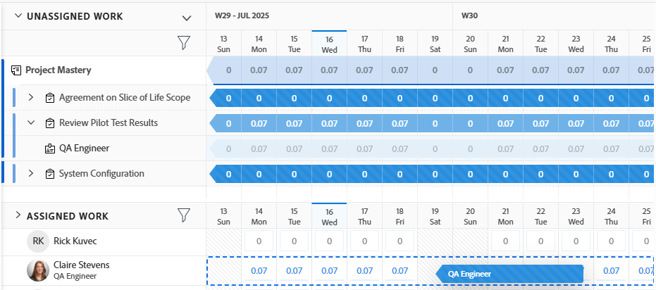

# Atribuir trabalho no Balanceador de carga de trabalho arrastando e soltando

{{preview-fast-release-general}}

Você pode atribuir itens de trabalho usando o Balanceador de carga de trabalho do Adobe Workfront arrastando e soltando itens de trabalho para os usuários corretos.

Para obter informações gerais sobre como atribuir trabalho a usuários usando o Balanceador de carga de trabalho, consulte [Visão geral da atribuição de trabalho no Balanceador de carga de trabalho](../../resource-mgmt/workload-balancer/assign-work-in-workload-balancer.md).

## Requisitos de acesso

+++ Expanda para visualizar os requisitos de acesso para a funcionalidade neste artigo. 

Você deve ter o seguinte acesso para executar as etapas deste artigo:

<table style="table-layout:auto"> 
 <col> 
 <col> 
 <tbody> 
  <tr> 
   <td role="rowheader">plano do Adobe Workfront</td> 
   <td> 
Qualquer 
 </td> 
  </tr> 
  <tr> 
   <td role="rowheader">Licença do Adobe Workfront</td> 
   <td>
Novo: Padrão

       
ou

       
Atual: plano, para atribuir trabalho no Balanceador de carga de trabalho na área Recursos; 
       Trabalho, para atribuir trabalho no Balanceador de carga de trabalho de uma equipe ou projeto
</td>
  </tr>
  <tr> 
   <td role="rowheader">Configurações de nível de acesso</td> 
   <td> 
Editar acesso ao seguinte:
 
    <ul> 
     <li>Gerenciamento de recursos</li> 
     <li>Projetos</li> 
     <li>Tarefas</li> 
     <li>Problemas</li> 
    </ul>
   </td> 
  </tr> 
  <tr> 
   <td role="rowheader">Permissões de objeto</td> 
   <td>Contribuir com permissões ou mais altas para projetos, tarefas e problemas que incluem Fazer atribuições</td> 
  </tr> 
 </tbody> 
</table>

Para obter mais detalhes sobre as informações nesta tabela, consulte [Requisitos de acesso na documentação do Workfront](/help/quicksilver/administration-and-setup/add-users/access-levels-and-object-permissions/access-level-requirements-in-documentation.md).

+++

## Atribuir um item ao arrastar e soltar

Você pode atribuir um item da área Trabalho não atribuído a um usuário ou pode reatribuir um item já atribuído a outro usuário na área Trabalho atribuído.

1. Vá para o Balanceador de carga de trabalho onde deseja atribuir trabalho.

   Você pode atribuir trabalho aos usuários usando o Balanceador de carga de trabalho na área Recursos, no projeto ou no nível da equipe. Para obter mais informações sobre onde o Balanceador de carga de trabalho está localizado na Workfront, consulte [Localizar o Balanceador de carga de trabalho](../../resource-mgmt/workload-balancer/locate-workload-balancer.md).

1. (Opcional) Vá para a área **Trabalho não atribuído** e aplique um filtro para exibir tarefas, problemas, e atribuições de função que não estejam atribuídas a usuários

   Ou

   Vá para a área **Trabalho atribuído** e expanda o nome de um usuário para ver os itens de trabalho atribuídos a ele, caso queira reatribuir seus itens.

   >[!NOTE]
   >
   >As atribuições de função são exibidas em itens de trabalho na área Trabalho não atribuído quando a configuração Mostrar atribuições de função está habilitada. Para obter mais informações, consulte [Personalizar a exibição](/help/quicksilver/resource-mgmt/workload-balancer/navigate-the-workload-balancer.md#customize-the-view) em [Navegar pelo Balanceador de Carga de Trabalho](/help/quicksilver/resource-mgmt/workload-balancer/navigate-the-workload-balancer.md).

1. (Condicional) No Balanceador de carga de trabalho de um projeto, clique no ícone **Mostrar todos os usuários**  para exibir todos os usuários do Workfront.

   Isso exibe todos os usuários que você tem acesso para visualizar.

   Os usuários que também fazem parte da equipe do projeto e já estão atribuídos a itens no projeto têm o ícone de projeto à direita de seu nome na área Trabalho atribuído.

   

   >[!TIP]
   >
   >* A opção Mostrar todos os usuários está disponível somente no Balanceador de carga de trabalho de um projeto.
   >* Use filtros para exibir somente os usuários que são importantes para você. Por exemplo, use um filtro para exibir somente usuários de suas equipes ou grupos.

1. Clique na barra de um item de trabalho ou atribuição de função que indica a linha do tempo planejada ou projetada e arraste-a ao longo das horas para um usuário na área **Atribuída**.

   O usuário que você passar o mouse para soltar o item de trabalho é realçado.

   Ao arrastar e soltar atribuições de funções, o usuário será realçado em laranja se sua função atual não corresponder à atribuição de função. Você ainda pode atribuir o trabalho ao usuário quando as funções não coincidirem.

   >[!TIP]
   >
   >As Horas planejadas do usuário que você está passando são atualizadas em tempo real com o número de Horas planejadas diárias do item de trabalho, para indicar qual pode ser o impacto da adição de um novo item na alocação geral.

   Imagem de exemplo no ambiente de Visualização:
   

   Imagem de amostra no ambiente de produção:
   

1. Quando estiver pronto, solte o item de trabalho selecionado ou a atribuição de função na mesma linha que o nome do usuário na Área Atribuída. O item é atribuído e as Horas Planejadas alocadas são atualizadas para o usuário com as novas horas do item de trabalho.

   Se a configuração Mostrar Atribuições de Função não estiver habilitada e o item de trabalho tiver sido atribuído a uma função de trabalho que o usuário não pode atender, o item será exibido abaixo do nome do usuário na área Trabalho Atribuído. Ele também permanece na área Trabalho não atribuído para indicar que a função de trabalho associada a ele ainda não foi substituída por um usuário.

   >[!TIP]
   >
   >* Se você ativou Agrupar por projeto na área Configurações, a tarefa atribuída é exibida no projeto correspondente. Se a configuração estiver desativada, a tarefa atribuída será exibida na área de usuário.
   >
   >
   >     O item é exibido de acordo com os critérios do Balanceador de carga de trabalho para classificar itens de trabalho. Para obter mais informações, consulte [Navegar pelo Balanceador de Carga de Trabalho](../../resource-mgmt/workload-balancer/navigate-the-workload-balancer.md).
   >
   >
   >* Se você ativou Mostrar todos os usuários no Balanceador de carga de trabalho de um projeto e atribuiu itens a usuários que não foram atribuídos anteriormente a itens no projeto, os usuários são adicionados à Equipe do projeto. Para obter mais informações, consulte [Gerenciar equipe de projeto](../../manage-work/projects/planning-a-project/manage-project-team.md).

1. (Opcional) Clique na barra de um item de trabalho sob o nome de um usuário na área Trabalho atribuído, arraste-o e solte-o sobre a área Trabalho não atribuído para desatribuí-lo. O item não está atribuído ao usuário, mas ainda pode estar atribuído a uma função de trabalho. Nesse caso, ele é exibido na área Trabalho não atribuído. Se o item for atribuído a outro usuário, ele permanecerá na área Trabalho atribuído sob o nome do usuário que ainda está atribuído.
1. (Opcional) Clique no **ícone Mostrar alocações**  e no **menu Mais**  > **Editar alocações**.

   <!--
   (make sure these are still called this, and that the icon has not changed)
   -->
   Ou

   Clique duas vezes em uma alocação diária ou semanal para modificar a quantidade de tempo que o usuário está alocado para o item de trabalho.

   Para obter informações sobre como modificar alocações de usuários no Balanceador de carga de trabalho, consulte a seção &quot;Modificar alocações de usuários&quot; no artigo [Gerenciar alocações de usuários no Balanceador de carga de trabalho](../../resource-mgmt/workload-balancer/manage-user-allocations-workload-balancer.md).

   Para obter informações sobre como remover atribuições de um item de trabalho usando o Balanceador de carga de trabalho, consulte [Cancelar atribuição de trabalho no Balanceador de carga de trabalho](../../resource-mgmt/workload-balancer/unassign-work-in-workload-balancer.md).

