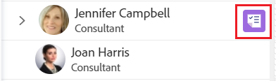

# Atribua trabalho ao Balanceador de Carga de Trabalho arrastando e soltando

<!--remove production and preview preferences at release-->

Você pode atribuir itens de trabalho usando o Balanceador de Carga de Trabalho do Adobe Workfront arrastando e soltando itens de trabalho nos usuários corretos.

Para obter informações gerais sobre como atribuir trabalho a usuários usando o Balanceador de Carga de Trabalho, consulte [Visão Geral da atribuição de trabalho no Balanceador de Carga de Trabalho](../../resource-mgmt/workload-balancer/assign-work-in-workload-balancer.md).

## Requisitos de acesso

Você deve ter o seguinte acesso para executar as etapas neste artigo:

<table style="table-layout:auto"> 
 <col> 
 <col> 
 <tbody> 
  <tr> 
   <td role="rowheader">Plano Adobe Workfront*</td> 
   <td> 
Qualquer Um 
 </td> 
  </tr> 
  <tr> 
   <td role="rowheader">Licença da Adobe Workfront*</td> 
   <td> 
Planejar, ao usar o Balanceador de Carga de Trabalho para uma equipe ou na área Recursos 

   
Trabalhe, ao usar o Balanceador de Carga de Trabalho de um projeto 

 </td> 
  </tr> 
  <tr> 
   <td role="rowheader">Nível de acesso*</td> 
   <td> 
Edite o acesso ao seguinte:
 
    <ul> 
     <li> 
Gerenciamento de recursos
 </li> 
     <li> 
Projetos
 </li> 
     <li> 
Tarefas
 </li> 
     <li> 
Problemas
 </li> 
    </ul> 
<b>Nota</b>

Caso ainda não tenha acesso, pergunte ao administrador do Workfront se ele definiu restrições adicionais em seu nível de acesso. Para obter informações sobre como um administrador do Workfront pode alterar seu nível de acesso, consulte <a href="../../administration-and-setup/add-users/configure-and-grant-access/create-modify-access-levels.md" class="MCXref xref">Criar ou modificar níveis de acesso personalizados</a>.
 </td>
</tr> 
  <tr> 
   <td role="rowheader">Permissões de objeto</td> 
   <td> 
Contribua com permissões ou superior para projetos, tarefas e problemas que incluem Fazer atribuições
 
Para obter informações sobre como solicitar acesso adicional, consulte <a href="../../workfront-basics/grant-and-request-access-to-objects/request-access.md" class="MCXref xref">Solicitar acesso a objetos </a>.
 </td> 
  </tr> 
 </tbody> 
</table>

&#42;Para descobrir qual plano, tipo de licença ou acesso você tem, entre em contato com o administrador da Workfront.

## Atribuir um item arrastando e soltando

Você pode atribuir um item da área de Trabalho Não Atribuído a um usuário ou reatribuir um item já atribuído a outro usuário na área de Trabalho Atribuído.

1. Vá para o Balanceador de Carga de Trabalho onde deseja atribuir trabalho.

   Você pode atribuir trabalhos a usuários usando o Balanceador de Carga de Trabalho na área Recursos, no projeto ou no nível da equipe. Para obter mais informações sobre onde o Balanceador de Carga de Trabalho está localizado no Workfront, consulte [Localizar o Balanceador de Carga de Trabalho](../../resource-mgmt/workload-balancer/locate-workload-balancer.md).

1. (Opcional) Vá para o **Trabalho Não Atribuído** e aplicar um filtro para exibir tarefas e problemas que não são atribuídos a usuários

   Ou

   Vá para o **Trabalho Atribuído** e expanda o nome de um usuário para exibir os itens de trabalho atribuídos a ele, caso deseje reatribuir seus itens.

1. (Condicional) No Balanceador de carga de trabalho de um projeto, clique no botão **Mostrar todos os usuários** ícone  para exibir todos os usuários do Workfront.

   Isso exibe todos os usuários que você tem acesso para visualizar.

   Os usuários que também fazem parte da equipe do projeto e já estão atribuídos aos itens no projeto têm o ícone do projeto à direita do nome na área de Trabalho atribuído.

   

   >[!TIP]
   >
   >* A opção Mostrar todos os usuários está disponível somente no Balanceador de Carga de Trabalho de um projeto.
   >* Use filtros para exibir somente os usuários importantes para você. Por exemplo, use um filtro para exibir somente usuários de suas equipes ou grupos.

1. Clique na barra de um item de trabalho que indica a linha do tempo planejada ou projetada e arraste-a sobre o nome de um usuário na **Atribuído** área.

   O usuário com o mouse sobre o qual você passa o mouse para soltar o item de trabalho em é destacado.

   >[!TIP]
   >
   >As Horas Planejadas para o usuário que você está passando o mouse sobre a atualização em tempo real com o número de Horas Planejadas Diárias do item de trabalho, para indicar qual pode ser o impacto da adição de um novo item na alocação geral.

   

1. Quando estiver pronto, solte o item de trabalho selecionado na mesma linha do nome do usuário na Área atribuída. O item é atribuído e as Horas Planejadas alocadas são atualizadas para o usuário com as novas horas do item de trabalho.

   Se o item foi atribuído a uma função de trabalho que o usuário não pode atender, o item será exibido sob o nome do usuário na área de Trabalho Atribuído e também permanecerá na área de Trabalho Não Atribuído para indicar que a função de trabalho associada a ele ainda não foi substituída por um usuário.

   >[!TIP]
   >
   >* Se você ativou Agrupar por projeto na área Configurações , a tarefa atribuída é exibida abaixo do projeto correspondente. Se a configuração estiver desativada, a tarefa atribuída será exibida na área de usuário.
      >
      >
      >     O item é exibido de acordo com os critérios do Balanceador de Carga de Trabalho para classificar itens de trabalho. Para obter mais informações, consulte [Navegar pelo Balanceador de Carga de Trabalho](../../resource-mgmt/workload-balancer/navigate-the-workload-balancer.md).
   >
   >
   >* Se você ativou Mostrar todos os usuários no Balanceador de Carga de Trabalho de um projeto e atribuiu itens a usuários que não tinham sido atribuídos anteriormente aos itens no projeto, os usuários são adicionados à Equipe do Projeto. Para obter mais informações, consulte [Gerenciar a equipe do projeto](../../manage-work/projects/planning-a-project/manage-project-team.md).

1. (Opcional) Clique na barra de um item de trabalho sob o nome de um usuário na área Trabalho atribuído e arraste-o e solte-o na área Trabalho não atribuído para cancelá-lo. O item não é atribuído do usuário, mas ainda pode ser atribuído a uma função de trabalho, caso em que é exibido na área Trabalho não atribuído. Se o item for atribuído a outro usuário, ele permanecerá na área Trabalho atribuído sob o nome do usuário que ainda está atribuído.
1. (Opcional) Clique no botão **Ícone Mostrar alocações** , em seguida, clique no botão **Menu Mais**  > **Editar alocações**.

   <!--
   (make sure these are still called this, and that the icon has not changed)
   -->
   Ou

   Clique duas vezes em uma alocação diária ou semanal para modificar a quantidade de tempo que o usuário está alocado para o item de trabalho.

   Para obter informações sobre como modificar alocações de usuários no Balanceador de Carga de Trabalho, consulte a seção &quot;Modificar alocações de usuários&quot; no artigo [Gerenciar alocações de usuários no Balanceador de Carga de Trabalho](../../resource-mgmt/workload-balancer/manage-user-allocations-workload-balancer.md).

   Para obter informações sobre como remover atribuições de um item de trabalho usando o Balanceador de Carga de Trabalho, consulte [Cancelar atribuição de trabalho no Balanceador de Carga de Trabalho](../../resource-mgmt/workload-balancer/unassign-work-in-workload-balancer.md).

