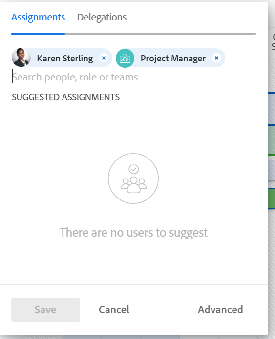

# Atribuir trabalho manualmente usando o Balanceador de carga de trabalho

Você pode atribuir itens de trabalho manualmente aos usuários usando o Balanceador de carga de trabalho do Adobe Workfront.

Para obter informações gerais sobre como atribuir trabalho aos usuários usando o Balanceador de carga de trabalho, consulte [Visão geral da atribuição de trabalho no Balanceador de carga de trabalho](../../resource-mgmt/workload-balancer/assign-work-in-workload-balancer.md).

## Requisitos de acesso

Você deve ter o seguinte acesso para executar as etapas deste artigo:

<table style="table-layout:auto"> 
 <col> 
 <col> 
 <tbody> 
  <tr> 
   <td role="rowheader">plano do Adobe Workfront*</td> 
   <td> 
Qualquer Um 
 </td> 
  </tr> 
  <tr> 
   <td role="rowheader">Licença da Adobe Workfront*</td> 
   <td> 
Planejar, ao usar o Balanceador de carga de trabalho na área Recursos

   
Trabalhar, ao usar o Balanceador de carga de trabalho de uma equipe ou projeto

 </td> 
  </tr> 
  <tr> 
   <td role="rowheader">Nível de acesso*</td> 
   <td> 
Editar acesso ao seguinte:
 
    <ul> 
     <li> 
Gerenciamento de recursos
 </li> 
     <li> 
Projetos
 </li> 
     <li> 
Tarefas
 </li> 
     <li> 
Problemas
 </li> 
    </ul> 
<b>Nota</b>

Se você ainda não tiver acesso, pergunte ao administrador do Workfront se ele definiu restrições adicionais em seu nível de acesso. Para obter informações sobre como um administrador do Workfront pode alterar seu nível de acesso, consulte <a href="../../administration-and-setup/add-users/configure-and-grant-access/create-modify-access-levels.md" class="MCXref xref">Criar ou modificar níveis de acesso personalizados</a>.
 </td>
</tr> 
  <tr> 
   <td role="rowheader">Permissões de objeto</td> 
   <td> 
Contribuir com permissões ou mais altas para projetos, tarefas e problemas que incluem Fazer atribuições
 
Para obter informações sobre como solicitar acesso adicional, consulte <a href="../../workfront-basics/grant-and-request-access-to-objects/request-access.md" class="MCXref xref">Solicitar acesso a objetos </a>.
 </td> 
  </tr> 
 </tbody> 
</table>

&#42;Para descobrir seu plano, tipo de licença ou acesso, entre em contato com o administrador do Workfront.

## Atribuir trabalho manualmente no Balanceador de carga de trabalho

Você pode atribuir itens de trabalho que ainda não foram atribuídos a um usuário ou reatribuir itens que foram atribuídos a usuários no Balanceador de carga de trabalho.

1. Vá para o Balanceador de carga de trabalho onde deseja atribuir trabalho.

   Você pode atribuir trabalho aos usuários usando o Balanceador de carga de trabalho na área Recursos, no projeto ou no nível da equipe. Para obter mais informações sobre onde o Balanceador de carga de trabalho está localizado no Workfront, consulte [Localize o Balanceador de carga de trabalho](../../resource-mgmt/workload-balancer/locate-workload-balancer.md).

1. (Opcional) Vá para a página **Trabalho não atribuído** e aplicar um filtro para exibir tarefas ou problemas

   Ou

   Vá para a **Trabalho atribuído** e expandir o nome de um usuário para visualizar os itens de trabalho atribuídos a ele, caso deseje reatribuir seus itens.

1. Clique em **Menu Mais**  à esquerda do nome de um item de trabalho e clique em **Atribuir esta para**.

   

   >[!TIP]
   >
   >Você também pode usar os seguintes atalhos para atribuir tarefas ou problemas:
   >
   >* No Windows: CTRL+clique na barra de tarefas ou problemas.
   >* No Mac: CMD+clique na barra de tarefas ou problemas.

1. Siga um destes procedimentos:

   * Comece a digitar o nome de um usuário, função de trabalho ou equipe que deseja atribuir ao item na **Pesquisar pessoas, funções ou equipes** selecione-o quando ele for exibido na lista e clique em **Salvar**.

   >[!TIP]
   >
   >Ao adicionar um usuário, observe o avatar, a função principal do usuário e seu endereço de email para distinguir entre usuários com nomes idênticos.
   >
   >Os usuários devem ser associados a pelo menos uma função de trabalho para visualizá-la à medida que forem adicionados.
   >
   > Você deve ter a configuração Exibir informações de contato ativada no seu nível de acesso para que os usuários visualizem os emails dos usuários. Para obter informações, consulte [Conceder acesso aos usuários](../../administration-and-setup/add-users/configure-and-grant-access/grant-access-other-users.md).

   

   >[!TIP]
   >
   > Se a Workfront ou o administrador de grupo tiver ativado delegações no seu ambiente, use a guia Atribuições para atribuir usuários à tarefa ou problema. Use a guia Delegações para exibir os usuários delegados ao item de trabalho. Para obter informações sobre como delegar trabalho, consulte [Gerenciar delegação de tarefas e problemas](../../manage-work/delegate-work/how-to-delegate-work.md).

   Isso atribui ou reatribui o item de trabalho aos atribuídos especificados.

   Se você atribuir um item apenas a uma equipe ou função de trabalho, o item será exibido somente na área Trabalho não atribuído. Você deve atribuir itens de trabalho aos usuários para exibi-los na área Trabalho atribuído do Balanceador de carga de trabalho.

   >[!TIP]
   >
   >Você pode atribuir vários usuários, funções de trabalho ou equipes. Você pode atribuir somente usuários, funções de trabalho e equipes ativos.
   >
   >
   >Se um usuário, função de trabalho ou equipe foi atribuído antes de ser desativado, ele permanece atribuído ao item de trabalho. Nesse caso, recomendamos o seguinte:
   >
   >   
   >   
   >   * Reatribuir o item de trabalho aos recursos ativos.
   >   * Associe os usuários de uma equipe desativada a uma equipe ativa e reatribua o item de trabalho à equipe ativa.
   >   
   >

   * Clique em **Avançado** para acessar as Atribuições Avançadas.

     Para obter mais informações sobre como fazer atribuições avançadas, consulte [Criar atribuições avançadas](../../manage-work/tasks/assign-tasks/create-advanced-assignments.md).

1. (Opcional) Clique no link **Mostrar ícone de alocações** e, em seguida, clique na guia **Menu Mais**  > **Editar alocações**.

   Ou

   Clique duas vezes em uma alocação diária ou semanal para modificar a quantidade de tempo que o usuário está alocado para o item de trabalho.

   Para obter informações sobre como modificar alocações de usuários no Balanceador de carga de trabalho, consulte a seção &quot;Modificar alocações de usuários&quot; no artigo [Gerenciar alocações de usuário no Balanceador de carga de trabalho](../../resource-mgmt/workload-balancer/manage-user-allocations-workload-balancer.md).

   Para obter informações sobre como remover atribuições de um item de trabalho usando o Balanceador de carga de trabalho, consulte [Cancelar atribuição de trabalho no Balanceador de carga de trabalho](../../resource-mgmt/workload-balancer/unassign-work-in-workload-balancer.md).

    
