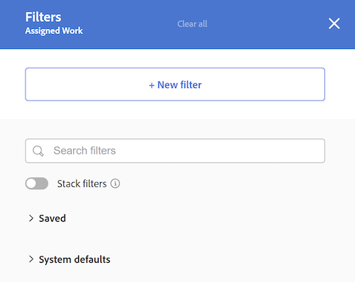

# Filtrar informações no Balanceador de carga de trabalho

<!-- Audited: 6/2025 -->

<!--
(when they add custom fields to fitlering, add the caveat you added for the Resource Planner : only field NAMES and not LABELS are to be found in the drop-down >> ADD THIS IN THE STEP BELOW WHEN ADDING A FILTER)
-->

Como gerenciador de recursos, você pode usar o Balanceador de carga de trabalho para exibir e gerenciar a carga de trabalho dos usuários. Para obter informações mais gerais sobre o Balanceador de carga de trabalho, consulte os seguintes artigos:

* [Visão geral do Balanceador de carga de trabalho](../../resource-mgmt/workload-balancer/overview-workload-balancer.md)
* [Navegar pelo Balanceador de carga de trabalho](../../resource-mgmt/workload-balancer/navigate-the-workload-balancer.md)

>[!IMPORTANT]
>
>Para encontrar itens de trabalho com eficiência e se concentrar nos usuários ou itens que você gerencia, recomendamos que você use filtros no Balanceador de carga de trabalho. Isso permite exibir as informações corretas antes de começar a gerenciar as atribuições dos recursos.
>
>Quando você sai do Balanceador de carga de trabalho depois de salvar e aplicar um novo filtro, o filtro ainda é aplicado mesmo depois de fazer logoff e logon novamente.

Este artigo contém informações sobre filtros no Balanceador de carga de trabalho. Para obter informações sobre filtros no Workfront, consulte [Visão geral sobre filtros](../../reports-and-dashboards/reports/reporting-elements/filters-overview.md).

## Requisitos de acesso

<table style="table-layout:auto"> 
 <col> 
 <col>
 <tbody> 
  <tr> 
   <td>Pacote do Adobe Workfront</td> 
   <td>
Qualquer
</td>
  </tr>
  <tr> 
   <td>Licença do Adobe Workfront</td> 
   <td>
Standard

       
Planejar, ao usar o Balanceador de carga de trabalho na área Recursos; Trabalhar, ao usar o Balanceador de carga de trabalho de uma equipe ou projeto
</td>
  </tr>
  <tr> 
   <td>Configurações de nível de acesso</td> 
   <td> 
Visualize ou tenha acesso superior ao seguinte:
 
    <ul> 
     <li>Gerenciamento de recursos</li> 
     <li>Projetos</li> 
     <li>Tarefas</li> 
     <li>Problemas</li>
     <li>Filtros, visualizações e agrupamentos</li>
    </ul>
    
Editar acesso a Filtros, Visualizações e Agrupamentos ao criar ou editar filtros 
 </td>
  </tr> 
  <tr> 
   <td>Permissões de objeto</td> 
   <td> 
Visualize ou aumente as permissões para projetos, tarefas, problemas

   
Gerencie permissões para os filtros que deseja editar ou excluir

   </td> 
  </tr> 
 </tbody> 
</table>

Para obter informações, consulte [Requisitos de acesso na documentação do Workfront](/help/quicksilver/administration-and-setup/add-users/access-levels-and-object-permissions/access-level-requirements-in-documentation.md).

+++

## Visão geral dos filtros no Balanceador de carga de trabalho

Considere o seguinte ao trabalhar com filtros no Balanceador de carga de trabalho:

* Dependendo de onde você acessa o Balanceador de carga de trabalho, o Workfront já pode estar filtrando as informações para você. Para obter mais informações, consulte a seguinte seção neste artigo: [Filtros pré-aplicados no Balanceador de carga de trabalho](#pre-applied-filters-in-the-workload-balancer).
* É possível criar e aplicar um filtro sem salvá-lo ou salvar um filtro para reutilização posterior.
* Ao aplicar um filtro sem salvá-lo, é possível reverter para as listas originais atualizando a página.
* É possível exibir os filtros criados ou os filtros que outros usuários criaram e compartilharam com você.
* Ao excluir ou editar um filtro compartilhado, ele também é excluído ou editado para todas as pessoas com as quais você o compartilhou.
* Ao criar filtros no Balanceador de carga de trabalho em uma área, eles não estão disponíveis em outras áreas.

  Por exemplo, os filtros criados na área Recursos não estão disponíveis no Balanceador de carga de trabalho de um projeto ou equipe.

  Para obter informações sobre onde localizar o Balanceador de carga de trabalho, consulte [Localizar o Balanceador de carga de trabalho](../../resource-mgmt/workload-balancer/locate-workload-balancer.md).

* Você só poderá visualizar itens que correspondem aos filtros selecionados se também corresponderem às datas na linha do tempo exibida na tela Balanceador de carga de trabalho.

## Filtros pré-aplicados no Balanceador de carga de trabalho {#pre-applied-filters-in-the-workload-balancer}

O Balanceador de carga de trabalho exibe informações em duas áreas separadas:

* **Área Trabalho Não Atribuído**: itens de trabalho que ainda não foram atribuídos aos usuários.
* **Área Trabalho Atribuído**: itens de trabalho atribuídos a usuários.

  Para obter informações sobre o que é exibido em cada uma das áreas, consulte [Navegar pelo Balanceador de Carga de Trabalho](../../resource-mgmt/workload-balancer/navigate-the-workload-balancer.md).

>[!IMPORTANT]
>
>Cada área do Balanceador de carga de trabalho tem seu próprio conjunto de filtros que funcionam independentemente uns dos outros. Você deve configurar ambos os filtros para indicar quais informações deseja ver em cada área.

O Balanceador de carga de trabalho exibe usuários e seus itens de trabalho.
Os itens de trabalho atribuídos aos usuários são exibidos somente quando as datas dos itens correspondem ao período exibido na tela.

Dependendo de onde você acessar o Balanceador de carga de trabalho a partir de, as áreas Não atribuídas e Atribuídas já serão filtradas por determinados critérios, conforme descrito na tabela a seguir:

<table style="table-layout:auto"> 
 <col> 
 <col> 
 <col> 
 <tbody> 
  <tr> 
   <td role="rowheader"><strong>Área do Workfront onde você acessa o Balanceador de carga de trabalho</strong></td> 
   <td><b>Itens exibidos na área Trabalho não atribuído por padrão</b> </td> 
   <td><b>Itens exibidos na área Trabalho atribuído por padrão</b> </td> 
  </tr> 
  <tr> 
   <td role="rowheader">A área Recursos</td> 
   <td>Nenhum item é exibido aqui por padrão. Você deve personalizar filtros para visualizar itens de trabalho nesta área.</td> 
   <td>Usuários que são membros de qualquer uma de suas equipes e seus itens de trabalho. </td> 
  </tr> 
  <tr> 
   <td role="rowheader">Uma equipe</td> 
   <td>Itens de trabalho atribuídos à equipe ou à equipe e uma função de trabalho. </td> 
   <td> 
Usuários que são membros da equipe selecionada e seus itens de trabalho.
 </td> 
  </tr> 
  <tr> 
   <td role="rowheader">Um projeto</td> 
   <td> 
Itens de trabalho não atribuídos ou itens atribuídos a equipes ou funções de trabalho no projeto selecionado são exibidos nesta área.
 </td> 
   <td> 
Usuários atribuídos a pelo menos um item de trabalho no projeto selecionado e seus itens de trabalho no projeto quando o filtro padrão do sistema <b>Itens de trabalho deste projeto</b> é selecionado. 

Quando o filtro padrão do sistema <b>Itens de trabalho deste projeto</b> é desmarcado, a área Trabalho atribuído de um projeto exibe todos os itens de trabalho dos usuários atribuídos a pelo menos um item no projeto selecionado.    Este filtro está desmarcado por padrão.

 <b>Observação</b>: você pode habilitar a opção <b>Mostrar todos os usuários</b> no Balanceador de Carga de Trabalho do projeto para exibir todos os usuários no sistema. Para obter mais informações, consulte <a href="../workload-balancer/navigate-the-workload-balancer.md" class="MCXref xref">Navegar pelo Balanceador de Carga de Trabalho</a>

</td> 
  </tr> 
 </tbody> 
</table>

## Criar filtros do Balanceador de carga de trabalho

O processo de criação de filtros para as áreas Trabalho não atribuído e Trabalho atribuído no Balanceador de carga de trabalho é idêntico independentemente de onde você acessa o Balanceador de carga de trabalho. Para obter informações sobre como localizar o Balanceador de carga de trabalho, consulte [Localizar o Balanceador de carga de trabalho](../../resource-mgmt/workload-balancer/locate-workload-balancer.md).

É possível criar um filtro do zero ou editar um dos filtros predefinidos. Para obter informações sobre filtros existentes que podem ser editados, consulte a seção [Editar um filtro existente no Balanceador de carga de trabalho](#edit-an-existing-filter-in-the-workload-balancer) neste artigo.

1. Vá para o Balanceador de carga de trabalho.

   Para obter informações sobre como acessar o Balanceador de carga de trabalho, consulte [Navegar pelo Balanceador de carga de trabalho](../../resource-mgmt/workload-balancer/navigate-the-workload-balancer.md).

1. No canto superior direito das áreas **Trabalho não atribuído** ou **Trabalho atribuído**, clique no ícone **Filtro** . A caixa **Filtros** é exibida à direita, e o nome da área para a qual você está criando o filtro é exibido no cabeçalho.

   

1. (Opcional e condicional) Se você acessar o Balanceador de carga de trabalho na área **Recursos**, o filtro Padrão predefinido talvez já esteja aplicado à área **Trabalho atribuído**. É possível editar e salvar uma cópia do filtro Padrão.

   >[!TIP]
   >
   >O filtro Padrão exibe os usuários que pertencem a qualquer uma das equipes e seus itens de trabalho. É possível editar uma cópia desse filtro.

   Se você acessar o [!UICONTROL Balanceador de carga de trabalho] de um projeto, o filtro **Itens de trabalho deste projeto** talvez já tenha sido aplicado. Exibe somente os itens de trabalho atribuídos aos usuários neste projeto. Você pode duplicar e salvar uma cópia desse filtro.

   Por padrão, o [!UICONTROL Balanceador de carga de trabalho] do projeto exibe todos os itens de trabalho atribuídos a todos os usuários no projeto.

1. Clique em **Novo filtro**.

1. Para criar um filtro, faça o seguinte:

   1. Selecione um nome de campo no primeiro menu suspenso ou clique em **Procurar campos** na parte inferior do menu suspenso para digitar o nome de um campo que não é exibido por padrão.

      >[!IMPORTANT]
      >
      >Ao fazer referência a campos personalizados, você deve digitar o nome do campo, não o rótulo do campo. O rótulo do campo é exibido em um formulário personalizado anexado a um objeto. Para obter informações sobre a diferença entre o rótulo e o nome de um campo personalizado, consulte [Criar um formulário personalizado](/help/quicksilver/administration-and-setup/customize-workfront/create-manage-custom-forms/form-designer/design-a-form/design-a-form.md).

   1. (Condicional) Se você clicou em **Procurar campos**, digite o nome de um campo no campo **Pesquisar** e selecione-o quando ele for exibido na lista.

      

      >[!TIP]
      >
      >Você pode selecionar um campo nas seguintes seções:
      >
      >* **Seleções recentes**: os campos que você filtrou recentemente.
      >* **Sugerido**: os campos usados com mais frequência.

   1. Selecione um modificador no segundo menu suspenso. Para obter informações sobre modificadores de filtro Workfront, consulte [Filtros e modificadores de condição](../../reports-and-dashboards/reports/reporting-elements/filter-condition-modifiers.md).
   1. Selecione ou digite um valor para o campo que você está filtrando.

      >[!NOTE]
      >
      > Quando quiser exibir objetos de trabalho de um portfólio específico, você pode aplicar o seguinte filtro: Portfolio ID Equals &lt; PORTFOLIO NAME >.
      >
      >
      >
      >Para excluir projetos com status Em espera, você deve aplicar o seguinte filtro: Projeto: O status Não é igual a Em espera. Isso impede que os itens de trabalho em projetos Suspensos sejam exibidos no Balanceador de carga de trabalho.
      >
      >

   1. (Opcional) Clique no ícone **Excluir**  para remover um critério de filtro.

1. (Opcional) Clique em **Adicionar filtro** para adicionar outro critério de filtro e repita as ações da etapa 4.

   <!--(NOTE: ensure this stays correct)-->

1. Clique em **Aplicar** para aplicar os resultados do filtro à área do Balanceador de carga de trabalho selecionada sem salvá-lo. A lista de itens de trabalho é atualizada à esquerda.

   >[!IMPORTANT]
   >
   >Os resultados são exibidos no Balanceador de carga de trabalho quando todas as instruções de filtro adicionadas são verdadeiras simultaneamente.

   O filtro é preservado até que você atualize a página, e o botão **Aplicar** é substituído por um botão **Salvar como novo**.

1. Clique em **Salvar como novo** para salvar o filtro para uso futuro.

   >[!TIP]
   >
   >A qualquer momento, ao clicar em **Cancelar**, você será direcionado de volta à área de criação do filtro.

1. No campo **Filtro sem título**, digite o novo nome de filtro.
1. (Opcional) Selecione um ícone para o novo filtro no menu suspenso **Ícone**.

   

1. (Opcional) Adicione um filtro **Descrição**. A descrição é exibida sob o nome do filtro na lista de filtros.
1. Clique em **Salvar**. O filtro salvo é exibido na área **Meus filtros** da caixa de filtro.

   Para obter informações sobre como aplicar filtros salvos, consulte a seção [Excluir um filtro salvo no Balanceador de carga de trabalho](#delete-a-saved-filter-in-the-workload-balancer) neste artigo.

1. (Condicional) Passe o mouse sobre o ícone **Filtro**  no canto superior direito das áreas **Trabalho não atribuído** ou **Trabalho atribuído** para exibir uma dica de ferramenta com o nome ou o número de filtros aplicados atualmente.

   

## Duplicação de um filtro

É possível duplicar e editar um filtro para criar um novo.

1. Vá para o Balanceador de carga de trabalho.

   Para obter informações sobre como acessar o Balanceador de carga de trabalho, consulte [Navegar pelo Balanceador de carga de trabalho](../../resource-mgmt/workload-balancer/navigate-the-workload-balancer.md).

1. No canto superior direito das áreas **Trabalho não atribuído** ou **Trabalho atribuído**, clique no ícone **Filtro** .  A caixa **Filtros** é exibida à direita, e o nome da área para a qual você está duplicando o filtro é exibido no cabeçalho.

1. Passe o mouse sobre um filtro existente e clique no menu **Mais** .
1. Clique em **Duplicar**.

   >[!TIP]
   >
   > Ao editar um filtro, você pode clicar no menu **Mais**  no canto inferior esquerdo da caixa **Editar filtro** e clicar em **Duplicar**.

1. Edite as seguintes informações para o filtro duplicado:

   * Nome
   * Ícone
   * Descrição
   * Qualquer campo, modificador ou valor.

1. (Opcional) Clique em **Adicionar filtro** para adicionar mais instruções ao filtro duplicado.
1. Clique em **Salvar** para salvar o filtro duplicado na área **Meus filtros**. O filtro original permanece inalterado e o filtro duplicado é salvo como um novo filtro.

## Editar um filtro existente no Balanceador de carga de trabalho {#edit-an-existing-filter-in-the-workload-balancer}

Você pode editar um filtro salvo no Balanceador de carga de trabalho.

>[!TIP]
>
>Ao editar um filtro compartilhado com outras pessoas, elas também verão as alterações feitas.

1. Vá para o Balanceador de carga de trabalho.

   Para obter informações sobre como acessar o Balanceador de carga de trabalho, consulte [Navegar pelo Balanceador de carga de trabalho](../../resource-mgmt/workload-balancer/navigate-the-workload-balancer.md).

1. No canto superior direito das áreas **Não atribuído** ou **Trabalho atribuído**, clique no ícone **Filtro** . O construtor de filtros é exibido à direita.

1. Passe o mouse sobre o filtro que deseja editar, em seguida, clique no ícone **Editar** .

1. Siga um destes procedimentos:

   * Modifique qualquer uma das instruções de filtro.
   * Clique em **Adicionar filtro** para adicionar novas instruções de filtro.
   * Clique no ícone **Excluir**  para remover instruções de filtro existentes.

1. (Opcional) Clique em **Aplicar**. Os resultados são atualizados no Balanceador de carga de trabalho à esquerda para ilustrar as alterações feitas no filtro.

1. Clique em **Salvar**. Os resultados são atualizados no Balanceador de carga de trabalho à esquerda, e o filtro é atualizado com as novas informações selecionadas.

## Excluir um filtro salvo no Balanceador de carga de trabalho {#delete-a-saved-filter-in-the-workload-balancer}

Considere o seguinte antes de excluir um filtro:

* Não é possível recuperar filtros excluídos.
* Não é possível excluir filtros predefinidos.
* Não é possível excluir um filtro não salvo. Eles são removidos automaticamente depois de fazer logout e logon novamente no Workfront.
* Quando você exclui um filtro compartilhado, ele também é excluído para todos os usuários com os quais é compartilhado.
* Depois de excluir todos os filtros salvos, o Balanceador de carga de trabalho é exibido de acordo com os padrões originais.

>[!NOTE]
>
>Quando você exclui um filtro compartilhado com outras pessoas, ele também é excluído para elas.

1. Vá para o Balanceador de carga de trabalho.

   Para obter informações sobre como acessar o Balanceador de carga de trabalho, consulte [Navegar pelo Balanceador de carga de trabalho](../../resource-mgmt/workload-balancer/navigate-the-workload-balancer.md).

1. No canto superior direito das áreas **Trabalho não atribuído** ou **Trabalho atribuído**, clique no **ícone Filtro** . A caixa **Filtros** é exibida à direita.

1. Passe o mouse sobre um filtro, clique no menu **Mais**  e clique em **Excluir**.

   >[!TIP]
   >
   >Ao editar um filtro, você pode clicar no menu **Mais**  no canto inferior esquerdo da caixa **Editar filtro** e clicar em **Excluir**.

1. (Opcional) Clique em **Cancelar** para cancelar a exclusão e retornar à lista de filtros.
1. Clique em **Excluir** para confirmar a exclusão. O filtro é excluído para você e todos os usuários que têm permissões para ele.

## Compartilhar um filtro no Balanceador de carga de trabalho

Você pode compartilhar um filtro que criou ou que foi compartilhado com você por outros usuários.

Considere o seguinte ao compartilhar filtros no Balanceador de carga de trabalho:

* É possível compartilhar filtros com usuários, equipes, funções e empresas ativos ou torná-los visíveis para todos em sua instância do Workfront.
* Os filtros compartilhados na área Recursos não estão visíveis no Balanceador de carga de trabalho de um projeto ou de uma equipe.
* Os filtros do Balanceador de carga de trabalho compartilhados com outras pessoas não estão visíveis em outras áreas do Workfront.

Para compartilhar um filtro:

1. Vá para o Balanceador de carga de trabalho.

   Para obter informações sobre como acessar o Balanceador de carga de trabalho, consulte [Navegar pelo Balanceador de carga de trabalho](../../resource-mgmt/workload-balancer/navigate-the-workload-balancer.md).

1. No canto superior direito das áreas **Trabalho não atribuído** ou **Trabalho atribuído**, clique no **ícone Filtro** . A caixa **Filtros** é exibida à direita.

1. Passe o mouse sobre um filtro e clique no menu **Mais** .

1. Clique em **Compartilhar**. A caixa **Compartilhamento de filtro** é exibida.

   >[!TIP]
   >
   > Ao editar um filtro, você pode clicar no menu **Mais**  no canto inferior esquerdo da caixa **Editar filtro** e clicar em **Compartilhar**.

1. No campo **Conceder acesso a**, digite os nomes de usuários, equipes, funções, grupos ou empresas com os quais deseja compartilhar o filtro e selecione-os quando eles forem exibidos.

1. (Opcional) Para editar as permissões de filtro para uma entidade, clique na seta ao lado do nome e selecione **Exibir** ou **Gerenciar**.

   

1. (Opcional) Ative ou desative as permissões adicionais de uma entidade seguindo um destes procedimentos:

   1. Clique em **Exibir** e desabilite a opção **Compartilhar**. Isso é ativado por padrão.

   1. Clique em **Gerenciar** e habilite a opção **Compartilhar** ou **Excluir**.

   >[!TIP]
   >
   >Os usuários não podem receber uma permissão maior do que seu nível de acesso. Se não tiverem acesso a Editar filtros em seus níveis de acesso, eles não poderão receber permissões para gerenciar um filtro. O Workfront desativa a opção Gerenciar para esses usuários.

1. Clique em **Compartilhar**. O filtro é compartilhado com as entidades especificadas, e o filtro compartilhado é exibido na área **Compartilhado comigo** da caixa **Filtros**.

   

<!--   

## Add a filter to your favorites list

You can mark a filter as a favorite for quicker access to it. 

The filters that you mark as a favorite do not count towards your system Favorites list. There is no limit for how many filters you can favorite. 

1. Go to the Workload Balancer
1. Click the **Filter** icon  in the upper-right corner of the **Unassigned Work** or **Assigned Work** areas. The filter builder box displays on the right. 
1. Mouse over a filter, then click the **Favorite** . 
(NOTE: insert screen shot here with Favorite as part of this menu - same as above ones but with Favorite)
1. The filter is listed in the **Favorited** section inside the filter panel. 
1. (Optional) Click the **Favorite** icon again to remove the filter from the list of favorite filters
(I logged bugs for "Favorited" and "Unfavorite" wordings - make sure these have not updated)
-->
