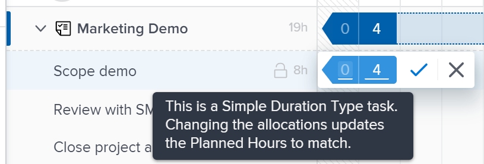

# Gerenciar alocações de usuário no Balanceador de carga de trabalho

<!-- Audited: 01/2024 -->

Como um Gerenciador de recursos, você pode atribuir trabalho aos usuários e gerenciar suas alocações diárias, semanais ou mensais no Balanceador de carga de trabalho para garantir que eles recebam uma quantidade de horas que se ajuste a suas programações disponíveis.

## Requisitos de acesso {#access-requirements}

+++ Expanda para visualizar os requisitos de acesso para a funcionalidade neste artigo.

<table style="table-layout:auto"> 
 <col> 
 <col> 
 <tbody> 
  <tr> 
   <td>Pacote do Adobe Workfront</td> 
   <td>
Qualquer
</td>
  </tr>
  <tr> 
   <td>Licença do Adobe Workfront</td> 
   <td>
Standard

       
Planejar, ao usar o Balanceador de carga de trabalho na área Recursos; Trabalhar, ao usar o Balanceador de carga de trabalho de uma equipe ou projeto
</td>
  </tr>
  <tr> 
   <td>Configurações de nível de acesso</td> 
   <td> 
Editar acesso ao seguinte:
 
    <ul> 
     <li>Gerenciamento de recursos</li> 
     <li>Projetos</li> 
     <li>Tarefas</li> 
     <li>Problemas</li> 
    </ul>
   </td> 
  </tr> 
  <tr> 
   <td>Permissões de objeto</td> 
   <td> 
Contribua com permissões ou superiores que incluam Fazer atribuições às tarefas e problemas para os quais você deseja gerenciar alocações. 
 
Ou 
 
Gerencie permissões para as tarefas para as quais você deseja atualizar as Horas planejadas, além de atualizar alocações. Para obter informações sobre como atualizar as Horas planejadas no Balanceador de carga de trabalho, consulte a seção <a href="#update-task-planned-hours-when-managing-user-allocations">Atualizar horas planejadas da tarefa ao gerenciar alocações de usuário</a> neste artigo.
 </td> 
  </tr> 
 </tbody> 
</table>

Para obter informações, consulte [Requisitos de acesso na documentação do Workfront](/help/quicksilver/administration-and-setup/add-users/access-levels-and-object-permissions/access-level-requirements-in-documentation.md).

+++

## Entender as alocações de usuários

As alocações de usuário são quantias de horas que indicam o tempo que um usuário deve gastar em um determinado dia ou dia da semana, semana ou mês para concluir o item de trabalho. Elas estão incluídas nas Horas Planejadas do item de trabalho.

Este artigo descreve como atualizar alocações por hora diárias, semanais ou mensais para usuários atribuídos a tarefas ou problemas. Para obter informações sobre como gerenciar alocações gerais de usuários e funções de trabalho para tarefas, consulte [Gerenciar horas de alocação de usuários e funções em tarefas](../../manage-work/tasks/assign-tasks/manage-allocation-hours-on-tasks.md).

### Visão geral da alocação de usuários {#user-allocation-overview}

Você pode exibir a alocação de usuários como horas ou como um valor percentual no Balanceador de carga de trabalho. Você pode ajustar horas ou porcentagens.

As alocações de usuário são incluídas no número de Horas Planejadas de um item de trabalho. Para obter informações sobre as Horas Planejadas, consulte [visão geral das Horas Planejadas](../../manage-work/tasks/task-information/planned-hours.md).

As horas planejadas da tarefa são distribuídas igualmente entre todos os dias na duração da tarefa para o usuário atribuído à tarefa. Por exemplo, se uma tarefa tiver uma Duração de 5 dias e um total de 10 Horas Planejadas, o número de alocações diárias para a tarefa será de 2 horas. A alocação semanal é de 10 horas. Isso significa que um usuário está alocado para trabalhar na tarefa por 2 horas por dia. No entanto, você pode alterar manualmente a alocação diária do usuário usando o Balanceador de carga de trabalho.

>[!CAUTION]
>
>O Balanceador de carga de trabalho exibe apenas <!--up to 1000 Planned Hours per work item per user, and--> até 1000 dias da duração de um item. As alocações no Balanceador de carga de trabalho são exibidas como zero depois que o limite de 1000 dias é atingido. Recomendamos dividir tarefas em subtarefas menores <!--to accommodate a larger number of Planned Hours or--> por períodos superiores a 1000 dias.

Considere o seguinte ao localizar alocações diárias, semanais ou mensais para tarefas ou problemas no Balanceador de carga de trabalho:

* Você pode visualizar as alocações diárias, semanais e mensais dos usuários em seus itens de trabalho. Habilite a exibição Semana ou Mês para exibir alocações semanais ou mensais.
* Você pode usar o Balanceador de carga de trabalho para modificar a alocação diária, semanal ou mensal dos usuários para as tarefas ou problemas. Para obter informações sobre como ajustar a exibição do Balanceador de carga de trabalho, consulte [Navegar pelo Balanceador de carga de trabalho](../../resource-mgmt/workload-balancer/navigate-the-workload-balancer.md).

  >[!NOTE]
  >
  >Recomendamos que você tome uma decisão sobre qual período de tempo (diário, semanal ou mensal) deseja usar sempre ao gerenciar alocações de usuários e não alterne entre eles para os mesmos itens de trabalho. A atualização de alocações semanais para o mesmo usuário para o qual você atualizou anteriormente alocações diárias altera a alocação diária para o usuário.

* Você pode atualizar alocações para dias úteis e não-úteis.
* Os carimbos de data e hora para as Datas de início e de conclusão planejadas dos itens de trabalho, bem como a programação do projeto, são importantes quando o Workfront calcula automaticamente a alocação diária da tarefa.

  >[!INFO]
  >
  > Por exemplo, uma tarefa pode ter uma Duração de 2 dias e 2 Horas planejadas e tem uma Hora de início planejada de 12:00 PM no primeiro dia da duração com um usuário e um Cronograma de projeto que termina às 17:00. A capacidade do usuário para o primeiro dia é de 5 horas. A capacidade do usuário para o segundo dia é de 8 horas (se a programação começar às 9:00 AM).
  >
  >O Workfront calcula a alocação das 2 horas nos 2 dias da duração usando a seguinte fórmula:
  >
  >`Daily allocation hours = (Total Planned Hours / Total of available hours) * Daily available hours`
  >
  >Para o nosso exemplo, as horas de alocação diárias para cada dia são:
  >   
  >(2 / 13) * 5 = 0,77 horas de alocação para o primeiro dia
  >
  >(2 / 13) * 8 = 1,23 hora de alocação para o segundo dia
  >
  >Nos cálculos acima, 13 é o total de horas disponíveis para a tarefa: 5 + 8 = 13

* Dois usuários em fusos horários ou agendamentos diferentes dos dos usuários atribuídos podem fazer com que os valores de alocação sejam exibidos de forma diferente para dois usuários que visualizam os mesmos itens de trabalho.

* Quando um usuário tem uma folga programada, o dia ou a parte do dia é exibida em um plano de fundo cinza, e um ícone de avião indica a folga. Se o administrador do Workfront ativou a configuração Tempo livre do usuário na área Configuração para considerar o tempo livre do usuário, as horas alocadas serão movidas para o próximo dia disponível na linha do tempo. Se a configuração estiver desativada, as horas alocadas permanecerão no dia marcado para folga e o usuário será exibido como superalocado. Para obter mais informações, consulte [Configurar preferências de projeto do sistema](../../administration-and-setup/set-up-workfront/configure-system-defaults/set-project-preferences.md).

  >[!TIP]
  >
  >Se o tempo de folga tiver sido marcado depois que o usuário foi atribuído a um item de trabalho, você deverá recalcular a linha do tempo do projeto para exibir a alocação movida. Para obter informações, consulte [Recalcular linhas do tempo do projeto](../../manage-work/projects/manage-projects/recalculate-project-timeline.md).

   * Quando vários usuários são atribuídos a uma tarefa e o principal responsável tem uma folga agendada, a linha do tempo é deslocada (se as datas não forem fixas) e as horas planejadas de todos os responsáveis são redistribuídas pela nova duração da tarefa. Se a tarefa tiver datas fixas, a linha do tempo não será alterada devido ao tempo livre e as horas serão realocadas entre os dias restantes.
   * Se as alocações forem feitas manualmente, as horas planejadas não serão realocadas após o tempo de folga.

* Se houver vários usuários atribuídos à tarefa, a quantidade de Horas planejadas será distribuída uniformemente para cada usuário primeiro e, em seguida, uniformemente para cada dia dentro da Duração da tarefa. Essa distribuição se torna a alocação de cada usuário para a tarefa.

  Por exemplo, os seguintes cenários podem existir:

   * Para uma tarefa com Duração de 2 dias e com 10 Horas planejadas atribuídas a um usuário, a alocação diária para o usuário é de 5 horas para cada dia, por padrão.
   * Para uma tarefa com uma Duração de 2 dias e com 10 Horas planejadas atribuídas a dois usuários, a alocação diária para cada usuário é de 2,5 horas para cada dia por padrão.

* Se uma tarefa ou problema for concluído antes da Data de conclusão planejada, o número de horas alocadas para os dias restantes será atingido e não contará para a alocação geral do usuário. Isso é exibido somente quando o ícone Mostrar alocações e a configuração Mostrar datas projetadas estão ativados. Para obter mais informações sobre como habilitar configurações no Balanceador de carga de trabalho, consulte [Navegar pelo Balanceador de carga de trabalho](../../resource-mgmt/workload-balancer/navigate-the-workload-balancer.md).

  

* Quando um usuário está superalocado, suas horas alocadas são exibidas com um fundo vermelho no campo do usuário.
* Quando o usuário está subalocado ou recebe uma quantidade igual de horas do seu tempo disponível programado, as horas são exibidas com um plano de fundo azul.
* Você pode exibir a alocação dos usuários em uma exibição de gráfico na linha do usuário. Para obter informações sobre como habilitar a exibição de gráfico para alocações de usuários, consulte a seção &quot;Navegar pelo Balanceador de Carga de Trabalho&quot; no artigo [Navegar pelo Balanceador de Carga de Trabalho](../../resource-mgmt/workload-balancer/navigate-the-workload-balancer.md).

  

### Critérios que redefinem as alocações de usuários {#criteria-that-reset-user-allocations}

Nem todas as alterações de tarefa acionam as alocações modificadas para redistribuir. No entanto, há certas ações que podem redefinir as alocações já ajustadas em seus recursos e redistribuí-las uniformemente para todos os dias durante a duração do item de trabalho para cada um dos atribuídos.

>[!NOTE]
>
>Se você não modificou a distribuição automática de alocações em itens de trabalho, as horas serão redistribuídas uniformemente entre todos os atribuídos quando houver uma alteração no número de atribuídos, na Duração de uma tarefa ou na quantidade de Horas Planejadas no item de trabalho.

#### Ações que redefinem alocações ajustadas {#actions-that-reset-adjusted-allocations}

As ações a seguir redefinem ou modificam as alocações diárias, semanais ou mensais para os usuários depois de ajustá-las manualmente, conforme descrito na seção [Modificar alocações de usuários](#modify-user-allocations) deste artigo:

* Quando você reduz a duração de um item de trabalho que diminui a quantidade de dias em sua Duração, as horas alocadas ajustadas dos dias perdidos são adicionadas à quantidade de alocação do último dia do item de trabalho.
* Quando você altera a quantidade de Horas Planejadas em uma atribuição ou no item de trabalho, o novo número de Horas Planejadas é redistribuído uniformemente para toda a Duração do item de trabalho.
* Quando você adiciona ou remove um destinatário a um item de trabalho e isso faz com que as Horas planejadas da tarefa sejam alteradas, os valores ajustados são redistribuídos uniformemente.

#### Ações que não redefinem alocações ajustadas {#actions-that-do-not-reset-adjusted-allocations}

As seguintes alterações em um item de trabalho não acionam as alocações ajustadas a serem redefinidas ou modificadas:

* Quando você move os dias de um item de trabalho, mas a quantidade de dias na Duração não muda, os valores alocados ajustados permanecem os mesmos e são movidos para as novas datas.
* Quando você aumenta a Duração de um item de trabalho que aumenta o número de dias em sua Duração, as horas alocadas ajustadas permanecem as mesmas para os dias ajustados. Dias adicionais são adicionados ao item de trabalho com 0 horas alocadas.
* Quando você adiciona ou remove um destinatário a um item de trabalho e isso não faz com que as Horas planejadas do item mudem, os valores ajustados permanecem os mesmos.

## Localizar horas planejadas no Balanceador de carga de trabalho

Você pode modificar alocações de usuário para tarefas ou problemas usando o Balanceador de carga de trabalho localizando as Horas planejadas das tarefas ou problemas atribuídos aos usuários.

Considere o seguinte ao exibir as Horas planejadas no Balanceador de carga de trabalho:

* O total de Horas planejadas de uma tarefa ou problema é exibido ao lado do Nome da tarefa ou problema à esquerda do Balanceador de carga de trabalho.

* O total de Horas planejadas de um projeto é exibido ao lado do Nome do projeto à esquerda do Balanceador de carga de trabalho. Representa o total de Horas planejadas para todas as tarefas e problemas listados no projeto no Balanceador de carga de trabalho e não todas as Horas planejadas do projeto.
* O tempo alocado diariamente ou semanalmente para todas as tarefas e para todos os projetos é exibido somente quando você ativa manualmente a configuração Mostrar alocações. Para obter informações sobre como habilitar configurações no Balanceador de carga de trabalho, consulte [Navegar pelo Balanceador de carga de trabalho](../../resource-mgmt/workload-balancer/navigate-the-workload-balancer.md).

## Modificar alocações de usuários {#modify-user-allocations}

Como parte da atribuição de trabalho a usuários, você pode modificar as alocações de usuários no Balanceador de carga de trabalho para garantir que elas nunca sejam superalocadas ou para garantir um equilíbrio preciso de horas entre os seus recursos. Para obter informações sobre como identificar se um usuário está superalocado, consulte a seção [Visão geral da alocação de usuários](#user-allocation-overview) neste artigo.

1. Verifique se você tem tarefas e problemas atribuídos aos usuários. Para obter informações sobre como atribuir trabalho a usuários no Balanceador de carga de trabalho, consulte [Visão geral da atribuição de trabalho no Balanceador de carga de trabalho](../../resource-mgmt/workload-balancer/assign-work-in-workload-balancer.md).
1. Vá para o Balanceador de carga de trabalho.
1. (Opcional) Clique em **Semana** ou **Mês** para gerenciar alocações semanais ou mensais para usuários.

   

1. Na área **Trabalho atribuído**, localize o usuário para o qual você deseja modificar manualmente a alocação e clique na seta à direita à esquerda do nome do usuário para expandi-lo.

   

1. Clique na seta apontando para a direita à esquerda do nome do projeto para expandir o projeto e exibir os itens de trabalho aos quais o usuário está atribuído.

   >[!TIP]
   >
   >Você pode modificar alocações de usuários somente para tarefas e problemas. Não é possível modificar alocações de usuários para projetos.

1. (Opcional) Clique no **ícone Mostrar alocações**  para exibir alocações para todos os itens de trabalho.

   O nome das tarefas e dos projetos é substituído pela alocação do usuário para a tarefa ou o projeto.

1. (Opcional) Clique no ícone **Configurações**  e selecione uma das seguintes opções:

   1. **Incluir horas de problemas**. Isso permite gerenciar alocações de problemas, além de alocações de tarefas.
   1. **Mostrar o trabalho concluído**. Exibe itens que foram concluídos e que estão agendados durante a linha de tempo para a qual você gerencia alocações.
   1. **Mostrar tempo restante**. O número total de horas para cada usuário (na linha do usuário) é alterado. Com essa configuração ativada, o Balanceador de carga de trabalho exibe as horas que cada usuário tem disponíveis para trabalho em vez do número de horas para as quais estão alocados.

      >[!TIP]
      >
      >Modificar alocações quando esta configuração estiver habilitada faz com que o número total na linha do usuário diminua.

   1. **Projeto** na seção **Selecionar tema de cor**. Isso exibe cada projeto e seus respectivos itens de trabalho em cores exclusivas e facilita a compreensão de quais itens pertencem a qual projeto.
   1. **Percentual** na **Exibir alocação de usuários na** seção. Isso exibe as alocações como um valor percentual. A capacidade do usuário de acordo com o agendamento é considerada como 100%. Por exemplo, se um usuário estiver associado a uma programação de 8 horas por dia, 8 horas será igual a 100% de capacidade. Se você quiser alocar o usuário para trabalhar 4 horas por dia, atualize essa alocação para 50%.

      >[!NOTE]
      >
      >O administrador do Workfront decide qual programação usar em seu sistema para calcular a capacidade do usuário na área Gerenciamento de recursos da Configuração. Para obter mais informações, consulte [Configurar preferências de Gerenciamento de Recursos](../../administration-and-setup/set-up-workfront/configure-system-defaults/configure-resource-mgmt-preferences.md).

1. Clique no menu **Mais**  para um item de trabalho e clique em **Editar alocações**.

   

   Ou

   Clique duas vezes no dia, semana ou mês na barra de uma tarefa ou problema.

   As caixas de alocação se tornam editáveis.

1. Clique dentro da caixa de cada alocação diária, semanal ou mensal para atualizar manualmente a quantidade de horas ou o valor percentual para o qual você deseja que o usuário seja alocado a cada dia, semana ou mês, e clique no ícone **Salvar** .

   >[!TIP]
   >
   >Clique no ícone **Cancelar**  para remover as alocações ajustadas.

   

   As alocações para a atualização do usuário.

   >[!TIP]
   >
   >Se uma tarefa ou problema for concluído antes da Data de conclusão planejada, o número de horas alocadas para os dias restantes será atingido e não contará para a alocação geral do usuário. Isso é exibido apenas quando o ícone **Mostrar alocações** e a configuração **Mostrar datas projetadas** estão habilitados.

   Existem os seguintes cenários:

   * Para tarefas com Tipos de Duração que não são Simples ou para problemas, o total das alocações deve corresponder às Horas Planejadas da tarefa antes que você possa clicar no ícone de marca de seleção.
   * Para tarefas com um Tipo de Duração Simples, o total das alocações pode ser maior ou menor que as Horas Planejadas e você pode clicar no ícone de marca de seleção mesmo que elas não correspondam. Isso também atualiza a quantidade de Horas planejadas para a tarefa. Você deve ter as permissões e o acesso corretos para atualizar as Horas planejadas nas tarefas do Balanceador de carga de trabalho.

     >[!TIP]
     >
     >Um ícone de bloqueio é exibido à direita do nome da tarefa quando você começa a ajustar suas alocações para indicar que a tarefa tem um Tipo de Duração Simples.

     

   Para obter mais informações sobre as condições que precisam ser atendidas para atualizar as Horas planejadas no Balanceador de carga de trabalho, consulte a seção [Atualizar horas planejadas da tarefa ao gerenciar alocações de usuário](#update-task-planned-hours-when-managing-user-allocations) neste artigo. Para obter informações sobre os Tipos de Duração da tarefa, consulte [Visão Geral da Duração da Tarefa e do Tipo de Duração](../../manage-work/tasks/taskdurtn/task-duration-and-duration-type.md).

1. (Condicional) Se a tarefa for atribuída a mais de um usuário, repita essas etapas para cada usuário atribuído à tarefa para atualizar as alocações para cada usuário.

   Qualquer pessoa com acesso para visualizar o Balanceador de carga de trabalho e visualizar os mesmos usuários e os mesmos projetos que você gerenciou agora visualiza a alocação atualizada para os usuários que você gerenciou.

>[!TIP]
>
>Um ícone de lápis é exibido à direita do nome do item de trabalho para indicar que ele foi ajustado manualmente.

## Atualizar Trabalho de Horas Planejadas da tarefa ao gerenciar alocações de usuários {#update-task-planned-hours-when-managing-user-allocations}

Você pode atualizar as Horas planejadas de uma tarefa ao gerenciar alocações de usuário no Balanceador de carga de trabalho para a tarefa. Isso acontece quando o total de horas alocadas atualizadas não corresponde ao total original de Horas planejadas de uma tarefa.

>[!IMPORTANT]
>
>* Atualizar as Horas planejadas para as tarefas pode afetar o progresso em seu projeto.
>* Atualizar manualmente as Horas Planejadas alterando as alocações diárias pode ter impacto nas Horas Planejadas ao remover atribuições das tarefas no futuro. Para obter mais informações, consulte [visão geral das Horas planejadas](../../manage-work/tasks/task-information/planned-hours.md).
>
>* Não é possível atualizar o Trabalho necessário para ocorrências atualizando as alocações no Balanceador de carga de trabalho.

Isso é possível quando as seguintes condições existem:

* Você tem as permissões e o acesso corretos para gerenciar as Horas planejadas no Balanceador de carga de trabalho. Isso inclui o seguinte:

   * Gerencie permissões para as tarefas.
   * Atualize o Trabalho necessário no acesso Balanceador de carga de trabalho na área Gerenciamento de recursos do seu Nível de acesso.

  Para obter mais informações sobre o acesso necessário para usar o Balanceador de carga de trabalho, consulte a seção [Requisitos de acesso](#access-requirements) neste artigo.

* A tarefa tem um Tipo de duração de Simples.

