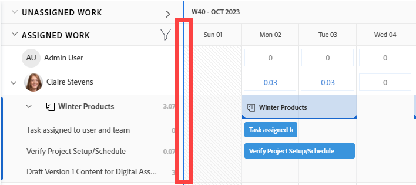
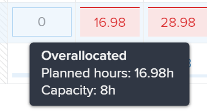
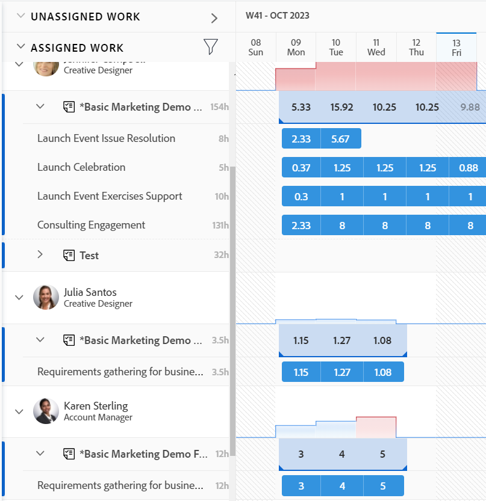
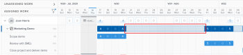

# Navegar pelo Balanceador de carga de trabalho

{{preview-fast-release-general}}

<!--Audited: 12/2024-->

Use o Balanceador de carga de trabalho no Adobe Workfront para atribuir trabalho aos usuários com base em sua disponibilidade. Este artigo descreve como você pode usar configurações e opções para navegar no Balanceador de carga de trabalho e exibir as informações relevantes para você. Os artigos adicionais listados aqui descrevem como você pode usar o Balanceador de carga de trabalho para gerenciar seus recursos e sua alocação para trabalhar.

O Balanceador de carga de trabalho está disponível em várias áreas do Adobe Workfront. Navegar por ele é semelhante em todas as áreas.

Para obter mais informações sobre onde o Balanceador de carga de trabalho está localizado, consulte [Localizar o Balanceador de carga de trabalho](https://experienceleague.adobe.com/en/docs/workfront/using/manage-resources/the-workload-balancer/locate-workload-balancer).

## Requisitos de acesso

+++ Expanda para visualizar os requisitos de acesso para a funcionalidade neste artigo.

Você deve ter o seguinte acesso para executar as etapas deste artigo:

<table style="table-layout:auto"> 
 <col> 
 <col> 
 <tbody> 
  <tr> 
   <td role="rowheader">plano do Adobe Workfront</td> 
   <td> 
Qualquer 
 </td> 
  </tr> 
  <tr> 
   <td role="rowheader">Licença do Adobe Workfront</td> 
   <td>
Novo: Padrão

       
ou

       
Atual: plano, ao usar o Balanceador de Carga de Trabalho na área Recursos; 
       Trabalhar, ao usar o Balanceador de carga de trabalho de uma equipe ou projeto
</td>
  </tr>
  <tr> 
   <td role="rowheader">Configurações de nível de acesso</td> 
   <td> 
Visualize ou tenha acesso superior ao seguinte:
 
    <ul> 
     <li>Gerenciamento de recursos</li> 
     <li>Projetos</li> 
     <li>Tarefas</li> 
     <li>Problemas</li> 
    </ul>
   </td> 
  </tr> 
  <tr> 
   <td role="rowheader">Permissões de objeto</td> 
   <td>Visualize ou aumente as permissões para projetos, tarefas e problemas</td> 
  </tr> 
 </tbody> 
</table>

Para obter mais detalhes sobre as informações nesta tabela, consulte [Requisitos de acesso na documentação do Workfront](/help/quicksilver/administration-and-setup/add-users/access-levels-and-object-permissions/access-level-requirements-in-documentation.md).

+++

## Considerações para a visualização de itens no Balanceador de carga de trabalho

Considere o seguinte ao visualizar o Balanceador de carga de trabalho:

* O Balanceador de carga de trabalho exibe itens de trabalho em duas áreas separadas, dependendo de suas atribuições. Os itens de trabalho e usuários são exibidos nas seguintes áreas:

   * **Trabalho não atribuído**: itens que não têm atribuições ou são atribuídos apenas a funções de trabalho ou equipes.
   * **Trabalho atribuído**: itens atribuídos a pelo menos um usuário. Os itens atribuídos são exibidos sob o nome do usuário atribuído.

  >[!NOTE]
  >
  >* Os itens de trabalho atribuídos a uma função de trabalho ou equipe, e também atribuídos a um usuário, são exibidos na área Trabalho não atribuído e sob o nome do usuário atribuído na área Trabalho atribuído.
  >* Itens de trabalho atribuídos a um usuário e a uma função de trabalho, onde a função de trabalho é selecionada como o principal responsável pelo item, são exibidos na área Trabalho não atribuído.
  >* Os itens de trabalho atribuídos a mais de um usuário são exibidos em todos os nomes de usuários atribuídos na área Trabalho atribuído.
  >* As atribuições de função são exibidas em itens de trabalho na área Trabalho não atribuído quando a configuração Mostrar atribuições de função está habilitada. Para obter informações, consulte a seção [Personalizar o modo de exibição](#customize-the-view) neste artigo.

  Para obter mais informações, consulte [Áreas de atribuição no Balanceador de carga de trabalho](/help/quicksilver/resource-mgmt/workload-balancer/assign-work-in-workload-balancer.md#assignment-areas-in-the-workload-balancer) em [Visão geral da atribuição de trabalho no Balanceador de carga de trabalho](/help/quicksilver/resource-mgmt/workload-balancer/assign-work-in-workload-balancer.md).

* Quando um projeto não tem tarefas durante um período de tempo, a barra no nível do projeto fica em branco por esse tempo.

  

* Quando você não tem permissões para ver determinados itens, eles são exibidos como **itens de trabalho inacessíveis** ou **projetos inacessíveis**.

  

* Os nomes dos itens de trabalho são exibidos à esquerda e a linha do tempo é exibida à direita.
* O total de Horas Planejadas para cada item de trabalho é exibido à direita do nome do item de trabalho e à esquerda da barra que representa a linha do tempo do item de trabalho.
* O total de Horas planejadas de cada projeto é exibido à direita do nome do projeto e à esquerda da barra que representa a linha do tempo do projeto.

  As informações de Horas planejadas do projeto são um total de Horas planejadas de todos os itens listados no Balanceador de carga de trabalho, e não um total de Horas planejadas do projeto.

Para obter mais informações sobre como exibir informações no Balanceador de carga de trabalho, consulte também os seguintes artigos:

* [Localize o Balanceador de carga de trabalho](../workload-balancer/locate-workload-balancer.md)
* [Filtrar informações no Balanceador de carga de trabalho](../workload-balancer/filter-information-workload-balancer.md)
* [Compartilhar o Balanceador de carga de trabalho com um link](../workload-balancer/share-link-for-workload-balancer.md)
* [Atualizar itens de trabalho no Balanceador de Carga de Trabalho usando o Resumo](../workload-balancer/update-items-in-summary-panel-in-workload-balancer.md)

Para obter informações sobre como gerenciar recursos usando o Balanceador de carga de trabalho, consulte também os seguintes artigos:

* [Visão geral da atribuição de trabalho no Balanceador de carga de trabalho](https://experienceleague.adobe.com/en/docs/workfront/using/manage-resources/the-workload-balancer/assign-work-in-workload-balancer)
* [Gerenciar alocações de usuário no Balanceador de carga de trabalho](https://experienceleague.adobe.com/en/docs/workfront/using/manage-resources/the-workload-balancer/manage-user-allocations-workload-balancer)

## Navegar pelo Balanceador de carga de trabalho para vários projetos na área Recursos

Navegar pelo Balanceador de carga de trabalho é semelhante em todas as áreas nas quais você o acessa.

As subseções a seguir descrevem como exibir as informações no Balanceador de carga de trabalho para vários projetos.

Você pode ajustar várias configurações e opções no Balanceador de carga de trabalho para exibir as informações que você precisa se concentrar no intervalo de tempo que faz mais sentido para você.

Após selecionar as configurações que deseja aplicar à visualização, o Balanceador de carga de trabalho lembra dessas configurações sempre que você o acessa de qualquer navegador ou dispositivo.

### Acesse o Balanceador de carga de trabalho para vários projetos na área Recursos

Para navegar pelo Balanceador de carga de trabalho para vários projetos:

{{step1-to-resourcing}}

1. Clique em **Balanceador de carga de trabalho** no painel esquerdo.

   

   O Balanceador de carga de trabalho exibe informações de atribuição de trabalho começando com a semana atual nas duas áreas a seguir:

   * A área **Trabalho não atribuído** exibe os seguintes itens de trabalho:

      * Itens de trabalho (tarefas e problemas) atribuídos a funções, equipes ou que não foram atribuídos são exibidos após a aplicação dos filtros.
A área Trabalho não atribuído não exibe itens de trabalho por padrão. Recomendamos o uso de filtros para exibir informações relevantes nesta área.

        Para obter informações sobre como usar filtros, consulte [Informações de filtro no Balanceador de carga de trabalho](../workload-balancer/filter-information-workload-balancer.md).

      * Atribuições de função em itens de trabalho são exibidas somente quando você habilita a configuração Mostrar Atribuições de Função. Para obter informações, consulte a seção [Personalizar o modo de exibição](#customize-the-view) neste artigo.

      * Os projetos são exibidos somente quando você ativa a configuração Agrupar por projeto. Para obter informações, consulte a seção [Personalizar a exibição](#customize-the-view) neste artigo.

   * A área **Trabalho atribuído** exibe os seguintes itens de trabalho:

      * Todos os usuários ativos no sistema são exibidos nessa área por padrão. Recomendamos o uso de filtros para limitar a quantidade de informações nessa área. Se os usuários forem atribuídos a itens, os itens de trabalho também serão exibidos com seu nome.

      * Tarefas e problemas atribuídos a pelo menos um usuário são exibidos sob o nome do usuário.

        Os itens de trabalho em nomes de usuários na área Trabalho atribuído são classificados pelos seguintes critérios, nesta ordem:

         1. Data de Início Planejada (a mais antiga primeiro)
         1. Data de Término Planejada (a mais antiga primeiro)
         1. Ordem alfabética por projeto (somente quando os dois primeiros critérios são idênticos para vários itens de trabalho)

            >[!TIP]
            >
            >* Você pode personalizar a classificação de projetos selecionando uma opção na configuração &quot;Classificar projetos por&quot;.
            >
            >* Os projetos são exibidos somente quando você ativa a configuração &quot;Agrupar por projeto&quot;.
            > 
            >Para obter informações sobre como personalizar configurações, consulte a seção [Personalizar a exibição](#customize-the-view) neste artigo.

1. (Opcional) Clique no ícone **Filtro**  na área **Trabalho atribuído** e selecione o **Filtro padrão** na área **Sugerido** da caixa de filtro.

   Ao aplicar o filtro Padrão, os usuários que pertencem a qualquer uma das suas equipes e seus itens de trabalho são exibidos. É possível editar uma cópia desse filtro.

   >[!TIP]
   >
   >O filtro Padrão está disponível somente no Balanceador de carga de trabalho na área Recursos.

1. Continue com as seguintes etapas para navegar pelo Balanceador de carga de trabalho:

   * [Selecione um intervalo de tempo no Balanceador de carga de trabalho](#select-a-time-frame-in-the-workload-balancer)
   * [Personalizar o modo de exibição](#customize-the-view)
   * [Atribuir itens de trabalho e ajustar alocações de usuário](#assign-work-items-and-adjust-user-allocations)
   * [Exibir alocações em um gráfico](#view-allocations-in-a-chart)

### Selecione um intervalo de tempo no Balanceador de carga de trabalho

1. Acesse o Balanceador de carga de trabalho na área **Recursos**, conforme descrito na seção [Acesse o Balanceador de carga de trabalho para vários projetos na área Recursos](#access-the-workload-balancer-for-multiple-projects-in-the-resourcing-area) deste artigo.

   O Balanceador de carga de trabalho exibe informações de atribuição de trabalho começando com a semana atual.

1. Use a rolagem horizontal para exibir a linha do tempo de itens de trabalho que ultrapassam os limites da tela.
1. Clique nos ícones **voltar ou encaminhar**  no canto superior esquerdo para navegar na linha do tempo e clique em **Hoje** para retornar à semana atual.
1. Clique no **menu suspenso de intervalo de tempo** na barra de ferramentas e, em seguida, clique na data de início do período que deseja exibir. Por padrão, a primeira semana selecionada no calendário é a semana para a qual você navegou.

   

1. Selecione o número de semanas que deseja exibir de uma vez no Balanceador de carga de trabalho a partir das seguintes opções:
   * 1 semana
   * 2 semanas
   * 4 semanas. Esta é a configuração padrão.
   * 6 semanas
   * 3 meses

   

1. Clique em uma das seguintes opções na barra de ferramentas para exibir as informações em diferentes intervalos de tempo:
   * **Dia**: exibe informações por dia durante quatro semanas, começando com a data de hoje, por padrão.
   * **Semana**: exibe informações por semana durante quatro semanas.
   * **Mês**: exibe informações por mês durante três meses.

1. Continue navegando no Balanceador de carga de trabalho conforme descrito nas seções a seguir.

### Personalizar a exibição

1. Acesse o Balanceador de carga de trabalho na área **Recursos**, conforme descrito na seção [Acesse o Balanceador de carga de trabalho para vários projetos na área Recursos](#access-the-workload-balancer-for-multiple-projects-in-the-resourcing-area) deste artigo.

   Os nomes dos itens de trabalho são listados no lado esquerdo e são representados por barras no lado direito do Balanceador de carga de trabalho. O comprimento da barra representa a linha do tempo de um item de trabalho.

1. (Opcional e recomendado) Use filtros nas áreas Trabalho não atribuído e atribuído para exibir somente itens de trabalho ou usuários que sejam relevantes para você.

   Para obter mais informações, consulte [Informações de filtro no Balanceador de carga de trabalho](../workload-balancer/filter-information-workload-balancer.md).

   Por padrão, as barras azuis representam as linhas do tempo dos projetos e tarefas, e as barras laterais representam problemas.

   É possível alterar a cor das barras de projetos e tarefas ao selecionar o tema de cores para corresponder ao projeto. Para obter mais informações, continue lendo este procedimento.

   Os itens de trabalho na área Trabalho atribuído são classificados por projetos de acordo com os seguintes critérios, nesta ordem:
   1. Data de Início Planejada (a mais antiga primeiro)
   1. Data de Término Planejada (a mais antiga primeiro)
   1. Ordem alfabética por projeto (somente quando os dois primeiros critérios são idênticos para vários itens de trabalho)

1. Clique na **seta à direita** à esquerda das áreas Não atribuído ou Atribuído para expandir todos os itens nos nomes de projeto (na área Não atribuído) e nos nomes de usuário (na área Atribuído).

   >[!TIP]
   >
   >Os itens de trabalho são listados em nomes de projeto na área Não atribuído somente quando você ativa a configuração &quot;Agrupar por projeto&quot;.

1. Clique na **seta para baixo** à esquerda das áreas Não atribuído ou Atribuído para recolher todos os itens nos nomes de projeto (na área Não atribuído) e nos nomes de usuário (na área Atribuído).

1. Passe o mouse sobre ele e arraste e solte a **linha de separação** entre o painel esquerdo e a área da linha do tempo para ajustar o tamanho do painel esquerdo.

   

1. Clique no ícone **Configurações** .

   O painel Configurações é exibido à direita.

   Imagem de exemplo no ambiente de Visualização:
   

   Imagem de amostra no ambiente de produção:
   

   Selecione entre as opções listadas abaixo para atualizar as informações exibidas no Balanceador de carga de trabalho e clique no **ícone X** no canto superior direito da caixa Configurações para fechá-lo.

   * **Agrupar por Projeto**: quando selecionado, os itens nas áreas Trabalho Atribuído e Não Atribuído são agrupados por projeto. É selecionado por padrão.

   * **Incluir horas de problemas**: quando selecionado, os problemas atribuídos aos usuários são exibidos sob o nome do usuário na área Trabalho atribuído, e os problemas não atribuídos aos usuários são exibidos na área Trabalho não atribuído. As Horas planejadas dos problemas contam para as Horas planejadas do projeto e do usuário na área Trabalho atribuído.
   * **Mostrar Datas Projetadas**: quando selecionado, a linha do tempo projetada dos itens de trabalho é exibida além da linha do tempo planejada. Observe o seguinte:
      * A linha do tempo projetada do projeto, tarefas e problemas é exibida como uma linha azul escura acima das barras de tarefa, problema e projeto.
      * A linha do tempo projetada fora da linha do tempo planejada é exibida em azul claro, mesmo quando você atualiza o tema de cor, conforme descrito abaixo.
      * A linha do tempo projetada para os itens que você não tem acesso para visualizar é exibida em cinza claro com uma linha abaixo.
      * Quando uma tarefa ou problema é concluído antes da Data de conclusão planejada vencida, os números de alocação dos dias restantes são atingidos e não contam para a alocação do usuário. Isso é exibido somente quando a configuração Mostrar datas projetadas e o ícone Mostrar alocação estão ativados.

     >[!TIP]
     >
     >Observe que os itens de trabalho são exibidos no Balanceador de carga de trabalho quando suas linhas do tempo planejadas ou projetadas (não necessariamente as duas ao mesmo tempo) ocorrem durante o período selecionado.

   * **Mostrar trabalho concluído**: quando habilitado, as tarefas concluídas e os problemas são exibidos na área Trabalho Atribuído. Isso é ativado por padrão.

     Um ícone de marca de seleção verde é exibido no canto superior direito de uma barra de tarefas ou problemas quando são concluídos. O mesmo ícone é exibido para um projeto quando as tarefas ou problemas do período selecionado do projeto são concluídos.
   * **Mostrar tempo restante**: quando habilitado, o Workfront exibe a diferença entre o horário diário para o qual o usuário está disponível para trabalhar com base em seus cronogramas e as horas para as quais ele está alocado na área Trabalho atribuído para os usuários. Isso é desativado por padrão e o tempo alocado é exibido por padrão.
   * **Mostrar atribuições de função**: quando habilitado, as atribuições de função são exibidas na área Trabalho não atribuído em seus itens de trabalho atribuídos. Isto é habilitado por padrão.

   * Na seção **Selecionar tema de cor**, selecione a cor desejada para as barras de projeto e tarefa.

     >[!TIP]
     >
     >A configuração para selecionar o tema de cor não afeta a cor das barras de edição. Os problemas sempre são exibidos em uma barra cor marrom.

     Selecione entre as seguintes opções:
      * **Padrão**: as barras de todos os projetos e seus itens de trabalho são exibidas em azul.
      * **Projeto**: as barras associadas a cada projeto e suas tarefas mudam de acordo com o nome do projeto. Todas as tarefas que pertencem ao projeto são exibidas em barras que correspondem à cor do projeto. As barras de projeto são exibidas em uma sombra mais clara para diferenciá-las das tarefas. As barras de projeto também incluem um ícone de projeto ao optar por não exibir alocações.
      * **Status do Projeto**: as barras associadas a cada projeto e a seus itens de trabalho mudam para a cor do status do projeto.

        O status do projeto é aquele associado ao Grupo do projeto. Se o Grupo não tiver status específicos de grupo, a cor das barras do item de trabalho será a do status do projeto no nível do sistema. Tanto os status do sistema quanto os personalizados são exibidos. Para obter informações sobre status de grupo, consulte [Criar ou editar um status de grupo](../../administration-and-setup/manage-groups/manage-group-statuses/create-or-edit-a-group-status.md).

   * Na seção **Exibir alocação de usuário em**, selecione uma das seguintes opções:
      * **Horas**: exibe o tempo alocado como horas. Este é o padrão.
      * **Porcentagem**: exibe o tempo alocado como uma porcentagem do tempo total disponível
   * Na seção **Preferências de classificação**, selecione como deseja que os itens sejam classificados no Balanceador de carga de trabalho. Selecione entre as seguintes opções:
      * **Classificar usuários por função principal**: os usuários são exibidos na ordem alfabética de suas funções principais na área Trabalho atribuído.
      * **Classificar usuários em ordem alfabética**: os usuários são exibidos em ordem alfabética de seus nomes na área Trabalho atribuído.
      * **Classificar projetos por**: selecione um campo de projeto no menu suspenso para classificar projetos em ordem alfabética de acordo com o campo nas áreas Trabalho não atribuído ou atribuído.

   >[!TIP]
   >
   >Você pode classificar por projetos somente quando a configuração Agrupar por projeto está ativada. Caso contrário, essa configuração ficará esmaecida.

1. (Opcional e condicional) Ao alterar o tema de cores para Status do projeto, passe o mouse sobre o nome de um projeto à esquerda para visualizar o status do projeto.

   

### Atribuir itens de trabalho e ajustar alocações de usuário

1. Acesse o Balanceador de carga de trabalho na área Recursos, conforme descrito na seção [Acesse o Balanceador de carga de trabalho para vários projetos na área Recursos](#access-the-workload-balancer-for-multiple-projects-in-the-resourcing-area) neste artigo.
1. Clique no **ícone Mostrar alocações**  para exibir as Horas Planejadas diárias ou semanais dos itens de trabalho.

   Isso substitui o nome nas barras dos itens de trabalho pela quantidade de Horas planejadas diárias ou semanais nas áreas Trabalho não atribuído e atribuído. Essa configuração é desativada por padrão.

   Os dias que mostram superalocações são exibidos em vermelho.

   >[!TIP]
   >
   >* A opção Mostrar alocações afeta apenas o que é exibido para projetos, tarefas, problemas e itens inacessíveis. As Horas planejadas diárias dos usuários são exibidas por padrão e não podem ser ocultas.
   >* Você deve ativar a configuração Agrupar por projeto para exibir as Horas planejadas diárias para os projetos.
   >* Quando você exibe o Balanceador de carga de trabalho por semana, as horas exibidas são as Horas planejadas semanais.

1. (Opcional) Passe o mouse sobre o tempo alocado na linha do usuário para entender a capacidade e a alocação do usuário. A capacidade é a disponibilidade do usuário de acordo com seu cronograma.

   

1. (Opcional) Clique no **ícone Ocultar alocações**  para exibir o nome das tarefas e problemas nas barras dos itens de trabalho.
1. Clique no ícone **Mais ícone do menu**  à direita do nome de uma tarefa, problema, ou função e clique em uma das opções abaixo.

   

   * **Atribua isto a** e comece digitando o nome de um usuário, função ou equipe ao qual deseja atribuir o item de trabalho no campo **Pesquisar pessoas, função ou equipes**.

     Clique em **Avançado** para acessar a tela Atribuições Avançadas do item de trabalho. Para obter mais informações, consulte [Criar atribuições avançadas](/help/quicksilver/manage-work/tasks/assign-tasks/create-advanced-assignments.md).

     Você também pode usar os seguintes atalhos para atribuir tarefas ou problemas:

      * No Windows: CTRL+clique na barra de tarefas ou problemas.
      * No Mac: CMD+clique na barra de tarefas ou problemas.

     Para obter mais informações sobre como atribuir itens de trabalho a usuários no Balanceador de carga de trabalho, consulte [Visão geral da atribuição de trabalho no Balanceador de carga de trabalho](../workload-balancer/assign-work-in-workload-balancer.md).

     >[!NOTE]
     >
     >As atribuições de função são exibidas somente em itens de trabalho na área Trabalho não atribuído quando a configuração Mostrar atribuições de função está habilitada. Para obter informações, consulte a seção [Personalizar a exibição](#customize-the-view) neste artigo. As atribuições de função só têm a opção **Atribuir a este(a)** no **menu Mais**.

     >[!TIP]
     >
     >Se a Workfront ou o administrador de grupo tiver ativado delegações no seu ambiente, use a guia Atribuições para atribuir usuários à tarefa ou problema. Para obter informações sobre como delegar trabalho, consulte [Delegar tarefas e problemas](../../manage-work/delegate-work/how-to-delegate-work.md).

   * **Editar alocações** e editar as alocações diárias ou semanais do usuário. Para obter informações sobre como gerenciar alocações de usuários, consulte [Gerenciar alocações de usuários no Balanceador de carga de trabalho](../workload-balancer/manage-user-allocations-workload-balancer.md).

   * **Abrir Resumo**. O painel Resumo é aberto à direita, em seguida, clique no campo Atribuições e comece a digitar o nome de um usuário, função ou equipe no campo **Pesquisar pessoas, função ou equipes** para atribuir o item. Para obter mais informações, consulte a seção [Exibir mais informações sobre tarefas e problemas](#display-more-information-about-tasks-and-issues) neste artigo.

1. (Opcional) Clique duas vezes em uma alocação diária ou semanal para um usuário dentro da barra de um item de trabalho para editar o número de horas alocadas e clique no **ícone Salvar**  para salvar as alocações ou no **ícone Cancelar**  para remover as alocações ajustadas.

   >[!TIP]
   >
   >Os ícones Salvar e Cancelar são exibidos perto do final da barra de linha do tempo de uma tarefa ou problema.
   >
   >

   Para obter informações sobre como gerenciar alocações de usuários, consulte [Gerenciar alocações de usuários no Balanceador de carga de trabalho](../workload-balancer/manage-user-allocations-workload-balancer.md).

1. Clique em **Atribuições em massa** para atribuir itens de trabalho em massa.

   Para obter mais informações, consulte [Atribuir trabalho em massa usando o Balanceador de Carga de Trabalho](../workload-balancer/assign-work-in-workload-balancer-in-bulk.md).
1. Arraste itens da área **Trabalho não atribuído** ou de um usuário e solte-os em outro usuário para atribuí-los.

   Para obter mais informações, consulte [Atribuir trabalho no Balanceador de carga de trabalho arrastando e soltando](../workload-balancer/assign-work-in-workload-balancer-by-drag-and-drop.md).

### Exibir alocações em um gráfico

Em vez de exibir alocações em números diários ou semanais, você pode exibi-los em um gráfico.

1. Acesse o Balanceador de carga de trabalho na área Recursos, conforme descrito na seção [Acesse o Balanceador de carga de trabalho para vários projetos na área Recursos](#access-the-workload-balancer-for-multiple-projects-in-the-resourcing-area) neste artigo.
1. Clique no **ícone do Gráfico**  para exibir a alocação de usuário em um formato de gráfico.

   Os dias em que o usuário está superalocado são exibidos como blocos vermelhos e os dias em que o usuário está subalocado ou na capacidade são exibidos como blocos azuis.

   O tamanho dos blocos indica a quantidade da alocação: quanto maior a caixa, mais tempo o usuário é alocado para itens de trabalho para esse dia ou semana.

   

### Exibir mais informações sobre tarefas e problemas

Você pode ver mais informações sobre as tarefas e os problemas no Balanceador de carga de trabalho.

1. Acesse o Balanceador de carga de trabalho na área Recursos, conforme descrito na seção [Acesse o Balanceador de carga de trabalho para vários projetos na área Recursos](#access-the-workload-balancer-for-multiple-projects-in-the-resourcing-area) neste artigo.
1. Para exibir mais informações no painel Resumo, siga um destes procedimentos:

   * Clique na barra de uma tarefa ou problema para abrir o painel Resumo à direita.
   * Clique no ícone **Abrir resumo**  e clique na barra de uma tarefa ou problema para abrir o painel Resumo.
   * Clique no menu **Mais** à direita de uma tarefa ou problema e clique em **Abrir resumo**.

   Para obter informações sobre como atualizar informações de tarefa no Resumo do Balanceador de carga de trabalho, consulte [Atualizar itens de trabalho no Balanceador de carga de trabalho usando o Resumo](../workload-balancer/update-items-in-summary-panel-in-workload-balancer.md).

1. Passe o mouse sobre o nome de uma tarefa ou problema para ver mais informações sobre ele. Uma caixa é exibida acima da tarefa ou do problema com as seguintes informações:

   * O nome da tarefa ou problema.
   * O nome do projeto.
   * As datas planejadas de início e término.
   * O número de Horas Planejadas.
   * Para tarefas, o número do antecessor.
   * Para tarefas, um indicador no canto superior da caixa que indica se a tarefa está pronta para ser trabalhada ou não.

   

1. Clique no nome de um item de trabalho à esquerda para acessá-lo. O item de trabalho é aberto em uma nova guia do navegador.

### Exibir o Balanceador de carga de trabalho em tela cheia

1. Acesse o Balanceador de carga de trabalho na área Recursos, conforme descrito na seção [Acesse o Balanceador de carga de trabalho para vários projetos na área Recursos](#access-the-workload-balancer-for-multiple-projects-in-the-resourcing-area) neste artigo.

1. Clique no ícone **Tela cheia**  para exibir o Balanceador de carga de trabalho em tela cheia.

   O Balanceador de carga de trabalho ocupa toda a tela. As janelas e guias do navegador são excluídas da visualização.

1. Clique no ícone **Sair da tela cheia**  para retornar à tela padrão e exibir o Balanceador de carga de trabalho na guia do navegador.

## Navegar pelo Balanceador de carga de trabalho de uma equipe

Navegar pelo Balanceador de carga de trabalho de uma equipe é semelhante a como você navega pelo Balanceador de carga de trabalho para vários projetos. Para obter informações, consulte a seção [Navegar pelo Balanceador de carga de trabalho para vários projetos](#navigate-the-workload-balancer-for-multiple-projects-in-the-resourcing-area) neste artigo.

{{step1-to-team}}

A página da Equipe inicial é exibida por padrão.

1. Clique em **Balanceador de carga de trabalho** no painel esquerdo.

   

   O Balanceador de carga de trabalho de uma equipe exibe as seguintes informações, por padrão:

   * Na área **Trabalho não atribuído**: itens de trabalho atribuídos à equipe ou às funções de equipe e trabalho e que não estão atribuídos a usuários. As atribuições de função são exibidas em itens de trabalho na área Trabalho não atribuído quando a configuração Mostrar atribuições de função está habilitada.
   * Na área **Trabalho atribuído**: os itens de trabalho atribuídos aos usuários são exibidos sob os nomes dos usuários.

1. Continue navegando no Balanceador de carga de trabalho de uma equipe, conforme descrito na seção [Navegar no Balanceador de carga de trabalho para vários projetos na seção Área de recursos](#navigate-the-workload-balancer-for-multiple-projects-in-the-resourcing-area) deste artigo.

## Navegar pelo Balanceador de carga de trabalho de um único projeto

{{step1-to-projects}}

1. Clique no nome de um projeto para abrir a página.
1. Clique em **Balanceador de carga de trabalho** no painel esquerdo.

   

   O Balanceador de carga de trabalho do projeto exibe as seguintes informações, por padrão:

   * Na área **Trabalho não atribuído**: itens de trabalho no projeto que são atribuídos a funções ou equipes e não são atribuídos a usuários. As atribuições de função são exibidas em itens de trabalho na área Trabalho não atribuído quando a configuração Mostrar atribuições de função está habilitada.
   * Na área **Trabalho atribuído**: itens de trabalho no projeto atribuídos a pelo menos um usuário.

   Recomendamos o uso de filtros para mostrar apenas os usuários que são importantes para você.

   Por exemplo, você pode considerar exibir somente os usuários que pertencem a suas equipes ou grupos. Para obter mais informações, consulte [Informações de filtro no Balanceador de carga de trabalho](../workload-balancer/filter-information-workload-balancer.md).

1. (Opcional) Clique no ícone **Filtro**  na área Trabalho Atribuído e selecione a opção **Itens de trabalho deste projeto** na área **Sugerido** do painel de filtro. Esse filtro é desmarcado por padrão.

   Quando essa opção é selecionada, somente os itens atribuídos aos usuários no projeto selecionado são exibidos.

   Quando a opção não está selecionada, todos os itens atribuídos aos usuários no projeto são exibidos, independentemente dos projetos aos quais os itens pertencem.

1. (Opcional e recomendado) Aplique um filtro na área Trabalho atribuído para exibir usuários que são importantes para você, mas que podem não estar atribuídos a itens no projeto, em seguida, clique no ícone **Mostrar todos os usuários** .

   Ao mostrar todos os usuários, você pode exibir todos os usuários no Workfront que ainda não estão atribuídos ao trabalho ou a outras funções no projeto.

   Aplique um filtro primeiro para reduzir o número de usuários exibidos.

   Por exemplo, você pode filtrar primeiro para usuários que pertencem a suas equipes ou grupos e, em seguida, exibir todos esses usuários.

   Para obter informações sobre como criar um filtro, consulte [Informações de filtro no Balanceador de carga de trabalho](../workload-balancer/filter-information-workload-balancer.md).

   >[!NOTE]
   >
   > A opção Mostrar todos os usuários está disponível somente para o Balanceador de carga de trabalho de um projeto.

1. (Opcional) Clique no **ícone Mostrar alocações de função** .

   O painel Alocação de função é exibido.

   Você pode exibir informações sobre as Horas Planejadas associadas às funções de trabalho no projeto e as funções de trabalho associadas às iniciativas vinculadas aos projetos do Planejador de Cenários.

   Para obter mais informações, consulte [Visão geral da reconciliação de alocações de recursos entre projetos e iniciativas](../../scenario-planner/overview-reconcile-allocations-between-projects-initiatives.md).

   >[!NOTE]
   >
   >Não é possível exibir as informações de função de trabalho da iniciativa se a organização não tiver comprado uma licença do Planejador de cenários do Workfront. Nesse caso, você só pode exibir as horas planejadas associadas às funções de trabalho no projeto. Para obter mais informações, consulte [Acesso necessário para usar o Planejador de cenários](../../scenario-planner/access-needed-to-use-sp.md).

1. Continue navegando no Balanceador de carga de trabalho de um projeto, conforme descrito na seção [Navegar no Balanceador de carga de trabalho para vários projetos](#navigate-the-workload-balancer-for-multiple-projects-in-the-resourcing-area) deste artigo.

<!--old content below - this used to be a one-large-procedure article - outdated, and rewrote it above with several smaller procedures: 

# Navigate the Workload Balancer

<!-drafted note for 22.4 release: remove all production/ preview references at Prod release>

The highlighted information on this page refers to functionality not yet generally available. It is available only in the Preview environment. 

Use the Workload Balancer to understand the availability of your resources as well as to assign work to your users. This article walks you through using the icons and settings available to update the view for and navigate the Workload Balancer.

>[!NOTE]
>
>The Workload Balancer is a resource scheduling tool that will eventually replace the current resource scheduling tools which are currently deprecated. 
>
>For more information about removing the resource scheduling tools and replacing them with the Workload Balancer, see [Deprecation of Resource Scheduling tools in Adobe Workfront](../../resource-mgmt/resource-mgmt-overview/deprecate-resource-scheduling.md).
>
>We recommend that you use the Workload Balancer for scheduling your resources.

The Workload Balancer is available in multiple areas of Adobe Workfront. Navigating it is similar in all areas. This article describes how to navigate the Workload Balancer for multiple projects in the Resourcing area. For more information about where the Workload Balancer is located, see [Locate the Workload Balancer](../../resource-mgmt/workload-balancer/locate-workload-balancer.md).

For information about managing resources using the Workload Balancer, also consider reading the following articles:

* [Overview of assigning work in the Workload Balancer](../../resource-mgmt/workload-balancer/assign-work-in-workload-balancer.md)
* [Manage user allocations in the Workload Balancer](../../resource-mgmt/workload-balancer/manage-user-allocations-workload-balancer.md)

## Access requirements

You must have the following access to perform the steps in this article:

<table style="table-layout:auto"> 
 <col> 
 <col> 
 <tbody> 
  <tr> 
   <td role="rowheader">Adobe Workfront plan*</td> 
   <td> 
Any 
 </td> 
  </tr> 
  <tr> 
   <td role="rowheader">Adobe Workfront license*</td> 
   <td> 
Plan, when using the Workload Balancer in all areas in the Production environment

   
Work, when using the Workload Balancer of a project, in the Preview environment 
 </td> 
  </tr> 
  <tr> 
   <td role="rowheader">Access level configurations*</td> 
   <td> 
View or higher access to the following:
 
    <ul> 
     <li> 
Resource Management
 </li> 
     <li> 
Projects
 </li> 
     <li> 
Tasks
 </li> 
     <li> 
Issues
 </li> 
    </ul> 
If you still don't have access, ask your Workfront administrator if they set additional restrictions in your access level. For information on how a Workfront administrator can change your access level, see <a href="../../administration-and-setup/add-users/configure-and-grant-access/create-modify-access-levels.md" class="MCXref xref">Create or modify custom access levels</a>.
 </td> 
  </tr> 
  <tr> 
   <td role="rowheader">Object permissions</td> 
   <td> 
View or higher permissions to the projects, tasks, and issues 
 
For information on requesting additional access, see <a href="../../workfront-basics/grant-and-request-access-to-objects/request-access.md" class="MCXref xref">Request access to objects </a>.
 </td> 
  </tr> 
 </tbody> 
</table>

*To find out what plan, license type, or access you have, contact your Workfront administrator.

## Considerations for viewing items in the Workload Balancer

Consider the following when viewing the Workload Balancer:

* Projects display in the Workload Balancer only when the Group by Project setting is enabled. This setting is enabled by default.
* Mousing over a task or an issue displays the following additional information about the task or issue:

  * Project name

  * Task or issue name

  * Parent task

  * Planned Start and Completion Dates

  * Number of Planned Hours

  * Ready to start or Not ready status

  

* When a project has no tasks during a period of time, the bar at the project level becomes a dimmed color.

  

* When you don't have permissions to see certain items, they display as **Inaccessible work items** or **Inaccessible projects**.

  

* The names of the work items display on the left and within the timeline selected on the right. 
* The total of Planned Hours for each work item displays to the right of the name of the work items on the left. 
* The total of the Planned Hours for each project displays to the right of the name of the project on the left.

  The Planned Hours information for the project is a total of Planned Hours from all items listed in the Workload Balancer, and not a total of Planned Hours on the project.

## Overview of the Unassigned Work and Assigned Work areas

The Workload Balancer displays work items in two separate areas, depending on their assignments.

The two areas of the Workload Balancer display the following information:

<table style="table-layout:auto"> 
 <col> 
 <col> 
 <tbody> 
  <tr> 
   <td role="rowheader">Unassigned Work</td> 
   <td> 
This area displays tasks and issues unassigned to users. 
 
Projects display when the Group by Project setting is enabled.
 
This area does not display any work items by default. We recommend using filters to display relevant information for you in this area.
 
After you apply a filter, this area displays the following work items:
 
    <ul> 
     <li>unassigned</li> 
     <li>assigned to a team </li> 
     <li>assigned to a job role</li> 
     <li> 
assigned to a team and a role at the same time
 </li> 
    </ul> 
Tip: Items assigned to a user as the primary assignee do not display in the Unassigned Work area. 
 </td> 
  </tr> 
  <tr> 
   <td role="rowheader">Assigned Work</td> 
   <td> 
 All active users in the system display in this area by default. We recommend using filters to limit the amount of information in this area.  
 
Both tasks and issues display in the Assigned Work area. 
 
Projects display when the Group by Project setting is enabled.
 
The work items that the users are assigned to display under their names. 
 
If a work item is assigned to multiple users, the item displays under each assigned user. 
 </td> 
  </tr> 
 </tbody> 
</table>

For information about applying a filter in the Workload Balancer, see [Filter information in the Workload Balancer](../../resource-mgmt/workload-balancer/filter-information-workload-balancer.md).

## Navigate the Workload Balancer

You can update the view in the Workload Balancer to display exactly the information you need to focus on in the time frame that makes the most sense to you.

After selecting the settings you want to apply to your view, the Workload Balancer remembers these settings every time you access it from any browser or device.

1. Click the **Main Menu** icon  in the upper-right corner of Workfront, then click **Resourcing**.
1. Click **Workload Balancer** in the left panel.

   The Workload Balancer displays work assignment information starting with the current week. The names of work items are listed on the left side as well as represented by bars on the right side of the of the Workload Balancer within their respective timelines. By default, blue bars represent the timelines of projects and tasks and maroon bars represent issues.

   >[!TIP]
   >
   >You can change the color of the bars for projects and tasks when you select your color scheme to match the project. For more information, continue reading this procedure.

   The work items that display under the name of users in the Workload Balancer are sorted by the following criteria, in this order:

   1. Planned Start Date (oldest first)
   1. Planned Completion Date (oldest first)
   1. Alphabetical by project (only when the first two criteria are identical for multiple work items)

1. Click the right-pointing arrow to the left of the Unassigned or Assigned areas to expand all items under the project names (in the Unassigned area) and under the user names (in the Assigned area).
1. Click the down-pointing arrow to the left of the Unassigned or Assigned areas to collapse all items under the project names (in the Unassigned area) and under the user names (in the Assigned area).
1. Use the horizontal scroll to navigate the timelines of work items that extends beyond the limits of the screen. 
1. Use the vertical scroll to display additional users and work items. 
1. Drag and drop the separation line between the left panel and the timeline areas to adjust the size of the left panel.

   

1. Click the **Filter icon**  in the upper-right corner of the **Unassigned Work** or the **Assigned Work** areas to select the type of information to display in the Workload Balancer.

   For information about filtering information in the Workload Balancer, see [Manage filters in the Workload Balancer](../../resource-mgmt/workload-balancer/filter-information-workload-balancer.md). 

1. Click the right-pointing arrow next to **Unassigned Work** to expand this area or the down-pointing arrow to collapse it.

   >[!TIP]
   >
   >No items display in this area by default. You must apply a filter to view unassigned work items.

1. Drag and drop the separation line between the **Unassigned Work** and **Assigned Work** areas to adjust their size.

   

1. Click the back or forward icons  to navigate the timeline, then click **Today** to return to the current week. 

1. Click the **time frame drop-down menu** on the toolbar, then click the beginning date of the period you want to display. By default, the first week selected on the calendar is the week you navigated to.

   

1. Click one of the following options in the toolbar to display information by different time frames:

   <table style="table-layout:auto"> 
    <col> 
    <col> 
    <tbody> 
     <tr> 
      <td role="rowheader">Day</td> 
      <td>Displays information by day for four weeks starting with today's date, by default. </td> 
     </tr> 
     <tr> 
      <td role="rowheader">Week</td> 
      <td>Displays information by week for four weeks. </td> 
     </tr> 
     <tr data-mc-conditions=""> 
      <td role="rowheader">Month</td> 
      <td> 
Displays information by month for three months. 
 </td> 
     </tr> 
    </tbody> 
   </table>

1. Select the number of weeks you want to display at one time in the Workload Balancer from the following options:

   * 1 week
   * 2 weeks
   * 4 weeks. This is the default setting.
   * 6 weeks
   * 3 months
        

1. Click the **Settings** icon .

   The Settings panel displays.

   

   Select from the options listed below to update the information you view in the Workload Balancer, then click the **X icon** in the upper-right of the Settings box to close it.

   * **Group by Project**: When this is selected, the items in the Unassigned and Assigned Work areas are grouped by project. This is selected by default.

     

   * **Include hours from issues**: When this is selected, issues assigned to users display under the user's name in the Assigned Work area and issues that are not assigned to users display in the Unassigned Work area. The Planned Hours from the issues count towards the Planned Hours for the project and for the user in the Assigned Work area. 

        

   
      * **Show Projected Dates**: When this is selected, the projected timeline of work items displays in addition to the planned timeline. Notice the following:

         * The projected timeline of project, tasks, and issues displays as a dark blue line above the task, issue, and project bars.
         * The projected timeline that is outside of the planned timeline displays in light blue, even when you update the color theme, as described below.
         * The projected timeline for the items that you have no access to view displays in light gray with a line underneath.
         * When a task or issue completes before the due Planned Completion Date the allocation numbers for the remaining days are struck through and do not count towards the user's allocation. This displays only when both the Show Projected Dates setting and the Show allocation icon are enabled.

         

         >[!TIP]
         >
         >Notice that work items display in the Workload Balancer when either their planned or the projected timelines (not necessarily both at the same time) occur during the timeframe selected.

   * **Show completed work**: When this is enabled, tasks and issues that are completed display in the Assigned Work area. This is enabled by default.

     A green checkmark icon  displays to the upper-right corner of a task or issue bar when they are completed. The same icon displays for a project when the tasks or issues for the selected time frame of the project are completed. 
   
   * **Show remaining time**: When this is enabled, Workfront displays the difference between the daily time for which the user is available to work based on their schedules and the hours for which they are allocated in the Assigned Work area for the users. This is disabled by default and allocated time displays by default.

   * In the **Select color theme** section, select the color that you want for the project and task bars.  

      >[!NOTE]
      >
      >The setting for selecting the color theme  does not affect the color of the issue bars. Issues always display in a maroon-color bar. 

      Select from the following:

      * **Default**: The bars for all projects and their work items display in blue.  
      * **Project**: The bars associated with each project and its tasks change according to the name of the project. All tasks that belong to the project display in bars that match the color of the project. The project bars display in a lighter shade to distinguish them from the tasks. The project bars also include a project icon when choosing not to display allocations.
      * **Project Status**: The bars associated with each project and its work items change to the color of the status of the project.

        >[!TIP]
        >
        >* The project status is that associated with the Group of the project. If the Group does not have group-specific statuses, the color of the work item bars is that of the system-level project status. Both system as well as custom statuses display. For information about group statuses, see [Create or edit a group status](../../administration-and-setup/manage-groups/manage-group-statuses/create-or-edit-a-group-status.md).
        
   * In the **Display user allocation in** section, select from the following:

      * **Hours**: Displays allocated time as hours. This is the default. 
      * **Percentage**: Displays allocated time as a percentage of the total available time

   * In the **Sorting preferences** section, select how you want the items to be sorted in the Workload Balancer. Select from the following options: 

      * **Sort users by Primary Role**: Users display in the alphabetical order of their Primary Roles in the Assigned Work area.

      * **Sort users alphabetically**: Users display in the alphabetical order of their first names in the Assigned Work area.

      * **Sort projects by**: Select a project field from the drop-down menu to sort projects alphabetically by that field in the Unassigned or Assigned Work areas. 

      >[!TIP]
      >
      >You can sort by projects only when the Group by Project setting is enabled. Otherwise, this setting is dimmed.

1. (Optional and conditional) If you changed the color theme to Project Status, hover over the name of a project on the left to view the status of the project.

   

1. (Conditional and recommended) In the Workload Balancer of a project, apply a filter in the Assigned Work area to display users that are important to you but might not be assigned to items on the project, then click the **Show all users** icon . This displays other users in the system that are not yet assigned on the project. For information about how to build a filter, see [Manage filters in the Workload Balancer](../workload-balancer/filter-information-workload-balancer.md).

 
   >[!TIP]
   >
   >The Show all users icon is available only for the Workload Balancer of a project. 

1. Click the **Chart icon**  to display the user allocation in a chart format. Days where the user is overallocated display as red blocks, and days where the user is underallocated or at capacity display as blue blocks. The size of the blocks indicates the amount of the allocation: the larger the box, the more time the user is allocated to work items for that day or week.

   

1. Click the **Show allocations icon**  to view the daily or weekly Planned Hours for work items.

   This replaces the name in the bars of the work items with the amount of daily or weekly Planned Hours in the Unassigned and Assigned Work areas. This setting is disabled by default.

   >[!TIP]
   >
   >* The Show allocations setting only affects what displays for projects, tasks, issues and inaccessible items. Daily Planned Hours for users display by default and cannot be hidden.
   >* You must enable the Group by Project setting to display daily Planned Hours for projects. 
   >* When you view the Workload Balancer by week, the hours displayed are the weekly Planned Hours. 

   Days that show overallocations display in red. 

1. (Optional) Hover over the allocated time in the user line to understand what the capacity and allocation of the user. The capacity is the availability of the user according to their schedule.

   

1. (Optional) Click the **Hide allocations icon**  to display the name of the tasks in the bars of the work items. 
1. Click the **More menu** icon  to the right of a task or issue name, then click one of options below. 

   

      * **Assign this to**, then start typing the name of a user, role, or team you want to assign the work item to in the **Search people, role, or teams** field.
    
      >[!TIP]
      >
      >You can also use the following shortcuts to assign tasks or issues:
      >
      >* In Windows: CTRL+click the task or issue bar.
      >* In Mac: CMD+click the task or issue bar.

      For more information about assigning work items to users in the Workload Balancer, see [Overview of assigning work in the Workload Balancer](../../resource-mgmt/workload-balancer/assign-work-in-workload-balancer.md). 

      >[!TIP]
      >
      >If your Workfront or group administrator enabled delegations in your environment, use the Assignments tab to assign users to the task or issue. For information about delegating work, see [Manage task and issue delegation](../../manage-work/delegate-work/how-to-delegate-work.md).

   * **Edit allocations**, then edit the daily or weekly allocations for the user. For information about managing user allocations, see [Manage user allocations in the Workload Balancer](../../resource-mgmt/workload-balancer/manage-user-allocations-workload-balancer.md).

1. Click the bar of a task or issue to open the Summary panel on the right

   Or

   Click **Open Summary** icon , then click the bar of a task or issue to open the Summary panel

   Or

   Click the **More** menu  to the right of a task or issue, then click **Open Summary**.

   For information about updating task information in the Summary in the Workload Balancer, see [Update work items in the Workload Balancer using the Summary](../../resource-mgmt/workload-balancer/update-items-in-summary-panel-in-workload-balancer.md).

    The Summary panel opens on the right. 

1. Click **Bulk Assignments** to assign work items in bulk.

   For more information, see [Assign work in bulk using the Workload Balancer](../../resource-mgmt/workload-balancer/assign-work-in-workload-balancer-in-bulk.md). 

1. Click the **Full screen** icon  to display the Workload Balancer in full screen, then click the **Exit full screen** icon  to return to the default screen. 
1. (Optional) Double-click a daily or weekly allocation for a user inside the bar of a work item to edit the number of allocated hours, then click the **Save** icon  to save the allocations or the **Cancel** icon  to remove the allocations you adjusted.

   >[!TIP]
   >
   >The Save and Cancel icons display towards the end of a task or an issue's timeline bar.

   For information about managing user allocations, see [Manage user allocations in the Workload Balancer](../../resource-mgmt/workload-balancer/manage-user-allocations-workload-balancer.md). 

1. Click the name of a work item on the left to access it. 
1. Click the **Shareable link icon**  to copy the direct URL for the Workload Balancer to your clipboard. 
1. (Optional) Share the link with any user who does not have direct access to the Workload Balancer.

   For information about sharing the Workload Balancer with a link, see [Share the Workload Balancer with a link](../../resource-mgmt/workload-balancer/share-link-for-workload-balancer.md). 

1. (Conditional) From the Workload Balancer of a project, click the **Show role allocations** icon .

   The Role Allocation panel displays. You can view information about Planned Hours associated with job roles on the project and job roles associated with initiatives from the Scenario Planner. For more information, see [Overview of reconciling resource allocations between projects and initiatives](../../scenario-planner/overview-reconcile-allocations-between-projects-initiatives.md).

   >[!TIP]
   >
   >You cannot view initiative job role information if your organization has not purchased a license for the Workfront Scenario Planner. In this case, you can only view the planned hours associated with job roles on the project. For more information, see [Access needed to use the Scenario Planner](../../scenario-planner/access-needed-to-use-sp.md).

-->
