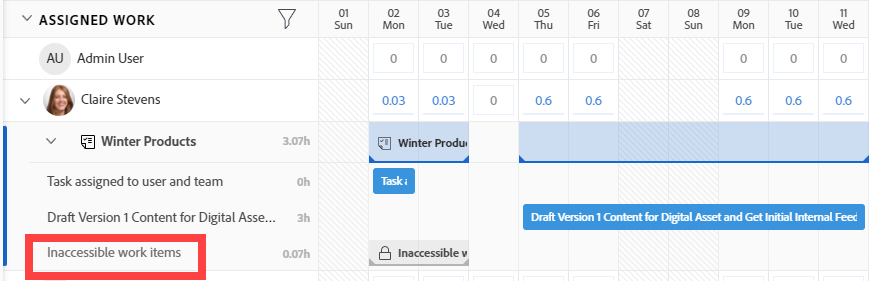
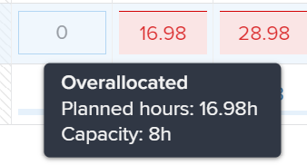

# Navegar no Balanceador de carga de trabalho

<!--Audited: 12/2024-->

Use o Balanceador de carga de trabalho no Adobe Workfront para atribuir trabalho aos usuários com base em sua disponibilidade. Este artigo descreve como você pode usar configurações e opções para navegar no Balanceador de carga de trabalho e exibir as informações relevantes para você. Os artigos adicionais listados aqui descrevem como você pode usar o Balanceador de carga de trabalho para gerenciar seus recursos e sua alocação para trabalhar.

O Balanceador de carga de trabalho está disponível em várias áreas do Adobe Workfront. Navegar por ele é semelhante em todas as áreas.

Para obter mais informações sobre onde o Balanceador de carga de trabalho está localizado, consulte [Localizar o Balanceador de carga de trabalho](https://experienceleague.adobe.com/en/docs/workfront/using/manage-resources/the-workload-balancer/locate-workload-balancer).

## Requisitos de acesso

+++ Expanda para visualizar os requisitos de acesso da funcionalidade neste artigo.

<table style="table-layout:auto"> 
 <col> 
 <col> 
 <tbody> 
  <tr> 
   <td>Pacote do Adobe Workfront</td> 
   <td>
Qualquer
</td>
  </tr>
  <tr> 
   <td>Licença do Adobe Workfront</td> 
   <td>
Padrão

       
Planejar, ao usar o Balanceador de carga de trabalho na área Recursos; Trabalhar, ao usar o Balanceador de carga de trabalho de uma equipe ou projeto
</td>
  </tr>
  <tr> 
   <td>Configurações de nível de acesso</td> 
   <td> 
Visualize ou tenha acesso superior ao seguinte:
 
    <ul> 
     <li>Gerenciamento de recursos</li> 
     <li>Projetos</li> 
     <li>Tarefas</li> 
     <li>Problemas</li> 
    </ul>
   </td> 
  </tr> 
  <tr> 
   <td>Permissões de objeto</td> 
   <td>Visualize ou aumente as permissões para projetos, tarefas e problemas</td> 
  </tr> 
 </tbody> 
</table>

Para obter informações, consulte [Requisitos de acesso na documentação do Workfront](/help/quicksilver/administration-and-setup/add-users/access-levels-and-object-permissions/access-level-requirements-in-documentation.md).

+++

## Considerações para a visualização de itens no Balanceador de carga de trabalho

Considere o seguinte ao visualizar o Balanceador de carga de trabalho:

* O Balanceador de carga de trabalho exibe itens de trabalho em duas áreas separadas, dependendo de suas atribuições. Os itens de trabalho e usuários são exibidos nas seguintes áreas:

  * **Trabalho não atribuído**: itens que não têm atribuições ou são atribuídos apenas a funções de trabalho ou equipes.
  * **Trabalho atribuído**: itens atribuídos a pelo menos um usuário. Os itens atribuídos são exibidos sob o nome do usuário atribuído.

  >[!NOTE]
  >
  >* Os itens de trabalho atribuídos a uma função de trabalho ou equipe, e também atribuídos a um usuário, são exibidos na área Trabalho não atribuído e sob o nome do usuário atribuído na área Trabalho atribuído.
  >* Itens de trabalho atribuídos a um usuário e a uma função de trabalho, onde a função de trabalho é selecionada como o principal responsável pelo item, são exibidos na área Trabalho não atribuído.
  >* Os itens de trabalho atribuídos a mais de um usuário são exibidos em todos os nomes de usuários atribuídos na área Trabalho atribuído.
  >* As atribuições de função são exibidas em itens de trabalho na área Trabalho não atribuído quando a configuração Mostrar atribuições de função está ativada. Para obter informações, consulte a seção [Personalizar a exibição](#customize-the-view) neste artigo.

  Para obter mais informações, consulte [Áreas de atribuição no Balanceador de carga de trabalho](/help/quicksilver/resource-mgmt/workload-balancer/assign-work-in-workload-balancer.md#assignment-areas-in-the-workload-balancer) em [Visão geral da atribuição de trabalho no Balanceador de carga de trabalho](/help/quicksilver/resource-mgmt/workload-balancer/assign-work-in-workload-balancer.md).

* Quando um projeto não tem tarefas durante um período de tempo, a barra no nível do projeto fica em branco por esse tempo.

  

* Quando você não tem permissões para ver determinados itens, eles são exibidos como **itens de trabalho inacessíveis** ou **projetos inacessíveis**.

  

* Os nomes dos itens de trabalho são exibidos à esquerda e a linha do tempo é exibida à direita.
* O total de Horas Planejadas para cada item de trabalho é exibido à direita do nome do item de trabalho e à esquerda da barra que representa a linha do tempo do item de trabalho.
* O total de Horas planejadas de cada projeto é exibido à direita do nome do projeto e à esquerda da barra que representa a linha do tempo do projeto.

  As informações de Horas planejadas do projeto são um total de Horas planejadas de todos os itens listados no Balanceador de carga de trabalho, e não um total de Horas planejadas do projeto.

Para obter mais informações sobre como exibir informações no Balanceador de carga de trabalho, consulte também os seguintes artigos:

* [Localize o Balanceador de carga de trabalho](../workload-balancer/locate-workload-balancer.md)
* [Filtrar informações no Balanceador de carga de trabalho](../workload-balancer/filter-information-workload-balancer.md)
* [Compartilhar o Balanceador de carga de trabalho com um link](../workload-balancer/share-link-for-workload-balancer.md)
* [Atualizar itens de trabalho no Balanceador de Carga de Trabalho usando o Resumo](../workload-balancer/update-items-in-summary-panel-in-workload-balancer.md)

Para obter informações sobre como gerenciar recursos usando o Balanceador de carga de trabalho, consulte também os seguintes artigos:

* [Visão geral da atribuição de trabalho no Balanceador de carga de trabalho](https://experienceleague.adobe.com/en/docs/workfront/using/manage-resources/the-workload-balancer/assign-work-in-workload-balancer)
* [Gerenciar alocações de usuário no Balanceador de carga de trabalho](https://experienceleague.adobe.com/en/docs/workfront/using/manage-resources/the-workload-balancer/manage-user-allocations-workload-balancer)

## Navegar pelo Balanceador de carga de trabalho para vários projetos na área Recursos

Navegar pelo Balanceador de carga de trabalho é semelhante em todas as áreas nas quais você o acessa.

As subseções a seguir descrevem como exibir as informações no Balanceador de carga de trabalho para vários projetos.

Você pode ajustar várias configurações e opções no Balanceador de carga de trabalho para exibir as informações que você precisa se concentrar no intervalo de tempo que faz mais sentido para você.

Após selecionar as configurações que deseja aplicar à visualização, o Balanceador de carga de trabalho lembra dessas configurações sempre que você o acessa de qualquer navegador ou dispositivo.

### Acesse o Balanceador de carga de trabalho para vários projetos na área Recursos

Para navegar pelo Balanceador de carga de trabalho para vários projetos:

{{step1-to-resourcing}}

1. Clique em **Balanceador de carga de trabalho** no painel esquerdo.

   

   O Balanceador de carga de trabalho exibe informações de atribuição de trabalho começando com a semana atual nas duas áreas a seguir:

   * A área **Trabalho não atribuído** exibe os seguintes itens de trabalho:

     * Itens de trabalho (tarefas e problemas) atribuídos a funções, equipes ou que não foram atribuídos são exibidos após a aplicação dos filtros.
       A área Trabalho não atribuído não exibe itens de trabalho por padrão. Recomendamos o uso de filtros para exibir informações relevantes nesta área.

       Para obter informações sobre como usar filtros, consulte [Informações de filtro no Balanceador de carga de trabalho](../workload-balancer/filter-information-workload-balancer.md).

     * As atribuições de função nos itens de trabalho são exibidas somente quando você ativa a configuração Mostrar atribuições de função. Para obter informações, consulte a seção [Personalizar a exibição](#customize-the-view) neste artigo.

     * Os projetos são exibidos somente quando você ativa a configuração Agrupar por projeto. Para obter informações, consulte a seção [Personalizar a exibição](#customize-the-view) neste artigo.

   * A área **Trabalho atribuído** exibe os seguintes itens de trabalho:

     * Todos os usuários ativos no sistema são exibidos nessa área por padrão. Recomendamos o uso de filtros para limitar a quantidade de informações nessa área. Se os usuários forem atribuídos a itens, os itens de trabalho também serão exibidos com seu nome.

     * Tarefas e problemas atribuídos a pelo menos um usuário são exibidos sob o nome do usuário.

       Os itens de trabalho em nomes de usuários na área Trabalho atribuído são classificados pelos seguintes critérios, nesta ordem:

       1. Data de Início Planejada (a mais antiga primeiro)
       1. Data de Término Planejada (a mais antiga primeiro)
       1. Ordem alfabética por projeto (somente quando os dois primeiros critérios são idênticos para vários itens de trabalho)

          >[!TIP]
          >
          >* Você pode personalizar a classificação de projetos selecionando uma opção na configuração &quot;Classificar projetos por&quot;.
          >
          >* Os projetos são exibidos somente quando você ativa a configuração &quot;Agrupar por projeto&quot;.
          > 
          >Para obter informações sobre como personalizar configurações, consulte a seção [Personalizar a exibição](#customize-the-view) neste artigo.

1. (Opcional) Clique no ícone **Filtro**  na área **Trabalho atribuído** e selecione o **Filtro padrão** na área **Sugerido** da caixa de filtro.

   Ao aplicar o filtro Padrão, os usuários que pertencem a qualquer uma das suas equipes e seus itens de trabalho são exibidos. É possível editar uma cópia desse filtro.

   >[!TIP]
   >
   >O filtro Padrão está disponível somente no Balanceador de carga de trabalho na área Recursos.

1. Continue com as seguintes etapas para navegar pelo Balanceador de carga de trabalho:

   * [Selecione um intervalo de tempo no Balanceador de carga de trabalho](#select-a-time-frame-in-the-workload-balancer)
   * [Personalizar o modo de exibição](#customize-the-view)
   * [Atribuir itens de trabalho e ajustar alocações de usuário](#assign-work-items-and-adjust-user-allocations)
   * [Exibir alocações em um gráfico](#view-allocations-in-a-chart)

### Selecione um intervalo de tempo no Balanceador de carga de trabalho

1. Acesse o Balanceador de carga de trabalho na área **Recursos**, conforme descrito na seção [Acesse o Balanceador de carga de trabalho para vários projetos na área Recursos](#access-the-workload-balancer-for-multiple-projects-in-the-resourcing-area) deste artigo.

   O Balanceador de carga de trabalho exibe informações de atribuição de trabalho começando com a semana atual.

1. Use a rolagem horizontal para exibir a linha do tempo de itens de trabalho que ultrapassam os limites da tela.
1. Clique nos ícones **voltar ou encaminhar**  no canto superior esquerdo para navegar na linha do tempo e clique em **Hoje** para retornar à semana atual.
1. Clique no **menu suspenso de intervalo de tempo** na barra de ferramentas e, em seguida, clique na data de início do período que deseja exibir. Por padrão, a primeira semana selecionada no calendário é a semana para a qual você navegou.

   

1. Selecione o número de semanas que deseja exibir de uma vez no Balanceador de carga de trabalho a partir das seguintes opções:
   * 1 semana
   * 2 semanas
   * 4 semanas. Esta é a configuração padrão.
   * 6 semanas
   * 3 meses

   

1. Clique em uma das seguintes opções na barra de ferramentas para exibir as informações em diferentes intervalos de tempo:
   * **Dia**: exibe informações por dia durante quatro semanas, começando com a data de hoje, por padrão.
   * **Semana**: exibe informações por semana durante quatro semanas.
   * **Mês**: exibe informações por mês durante três meses.

1. Continue navegando no Balanceador de carga de trabalho conforme descrito nas seções a seguir.

### Personalizar a exibição

1. Acesse o Balanceador de carga de trabalho na área **Recursos**, conforme descrito na seção [Acesse o Balanceador de carga de trabalho para vários projetos na área Recursos](#access-the-workload-balancer-for-multiple-projects-in-the-resourcing-area) deste artigo.

   Os nomes dos itens de trabalho são listados no lado esquerdo e são representados por barras no lado direito do Balanceador de carga de trabalho. O comprimento da barra representa a linha do tempo de um item de trabalho.

1. (Opcional e recomendado) Use filtros nas áreas Trabalho não atribuído e atribuído para exibir somente itens de trabalho ou usuários que sejam relevantes para você.

   Para obter mais informações, consulte [Informações de filtro no Balanceador de carga de trabalho](../workload-balancer/filter-information-workload-balancer.md).

   Por padrão, as barras azuis representam as linhas do tempo dos projetos e tarefas, e as barras laterais representam problemas.

   É possível alterar a cor das barras de projetos e tarefas ao selecionar o tema de cores para corresponder ao projeto. Para obter mais informações, continue lendo este procedimento.

   Os itens de trabalho na área Trabalho atribuído são classificados por projetos de acordo com os seguintes critérios, nesta ordem:
   1. Data de Início Planejada (a mais antiga primeiro)
   1. Data de Término Planejada (a mais antiga primeiro)
   1. Ordem alfabética por projeto (somente quando os dois primeiros critérios são idênticos para vários itens de trabalho)

1. Clique na **seta à direita** à esquerda das áreas Não atribuído ou Atribuído para expandir todos os itens nos nomes de projeto (na área Não atribuído) e nos nomes de usuário (na área Atribuído).

   >[!TIP]
   >
   >Os itens de trabalho são listados em nomes de projeto na área Não atribuído somente quando você ativa a configuração &quot;Agrupar por projeto&quot;.

1. Clique na **seta para baixo** à esquerda das áreas Não atribuído ou Atribuído para recolher todos os itens nos nomes de projeto (na área Não atribuído) e nos nomes de usuário (na área Atribuído).

1. Passe o mouse sobre ele e arraste e solte a **linha de separação** entre o painel esquerdo e a área da linha do tempo para ajustar o tamanho do painel esquerdo.

   

1. Clique no ícone **Configurações** .

   O painel Configurações é exibido à direita.

   

   Selecione entre as opções listadas abaixo para atualizar as informações exibidas no Balanceador de carga de trabalho e clique no **ícone X** no canto superior direito da caixa Configurações para fechá-lo.

   * **Agrupar por Projeto**: quando selecionado, os itens nas áreas Trabalho Atribuído e Não Atribuído são agrupados por projeto. É selecionado por padrão.

   * **Incluir horas de problemas**: quando selecionado, os problemas atribuídos aos usuários são exibidos sob o nome do usuário na área Trabalho atribuído, e os problemas não atribuídos aos usuários são exibidos na área Trabalho não atribuído. As Horas planejadas dos problemas contam para as Horas planejadas do projeto e do usuário na área Trabalho atribuído.
   * **Mostrar Datas Projetadas**: quando selecionado, a linha do tempo projetada dos itens de trabalho é exibida além da linha do tempo planejada. Observe o seguinte:
     * A linha do tempo projetada do projeto, tarefas e problemas é exibida como uma linha azul escura acima das barras de tarefa, problema e projeto.
     * A linha do tempo projetada fora da linha do tempo planejada é exibida em azul claro, mesmo quando você atualiza o tema de cor, conforme descrito abaixo.
     * A linha do tempo projetada para os itens que você não tem acesso para visualizar é exibida em cinza claro com uma linha abaixo.
     * Quando uma tarefa ou problema é concluído antes da Data de conclusão planejada vencida, os números de alocação dos dias restantes são atingidos e não contam para a alocação do usuário. Isso é exibido somente quando a configuração Mostrar datas projetadas e o ícone Mostrar alocação estão ativados.

     >[!TIP]
     >
     >Observe que os itens de trabalho são exibidos no Balanceador de carga de trabalho quando suas linhas do tempo planejadas ou projetadas (não necessariamente as duas ao mesmo tempo) ocorrem durante o período selecionado.

   * **Mostrar trabalho concluído**: quando habilitado, as tarefas concluídas e os problemas são exibidos na área Trabalho Atribuído. Isso é ativado por padrão.

     Um ícone de marca de seleção verde é exibido no canto superior direito de uma barra de tarefas ou problemas quando são concluídos. O mesmo ícone é exibido para um projeto quando as tarefas ou problemas do período selecionado do projeto são concluídos.

     >[!NOTE]
     >
     >A visibilidade da tarefa no Balanceador de carga de trabalho é orientada pela conclusão no nível da tarefa, não pela conclusão no nível da atribuição. Se uma tarefa tiver vários atribuídos e um ou mais deles selecionar &quot;Concluído com minha parte&quot;, mas o status geral da tarefa não for Concluído, a tarefa será considerada um trabalho não concluído. Quando a **opção Mostrar trabalho concluído** está desativada, a tarefa ainda será exibida porque não foi totalmente concluída.

   * **Mostrar tempo restante**: quando habilitado, o Workfront exibe a diferença entre o horário diário para o qual o usuário está disponível para trabalhar com base em seus cronogramas e as horas para as quais ele está alocado na área Trabalho atribuído para os usuários. Isso é desativado por padrão e o tempo alocado é exibido por padrão.
   * **Mostrar atribuições de função**: quando habilitado, as atribuições de função são exibidas na área Trabalho não atribuído em seus itens de trabalho atribuídos. Isso é ativado por padrão.

   * Na seção **Selecionar tema de cor**, selecione a cor desejada para as barras de projeto e tarefa.

     >[!TIP]
     >
     >A configuração para selecionar o tema de cor não afeta a cor das barras de edição. Os problemas sempre são exibidos em uma barra cor marrom.

     Selecione entre as seguintes opções:
     * **Padrão**: as barras de todos os projetos e seus itens de trabalho são exibidas em azul.
     * **Projeto**: as barras associadas a cada projeto e suas tarefas mudam de acordo com o nome do projeto. Todas as tarefas que pertencem ao projeto são exibidas em barras que correspondem à cor do projeto. As barras de projeto são exibidas em uma sombra mais clara para diferenciá-las das tarefas. As barras de projeto também incluem um ícone de projeto ao optar por não exibir alocações.
     * **Status do Projeto**: as barras associadas a cada projeto e a seus itens de trabalho mudam para a cor do status do projeto.

       O status do projeto é aquele associado ao Grupo do projeto. Se o Grupo não tiver status específicos de grupo, a cor das barras do item de trabalho será a do status do projeto no nível do sistema. Tanto os status do sistema quanto os personalizados são exibidos. Para obter informações sobre status de grupo, consulte [Criar ou editar um status de grupo](../../administration-and-setup/manage-groups/manage-group-statuses/create-or-edit-a-group-status.md).

   * Na seção **Exibir alocação de usuário em**, selecione uma das seguintes opções:
     * **Horas**: exibe o tempo alocado como horas. Este é o padrão.
     * **Porcentagem**: exibe o tempo alocado como uma porcentagem do tempo total disponível
   * Na seção **Preferências de classificação**, selecione como deseja que os itens sejam classificados no Balanceador de carga de trabalho. Selecione entre as seguintes opções:
     * **Classificar usuários por função principal**: os usuários são exibidos na ordem alfabética de suas funções principais na área Trabalho atribuído.
     * **Classificar usuários em ordem alfabética**: os usuários são exibidos em ordem alfabética de seus nomes na área Trabalho atribuído.
     * **Classificar projetos por**: selecione um campo de projeto no menu suspenso para classificar projetos em ordem alfabética de acordo com o campo nas áreas Trabalho não atribuído ou atribuído.

   >[!TIP]
   >
   >Você pode classificar por projetos somente quando a configuração Agrupar por projeto está ativada. Caso contrário, essa configuração ficará esmaecida.

1. (Opcional e condicional) Ao alterar o tema de cores para Status do projeto, passe o mouse sobre o nome de um projeto à esquerda para visualizar o status do projeto.

   

### Atribuir itens de trabalho e ajustar alocações de usuário

1. Acesse o Balanceador de carga de trabalho na área Recursos, conforme descrito na seção [Acesse o Balanceador de carga de trabalho para vários projetos na área Recursos](#access-the-workload-balancer-for-multiple-projects-in-the-resourcing-area) neste artigo.
1. Clique no **ícone Mostrar alocações**  para exibir as Horas Planejadas diárias ou semanais dos itens de trabalho.

   Isso substitui o nome nas barras dos itens de trabalho pela quantidade de Horas planejadas diárias ou semanais nas áreas Trabalho não atribuído e atribuído. Essa configuração é desativada por padrão.

   Os dias que mostram superalocações são exibidos em vermelho.

   >[!TIP]
   >
   >* A opção Mostrar alocações afeta apenas o que é exibido para projetos, tarefas, problemas e itens inacessíveis. As Horas planejadas diárias dos usuários são exibidas por padrão e não podem ser ocultas.
   >* Você deve ativar a configuração Agrupar por projeto para exibir as Horas planejadas diárias para os projetos.
   >* Quando você exibe o Balanceador de carga de trabalho por semana, as horas exibidas são as Horas planejadas semanais.

1. (Opcional) Passe o mouse sobre o tempo alocado na linha do usuário para entender a capacidade e a alocação do usuário. A capacidade é a disponibilidade do usuário de acordo com seu cronograma.

   

1. (Opcional) Clique no **ícone Ocultar alocações**  para exibir o nome das tarefas e problemas nas barras dos itens de trabalho.
1. Clique no ícone  à direita do nome de uma tarefa, problema ou função e clique em uma das opções abaixo.

   

   * **Atribua isto a** e comece digitando o nome de um usuário, função ou equipe ao qual deseja atribuir o item de trabalho no campo **Pesquisar pessoas, função ou equipes**.

     Clique em **Avançado** para acessar a tela Atribuições Avançadas do item de trabalho. Para obter mais informações, consulte [Criar atribuições avançadas](/help/quicksilver/manage-work/tasks/assign-tasks/create-advanced-assignments.md).

     Você também pode usar os seguintes atalhos para atribuir tarefas ou problemas:

     * No Windows: CTRL+clique na barra de tarefas ou problemas.
     * No Mac: CMD+clique na barra de tarefas ou problemas.

     Para obter mais informações sobre como atribuir itens de trabalho a usuários no Balanceador de carga de trabalho, consulte [Visão geral da atribuição de trabalho no Balanceador de carga de trabalho](../workload-balancer/assign-work-in-workload-balancer.md).

     >[!NOTE]
     >
     >As atribuições de função são exibidas somente em itens de trabalho na área Trabalho não atribuído quando a configuração Mostrar atribuições de função está ativada. Para obter informações, consulte a seção [Personalizar a exibição](#customize-the-view) neste artigo. As atribuições de função só têm a opção **Atribuir a este(a)** no menu **Mais**.

     >[!TIP]
     >
     >Se a Workfront ou o administrador de grupo tiver ativado delegações no seu ambiente, use a guia Atribuições para atribuir usuários à tarefa ou problema. Para obter informações sobre como delegar trabalho, consulte [Delegar tarefas e problemas](../../manage-work/delegate-work/how-to-delegate-work.md).

   * **Editar alocações** e editar as alocações diárias ou semanais do usuário. Para obter informações sobre como gerenciar alocações de usuários, consulte [Gerenciar alocações de usuários no Balanceador de carga de trabalho](../workload-balancer/manage-user-allocations-workload-balancer.md).

   * **Abrir Resumo**. O painel Resumo é aberto à direita, em seguida, clique no campo Atribuições e comece a digitar o nome de um usuário, função ou equipe no campo **Pesquisar pessoas, função ou equipes** para atribuir o item. Para obter mais informações, consulte a seção [Exibir mais informações sobre tarefas e problemas](#display-more-information-about-tasks-and-issues) neste artigo.

1. (Opcional) Clique duas vezes em uma alocação diária ou semanal para um usuário dentro da barra de um item de trabalho para editar o número de horas alocadas e clique no **ícone Salvar**  para salvar as alocações ou no **ícone Cancelar**  para remover as alocações ajustadas.

   >[!TIP]
   >
   >Os ícones Salvar e Cancelar são exibidos perto do final da barra de linha do tempo de uma tarefa ou problema.
   >
   >

   Para obter informações sobre como gerenciar alocações de usuários, consulte [Gerenciar alocações de usuários no Balanceador de carga de trabalho](../workload-balancer/manage-user-allocations-workload-balancer.md).

1. Clique em **Atribuições em massa** para atribuir itens de trabalho em massa.

   Para obter mais informações, consulte [Atribuir trabalho em massa usando o Balanceador de carga de trabalho](../workload-balancer/assign-work-in-workload-balancer-in-bulk.md).
1. Arraste itens da área **Trabalho não atribuído** ou de um usuário e solte-os em outro usuário para atribuí-los.

   Para obter mais informações, consulte [Atribuir trabalho no Balanceador de carga de trabalho arrastando e soltando](../workload-balancer/assign-work-in-workload-balancer-by-drag-and-drop.md).

### Exibir alocações em um gráfico

Em vez de exibir alocações em números diários ou semanais, você pode exibi-los em um gráfico.

1. Acesse o Balanceador de carga de trabalho na área Recursos, conforme descrito na seção [Acesse o Balanceador de carga de trabalho para vários projetos na área Recursos](#access-the-workload-balancer-for-multiple-projects-in-the-resourcing-area) neste artigo.
1. Clique no **ícone do Gráfico**  para exibir a alocação de usuário em um formato de gráfico.

   Os dias em que o usuário está superalocado são exibidos como blocos vermelhos e os dias em que o usuário está subalocado ou na capacidade são exibidos como blocos azuis.

   O tamanho dos blocos indica a quantidade da alocação: quanto maior a caixa, mais tempo o usuário é alocado para itens de trabalho para esse dia ou semana.

   

### Exibir mais informações sobre tarefas e problemas

Você pode ver mais informações sobre as tarefas e os problemas no Balanceador de carga de trabalho.

1. Acesse o Balanceador de carga de trabalho na área Recursos, conforme descrito na seção [Acesse o Balanceador de carga de trabalho para vários projetos na área Recursos](#access-the-workload-balancer-for-multiple-projects-in-the-resourcing-area) neste artigo.
1. Para exibir mais informações no painel Resumo, siga um destes procedimentos:

   * Clique na barra de uma tarefa ou problema para abrir o painel Resumo à direita.
   * Clique no ícone **Abrir resumo**  e clique na barra de uma tarefa ou problema para abrir o painel Resumo.
   * Clique no menu **Mais** à direita de uma tarefa ou problema e clique em **Abrir resumo**.

   Para obter informações sobre como atualizar informações de tarefa no Resumo do Balanceador de carga de trabalho, consulte [Atualizar itens de trabalho no Balanceador de carga de trabalho usando o Resumo](../workload-balancer/update-items-in-summary-panel-in-workload-balancer.md).

1. Passe o mouse sobre o nome de uma tarefa ou problema para ver mais informações sobre ele. Uma caixa é exibida acima da tarefa ou do problema com as seguintes informações:

   * O nome da tarefa ou problema.
   * O nome do projeto.
   * As datas planejadas de início e término.
   * O número de Horas Planejadas.
   * Para tarefas, o número do antecessor.
   * Para tarefas, um indicador no canto superior da caixa que indica se a tarefa está pronta para ser trabalhada ou não.

   

1. Clique no nome de um item de trabalho à esquerda para acessá-lo. O item de trabalho é aberto em uma nova guia do navegador.

### Exibir o Balanceador de carga de trabalho em tela cheia

1. Acesse o Balanceador de carga de trabalho na área Recursos, conforme descrito na seção [Acesse o Balanceador de carga de trabalho para vários projetos na área Recursos](#access-the-workload-balancer-for-multiple-projects-in-the-resourcing-area) neste artigo.

1. Clique no ícone **Tela cheia**  para exibir o Balanceador de carga de trabalho em tela cheia.

   O Balanceador de carga de trabalho ocupa toda a tela. As janelas e guias do navegador são excluídas da visualização.

1. Clique no ícone **Sair da tela cheia**  para retornar à tela padrão e exibir o Balanceador de carga de trabalho na guia do navegador.

## Navegar pelo Balanceador de carga de trabalho de uma equipe

Navegar pelo Balanceador de carga de trabalho de uma equipe é semelhante a como você navega pelo Balanceador de carga de trabalho para vários projetos. Para obter informações, consulte a seção [Navegar pelo Balanceador de carga de trabalho para vários projetos](#navigate-the-workload-balancer-for-multiple-projects-in-the-resourcing-area) neste artigo.

{{step1-to-team}}

A página da Equipe inicial é exibida por padrão.

1. Clique em **Balanceador de carga de trabalho** no painel esquerdo.

   

   O Balanceador de carga de trabalho de uma equipe exibe as seguintes informações, por padrão:

   * Na área **Trabalho não atribuído**: itens de trabalho atribuídos à equipe ou às funções de equipe e trabalho e que não estão atribuídos a usuários. As atribuições de função são exibidas em itens de trabalho na área Trabalho não atribuído quando a configuração Mostrar atribuições de função está ativada.
   * Na área **Trabalho atribuído**: os itens de trabalho atribuídos aos usuários são exibidos sob os nomes dos usuários.

1. Continue navegando no Balanceador de carga de trabalho de uma equipe, conforme descrito na seção [Navegar no Balanceador de carga de trabalho para vários projetos na seção Área de recursos](#navigate-the-workload-balancer-for-multiple-projects-in-the-resourcing-area) deste artigo.

## Navegar pelo Balanceador de carga de trabalho de um único projeto

{{step1-to-projects}}

1. Clique no nome de um projeto para abrir a página.
1. Clique em **Balanceador de carga de trabalho** no painel esquerdo.

   

   O Balanceador de carga de trabalho do projeto exibe as seguintes informações, por padrão:

   * Na área **Trabalho não atribuído**: itens de trabalho no projeto que são atribuídos a funções ou equipes e não são atribuídos a usuários. As atribuições de função são exibidas em itens de trabalho na área Trabalho não atribuído quando a configuração Mostrar atribuições de função está ativada.
   * Na área **Trabalho atribuído**: itens de trabalho no projeto atribuídos a pelo menos um usuário.

   Recomendamos o uso de filtros para mostrar apenas os usuários que são importantes para você.

   Por exemplo, você pode considerar exibir somente os usuários que pertencem a suas equipes ou grupos. Para obter mais informações, consulte [Informações de filtro no Balanceador de carga de trabalho](../workload-balancer/filter-information-workload-balancer.md).

1. (Opcional) Clique no ícone **Filtro**  na área Trabalho Atribuído e selecione a opção **Itens de trabalho deste projeto** na área **Sugerido** do painel de filtro. Esse filtro é desmarcado por padrão.

   Quando essa opção é selecionada, somente os itens atribuídos aos usuários no projeto selecionado são exibidos.

   Quando a opção não está selecionada, todos os itens atribuídos aos usuários no projeto são exibidos, independentemente dos projetos aos quais os itens pertencem.

1. (Opcional e recomendado) Aplique um filtro na área Trabalho atribuído para exibir usuários que são importantes para você, mas que podem não estar atribuídos a itens no projeto, em seguida, clique no ícone **Mostrar todos os usuários** .

   Ao mostrar todos os usuários, você pode exibir todos os usuários no Workfront que ainda não estão atribuídos ao trabalho ou a outras funções no projeto.

   Aplique um filtro primeiro para reduzir o número de usuários exibidos.

   Por exemplo, você pode filtrar primeiro para usuários que pertencem a suas equipes ou grupos e, em seguida, exibir todos esses usuários.

   Para obter informações sobre como criar um filtro, consulte [Informações de filtro no Balanceador de carga de trabalho](../workload-balancer/filter-information-workload-balancer.md).

   >[!NOTE]
   >
   > A opção Mostrar todos os usuários está disponível somente para o Balanceador de carga de trabalho de um projeto.

1. (Opcional) Clique no **ícone Mostrar alocações de função** .

   O painel Alocação de função é exibido.

   Você pode exibir informações sobre as Horas Planejadas associadas às funções de trabalho no projeto e as funções de trabalho associadas às iniciativas vinculadas aos projetos do Planejador de Cenários.

   Para obter mais informações, consulte [Visão geral da reconciliação de alocações de recursos entre projetos e iniciativas](../../scenario-planner/overview-reconcile-allocations-between-projects-initiatives.md).

   >[!NOTE]
   >
   >Não é possível exibir as informações de função de trabalho da iniciativa se a organização não tiver comprado uma licença do Planejador de cenários do Workfront. Nesse caso, você só pode exibir as horas planejadas associadas às funções de trabalho no projeto. Para obter mais informações, consulte [Acesso necessário para usar o Planejador de cenários](../../scenario-planner/access-needed-to-use-sp.md).

1. Continue navegando no Balanceador de carga de trabalho de um projeto, conforme descrito na seção [Navegar no Balanceador de carga de trabalho para vários projetos](#navigate-the-workload-balancer-for-multiple-projects-in-the-resourcing-area) deste artigo.

## Navegar pelo Balanceador de carga de trabalho de um usuário

Você pode acessar o Balanceador de carga de trabalho em seu próprio perfil de usuário.

{{step1-click-profile-pic}}

1. Clique em **Balanceador de carga de trabalho** no painel esquerdo.

   O Balanceador de carga de trabalho do usuário é exibido.

   

   O Balanceador de carga de trabalho de um usuário exibe as seguintes informações por padrão:

   * **Trabalho atribuído**: as tarefas e problemas atribuídos ao usuário específico.

   >[!NOTE]
   >
   >O Balanceador de carga de trabalho em um perfil de usuário é somente leitura e as atribuições e alocações não podem ser alteradas.

1. Continue navegando no Balanceador de carga de trabalho de um usuário conforme descrito na seção [Navegar no Balanceador de carga de trabalho para vários projetos](#navigate-the-workload-balancer-for-multiple-projects-in-the-resourcing-area) deste artigo.

