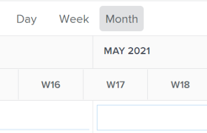

# Compartilhar o Balanceador de carga de trabalho com um link

Você pode compartilhar o Balanceador de carga de trabalho com outros usuários que talvez não tenham a área Recursos disponível no Menu principal. Para obter informações sobre como usar o Balanceador de carga de trabalho, consulte [Navegar pelo Balanceador de carga de trabalho](../../resource-mgmt/workload-balancer/navigate-the-workload-balancer.md).

## Requisitos de acesso

+++ Expanda para visualizar os requisitos de acesso da funcionalidade neste artigo.

<table style="table-layout:auto"> 
 <col> 
 <col> 
 <tbody> 
  <tr> 
   <td>Pacote do Adobe Workfront</td> 
   <td>
Qualquer
</td>
  </tr>
  <tr> 
   <td>Licença do Adobe Workfront</td> 
   <td>
Padrão

       
Planejar, ao usar o Balanceador de carga de trabalho na área Recursos; Trabalhar, ao usar o Balanceador de carga de trabalho de uma equipe ou projeto
</td>
  </tr>
  <tr> 
   <td>Configurações de nível de acesso</td> 
   <td> 
Visualize ou tenha acesso superior ao seguinte:
 
    <ul> 
     <li>Gerenciamento de recursos</li> 
     <li>Projetos</li> 
     <li>Tarefas</li> 
     <li>Problemas</li> 
    </ul>
   </td> 
  </tr> 
  <tr> 
   <td>Permissões de objeto</td> 
   <td>Visualize ou aumente as permissões para projetos, tarefas e problemas</td> 
  </tr> 
 </tbody> 
</table>

Para obter informações, consulte [Requisitos de acesso na documentação do Workfront](/help/quicksilver/administration-and-setup/add-users/access-levels-and-object-permissions/access-level-requirements-in-documentation.md).

+++

## Informações incluídas no Balanceador de carga de trabalho ao visualizá-lo a partir de um link compartilhado

Quando você compartilha um link para o Balanceador de carga de trabalho com outros usuários, as seguintes informações são incluídas no link compartilhado:

* A área Trabalho atribuído do Balanceador de carga de trabalho.
* Informações sobre projeto, tarefa e usuário. Isso inclui as informações de alocação do usuário.
* As informações são exibidas de acordo com o filtro selecionado.

  >[!IMPORTANT]
  >
  >Se você excluir os filtros depois de compartilhar o link, os usuários que visualizam o Balanceador de carga de trabalho no link receberão um aviso de que os filtros foram excluídos. Eles exibem todos os usuários na área Trabalho atribuído. Essa é a exibição padrão do Balanceador de carga de trabalho.

* O número de semanas selecionadas anteriormente.

As seguintes opções estão disponíveis para o usuário que está visualizando o Balanceador de carga de trabalho de um link compartilhado para se atualizar:

* As seguintes seleções de linha do tempo:

   * Hoje
   * Ícones para voltar e avançar
   * Seleção de calendário

* Os ícones Dia, Semana e Mês
* O ícone Configurações
* O ícone Mostrar alocações

  Para obter informações sobre como usar essas opções, consulte [Navegar pelo Balanceador de Carga de Trabalho](../../resource-mgmt/workload-balancer/navigate-the-workload-balancer.md).

* O ícone Mostrar alocações de função

  Isso está disponível somente para o Balanceador de carga de trabalho de um projeto.

O usuário que recebe o link compartilhado não pode fazer o seguinte no Balanceador de carga de trabalho a partir deste link:

* Atribuir itens de trabalho aos usuários
* Gerenciar alocações de usuários
* Criar filtros novos ou atualizar os filtros aplicados originalmente

## Acesso necessário para exibir informações no Balanceador de carga de trabalho de um link compartilhado

Você precisa do seguinte acesso para visualizar informações no Balanceador de carga de trabalho de um link compartilhado:

* Uma licença válida do Adobe Workfront e você deve estar conectado ao Workfront.
* Pelo menos visualize o acesso ao Gerenciamento de recursos no seu Nível de acesso. Para obter informações sobre como conceder acesso ao Gerenciamento de Recursos, consulte [Conceder acesso ao Gerenciamento de Recursos](../../administration-and-setup/add-users/configure-and-grant-access/grant-access-resource-management.md).
* Visualize permissões para projetos, tarefas, problemas e usuários exibidos no Balanceador de carga de trabalho.

## Compartilhar o Balanceador de carga de trabalho com outros usuários em um link

1. Ir para o Balanceador de carga de trabalho

   Para obter informações sobre como acessar o Balanceador de carga de trabalho, consulte [Navegar pelo Balanceador de carga de trabalho](../../resource-mgmt/workload-balancer/navigate-the-workload-balancer.md).

1. (Opcional) Siga um ou mais destes procedimentos:

   * Atualize a seleção do período de tempo.
   * Clique em **Dia, Semana** ou **Mês** para exibir informações diárias, semanais ou mensais.

     

   * Aplique filtros às áreas Trabalho não atribuído e atribuído.

     Para obter informações sobre como filtrar informações no Balanceador de carga de trabalho, consulte [Informações de filtro no Balanceador de carga de trabalho](../../resource-mgmt/workload-balancer/filter-information-workload-balancer.md).

1. Clique no **ícone de link** .

   Isso adiciona o link à área de transferência.

1. Siga um destes procedimentos para compartilhar o link com outras pessoas:

   * Cole-o em um email, mensagem de chat ou qualquer outro aplicativo e compartilhe-o com outros usuários.
   * Adicione-o a um painel como uma página externa, adicione o painel ao perfil de um usuário ou a um modelo de layout e, em seguida, compartilhe o modelo de layout com usuários, equipes, funções de trabalho ou grupos.

     Para obter informações sobre como criar uma página externa, consulte [Incorporar uma página da Web externa em um painel](../../reports-and-dashboards/dashboards/creating-and-managing-dashboards/embed-external-web-page-dashboard.md). Para obter informações sobre como adicionar painéis a um modelo de layout, consulte [Personalizar o painel esquerdo usando um modelo de layout](../../administration-and-setup/customize-workfront/use-layout-templates/customize-left-panel.md).

     >[!IMPORTANT]
     >
     >Ao adicionar o Balanceador de carga de trabalho como um painel ao painel esquerdo de um objeto, as informações no Balanceador de carga de trabalho não são filtradas pelo objeto. O Balanceador de carga de trabalho exibe as informações filtradas pelos filtros aplicados originalmente.
