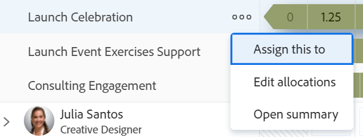

# Cancelar atribuição de trabalho no Balanceador de carga de trabalho

Você pode desatribuir usuários de itens de trabalho na área Trabalho atribuído do Balanceador de carga de trabalho do Adobe Workfront ou reatribuí-los a outros usuários, funções ou equipes.

Você pode cancelar a atribuição de itens de trabalho manualmente, arrastando e soltando ou em massa. Este artigo descreve como cancelar a atribuição de usuários manualmente.

Para obter informações sobre como desatribuir usuários arrastando e soltando, consulte [Atribuir trabalho no Balanceador de carga de trabalho arrastando e soltando](../../resource-mgmt/workload-balancer/assign-work-in-workload-balancer-by-drag-and-drop.md)

Para obter informações sobre como desatribuir usuários em massa, consulte [Atribuir trabalho em massa usando o Balanceador de carga de trabalho](../../resource-mgmt/workload-balancer/assign-work-in-workload-balancer-in-bulk.md).

## Requisitos de acesso

Você deve ter o seguinte acesso para executar as etapas deste artigo:

<table style="table-layout:auto"> 
 <col> 
 <col> 
 <tbody> 
  <tr> 
   <td role="rowheader">plano do Adobe Workfront*</td> 
   <td> 
Qualquer 
 </td> 
  </tr> 
  <tr> 
   <td role="rowheader">Licença da Adobe Workfront*</td> 
   <td> 
Planejar, ao usar o Balanceador de carga de trabalho na área Recursos

   
Trabalhar, ao usar o Balanceador de carga de trabalho de uma equipe ou projeto

</td> 
  </tr> 
  <tr> 
   <td role="rowheader">Configurações de nível de acesso*</td> 
   <td> 
Editar acesso ao seguinte:
 
    <ul> 
     <li> 
Gerenciamento de recursos
 </li> 
     <li> 
Projetos
 </li> 
     <li> 
Tarefas
 </li> 
     <li> 
Problemas
 </li> 
    </ul> 
Se você ainda não tiver acesso, pergunte ao administrador do Workfront se ele definiu restrições adicionais em seu nível de acesso. Para obter informações sobre como um administrador do Workfront pode alterar seu nível de acesso, consulte <a href="../../administration-and-setup/add-users/configure-and-grant-access/create-modify-access-levels.md" class="MCXref xref">Criar ou modificar níveis de acesso personalizados</a>.
 </td> 
  </tr> 
  <tr> 
   <td role="rowheader">Permissões de objeto</td> 
   <td> 
Permissões do Contribute ou superiores para projetos, tarefas e problemas que incluem Fazer atribuições
 
Para obter informações sobre como solicitar acesso adicional, consulte <a href="../../workfront-basics/grant-and-request-access-to-objects/request-access.md" class="MCXref xref">Solicitar acesso aos objetos </a>.
 </td> 
  </tr> 
 </tbody> 
</table>

&#42;Para saber qual plano, tipo de licença ou acesso você tem, contate o administrador do Workfront.

 

## Cancelar atribuição de itens de trabalho no Balanceador de carga de trabalho

Você pode cancelar a atribuição de itens de usuários e movê-los para a área Trabalho não atribuído ou reatribuí-los a outros usuários.

Para desatribuir itens de trabalho dos usuários:

1. No Balanceador de carga de trabalho, vá para a área **Trabalho atribuído** e expanda um usuário.
1. Siga um destes procedimentos:

   * Localize o item que deseja cancelar a atribuição na área de um usuário, clique nele e arraste e solte-o na área Não atribuído ou na área de outro usuário.
   * Clique no ícone **Mais**  à direita do nome de um item de trabalho, clique em **Atribuir a este item**, remova o nome das entidades atribuídas ao item de trabalho ou insira outro nome e clique em **Salvar**.

     

   O item é exibido na área Trabalho não atribuído se corresponder aos critérios de filtragem para essa área e não estiver atribuído a outros usuários, ou é exibido na área do usuário se estiver atribuído a outro usuário.

   Para obter informações sobre como filtrar informações no Balanceador de carga de trabalho, consulte [Informações de filtro no Balanceador de carga de trabalho](../../resource-mgmt/workload-balancer/filter-information-workload-balancer.md).
