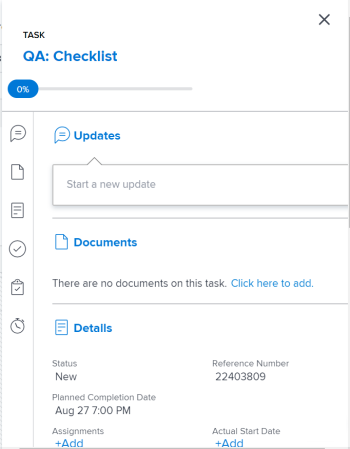

# Atualizar itens de trabalho no Balanceador de carga de trabalho usando o Resumo

Você pode usar o painel Resumo de uma tarefa ou um problema para atualizar informações importantes desse item. no Balanceador de carga de trabalho.

O painel Resumo está disponível para tarefas e problemas nas áreas Trabalho atribuído e não atribuído do Balanceador de carga de trabalho.

## Requisitos de acesso

Você deve ter o seguinte:

<table style="table-layout:auto"> 
 <col> 
 <col> 
 <tbody> 
  <tr> 
   <td role="rowheader">plano do Adobe Workfront*</td> 
   <td> 
Qualquer 
 </td> 
  </tr> 
  <tr> 
   <td role="rowheader">Licença da Adobe Workfront*</td> 
   <td> 
Planejar, ao usar o Balanceador de carga de trabalho na área Recursos

   
Trabalhar, ao usar o Balanceador de carga de trabalho de uma equipe ou projeto
 
 
 </td> 
  </tr> 
  <tr> 
   <td role="rowheader">Configurações de nível de acesso*</td> 
   <td> 
Editar acesso ao seguinte:
 
    <ul> 
     <li> 
Gerenciamento de recursos
 </li> 
     <li> 
Projetos
 </li> 
     <li> 
Tarefas
 </li> 
     <li> 
Problemas
 </li> 
    </ul> 
Se você ainda não tiver acesso, pergunte ao administrador do Workfront se ele definiu restrições adicionais em seu nível de acesso. Para obter informações sobre como um administrador do Workfront pode alterar seu nível de acesso, consulte <a href="../../administration-and-setup/add-users/configure-and-grant-access/create-modify-access-levels.md" class="MCXref xref">Criar ou modificar níveis de acesso personalizados</a>.
 </td> 
  </tr> 
  <tr> 
   <td role="rowheader">Permissões de objeto</td> 
   <td> 
Contribuir com permissões ou com permissões superiores para projetos, tarefas e problemas 
 
Para obter informações sobre como solicitar acesso adicional, consulte <a href="../../workfront-basics/grant-and-request-access-to-objects/request-access.md" class="MCXref xref">Solicitar acesso a objetos </a>.
 </td> 
  </tr> 
 </tbody> 
</table>

&#42;Para descobrir seu plano, tipo de licença ou acesso, entre em contato com o administrador do Workfront.

## Atualizar tarefas e problemas no painel Resumo do Balanceador de carga de trabalho

1. Vá para o Balanceador de carga de trabalho.

   O Balanceador de carga de trabalho exibe informações de atribuição de trabalho começando com a semana atual.

1. Vá para a **Trabalho não atribuído** e localize um item de trabalho.

   Ou

   Vá para a **Trabalho atribuído** , expanda um usuário e localize um item de trabalho.

1. Clique na barra de uma tarefa ou problema para abrir o painel Resumo à direita

   Ou

   Clique em **Abrir resumo** ícone , em seguida, clique na barra de uma tarefa ou problema para abrir o painel Resumo

   Ou

   Clique em **Mais** menu  à direita de uma tarefa ou problema, em seguida clique em **Abrir resumo**.

   O painel Resumo é aberto à direita.

   

1. Modifique um número de campos para o item de trabalho, informe uma atualização ou navegue daqui para outras áreas do Workfront para adicionar documentos ou outras informações ao item de trabalho.

   >[!CAUTION]
   >
   >Navegar do Resumo para a seção Subtarefas para adicionar subtarefas remove a tarefa original, pois as tarefas pai não são exibidas no Balanceador de carga de trabalho.

   Para obter mais informações sobre como atualizar informações usando o Resumo, consulte [Visão geral do resumo](../../workfront-basics/the-new-workfront-experience/summary-overview.md).

1. (Condicional) Se você abriu qualquer seção do item de trabalho, clique no link do **Botão Voltar** para retornar ao Balanceador de carga de trabalho.
1. Clique em **Ícone Fechar**  no canto superior direito do Resumo, para fechá-lo.
