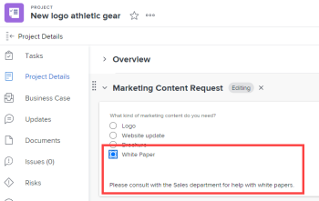

# Adicionar lógica de exibição e ignorar lógica a um formulário personalizado

Você pode usar regras inteligentes para tornar um formulário personalizado dinâmico e mais relevante para os usuários que o preencherem. Quando um usuário responde de determinada maneira a um campo de múltipla escolha em um formulário, uma regra inteligente mostra o que você deseja que ele veja em seguida, com base nessa resposta.

Os tipos de campos de múltipla escolha são Menu suspenso, Caixas de seleção e Botões de opção.

* **Exibir lógica**: Você configura uma regra de lógica de exibição no campo, no widget ou na seção que deseja que o usuário veja somente depois de selecionar uma escolha específica em um campo de múltipla escolha anterior.

   **Exemplo:** Você está criando um formulário de Solicitação de conteúdo de marketing em que as pessoas em sua organização podem solicitar um novo logotipo, atualização de site, folheto ou outros tipos de conteúdo de marketing. Com base no tipo de conteúdo que o usuário deseja, é necessário solicitar a eles diferentes tipos de detalhes, como cores e ideias de design, se eles precisarem de um logotipo ou uma lista de recursos do produto, caso precisem de um folheto.

   No campo perguntando sobre cores e detalhes para um novo logotipo, é possível adicionar uma regra de lógica de exibição que exibe esse campo somente depois que o usuário seleciona o botão de opção Logotipo no primeiro campo.

   Da mesma forma, no campo perguntando sobre os recursos do produto, é possível adicionar uma regra de lógica de exibição que exibe esse campo somente depois que um usuário seleciona o botão de opção Brochura no primeiro campo.

   

   Você pode configurar regras de lógica de exibição em qualquer campo personalizado, widget ou quebra de seção que siga um campo de múltipla escolha.

* **Ignorar regra lógica**: Essa regra é configurada para ocultar partes de um formulário que o usuário não precisa. Quando o usuário seleciona um item específico em um campo de múltipla escolha anterior, a regra de lógica de ignorar os ignora até o final do formulário ou até um campo, widget ou seção personalizado que você deseja que eles vejam.

   **Exemplo:** Alguém usa o formulário de Solicitação de conteúdo de marketing acima para solicitar um white paper, que é fornecido por Vendas, não pelo Marketing. Para esse usuário, uma regra de lógica de ignorar pode ocultar a pergunta solicitando detalhes e ignorar para uma linha de texto que os referencie ao departamento necessário.

   

   Nesse caso, é possível adicionar um campo de Texto descritivo que faça referência ao usuário para o departamento de Vendas. No primeiro campo personalizado que pergunta qual tipo de conteúdo de marketing o usuário precisa, é possível adicionar uma regra de lógica de omissão que exibe apenas a linha de texto quando um usuário seleciona o botão de opção White Paper no primeiro campo.

   Isso seria especialmente útil se você adicionasse muitos outros campos sobre logotipos, atualizações do site e panfletos que este usuário não precisa ver.
É possível aplicar uma regra de lógica de omissão somente a um campo personalizado, não a um widget ou seção.

Para obter informações sobre campos e widgets personalizados em formulários personalizados, consulte [Adicionar um campo personalizado a um formulário personalizado](../../administration-and-setup/customize-workfront/create-manage-custom-forms/add-a-custom-field-to-a-custom-form.md) e [Adicionar ou editar um widget de ativo em um formulário personalizado](../../administration-and-setup/customize-workfront/create-manage-custom-forms/add-widget-or-edit-its-properties-in-a-custom-form.md).

## Requisitos de acesso

Você deve ter o seguinte para executar as etapas neste artigo:

<table style="table-layout:auto"> 
 <col> 
 <col> 
 <tbody> 
  <tr data-mc-conditions=""> 
   <td role="rowheader"> 
Plano Adobe Workfront*
 </td> 
   <td>Qualquer Um</td> 
  </tr> 
  <tr> 
   <td role="rowheader">Licença da Adobe Workfront*</td> 
   <td> 
Plano 
 </td> 
  </tr> 
  <tr data-mc-conditions=""> 
   <td role="rowheader">Configurações de nível de acesso*</td> 
   <td> 
Acesso administrativo a formulários personalizados
 
Para obter informações sobre como os administradores do Workfront concedem esse acesso, consulte <a href="../../administration-and-setup/add-users/configure-and-grant-access/grant-users-admin-access-certain-areas.md" class="MCXref xref">Conceder aos usuários acesso administrativo a determinadas áreas</a>.
 </td> 
  </tr>  
 </tbody> 
</table>

&#42;Para descobrir que plano, tipo de licença ou configurações de nível de acesso você possui, entre em contato com o administrador da Workfront.

## Crie um formulário personalizado de amostra que tenha a lógica de exibição e omissão

A melhor maneira de aprender a adicionar a lógica de exibição e de omissão a um formulário personalizado é através do exemplo prático explicado nas duas seções a seguir:

* [Lógica de exibição - exemplo prático](#display-logic-practical-example)
* [Ignorar lógica - exemplo prático](#skip-logic-practical-example)

### Lógica de exibição - exemplo prático {#display-logic-practical-example}

Neste exemplo, você criará um formulário personalizado com um campo de botão de opção de múltipla escolha. Em seguida, você adicionará a lógica de exibição que conecta esse campo a um segundo campo.

1. Clique no botão **Menu principal** ícone  no canto superior direito do Adobe Workfront, em seguida, clique em **Configuração** .

1. No painel esquerdo, selecione **Forms personalizada** .

1. Clique em **Novo formulário personalizado**, selecione **Projeto** na caixa exibida, selecione **Continuar**.

1. No **Título do formulário** caixa de texto, tipo **Exemplo de formulário personalizado - Saiba mais sobre a lógica de exibição e ignore a lógica** para nomear o formulário.

   

1. Para adicionar o primeiro campo no formulário:

   1. Abra o **Adicionar um campo** guia .

      

   1. Selecione o **Botões de opção** tipo de campo e, em seguida, digite *De que tipo de conteúdo de marketing você precisa?* como **Rótulo** para o campo .

   1. Em **Opções**, substituir **Escolha 1** e **Escolha 2** com o seguinte texto para criar duas opções, os usuários podem escolher no campo :

      *Atualização do site*

      *Design do logotipo*

1. Para adicionar o próximo campo personalizado e adicionar uma regra de lógica de exibição a ele:

   1. Abra o **Adicionar um campo** novamente e adicione uma nova **Botões de opção** campo chamado *De que tipo de atualização de site você precisa?*

      Adicionaremos as opções para esse campo posteriormente.

   1. No **Configurações adicionais** seção , selecione **Adicionar lógica**.

      

1. Na caixa exibida, com a variável **Exibir lógica** abra a guia , configure o segundo campo para que ele apareça somente para os usuários que selecionaram *Design do site* no primeiro campo:

   1. Na primeira lista suspensa, selecione **De que tipo de conteúdo de marketing você precisa?**
   1. Na segunda lista suspensa, selecione **Design do site**.
   1. Deixando a terceira lista suspensa definida como **Selecionado**, selecione **Salvar**.

   Observe os pequenos quadrados coloridos com um valor D, indicando que o segundo campo está conectado à lógica de exibição para a seleção do usuário no primeiro campo:

   

1. Selecionar **Visualizar** para garantir que a lógica funcione da forma desejada no formulário, selecione **Visualização final**.

1. Clique em **Salvar + Fechar** salve o formulário e continue em [Ignorar lógica - exemplo prático](#skip-logic-practical-example) abaixo.

### Ignorar lógica - exemplo prático {#skip-logic-practical-example}

Ignorar a lógica funciona de forma semelhante à lógica de exibição, mas atua como o inverso: em vez de fazer com que campos de escolha múltipla personalizados específicos sejam exibidos com base em seleções de usuário anteriores, você determinará quais deles devem ser ocultos (ignorados), pois não são relevantes para o usuário.

Para saber mais sobre isso, continue trabalhando no formulário personalizado de amostra criado na seção [Lógica de exibição - exemplo prático](#display-logic-practical-example) neste artigo.

1. Clique no botão **Menu principal** ícone  no canto superior direito do Adobe Workfront, em seguida, clique em **Configuração** .

1. Clique em **Forms personalizada**.
1. Clique no nome do formulário **Exemplo de formulário personalizado - Saiba mais sobre a lógica de exibição e ignore a lógica** que você criou nas etapas acima, para abri-la para edição.
1. Selecione o campo suspenso que você criou com o nome *De que tipo de site você precisa?*, adicione as seguintes opções para o campo e clique em **Aplicar**:

   *Comércio eletrônico*

   *Brochura*

   *Associação*

1. Abra o **Adicionar um campo** crie um **Campo de texto com Formatação **campo chamado *Qual é o objetivo do site?*, depois clique em **Aplicar**.

   Nesta organização, um site de documentação da Ajuda é criado pela equipe de Gravação Técnica, não pelo departamento de Marketing. Portanto, nenhuma informação adicional é necessária de um usuário que seleciona a documentação da Ajuda no segundo campo. Criaremos uma linha de texto (um campo de texto descritivo) dizendo para que eles visualizem a equipe de gravação técnica. E usaremos uma regra de lógica de omissão que ignora esse usuário nessa linha de texto.

1. Para criar a linha de texto:

   1. Abra o **Adicionar um campo** e crie uma **Campo de texto descritivo**.

   1. Para o **Rótulo**, tipo *Consulte Equipe de escrita técnica*.

   1. Para o **Texto descritivo**, tipo *Consulte a equipe de Escrita Técnica para obter a documentação de ajuda online*.

   1. Selecionar **Aplicar**.

1. Para criar a regra lógica de omissão:

   1. Selecione o segundo campo suspenso , *De que tipo de site você precisa?*
   1. No **Configuração adicional** s seção , selecione **Editar lógica**.
   1. Na caixa exibida, abra o **Ignorar lógica** guia .
   1. Defina o primeiro menu suspenso como **Documentação de ajuda**, deixe o segundo menu suspenso definido como **Selecionado** e defina o terceiro menu suspenso como **Consulte a equipe de escrita técnica**.
   1. Selecionar **Salvar**.

   Observe os pequenos quadrados lógicos de omissão com um S, indicando que o usuário ignorará algo depois de selecionar uma determinada escolha no segundo campo.

   

1. Clique em **Visualizar**  para ter certeza de que a lógica se aplica da maneira que você quer.
1. Clique em **Salvar +Fechar**.

Ao criar um formulário como esse, você poderia adicionar mais campos de texto para solicitar informações de usuários que selecionaram Comércio eletrônico ou Folheto no segundo campo. Esses campos poderiam perguntar quem é o público-alvo do site, qual é o objetivo da criação, qual é o orçamento e assim por diante.

E, com regras lógicas, você poderia criar caminhos de perguntas de ramificação.

Por exemplo, para usuários que selecionam E-commerce, você pode criar campos fazendo perguntas sobre fotos de produtos, descrições, preços e opções de pagamento. Para usuários que selecionam Brochura, você pode criar campos perguntando sobre conteúdo.

Um usuário que selecionou a documentação da Ajuda nunca veria nenhum desses campos adicionais irrelevantes para ele.

>[!TIP]
>
>Você pode adicionar lógica de exibição e lógica de omissão a um campo personalizado se tudo o seguinte for verdadeiro sobre o campo:
>
>* É um campo de múltipla escolha (botões de opção, lista suspensa ou caixas de seleção)
>* É precedido por um campo de escolha múltipla
>* É seguido por outro campo personalizado
>

<!--
<h2 data-mc-conditions="QuicksilverOrClassic.Draft mode">Multi-field display logic statements</h2>
-->

