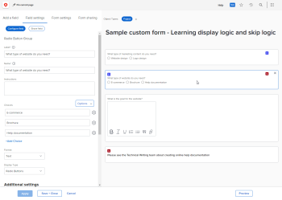

# Adicionar lógica de exibição e lógica de salto a um formulário personalizado

Você pode usar regras inteligentes para tornar um formulário personalizado dinâmico e mais relevante para os usuários que o preenchem. Quando um usuário responde de determinada maneira a um campo de múltipla escolha em um formulário, uma regra inteligente mostra a ele o que você deseja que veja a seguir, com base nessa resposta.

Os tipos de campo de múltipla escolha são Suspenso, Caixas de seleção e Botões de opção.

* **Lógica de exibição**: você configura uma regra de lógica de exibição no campo, widget ou seção que você deseja que o usuário veja somente depois de selecionar uma opção específica em um campo de múltipla escolha anterior.

  **Exemplo:** Você está criando um formulário de Solicitação de Conteúdo de Marketing no qual as pessoas da sua organização podem solicitar um novo logotipo, atualização de site, folheto ou outros tipos de conteúdo de marketing. Com base no tipo de conteúdo que o usuário deseja, você precisa solicitar diferentes tipos de detalhes, como cores e ideias de design se precisar de um logotipo ou uma lista de recursos do produto se precisar de um folheto.

  No campo que pergunta sobre cores e detalhes de um novo logotipo, é possível adicionar uma regra de lógica de exibição que exibe esse campo somente depois que o usuário seleciona o botão de opção Logotipo no primeiro campo.

  Da mesma forma, no campo que pergunta sobre recursos do produto, é possível adicionar uma regra de lógica de exibição que exiba esse campo somente depois que um usuário selecionar o botão de opção Folheto no primeiro campo.

  

  Você pode configurar regras de lógica de exibição em qualquer campo personalizado, widget ou quebra de seção que siga um campo de múltipla escolha.

* **Ignorar regra de lógica**: você configura esta regra para ocultar partes de um formulário de que o usuário não precisa. Quando o usuário seleciona um item específico em um campo de múltipla escolha anterior, a regra de lógica de salto o ignora até o final do formulário ou até um campo, widget ou seção personalizada que você deseja que ele veja.

  **Exemplo:** Alguém usa o formulário de Solicitação de Conteúdo de Marketing acima para solicitar um white paper, que é fornecido pelas Vendas, não pelo Marketing. Para esse usuário, uma regra lógica de salto pode ocultar a pergunta solicitando detalhes e pular para uma linha de texto que os encaminhe ao departamento de que precisam.

  

  Nesse caso, é possível adicionar um campo Texto descritivo que faça referência ao usuário ao departamento de vendas. No primeiro campo personalizado que pergunta qual tipo de conteúdo de marketing o usuário precisa, é possível adicionar uma regra de lógica de salto que exibe somente a linha do texto quando um usuário seleciona o botão de opção White Paper no primeiro campo.

  Isso seria especialmente útil se você adicionar muitos outros campos sobre logotipos, atualizações de sites e folhetos que este usuário não precisa ver.
É possível aplicar uma regra lógica de salto somente a um campo personalizado, não a um widget ou seção.

## Requisitos de acesso

Você deve ter o seguinte para executar as etapas deste artigo:

<table style="table-layout:auto"> 
 <col> 
 <col> 
 <tbody> 
  <tr data-mc-conditions=""> 
   <td role="rowheader"> 
plano do Adobe Workfront*
 </td> 
   <td>Qualquer</td> 
  </tr> 
  <tr> 
   <td role="rowheader">Licença da Adobe Workfront*</td> 
   <td> 
Plano 
 </td> 
  </tr> 
  <tr data-mc-conditions=""> 
   <td role="rowheader">Configurações de nível de acesso*</td> 
   <td> 
Acesso administrativo a formulários personalizados
 
Para obter informações sobre como os administradores do Workfront concedem esse acesso, consulte <a href="../../administration-and-setup/add-users/configure-and-grant-access/grant-users-admin-access-certain-areas.md" class="MCXref xref">Conceder aos usuários acesso administrativo a determinadas áreas</a>.
 </td> 
  </tr>  
 </tbody> 
</table>

&#42;Para saber quais configurações de plano, tipo de licença ou nível de acesso você tem, contate o administrador do Workfront.

## Criar um formulário personalizado de amostra com lógica de exibição e salto

A melhor maneira de aprender a adicionar lógica de exibição e salto a um formulário personalizado é por meio do exemplo prático explicado nas duas seções a seguir:

* [Lógica de exibição - exemplo prático](#display-logic-practical-example)
* [Lógica de salto - exemplo prático](#skip-logic-practical-example)

### Lógica de exibição - exemplo prático {#display-logic-practical-example}

Neste exemplo, você criará um formulário personalizado com um campo de botão de opção de múltipla escolha. Em seguida, você adicionará a lógica de exibição que conecta esse campo a um segundo campo.

1. Clique no ícone **do** Menu Principal no canto superior direito do Adobe Workfront e em **Configurar** .

1. No painel esquerdo, selecione **Forms Personalizado** .

1. Clique em **Novo formulário personalizado**, selecione **Projeto** na caixa exibida e selecione **Continuar**.

1. Na caixa de texto **Título do formulário**, digite **Exemplo de formulário personalizado - Lógica de exibição de aprendizado e lógica de salto** para nomear o formulário.

   

1. Para adicionar o primeiro campo ao formulário:

   1. Abra a guia **Adicionar um Campo**.

      

   1. Selecione o tipo de campo **Botões de opção** e digite *Qual tipo de conteúdo de marketing é necessário?* como o **Rótulo** do campo.

   1. Em **Opções**, substitua **Opção 1** e **Opção 2** pelo seguinte texto para criar duas opções que os usuários podem escolher no campo:

      *Atualização do site*

      *Design do logotipo*

1. Para adicionar o próximo campo personalizado e adicionar uma regra de lógica de exibição a ele:

   1. Abra a guia **Adicionar campo** novamente e adicione um novo campo **Botões de Opção** chamado *Que tipo de atualização de site você precisa?*

      Adicionaremos as opções para esse campo posteriormente.

   1. Na seção **Configurações adicionais**, selecione **Adicionar lógica**.

      

1. Na caixa exibida, com a guia **Lógica de Exibição** aberta, configure o segundo campo para que ele seja exibido apenas para os usuários que selecionaram *Design do site* no primeiro campo:

   1. Na primeira lista suspensa, selecione **Que tipo de conteúdo de marketing você precisa?**
   1. Na segunda lista suspensa, selecione **Design do site**.
   1. Deixando a terceira lista suspensa definida como **Selecionado**, selecione **Salvar**.

   Observe os pequenos quadrados coloridos com um D, indicando que o segundo campo está conectado com a lógica de exibição à seleção do usuário no primeiro campo:

   

1. Selecione **Visualizar** para verificar se a lógica funciona da maneira que você deseja no formulário e selecione **Finalizar Visualização**.

1. Clique em **Salvar + Fechar** para salvar o formulário e prosseguir para [Lógica de ramificação - exemplo prático](#skip-logic-practical-example) abaixo.

### Lógica de salto - exemplo prático {#skip-logic-practical-example}

A lógica de ignorar funciona de forma semelhante à lógica de exibição, mas age como o inverso: em vez de fazer com que campos de múltipla escolha personalizados específicos sejam exibidos com base em seleções de usuários anteriores, você determina quais devem ser ocultos (ignorados), pois não são relevantes para o usuário.

Para saber mais sobre isso, continue trabalhando no exemplo de formulário personalizado criado na seção [Lógica de exibição - exemplo prático](#display-logic-practical-example) deste artigo.

1. Clique no ícone **do** Menu Principal no canto superior direito do Adobe Workfront e em **Configurar** .

1. Clique em **Forms Personalizado**.
1. Clique no nome do formulário **Exemplo de formulário personalizado - Lógica de exibição de aprendizado e lógica de salto** que você criou nas etapas acima para abri-lo para edição.
1. Selecione o campo suspenso criado com o nome *De que tipo de site você precisa?*, adicione as seguintes opções para o campo e clique em **Aplicar**:

   *Comércio eletrônico*

   *Folheto*

   *Associação*

1. Abra a guia **Adicionar um campo**, crie um campo **Campo de Texto com Formatação** chamado *Qual é a meta do site?* e clique em **Aplicar**.

   Nesta organização, um site de documentação de ajuda é criado pela equipe técnica de redação, não pelo departamento de Marketing. Portanto, não são necessárias mais informações de um usuário que seleciona a documentação de Ajuda no segundo campo. Criaremos uma linha de texto (um campo de texto descritivo) dizendo para eles verem a equipe de Redação técnica em vez disso. E usaremos uma regra de lógica de salto que ignora esse usuário para essa linha de texto.

1. Para criar a linha de texto:

   1. Abra a guia **Adicionar um campo** e crie um **campo de Texto Descritivo**.

   1. Para o **Rótulo**, digite *Consulte a equipe técnica de gravação*.

   1. Para o **Texto descritivo**, digite *Consulte a equipe de Redação técnica sobre como criar a documentação de ajuda online*.

   1. Selecione **Aplicar**.

1. Para criar a regra de lógica de salto:

   1. Selecione o segundo campo suspenso, *Que tipo de site você precisa?*
   1. Na seção **Configuração adicional** s, selecione **Editar Lógica**.
   1. Na caixa que é exibida, abra a guia **Lógica de salto**.
   1. Defina o primeiro menu suspenso como **Documentação de ajuda**, deixe o segundo menu suspenso definido como **Selecionado** e defina o terceiro menu suspenso como **Consulte a equipe de Redação Técnica**.
   1. Selecione **Salvar**.

   Observe a pequena lógica de salto quadrada com um S, indicando que o usuário ignorará algo após selecionar uma determinada escolha no segundo campo.

   

1. Clique em **Visualizar**  para garantir que a lógica se aplique da maneira desejada.
1. Clique em **Salvar +Fechar**.

Ao criar um formulário como esse, você pode adicionar mais campos de texto para solicitar informações de usuários que selecionam Comércio eletrônico ou Folheto no segundo campo. Esses campos podem perguntar quem é o público-alvo do site, qual é o objetivo da criação, qual é o orçamento e assim por diante.

E, com as regras de lógica, você poderia criar caminhos de perguntas de ramificação.

Por exemplo, para usuários que selecionam Comércio eletrônico, você pode criar campos fazendo perguntas sobre fotos de produtos, descrições, preços e opções de pagamento. Para usuários que selecionam Folheto, você pode criar campos perguntando sobre o conteúdo.

Um usuário que selecionou Documentação de ajuda nunca veria nenhum desses campos adicionais que são irrelevantes para ele.

>[!TIP]
>
>Você pode adicionar a lógica de exibição e a lógica de salto a um campo personalizado se todos os itens a seguir forem verdadeiros sobre o campo:
>
>* É um campo de múltipla escolha (botões de opção, lista suspensa ou caixas de seleção)
>* É precedido por um campo de múltipla escolha
>* Ele é seguido por outro campo personalizado
>

<!--
<h2 data-mc-conditions="QuicksilverOrClassic.Draft mode">Multi-field display logic statements</h2>
-->

