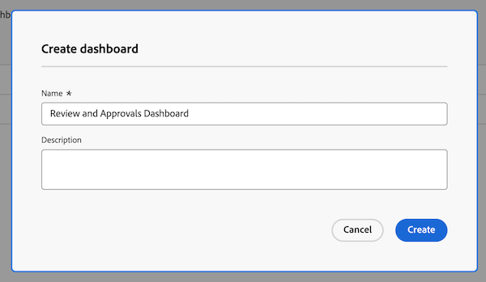

# Criar um painel de relatório para revisão e aprovações

Você pode criar um painel de relatório na área Painéis da tela para exibir informações de alto nível e detalhadas sobre revisões e aprovações com a nova funcionalidade de aprovações de documentos.

>[!IMPORTANT]
>
>Essa funcionalidade está disponível somente para clientes que usam o novo serviço de aprovações de documentos e estão inscritos na versão beta dos Painéis de controle do Canvas.

## Criar um painel

{{step1-to-dashboards}}

1. No painel esquerdo, clique em **Painéis do Canvas**.
1. Clique em **Novo Painel**.
1. Dê um nome ao painel.
1. (Opcional) Adicione uma descrição.
1. Clique em **Criar**.
   

Depois de criar um painel, você pode começar a adicionar KPIs, Gráficos e Tabelas. Consulte as seguintes seções para obter mais informações:

* [Adicionar informações de revisão e aprovação de alto nível com KPIs e Gráficos](#add-high-level-review-and-approval-information-with-kpis-and-charts)
* [Adicionar informações detalhadas de revisão e aprovação com Tabelas](#add-detailed-review-and-approval-information-with-tables)

## Adicionar informações de revisão e aprovação de alto nível com KPIs e Gráficos

Você pode exibir informações de alto nível sobre aprovações de documentos com KPIs e gráficos. Informações detalhadas não estão disponíveis atualmente na versão beta.

### KPIs

<!--
>>[!IMPORTANT]
>
>New document approvals data currently refreshes during the evenings in the US Mountain timezone. Real-time updates are planned and coming soon.-->

#### Aprovações pendentes

1. [Crie um painel](#create-a-dashboard) conforme descrito na seção acima.
1. No cartão **KPI**, clique em **Adicionar**.
1. Digite _Pendente_ na caixa de texto **Título de KPI**.
1. Digite _Aprovações pendentes_ na caixa de texto **Legenda de KPI**. Esse texto descreve o que o KPI está mostrando.
1. Na parte superior da página, clique em **Selecionar Campo de KPI**.
1. Role para baixo e localize a **pasta de Aprovação de Documentos**.
1. Escolha **Status** e selecione **Count** no menu suspenso.
1. Clique em **Editar Filtro** > **Adicionar condição**.
   1. Clique no filtro de condição vazio, clique em **Escolher um Campo** e escolha **Status**.
   1. Deixe o operador como **Igual** e digite _revisão pendente_ na caixa de texto.
      
1. Clique em **Concluído** no canto superior direito da tela.

#### Aprovações atrasadas

1. [Crie um painel](#create-a-dashboard) conforme descrito na seção acima.
1. No cartão **KPI**, clique em **Adicionar**.
1. Digite _Vencido_ na caixa de texto **Título de KPI**.
1. Digite _Prazo final do estágio de aprovação no passado_ na caixa de texto **Legenda de KPI**. Esse texto descreve o que o KPI está mostrando.
1. Na parte superior da página, clique em **Selecionar Campo de KPI**.
1. Role para baixo e localize a **pasta de Aprovação de Documentos**.
1. Escolha **Status** e selecione **Count** no menu suspenso.
1. Clique em **Editar Filtro** > **Adicionar condição**:
   1. Clique no filtro de condição vazio, clique em **Escolher um Campo** e escolha **Prazo**.
   1. Altere o operador para **Less Than**, alterne Data relativa para Em e digite _$$TODAY_ na caixa de texto.
      
1. Clique em **Adicionar condição**:
   1. Clique no filtro de condição vazio, clique em **Escolher um Campo** e escolha **Status**.
   1. Altere o operador para **Não Contém** e digite _aprovado_ na caixa de texto.
       vencido
1. Clique em **Concluído** no canto superior direito da tela.

#### Aprovações concluídas

1. [Crie um painel](#create-a-dashboard) conforme descrito na seção acima.
1. No cartão **KPI**, clique em **Adicionar**.
1. Digite _Concluído_ na caixa de texto **Título de KPI**.
1. Digite _Contagem de Status de Aprovação_ na caixa de texto **Legenda de KPI**. Esse texto descreve o que o KPI está mostrando.
1. Na parte superior da página, clique em **Selecionar Campo de KPI**.
1. Role para baixo e localize a **pasta de Aprovação de Documentos**.
1. Escolha **Status** e selecione **Count** no menu suspenso.
1. Clique em **Editar Filtro** > **Adicionar condição**:
   1. Clique no filtro de condição vazio, clique em **Escolher um Campo** e escolha **Status**.
   1. Altere o operador para **Contém** e digite _aprovado_ na caixa de texto.
      
1. Clique em **Adicionar condição**:
   1. Clique em **And** para alterá-lo para **Or**.
   1. Clique no filtro de condição vazio, clique em **Escolher um Campo** e escolha **Status**.
   1. Altere o operador para **Igual** e digite _revisado_ na caixa de texto.
      
1. Clique em **Concluído** no canto superior direito da tela.

#### Aprovações abandonadas

1. [Crie um painel](#create-a-dashboard) conforme descrito na seção acima.
1. No cartão **KPI**, clique em **Adicionar**.
1. Tipo _Abandonado_ na caixa de texto **Título de KPI**.
1. Digite _Prazo de aprovação em 2 semanas após_ na caixa de texto **Legenda de KPI**. Esse texto descreve o que o KPI está mostrando.
1. Na parte superior da página, clique em **Selecionar Campo de KPI**.
1. Role para baixo e localize a **pasta Estágio de Aprovação de Documentos**.
1. Escolha **Prazo** e selecione **Contagem** no menu suspenso.
1. Clique em **Editar Filtro** > **Adicionar condição**:
   1. Clique no filtro de condição vazio, clique em **Escolher um Campo** e escolha **Status**.
   1. Altere o operador para **Não Contém** e digite _aprovado_ na caixa de texto.
      
1. Clique em **Adicionar condição**:
   1. Clique no filtro de condição vazio, clique em **Escolher um Campo** e escolha **Prazo**.
   1. Altere o operador para **Less Than**, em seguida, alterne Data relativa para Em e digite _$$TODAY-2w_ na caixa de texto.
      
1. Clique em **Concluído** no canto superior direito da tela.

### Gráficos

#### Gráfico de barras de decisão para aprovações

1. [Crie um painel](#create-a-dashboard) conforme descrito na seção acima.
1. No cartão **Gráfico**, clique em **Adicionar**.
1. Digite _Aprovações por decisão_ na caixa de texto **Nome**.
1. (Opcional) Digite uma descrição na caixa de texto **Descrição**. Esse texto é exibido como uma dica de ferramenta ao lado do nome do gráfico.
1. Clique em **Abrir detalhes do gráfico**.
1. No menu suspenso **Tipo de gráfico**, deixe o **Gráfico de barras** selecionado.
1. No menu suspenso **Tipo de barra**, deixe **Simples** selecionado.
1. Clique em **Atualizar campo** para o **eixo inferior (X)** e escolha a primeira pasta **Aprovação de documento** e depois **Status**.
1. Defina o tipo de Agregação como **Count**.
1. Clique em **Atualizar campo** para o **eixo esquerdo (Y)**, escolha a primeira opção **Aprovação de documento** e depois **Status**.
1. Clique na guia Filtro .
1. Clique em **Editar Filtro** > **Adicionar condição**:
   1. Clique no filtro de condição vazio, clique em **Escolher um Campo** e escolha **Versão do Documento**.
   1. Altere o operador para **Is Not Null**.
      
1. Clique em **Concluído** no canto superior direito da tela.

#### Gráfico de barras de revisões

1. [Crie um painel](#create-a-dashboard) conforme descrito na seção acima.
1. No cartão **Gráfico**, clique em **Adicionar**.
1. Digite _Revisões_ na caixa de texto **Nome**.
1. Digite _Número de revisões de documentos com decisões incompletas planejadas antes do fim deste mês_ na caixa de texto **Descrição**. Esse texto é exibido como uma dica de ferramenta ao lado do nome do gráfico.
1. Clique em **Abrir detalhes do gráfico**.
1. No menu suspenso **Tipo de gráfico**, deixe o **Gráfico de barras** selecionado.
1. No menu suspenso **Tipo de barra**, deixe **Simples** selecionado.
1. Clique em **Atualizar campo** para o **eixo inferior (X)** e escolha a primeira pasta **Aprovação de Documento** e depois **Versão do Documento** > **Versão**.
1. Defina o tipo de Agregação como **Count**.
1. Clique em **Atualizar campo** para o **eixo esquerdo (Y)**, escolha a primeira opção **Aprovação de Documento** e depois **Versão do Documento** > **Documento** > **Nome**.
1. Clique na guia Filtro .
1. Clique em **Editar Filtro** > **Adicionar condição**:
   1. Clique no filtro de condição vazio, clique em **Escolher um campo** e escolha **Data de decisão dos participantes do estágio de aprovação**.
   1. Altere o operador para **Is Null**.
      
1. Clique em **Editar Filtro** > **Adicionar condição**:
   1. Clique no filtro de condição vazio, clique em **Escolher um campo** e escolha **Prazo do estágio de aprovação**.
   1. Altere o operador para **Less Than or Equal**, em seguida, alterne Set relative date On e digite _$$TODAYem_ na caixa de texto.
      
1. Clique em **Concluído** no canto superior direito da tela.

## Adicionar informações detalhadas de revisão e aprovação com Tabelas

### Lista de aprovações pendentes

1. [Crie um painel](#create-a-dashboard) conforme descrito na seção acima.
1. No cartão **Tabela**, clique em **Adicionar**.
1. Digite _Aprovações Pendentes_ na caixa de texto **Nome**.
1. (Opcional) Digite uma descrição na caixa de texto **Descrição**. Esse texto é exibido como uma dica de ferramenta ao lado do nome do gráfico.
1. Clique em **Abrir configurações de coluna**.
1. Clique em **Adicionar coluna**, role para baixo e clique na primeira pasta **Aprovações de Documentos** e escolha **Status**.
1. Adicione as seguintes colunas:

   <table>
    <tr>
    <td><strong>Nome do projeto</strong></td>
    <td>Versão do documento &gt; Documento &gt; Projeto &gt; Nome</td>
    </tr>
    <tr>
    <td><strong>Nome do documento</strong></td>
    <td>Versão do documento &gt; Documento &gt; digite _Name_ na caixa de pesquisa.</td>
    </tr>
    <tr>
    <td><strong>Versão do documento</strong></td>
    <td>Versão do documento &gt; Documento &gt; Versão</td>
    </tr>
    <tr>
    <td><strong>Prazo</strong></td>
    <td>Documento &gt; Estágio de aprovação &gt; Prazo</td>
    </tr>
    <tr>
    <td><strong>Requisitado por</strong></td>
    <td>Documento &gt; Estágio de aprovação &gt; Participantes do estágio de aprovação* &gt; Solicitante &gt; digite _Name_ na caixa de pesquisa.</td>
    </tr>
     <tr>
    <td><strong>Data de solicitação</strong></td>
    <td>Documento &gt; Estágio de aprovação &gt; Participantes do estágio de aprovação* &gt; Criado em</td>
    </tr>
     <tr>
    <td><strong>Aprovador</strong></td>
    <td>Documento &gt; Estágio de aprovação &gt; Participantes do estágio de aprovação* &gt; Usuário participante &gt; digite _Name_ na caixa de pesquisa.</td>
    </tr>
    <table>

   *Os participantes do estágio de aprovação são truncados para o estágio de aprovação Pa..

1. Continue em [Adicionar o filtro necessário abaixo](#add-the-required-filter).

#### Adicionar o filtro de aprovações pendentes necessário

1. Clique na guia Filtro .
1. Clique em **Editar Filtro** > **Adicionar condição**:
   1. Clique no filtro de condição vazio, clique em **Escolher um Campo** e escolha **Status**.
   1. Altere o operador para **Igual** e digite _aprovação pendente_.
      
1. Adicione filtros opcionais conforme descrito abaixo ou clique em **Concluído** no canto superior direito da tela.

**Filtros opcionais**

Para exibir informações mais específicas dependendo do caso de uso, é possível adicionar outras condições de filtro. Talvez você queira recriar a tabela e adicionar novas condições de filtro por caso de uso.

+++ Expandir para exibir opções de filtro adicionais

**Meus Projetos**

1. Clique em **Editar Filtro** > **Adicionar condição**:
   1. Clique no filtro de condição vazio, clique em **Escolher um Campo** e escolha **Versão do documento** > **Documento** > **Projeto** > **Proprietário** > digite _Nome_ na caixa de pesquisa.
   1. Altere o operador para **Igual** e escolha **Eu (Usuário conectado)** para exibir projetos na Workfront nos quais você está marcado como proprietário do projeto.
      
1. Clique em **Concluído** no canto superior direito da tela.

**Aprovações que enviei**

1. Clique em **Editar Filtro** > **Adicionar condição**:
   1. Clique no filtro de condição vazio, clique em **Escolher um Campo** e escolha **Estágio de Aprovação** > **Participantes do Estágio de Aprovação** > **Solicitante** > digite _Nome_ na caixa de pesquisa.
   1. Altere o operador para **Igual** e escolha **Eu (Usuário conectado)** para exibir projetos na Workfront nos quais você está marcado como proprietário do projeto.
      
1. Clique em **Concluído** no canto superior direito da tela.

+++

### Lista de aprovações vencidas

1. [Crie um painel](#create-a-dashboard) conforme descrito na seção acima.
1. No cartão Tabela, clique em **Adicionar**.
1. Digite _Aprovações atrasadas_ na caixa de texto **Nome**.
1. (Opcional) Digite uma descrição na caixa de texto **Descrição**. Esse texto é exibido como uma dica de ferramenta ao lado do nome do gráfico.
1. Clique em **Abrir configurações de coluna**.
1. Clique em **Adicionar coluna**, role para baixo e clique na primeira pasta **Aprovações de Documentos** e escolha **Status**.
1. Adicione as seguintes colunas:

   <table>
    <tr>
    <td><strong>Nome do projeto</strong></td>
    <td>Versão do documento &gt; Documento &gt; Projeto &gt; Nome</td>
    </tr>
    <tr>
    <td><strong>Nome do documento</strong></td>
    <td>Versão do documento &gt; Documento &gt; digite _Name_ na caixa de pesquisa.</td>
    </tr>
    <tr>
    <td><strong>Versão do documento</strong></td>
    <td>Versão do documento &gt; Documento &gt; Versão</td>
    </tr>
    <tr>
    <td><strong>Prazo</strong></td>
    <td>Documento &gt; Estágio de aprovação &gt; Prazo</td>
    </tr>
    <tr>
    <td><strong>Requisitado por</strong></td>
    <td>Documento &gt; Estágio de aprovação &gt; Participantes do estágio de aprovação* &gt; Solicitante &gt; digite _Name_ na caixa de pesquisa.</td>
    </tr>
     <tr>
    <td><strong>Data de solicitação</strong></td>
    <td>Documento &gt; Estágio de aprovação &gt; Participantes do estágio de aprovação* &gt; Criado em</td>
    </tr>
     <tr>
    <td><strong>Aprovador</strong></td>
    <td>Documento &gt; Estágio de aprovação &gt; Participantes do estágio de aprovação* &gt; Usuário participante &gt; digite _Name_ na caixa de pesquisa.</td>
    </tr>
    <table>

   *Os participantes do estágio de aprovação são truncados para o estágio de aprovação Pa..

1. Continue em [Adicionar o filtro necessário abaixo](#add-the-required-filter-1).

#### Adicionar o filtro de aprovações vencidas necessário

1. Clique na guia Filtro .
1. Clique em **Editar Filtro** > **Adicionar condição**:
   1. Clique no filtro de condição vazio, clique em **Escolher um Campo** e escolha **Estágio de Aprovação** > **Prazo final**.
   1. Altere o operador para **Less than**, alterne **Set relative date** On e digite _$$TODAY_.
      
1. Adicione filtros opcionais conforme descrito abaixo ou clique em **Concluído** no canto superior direito da tela.

**Filtros opcionais**

Para exibir informações mais específicas dependendo do caso de uso, é possível adicionar outras condições de filtro. Talvez você queira recriar a tabela e adicionar novas condições de filtro opcionais para cada caso de uso.

+++ Expandir para exibir opções de filtro adicionais

**Meus Projetos**

1. Clique em **Editar Filtro** > **Adicionar condição**:
   1. Clique no filtro de condição vazio, clique em **Escolher um Campo** e escolha **Versão do documento** > **Documento** > **Projeto** > **Proprietário** > digite _Nome_ na caixa de pesquisa.
   1. Altere o operador para **Igual** e escolha **Eu (Usuário conectado)** para exibir projetos na Workfront nos quais você está marcado como proprietário do projeto.
      
1. Clique em **Concluído** no canto superior direito da tela.

**Aprovações que enviei**

1. Clique em **Editar Filtro** > **Adicionar condição**:
   1. Clique no filtro de condição vazio, clique em **Escolher um Campo** e escolha **Estágio de Aprovação** > **Participantes do Estágio de Aprovação** > **Solicitante** > digite _Nome_ na caixa de pesquisa.
   1. Altere o operador para **Igual** e escolha **Eu (Usuário conectado)** para exibir projetos na Workfront nos quais você está marcado como proprietário do projeto.
      
1. Clique em **Concluído** no canto superior direito da tela.

**Minha equipe**

1. Clique em **Editar Filtro** > **Adicionar condição**:
   1. Clique no filtro de condição vazio, clique em **Escolher um Campo** e escolha **Estágio de Aprovação** > **Participantes do Estágio de Aprovação** > **Equipe do Participante** > digite _Nome_ na caixa de pesquisa.
   1. Altere o operador para **Igual** e escolha **Minhas equipes padrão (Usuário conectado)** ou **Minhas outras equipes (Usuário conectado)** para exibir os projetos atribuídos à sua equipe padrão ou a outras equipes nas quais você está.
      
1. Clique em **Concluído** no canto superior direito da tela.
+++
