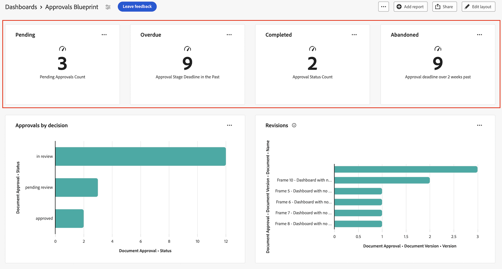

# Criar um painel de relatório para revisão e aprovações

Você pode criar um painel de relatório na área Painéis da tela para exibir informações de alto nível e detalhadas sobre revisões e aprovações com a funcionalidade Aprovações unificadas.

>[!IMPORTANT]
>
>Essa funcionalidade está disponível somente para clientes que usam o serviço Aprovações unificadas e estão inscritos na versão beta dos Painéis de controle do Canvas. Para obter mais informações, consulte [informações beta de Painéis do Canvas](/help/quicksilver/product-announcements/betas/canvas-dashboards-beta/canvas-dashboards-beta-information.md).

## Criar um painel

{{step1-to-dashboards}}

1. No painel esquerdo, clique em **Painéis do Canvas**.
1. Clique em **Novo Painel**.
1. Dê um nome ao painel.
1. (Opcional) Adicione uma descrição.
1. Clique em **Criar**.
   

Depois de criar um painel, você pode começar a adicionar KPIs, Gráficos e Tabelas. Consulte as seguintes seções para obter mais informações:

* [Adicionar informações de revisão e aprovação de alto nível com KPIs e Gráficos](#add-high-level-review-and-approval-information-with-kpis-and-charts)
* [Adicionar informações detalhadas de revisão e aprovação com Tabelas](#add-detailed-review-and-approval-information-with-tables)

## Adicionar informações de revisão e aprovação de alto nível com KPIs e Gráficos

Você pode exibir informações de alto nível sobre aprovações de documentos com KPIs e gráficos.

Para obter mais informações, consulte [Criar um relatório de KPI](/help/quicksilver/reports-and-dashboards/canvas-dashboards/add-reports/build-kpi-report.md) e [Criar um relatório de gráfico](/help/quicksilver/reports-and-dashboards/canvas-dashboards/add-reports/build-chart-report.md).

### KPIs

#### Aprovações pendentes

1. [Crie um painel](#create-a-dashboard) conforme descrito na seção acima.
1. No canto superior direito da página de detalhes do painel, clique em **Adicionar relatório**.

1. Na caixa **Adicionar relatório**, selecione **Criar relatório**.

1. No lado esquerdo, selecione **KPI**.

1. No canto superior direito, clique em **Criar relatório**.

1. Siga as etapas abaixo para configurar a seção **Detalhes**:

   1. Digite *Pendente* no campo **Nome**.
   1. Digite *Aprovações pendentes* no campo **Descrição**. É exibido como uma legenda abaixo do valor do KPI.

1. Siga as etapas abaixo para configurar a seção **Criar KPI**:

   1. No painel esquerdo, clique no **ícone Criar KPI** .

   1. Clique em **Selecionar campo**.

   1. Localize e selecione a pasta **Aprovação de documentos**.

   1. Selecione **Status**.

   1. No menu suspenso **Tipo de agregação**, selecione **Contagem**.

1. Siga as etapas abaixo para configurar a seção **Filtro**:

   1. No painel esquerdo, clique no ícone **Filtro** .

   1. Selecione **Editar filtro**.

   1. Clique em **Adicionar condição**.

   1. Clique no filtro de condição vazio, clique em **Escolher um Campo** e escolha **Status**.
   1. Deixe o operador como **Igual** e digite _revisão pendente_ na caixa de texto.
      
1. Clique em **Salvar** no canto superior direito da tela.

#### Aprovações atrasadas

1. [Crie um painel](#create-a-dashboard) conforme descrito na seção acima.
1. No canto superior direito da página de detalhes do painel, clique em **Adicionar relatório**.

1. Na caixa **Adicionar relatório**, selecione **Criar relatório**.

1. No lado esquerdo, selecione **KPI**.

1. No canto superior direito, clique em **Criar relatório**.

1. Siga as etapas abaixo para configurar a seção **Detalhes**:

   1. Digite _Vencido_ no campo **Nome**.
   1. Digite _Prazo final do estágio de aprovação no passado_ no campo **Descrição**. Essa descrição é exibida como uma legenda abaixo do valor do KPI.

1. Siga as etapas abaixo para configurar a seção **Criar KPI**:

   1. No painel esquerdo, clique no **ícone Criar KPI** .

   1. Clique em **Selecionar campo**.

   1. Localize e selecione a pasta **Aprovação de documentos**.

   1. Selecione **Status**.

   1. No menu suspenso **Tipo de agregação**, selecione **Contagem**.

1. Siga as etapas abaixo para configurar a seção **Filtro**:

   1. No painel esquerdo, clique no ícone **Filtro** .

   1. Selecione **Editar filtro**.

   1. Clique em **Adicionar condição**.

   1. Clique no filtro de condição vazio e em **Escolher um Campo**.

   1. Selecione **Estágio de Aprovação** > **Prazo**.
   1. Altere o operador para **Less Than**.
   1. Alterne **Definir data relativa** para **ON** e digite _$$TODAY_ na caixa de texto.
      
   1. Clique em **Adicionar condição**.
   1. Clique no filtro de condição vazio e em **Escolher um Campo**.
   1. Selecione **Status**.
   1. Altere o operador para **Não Contém** e digite _aprovado_ na caixa de texto.
       vencido
1. Clique em **Salvar** no canto superior direito da tela.

#### Aprovações concluídas

1. [Crie um painel](#create-a-dashboard) conforme descrito na seção acima.
1. No canto superior direito da página de detalhes do painel, clique em **Adicionar relatório**.

1. Na caixa **Adicionar relatório**, selecione **Criar relatório**.

1. No lado esquerdo, selecione **KPI**.

1. No canto superior direito, clique em **Criar relatório**.

1. Siga as etapas abaixo para configurar a seção **Detalhes**:

   1. Tipo _Concluído_ no campo **Nome**.
   1. Digite _Contagem de Status de Aprovação_ no campo **Descrição**. Essa descrição é exibida como uma legenda abaixo do valor do KPI.

1. Siga as etapas abaixo para configurar a seção **Criar KPI**:

   1. No painel esquerdo, clique no **ícone Criar KPI** .

   1. Clique em **Selecionar campo**.

   1. Localize e selecione a pasta **Aprovação de documentos**.

   1. Selecione **Status**.

   1. No menu suspenso **Tipo de agregação**, selecione **Contagem**.

1. Siga as etapas abaixo para configurar a seção **Filtro**:

   1. No painel esquerdo, clique no ícone **Filtro** .

   1. Selecione **Editar filtro**.

   1. Clique em **Adicionar condição**.

   1. Clique no filtro de condição vazio e em **Escolher um Campo**.

   1. Selecione **Status**.

   1. Altere o operador para **Contém** e digite _aprovado_ na caixa de texto.
      
   1. Clique em **Adicionar condição**.
   1. Clique em **And** para alterá-lo para **Or**.
   1. Clique no filtro de condição vazio e em **Escolher um Campo**.
   1. Selecione **Status**.
   1. Altere o operador para **Igual** e digite _revisado_ na caixa de texto.
      
1. Clique em **Salvar** no canto superior direito da tela.

#### Aprovações abandonadas

1. [Crie um painel](#create-a-dashboard) conforme descrito na seção acima.
1. No canto superior direito da página de detalhes do painel, clique em **Adicionar relatório**.

1. Na caixa **Adicionar relatório**, selecione **Criar relatório**.

1. No lado esquerdo, selecione **KPI**.

1. No canto superior direito, clique em **Criar relatório**.

1. Siga as etapas abaixo para configurar a seção **Detalhes**:

   1. Tipo _Abandonado_ no campo **Nome**.
   1. Digite _Prazo de aprovação mais de 2 semanas depois de_ no campo **Descrição**. Essa descrição é exibida como uma legenda abaixo do valor do KPI.

1. Siga as etapas abaixo para configurar a seção **Criar KPI**:

   1. No painel esquerdo, clique no **ícone Criar KPI** .

   1. Clique em **Selecionar campo**.

   1. Localize e selecione a pasta **Estágio de aprovação de documento**.

   1. Selecione **Prazo**.

   1. No menu suspenso **Tipo de agregação**, selecione **Contagem**.

1. Siga as etapas abaixo para configurar a seção **Filtro**:

   1. No painel esquerdo, clique no ícone **Filtro** .

   1. Selecione **Editar filtro**.

   1. Clique em **Adicionar condição**.

   1. Clique no filtro de condição vazio, clique em **Escolher um Campo**.

   1. Selecione **Status**.

   1. Altere o operador para **Não Contém** e digite _aprovado_ na caixa de texto.
      
   1. Clique em **Adicionar condição**.
   1. Clique no filtro de condição vazio e em **Escolher um Campo**.
   1. Selecione **Prazo**.
   1. Altere o operador para **Less Than** e alterne **Definir data relativa** para **ON**.
   1. Digite _$$TODAY-2w_ na caixa de texto.
      
1. Clique em **Salvar** no canto superior direito da tela.

### Gráficos

#### Gráfico de barras de decisão para aprovações

1. [Crie um painel](#create-a-dashboard) conforme descrito na seção acima.
1. No canto superior direito da página de detalhes do painel, clique em **Adicionar relatório**.

1. Na caixa **Adicionar relatório**, selecione **Criar relatório**.

1. No lado esquerdo, selecione **Gráfico**.

1. No canto superior direito, clique em **Criar relatório**.

1. Siga as etapas abaixo para configurar a seção **Detalhes**:

   1. Digite _Aprovações por decisão_ no campo **Nome**.
   1. (Opcional) Digite uma descrição no campo **Descrição**. Esse texto é exibido como uma dica de ferramenta ao lado do nome do gráfico.
1. Siga as etapas abaixo para configurar a seção **Criar gráfico**:

   1. No painel esquerdo, clique no ícone **Criar gráfico** .

   1. No menu suspenso **Tipo de gráfico**, deixe **Barra** selecionada.
   1. No menu suspenso **Tipo de barra**, deixe **Simples** selecionado.
   1. Clique em **Atualizar campo** para o **Eixo inferior (X)** e selecione **Aprovação de documento** > **Status**.
   1. Defina o **Tipo de agregação** como **Contagem**.
   1. Clique em **Atualizar campo** para o **eixo esquerdo (Y)** e selecione **Status**.
1. Siga as etapas abaixo para configurar a seção **Filtro**:
   1. No painel esquerdo, clique no ícone da **guia Filtro** .
   1. Clique em **Editar Filtro** e depois em **Adicionar condição**.
   1. Clique no filtro de condição vazio e em **Escolher um Campo**.
   1. Selecione **Versão do Documento** > **Versão**.
   1. Altere o operador para **Is Not Null**.
      
1. Clique em **Salvar** no canto superior direito da tela.

#### Gráfico de barras de revisões

1. [Crie um painel](#create-a-dashboard) conforme descrito na seção acima.
1. No canto superior direito da página de detalhes do painel, clique em **Adicionar relatório**.

1. Na caixa **Adicionar relatório**, selecione **Criar relatório**.

1. No lado esquerdo, selecione **Gráfico**.

1. No canto superior direito, clique em **Criar relatório**.

1. Siga as etapas abaixo para configurar a seção **Detalhes**:

   1. Digite _Revisões_ no campo **Nome**.
   1. Tipo _Número de revisões de documentos com decisões incompletas planejadas antes do final deste mês_ no campo **Descrição**. Esse texto é exibido como uma dica de ferramenta ao lado do nome do gráfico.

1. Siga as etapas abaixo para configurar a seção **Criar gráfico**:

   1. No painel esquerdo, clique no ícone **Criar gráfico** .

   1. No menu suspenso **Tipo de gráfico**, deixe **Barra** selecionada.
   1. No menu suspenso **Tipo de barra**, deixe **Simples** selecionado.
   1. Clique em **Atualizar campo** para o **eixo inferior (X)** e selecione **Aprovação de documento** > **Versão do documento** > **Versão**.
   1. Defina o **Tipo de agregação** como **Contagem**.
   1. Clique em **Atualizar campo** para o **eixo esquerdo (Y)** e selecione **Aprovação de Documento** > **Versão do Documento** > **Documento** > **Nome**.

1. Siga as etapas abaixo para configurar a seção **Filtro**:
   1. No painel esquerdo, clique no ícone da **guia Filtro** .
   1. Clique em **Editar Filtro** e depois em **Adicionar condição**.
   1. Clique no filtro de condição vazio e em **Escolher um Campo**.

   1. Selecione **Estágio de aprovação** > **Participantes do estágio de aprovação** > **Data da decisão**.

   1. Altere o operador para **Is Null**.
      
   1. Clique em **Adicionar condição**.
   1. Clique no filtro de condição vazio e em **Escolher um Campo**.
   1. Selecione **Estágio de aprovação** > **Prazo final**.
   1. Altere o operador para **Menor que ou Igual** e alterne **Definir data relativa** para **ON**.
   1. Digite _$$TODAYem_ na caixa de texto.
      
1. Clique em **Salvar** no canto superior direito da tela.

## Adicionar informações detalhadas de revisão e aprovação com Tabelas

Para obter mais informações sobre a criação de um relatório de tabela, consulte [Criar um relatório de tabela](/help/quicksilver/reports-and-dashboards/canvas-dashboards/add-reports/build-table-report.md).

### Lista de aprovações pendentes

1. [Crie um painel](#create-a-dashboard) conforme descrito na seção acima.
1. No canto superior direito da página de detalhes do painel, clique em **Adicionar relatório**.

1. Na caixa **Adicionar relatório**, selecione **Criar relatório**.

1. No lado esquerdo, selecione **Tabela**.

1. No canto superior direito, clique em **Criar relatório**.

1. Siga as etapas abaixo para configurar a seção **Detalhes**:

   1. Digite _Aprovações pendentes_ no campo **Nome**.
   1. Digite uma descrição no campo **Descrição**. Esse texto é exibido como uma dica de ferramenta ao lado do nome do gráfico.

1. Siga as etapas abaixo para configurar a seção **Tabela de compilação**:

   1. No painel esquerdo, clique no ícone **Colunas da tabela** .
   1. Clique em **Adicionar coluna**.
   1. Role para baixo e selecione **Aprovações de documentos** > **Status**.
   1. Adicione as seguintes colunas:

   <table>
    <tr>
    <td><strong>Nome do projeto</strong></td>
    <td>Versão do documento &gt; Documento &gt; Projeto &gt; Nome</td>
    </tr>
    <tr>
    <td><strong>Nome do documento</strong></td>
    <td>Versão do documento &gt; Documento &gt; digite <em>Nome</em> na caixa de pesquisa.</td>
    </tr>
    <tr>
    <td><strong>Versão do documento</strong></td>
    <td>Versão do documento &gt; Documento &gt; Versão</td>
    </tr>
    <tr>
    <td><strong>Prazo</strong></td>
    <td>Aprovação de documento &gt; Estágio de aprovação &gt; Prazo</td>
    </tr>
    <tr>
    <td><strong>Requisitado por</strong></td>
    <td>Aprovação de documento &gt; Estágio de aprovação &gt; Participantes do estágio de aprovação* &gt; Solicitante &gt; digite <em>Name</em> na caixa de pesquisa.</td>
    </tr>
    <tr>
    <td><strong>Data de solicitação</strong></td>
    <td>Aprovação de documento &gt; Estágio de aprovação &gt; Participantes do estágio de aprovação* &gt; Criado em</td>
    </tr>
    <tr>
    <td><strong>Aprovador</strong></td>
    <td>Aprovação de documento &gt; Estágio de aprovação &gt; Participantes do estágio de aprovação* &gt; Usuário participante &gt; tipo <em>Nome</em> na caixa de pesquisa.</td>
    </tr>
    </table>

   *Os Participantes do Estágio de Aprovação estão truncados para _Pasta do Estágio de Aprovação.._

1. Siga as etapas abaixo para configurar a seção **Filtro**:
   1. No painel esquerdo, clique no ícone da **guia Filtro** .
   1. Clique em **Editar Filtro** e depois em **Adicionar condição**.
   1. Clique no filtro de condição vazio e em **Escolher um Campo**.
   1. Selecione **Status**.
   1. Altere o operador para **Igual** e digite _aprovação pendente_ na caixa de texto.
      
   1. (Opcional) Adicione mais filtros conforme descrito na seção **Filtros opcionais** abaixo.
1. Clique em **Salvar** no canto superior direito da tela.

**Filtros opcionais**

Para exibir informações mais específicas dependendo do caso de uso, é possível adicionar outras condições de filtro. Talvez você queira recriar a tabela e adicionar novas condições de filtro por caso de uso.

+++ Expandir para exibir opções de filtro adicionais

**Meus Projetos**

1. Clique em **Editar Filtro** > **Adicionar condição**:
   1. Clique no filtro de condição vazio e em **Escolher um Campo**.
   1. Selecione **Versão do documento** > **Documento** > **Projeto** > **Proprietário** > digite _Nome_ na caixa de pesquisa.
   1. Altere o operador para **Igual** e escolha **Eu (usuário conectado)** para exibir projetos na Workfront onde você está marcado como o proprietário do projeto.
      
1. Clique em **Salvar** no canto superior direito da tela.

**Aprovações que enviei**

1. Clique em **Editar Filtro** > **Adicionar condição**:
   1. Clique no filtro de condição vazio, clique em **Escolher um Campo**.
   1. Selecione **Estágio de Aprovação** > **Participantes do Estágio de Aprovação** > **Solicitante** > digite _Nome_ na caixa de pesquisa.
   1. Altere o operador para **Igual** e escolha **Eu (usuário conectado)** para exibir projetos na Workfront onde você está marcado como o proprietário do projeto.
      
1. Clique em **Salvar** no canto superior direito da tela.

+++

### Lista de aprovações vencidas

1. [Crie um painel](#create-a-dashboard) conforme descrito na seção acima.

1. No canto superior direito da página de detalhes do painel, clique em **Adicionar relatório**.

1. Na caixa **Adicionar relatório**, selecione **Criar relatório**.

1. No lado esquerdo, selecione **Tabela**.

1. No canto superior direito, clique em **Criar relatório**.

1. Siga as etapas abaixo para configurar a seção **Detalhes**:

   1. Digite _aprovações vencidas_ no campo **Nome**.
   1. (Opcional) Digite uma descrição no campo **Descrição**. Esse texto é exibido como uma dica de ferramenta ao lado do nome do gráfico.

1. Siga as etapas abaixo para configurar a seção **Tabela de compilação**:

   1. No painel esquerdo, clique no ícone **Colunas da tabela** .
   1. Clique em **Adicionar coluna**.
   1. Role para baixo e selecione **Aprovações de documentos** > **Status**.
   1. Adicione as seguintes colunas:

      <table>
        <tr>
        <td><strong>Nome do projeto</strong></td>
        <td>Versão do documento &gt; Documento &gt; Projeto &gt; Nome</td>
        </tr>
        <tr>
        <td><strong>Nome do documento</strong></td>
        <td>Versão do documento &gt; Documento &gt; digite <em>Nome</em> na caixa de pesquisa.</td>
        </tr>
        <tr>
        <td><strong>Versão do documento</strong></td>
        <td>Versão do documento &gt; Documento &gt; Versão</td>
        </tr>
        <tr>
        <td><strong>Prazo</strong></td>
        <td>Documento &gt; Estágio de aprovação &gt; Prazo</td>
        </tr>
        <tr>
        <td><strong>Requisitado por</strong></td>
        <td>Documento &gt; Estágio de aprovação &gt; Participantes do estágio de aprovação* &gt; Solicitante &gt; digite <em>Name</em> na caixa de pesquisa.</td>
        </tr>
        <tr>
        <td><strong>Data de solicitação</strong></td>
        <td>Documento &gt; Estágio de aprovação &gt; Participantes do estágio de aprovação* &gt; Criado em</td>
        </tr>
        <tr>
        <td><strong>Aprovador</strong></td>
        <td>Documento &gt; Estágio de aprovação &gt; Participantes do estágio de aprovação* &gt; Usuário participante &gt; digite <em>Nome</em> na caixa de pesquisa.</td>
        </tr>
        </table>

      *Os Participantes do Estágio de Aprovação estão truncados para _Pasta do Estágio de Aprovação.._

1. Siga as etapas abaixo para configurar a seção **Filtro**:
   1. No painel esquerdo, clique no ícone da **guia Filtro** .
   1. Clique em **Editar Filtro** e depois em **Adicionar condição**.
   1. Clique no filtro de condição vazio e em **Escolher um Campo**.
   1. Selecione **Estágio de Aprovação** > **Prazo**.
   1. Altere o operador para **Menor que** e alterne **Definir data relativa** para **EM**.
   1. Digite _$$TODAY_ no campo de texto.
      
   1. (Opcional) Adicione mais filtros conforme descrito na seção **Filtros opcionais** abaixo.
1. Clique em **Salvar** no canto superior direito da tela.

**Filtros opcionais**

Para exibir informações mais específicas dependendo do caso de uso, é possível adicionar outras condições de filtro. Talvez você queira recriar a tabela e adicionar novas condições de filtro opcionais para cada caso de uso.

+++ Expandir para exibir opções de filtro adicionais

**Meus Projetos**

1. Clique em **Editar Filtro** > **Adicionar condição**:
   1. Clique no filtro de condição vazio, clique em **Escolher um Campo**.
   1. Selecione **Versão do documento** > **Documento** > **Projeto** > **Proprietário** > digite _Nome_ na caixa de pesquisa.
   1. Altere o operador para **Igual** e escolha **Eu (Usuário conectado)** para exibir projetos na Workfront nos quais você está marcado como proprietário do projeto.
      
1. Clique em **Salvar** no canto superior direito da tela.

**Aprovações que enviei**

1. Clique em **Editar Filtro** > **Adicionar condição**:
   1. Clique no filtro de condição vazio, clique em **Escolher um Campo**.
   1. Selecione **Estágio de Aprovação** > **Participantes do Estágio de Aprovação** > **Solicitante** > digite _Nome_ na caixa de pesquisa.
   1. Altere o operador para **Igual** e escolha **Eu (Usuário conectado)** para exibir projetos na Workfront nos quais você está marcado como proprietário do projeto.
      
1. Clique em **Salvar** no canto superior direito da tela.

**Minha equipe**

1. Clique em **Editar Filtro** > **Adicionar condição**:
   1. Clique no filtro de condição vazio, clique em **Escolher um Campo**.
   1. Selecione **Estágio de Aprovação** > **Participantes do Estágio de Aprovação** > **Equipe do Participante** > digite _Nome_ na caixa de pesquisa.
   1. Altere o operador para **Igual** e escolha **Minhas equipes padrão (Usuário conectado)** ou **Minhas outras equipes (Usuário conectado)** para exibir os projetos atribuídos à sua equipe padrão ou a outras equipes nas quais você está.
      
1. Clique em **Salvar** no canto superior direito da tela.
+++
