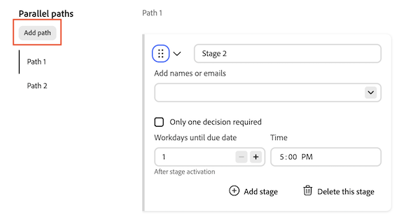

# Criar um modelo de fluxo de trabalho de aprovação para documentos

Na área Configuração do Workfront, os usuários com uma licença Standard podem criar Modelos de aprovação reutilizáveis. Depois de criados, os Modelos de aprovação podem ser aplicados aos ativos na área Documentos de um objeto.
>[!IMPORTANT]
>
>O conteúdo deste artigo se refere à funcionalidade atualizada de aprovação de documentos, disponível somente para contas específicas. Para obter informações sobre processos de aprovação padrão, consulte os artigos listados em [Aprovações de trabalho](/help/quicksilver/review-and-approve-work/manage-approvals/manage-approvals.md).

## Requisitos de acesso

+++ Expanda para visualizar os requisitos de acesso da funcionalidade neste artigo.

<table style="table-layout:auto"> 
 <col> 
 <col> 
 <tbody> 
  <tr> 
   <td role="rowheader">Pacote do Adobe Workfront</td> 
   <td>
Qualquer pacote do Workfront para gerenciar aprovações usando o armazenamento herdado do Workfront

Qualquer pacote de fluxo de trabalho para gerenciar aprovações usando o Adobe Cloud Storage
 </td> 
  </tr> 
  <tr> 
   <td role="rowheader">Licença do Adobe Workfront</td> 
   <td> 
Padrão
 
   
Plano

   </td> 
  </tr> 
 </tbody> 
</table>

Para obter mais detalhes sobre as informações contidas nesta tabela, consulte [Requisitos de acesso na documentação do Workfront](/help/quicksilver/administration-and-setup/add-users/access-levels-and-object-permissions/access-level-requirements-in-documentation.md).

+++

<!--
## Create an Approval Template in Production

{{step-1-to-setup}}

1. In the left panel, click **Review and Approval** > **Approval Templates**.
1. Click **New Template** on the right side of the page. 

1. Fill in the following details:

   <table>
     <tr>
   <td><strong>Template name</strong></td>
   <td>Add a template name. </td>
   </tr>
   <tr>
   <td><strong>Stage name</strong></td>
   <td>Add a stage name. You can change the name to something more descriptive, such as <em>Initial Review</em> or <em>Final Approval</em>.</td>
   </tr>
   <tr>
   <td><strong>Add names or emails</strong></td>
   <td>Begin typing a user or team name to add as an approver or reviewer. If you only have reviewers, they will be notified and have the option to complete the review but no decision will be required or made.</td>
   </tr>
   <tr>
   <td><strong>One decision required (optional)</strong></td>
   <td>The first person who makes a decision completes the stage.</td>
   </tr>
   <tr>
   <td><strong>Workdays until due date</strong></td>
   <td>Choose how many workdays until the approval is due after a stage is activated.</td>
   </tr>
   </table>

1. (Optional) Repeat the previous step to add additional stages as needed.

   >[!NOTE]
   >
   >If you add multiple stages, the approval workflow proceeds in the order the stages are listed. When all required decisions are made, the next stage begins and the previous stage is locked.

   
    
1. Click **Save**.

Once the template is created, it can be applied to documents in the Documents area of an object to begin the formal review and approval process in Workfront.
-->

## Criar um modelo de aprovação

A caixa de diálogo do modelo de aprovação sempre se abre no modo Avançado. Não há modo Básico para modelos. É possível configurar até 30 caminhos paralelos em um modelo, com até 100 estágios no total. Cada caminho é executado independentemente e pode conter um ou mais estágios sequenciais.

Para criar um modelo de aprovação:

{{step-1-to-setup}}

1. No painel esquerdo, clique em **Revisar e aprovar** > **Modelos de Aprovação**.

1. Clique em **Novo modelo** no lado direito da página.

1. Adicione um **Nome do modelo**.

1. Preencha os detalhes para o Estágio 1 do Caminho 1:

   <table>
   <tr>
   <td><strong>Nome do estágio</strong></td>
   <td>Os estágios são nomeados como <em>Estágio 1</em>, <em>Estágio 2</em> e assim por diante por padrão. Renomeie o estágio para algo mais descritivo, como <em>Revisão inicial</em> ou <em>Aprovação final</em>.</td>
   </tr>
   <tr>
   <td><strong>Adicionar nomes ou emails (opcional)</strong></td>
   <td>Comece a digitar um nome de usuário ou de equipe para adicionar como aprovador ou revisor. Os participantes são opcionais nos templates. Você pode adicioná-los quando o modelo for aplicado a um documento.
Nota: Um revisor ou aprovador pode ser atribuído a apenas um estágio aberto por vez no mesmo ativo. Se vários estágios paralelos forem abertos simultaneamente, a mesma pessoa não poderá ser adicionada a mais de um.
</td>
   </tr>
   <tr>
   <td><strong>É necessária apenas uma decisão (opcional)</strong></td>
   <td>A primeira pessoa que toma uma decisão completa a etapa.</td>
   </tr>
   <tr>
   <td><strong>Dias úteis até a data de vencimento (opcional)</strong></td>
   <td>Escolha quantos dias úteis o estágio leva para ser concluído depois de ser aberto. O primeiro estágio de cada caminho também suporta uma data de vencimento absoluta. Cada estágio subsequente no caminho suporta apenas uma data de vencimento relativa.</td>
   </tr>
   <tr>
   <td><strong>Adicionar mensagem personalizada (opcional)</strong></td>
   <td>Digite uma mensagem na caixa de texto <strong>Adicionar mensagem personalizada</strong>. Quando o modelo é aplicado a um documento, a mensagem aparece na notificação por email de aprovação e na guia Aprovações no Workfront.
Ao adicionar um segundo estágio, <strong>Mostrar esta mensagem em todos os estágios</strong> é selecionado por padrão. Deixe-a selecionada para usar a mesma mensagem em cada estágio. Para usar uma mensagem diferente para cada estágio, desmarque <strong>Mostrar esta mensagem em todos os estágios</strong> e digite a mensagem específica do estágio na caixa de texto <strong>Adicionar Mensagem Personalizada</strong> de cada estágio.
</td>
   </tr>
   </table>

   

1. (Opcional) Clique em **Adicionar estágio** para adicionar outro estágio ao caminho. Os estágios em um caminho são executados sequencialmente na ordem em que estão listados. Quando todas as decisões necessárias em um estágio são tomadas, o próximo estágio nesse caminho começa e o estágio anterior é bloqueado. É possível reordenar os estágios em um caminho, mas não é possível mover um estágio de um caminho para outro. Cada caminho pode ter um número diferente de estágios.

1. (Opcional) Em **Caminhos paralelos**, clique em **Adicionar caminho** para adicionar outro caminho. O novo caminho começa com uma etapa vazia e se torna o caminho selecionado. Os caminhos não podem ser reordenados.

   

1. (Opcional) Para renomear um caminho, passe o mouse sobre o rótulo do caminho, clique no ícone de lápis e digite um novo nome. Para remover um caminho, passe o mouse sobre o rótulo do caminho e clique no ícone de lixeira. **Caminho 1** não pode ser removido, e outros caminhos só podem ser removidos se nenhum estágio no caminho estiver bloqueado ou concluído.

1. (Opcional) Para limpar todos os caminhos e estágios e começar novamente, clique em **Redefinir** no canto superior direito.

1. Clique em **Salvar**.

Depois que o modelo é criado, ele pode ser aplicado a documentos na área Documentos de um objeto para iniciar o processo formal de revisão e aprovação no Workfront.

<!--
 Once a template is created, it can be applied to assets sent from Frame.io to begin the formal review and approval process in Workfront.

-->
