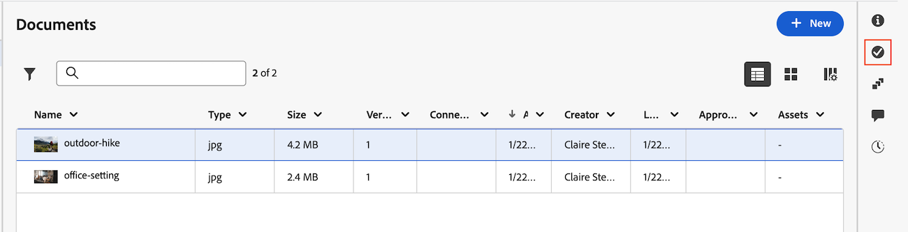

# Remover aprovadores ou revisores de um fluxo de trabalho de aprovação de documento

As informações destacadas nesta página referem-se a funcionalidades que ainda não estão disponíveis. Ele está disponível somente no ambiente de Pré-visualização da Sandbox.

Você pode remover aprovadores ou revisores individuais de um ativo ou documento depois que eles tiverem sido atribuídos.

>[!IMPORTANT]
>
>O conteúdo deste artigo se refere à funcionalidade atualizada de aprovação de documentos, disponível somente para contas específicas. Para obter informações sobre processos de aprovação padrão, consulte os artigos listados em [Aprovações de trabalho](/help/quicksilver/review-and-approve-work/manage-approvals/manage-approvals.md).

## Requisitos de acesso

+++ Expanda para visualizar os requisitos de acesso da funcionalidade neste artigo.

<table style="table-layout:auto"> 
 <col> 
 <col> 
 <tbody> 
  <tr> 
   <td role="rowheader">Pacote do Adobe Workfront</td> 
   <td> 
Qualquer
 </td> 
  </tr> 
  <tr> 
   <td role="rowheader">Licença do Adobe Workfront</td> 
   <td> 
   
Colaborador ou posterior

   
Revisar ou superior

   
Se você estiver usando a integração Frame.io, é necessário ter uma licença Standard para criar workflows de aprovação.

   </td> 
  </tr> 
  <tr> 
   <td role="rowheader">Configurações de nível de acesso</td> 
   <td> 
Visualize ou tenha acesso superior a projetos, tarefas, problemas, modelos, portfólios, programas, relatórios, painéis e calendários, documentos
 </td> 
  </tr> 
  <tr> 
   <td role="rowheader">Permissões de objeto</td> 
   <td> 
Gerenciar acesso ao objeto associado à solicitação de acesso ou aprovação 
  </td> 
  </tr> 
 </tbody> 
</table>

Para obter informações, consulte [Requisitos de acesso na documentação do Workfront](/help/quicksilver/administration-and-setup/add-users/access-levels-and-object-permissions/access-level-requirements-in-documentation.md).

+++

## Remova aprovadores ou revisores da página Detalhes do documento no ambiente de produção

1. Vá para a página do documento clicando no nome do documento e selecione a versão do documento para a qual deseja remover uma aprovação na lista suspensa de versões. A versão mais recente é selecionada por padrão.

1. Selecione **Aprovações** no painel esquerdo.

1. Passe o mouse sobre o nome do aprovador ou revisor que você deseja remover, em seguida, clique no ícone **Excluir**  que aparece após o nome.

   A solicitação de aprovação ou revisão é removida e o aprovador recebe uma notificação de que sua aprovação não é mais necessária. O acesso compartilhado relacionado à aprovação também é removido.

1. (Opcional) Para rebaixar um aprovador para um revisor, em vez de removê-lo totalmente, desmarque a caixa de seleção **Aprovador** de acordo com seu nome.

1. Repita a etapa anterior para remover aprovadores ou revisores adicionais.

## Remover aprovadores ou revisores do Resumo do documento no seu ambiente de produção

1. Vá para o projeto, tarefa ou problema que contém o documento e selecione **Documentos**.

1. Clique no documento necessário e o painel Resumo do documento desse documento será aberto.

1. Selecione a versão do documento da qual você deseja remover um aprovador ou revisor na lista suspensa de versões. A versão mais recente é selecionada por padrão.

1. Role para baixo até a seção **Aprovações** no painel Resumo do documento. Passe o mouse sobre o nome do aprovador ou revisor que você deseja remover, em seguida, clique no ícone **Excluir**  que aparece após o nome.

   A solicitação de aprovação ou revisão é removida e o aprovador recebe uma notificação de que sua aprovação não é mais necessária. O acesso compartilhado relacionado à aprovação também é removido.

1. (Opcional) Para rebaixar um aprovador para um revisor, em vez de removê-lo totalmente, desmarque a caixa de seleção **Aprovador** de acordo com seu nome.

1. Repita a etapa anterior para remover aprovadores ou revisores adicionais.

## Remova aprovadores ou revisores de um fluxo de trabalho de aprovação no seu ambiente de visualização na área de documentos herdados

Se sua organização estiver no armazenamento da Workfront, você verá a área de documentos herdados ao acessar documentos no Workfront. Para obter mais informações sobre o armazenamento da Workfront, consulte [Armazenamento da Workfront vs. armazenamento corporativo da Adobe](/help/quicksilver/review-and-approve-work/esm-overview.md#workfront-storage-vs-adobe-enterprise-storage).

Para remover aprovadores ou revisores de um fluxo de trabalho de aprovação:

1. Vá para o projeto, tarefa ou problema que contém o documento e selecione **Documentos** no painel esquerdo.

1. Clique no documento necessário e o painel Resumo do documento desse documento será aberto.

1. Role para baixo até a seção **Aprovações** no painel Resumo do documento.

1. Clique em **Editar workflow**.

1. Localize o participante que você deseja remover e clique no ícone **Remover** ao lado do nome.

   A solicitação de aprovação ou revisão é removida e o aprovador recebe uma notificação de que sua aprovação não é mais necessária. O acesso compartilhado relacionado à aprovação também é removido.

   

1. (Opcional) Para alterar a função de um aprovador para um revisor, ou vice-versa, clique no menu suspenso ao lado do nome de usuário e selecione a nova função.

1. Repita a etapa anterior para remover aprovadores ou revisores adicionais.

## Remover aprovadores ou revisores de um fluxo de trabalho de aprovação na nova área de documento

Se sua organização usar armazenamento corporativo, você verá a nova área de documentos ao acessar documentos no Workfront. Para obter mais informações sobre armazenamento corporativo, consulte [Visão geral sobre armazenamento corporativo](/help/quicksilver/review-and-approve-work/esm-overview.md).

Para criar um workflow de aprovação:

1. Vá para o projeto, tarefa ou problema que contém o documento e selecione **Documentos** no painel esquerdo.

1. Clique no documento e, em seguida, clique no ícone **Aprovações**, no lado direito da página.

   

1. Clique em **Editar workflow**.

1. Localize o participante que você deseja remover e clique no ícone **Remover** ao lado do nome.

   A solicitação de aprovação ou revisão é removida e o aprovador recebe uma notificação de que sua aprovação não é mais necessária.

1. (Opcional) Para alterar a função de um aprovador para um revisor, ou vice-versa, clique no menu suspenso ao lado do nome de usuário e selecione a nova função.

1. Repita a etapa anterior para remover aprovadores ou revisores adicionais.

   
1. Clique em **Salvar**.