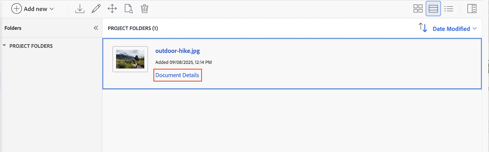

# Fazer upload de uma nova versão do documento e solicitar uma aprovação

Se um documento estiver marcado e precisar de trabalho em uma revisão anterior, você poderá fazer upload de uma nova versão para o documento original e iniciar outra rodada de aprovações. Após carregar uma nova versão do documento, as versões anteriores serão bloqueadas.

Se o nome do arquivo da nova versão for diferente do nome do arquivo da versão anterior, o Workfront exibirá o documento com o nome de arquivo mais recente.

Quando uma nova versão é adicionada a um documento com aprovações pendentes, a aprovação da versão anterior é exibida como Retirado. O processo de aprovação anterior é encerrado, mesmo que alguns participantes ainda não tenham tomado uma decisão.

Se a versão mais recente do documento for excluída, as versões anteriores permanecerão bloqueadas. Se precisar editar uma versão anterior, desbloqueie-a manualmente.

## Requisitos de acesso

+++ Expanda para visualizar os requisitos de acesso para a funcionalidade neste artigo.

<table style="table-layout:auto"> 
 <col> 
 </col> 
 <col> 
 </col> 
 <tbody> 
  <tr> 
   <td role="rowheader">Pacote do Adobe Workfront</td> 
   <td> 
 Qualquer
 </td> 
  </tr> 
  <tr> 
   <td role="rowheader">Licenças da Adobe Workfront*</td> 
   <td> 
Solicitação ou superior

   
Colaborador ou superior
 </td> 
  </tr> 
  <tr data-mc-conditions=""> 
   <td role="rowheader">Configurações de nível de acesso</td> 
   <td> 
Editar acesso a documentos
 
Observação: se você ainda não tiver acesso, pergunte ao administrador do Workfront se ele definiu restrições adicionais em seu nível de acesso. Para obter informações sobre como um administrador do Workfront pode modificar seu nível de acesso, consulte <a href="/help/quicksilver/administration-and-setup/add-users/configure-and-grant-access/create-modify-access-levels.md" class="MCXref xref">Criar ou modificar níveis de acesso personalizados</a>.
 </td> 
  </tr> 
  <tr data-mc-conditions=""> 
   <td role="rowheader">Permissões de objeto</td> 
   <td> 
Editar acesso ao objeto associado ao documento
 
Para obter informações sobre como solicitar acesso adicional, consulte <a href="/help/quicksilver/workfront-basics/grant-and-request-access-to-objects/grant-and-request-access-to-objects.md" class="MCXref xref">Solicitar acesso aos objetos </a>.
 </td> 
  </tr> 
 </tbody> 
</table>

Para obter informações, consulte [Requisitos de acesso na documentação do Workfront](/help/quicksilver/administration-and-setup/add-users/access-levels-and-object-permissions/access-level-requirements-in-documentation.md).

+++

## Usar o recurso arrastar e soltar para adicionar uma nova versão

>[!NOTE]
>
>Arrastar e soltar não funciona com o Internet Explorer.

Se você precisar de outra rodada de revisão e aprovação em um documento, poderá criar uma nova versão do documento no Workfront.

Você pode adicionar os participantes anteriores, novos participantes ou uma combinação de ambos. Você pode exibir informações sobre versões anteriores e participantes na página Detalhes do documento.

Para adicionar uma nova versão:

1. Navegue até o documento no Workfront.
1. Arraste e solte o novo arquivo sobre o documento anterior. Isso cria uma nova versão automaticamente.

1. Quando o documento terminar de carregar, selecione-o e clique em **Detalhes do Documento**.
   

1. No painel esquerdo, clique em **Aprovações** e em **Adicionar**.

1. Para adicionar todos os participantes anteriores, clique em **Adicionar todos**. Você também pode adicionar novos participantes ou remover participantes anteriores, conforme necessário.

1. Para adicionar um modelo de aprovação existente, clique no botão Modelo e comece a digitar um nome de modelo.

   >[!TIP]
   >
   >   Os usuários com uma licença Standard podem criar Modelos de aprovação reutilizáveis na área Configuração. Para obter mais informações, consulte [Criar um Modelo de Aprovação para ativos e documentos](/help/quicksilver/review-and-approve-work/document-reviews-and-approvals/manage-document-approvals/create-approval-template.md).

1. (Opcional) Defina um prazo para a aprovação. Os usuários e as equipes são notificados por email 72 horas e, em seguida, 24 horas antes do prazo especificado.

1. Depois de adicionar todos os revisores e aprovadores, clique em **Enviar solicitação**. Os participantes são notificados por email.

   

