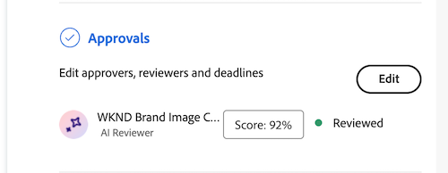

# Exibir pontuação e feedback do revisor de conteúdo

{{highlighted-preview-article-level}}

Segundos após enviar a solicitação de revisão e aprovação, você poderá exibir a pontuação e o feedback do Revisor de conteúdo no painel Resumo do documento.

O Revisor de conteúdo não foi projetado para ser um tomador de decisão no fluxo de trabalho de revisão e aprovação. Ela só fornece uma pontuação e recomendações para alinhar o ativo aos requisitos da marca especificados.

## Entender como as pontuações são calculadas

O Revisor de conteúdo calcula as pontuações de forma diferente dependendo do tipo de revisão:

* Revisão da imagem: essa pontuação reflete a proporção entre as diretrizes aprovadas e as com falha.
* Revisão da cópia: essa pontuação usa uma ponderação equilibrada de resultados subjetivos e objetivos. Diretrizes de objetivo (exibidas em &quot;Fix&quot;) são ponderadas três vezes mais do que diretrizes subjetivas (exibidas em &quot;Considerar&quot;).

Como as diretrizes objetivas têm mais peso nas revisões de cópia, recomendamos escrever diretrizes concretas e mensuráveis na sua marca. Para obter mais informações, consulte a seção [Práticas recomendadas para escrever as diretrizes da marca](/help/quicksilver/review-and-approve-work/document-reviews-and-approvals/create-a-brand.md#best-practices-for-writing-brand-guidelines) no artigo Criar e gerenciar marcas para o Revisor de Conteúdo.

## Exibir pontuação e feedback

Você pode visualizar a pontuação e o feedback do Revisor de conteúdo no painel Resumo do documento ou na guia Aprovações na página Detalhes do documento.

1. No email de notificação do Workfront, clique em **Ir para revisão**.

   Ou

   Vá para a área Documentos onde o documento é carregado e abra o painel Resumo do documento.
1. Clique em **Pontuação**.
   

Na janela de pontuação e feedback, o Revisor de conteúdo explica como o ativo não atende às diretrizes especificadas.

## Faça upload de uma nova versão e adicione o Revisor de conteúdo novamente

Se você precisar ajustar o ativo com base no feedback do Revisor de conteúdo, é possível fazer upload de uma nova versão e iniciar uma nova revisão.

Para obter mais informações, consulte [Carregar uma nova versão do documento e solicitar uma aprovação](/help/quicksilver/review-and-approve-work/document-reviews-and-approvals/manage-document-approvals/upload-new-doc-version.md).
