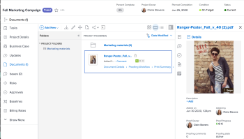

# Aprovar trabalho

<!--

(NOTE:&nbsp;From&nbsp;Courtney: Linked to Training sites/ articles , don't change title and link)

-->

Se você estiver definido como um aprovador, deverá revisar regularmente qual trabalho está aguardando sua aprovação.

Para obter informações sobre como criar processos de aprovação, consulte [Criar um processo de aprovação para itens de trabalho](../../administration-and-setup/customize-workfront/configure-approval-milestone-processes/create-approval-processes.md).

Para obter informações sobre como associar aprovações ao trabalho no Workfront, consulte [Associar um processo de aprovação novo ou existente ao trabalho](../../review-and-approve-work/manage-approvals/associate-approval-with-work.md).

## Requisitos de acesso

+++ Expanda para visualizar os requisitos de acesso para a funcionalidade neste artigo.

<table style="table-layout:auto"> 
 <col> 
 <col> 
 <tbody> 
  <tr> 
   <td role="rowheader">Pacote do Adobe Workfront</td> 
   <td> 
Qualquer
 </td> 
  </tr> 
  <tr> 
   <td role="rowheader">Licença do Adobe Workfront</td> 
   <td> 
   
Colaborador ou superior

   
Revisar ou superior
 </td> 
  </tr> 
  <tr> 
   <td role="rowheader">Configurações de nível de acesso</td> 
   <td> 
Visualizar ou ter maior acesso aos objetos associados às aprovações
</td> 
  </tr> 
  <tr> 
   <td role="rowheader">Permissões de objeto</td> 
   <td> 
Exibir permissões ou mais altas para os objetos associados às aprovações
</td> 
  </tr> 
 </tbody> 
</table>

Para obter informações, consulte [Requisitos de acesso na documentação do Workfront](/help/quicksilver/administration-and-setup/add-users/access-levels-and-object-permissions/access-level-requirements-in-documentation.md).

+++

## Localizar aprovações no Adobe Workfront

Você pode visualizar e gerenciar aprovações em várias áreas do Workfront.

Para obter mais informações sobre como exibir itens que estão aguardando aprovação ou itens que você mesmo enviou para aprovação, consulte [Exibir aprovações](../../review-and-approve-work/manage-approvals/view-approvals.md).

## Aprovar trabalho na área Página inicial

1. Clique no **[!UICONTROL Menu Principal]**  no canto superior direito e clique em **[!UICONTROL Página Inicial]**.
1. (Condicional) Clique em **Personalizar** para adicionar o widget **Minhas aprovações**.
1. (Condicional) Clique no menu suspenso **Filtro** e selecione **Todos** para ver as aprovações atribuídas e delegadas a você.

   >[!NOTE]
   >
   >As aprovações atribuídas a funções ou grupos de trabalho não são exibidas na Página inicial. As aprovações atribuídas a equipes são exibidas no widget Minhas aprovações para cada membro da equipe.

1. Selecione o item em que deseja tomar uma decisão de aprovação.

   

1. Clique em uma das opções disponíveis ao tomar uma decisão de aprovação no painel direito. As seguintes opções são exibidas no canto superior direito da página, dependendo do tipo de item que você está aprovando:

   <table>
   <tr>
      <td>
      
<strong>Acesso</strong>

      </td>
      <td>
      
<strong>Itens de trabalho</strong>

      </td>
      <td>
      
<strong>Documentos</strong>

      </td>
      <td>
      
<strong>Provas</strong>

      </td>
   </tr>
   <tr>
      <td>
       <ul>
      <li>Conceder</li>
      <li>Ignorar</li>
      </ul>
      Você pode ajustar o nível de acesso no menu suspenso <b>Alterar acesso</b>, se desejar.
      </td>
      <td>
         <ul>
         <li>Aprovar</li>
         <li>Rejeitar</li>
         </ul>
      Você pode deixar um comentário com sua decisão clicando no menu suspenso no botão de decisão.
      </td>
      <td>
   Atribuído como um aprovador
         <ul>
         <li>Aprovar</li>
         <li>Aprovar com alterações</li>
         <li>Precisa do trabalho</li>
         </ul>
   Atribuído como revisor
         <ul>
         <li>Concluir minha revisão</li>
         </ul>
      As opções dessa coluna se aplicam somente às Aprovações unificadas. As aprovações de documentos herdados aparecem da mesma forma que as aprovações de itens de Trabalho. 
      </td>
      <td>
         <ul>
         <li>Ir para prova</li>
         </ul>
         Você toma a sua decisão no visualizador de prova. Para obter informações sobre como revisar uma prova, consulte <a href="../../review-and-approve-work/proofing/reviewing-proofs-within-workfront/review-proofs-in-wf.md">Revisar provas no Adobe Workfront</a>.
      </td>
   </tr>
   </table>

Depois de tomar uma decisão, a aprovação é removida do widget Minha aprovação.

## Aprovar o trabalho diretamente de um projeto, tarefa ou problema

Quando um projeto, tarefa ou problema tem aprovação pendente, você pode aprovar ou rejeitar a aprovação diretamente do projeto, tarefa ou problema. Você também pode exibir detalhes sobre o processo de aprovação.

Para aprovar o trabalho diretamente de um projeto, tarefa ou problema:

1. Vá para o projeto, tarefa ou problema que requer sua aprovação.

   As informações de aprovação referentes ao processo de aprovação atual de um projeto, tarefa ou problema são exibidas no cabeçalho do item.

   

   As seguintes informações de aprovação estão disponíveis:

   <table style="table-layout:auto"> 
    <col> 
    <col> 
    <tbody> 
     <tr> 
      <td role="rowheader">Status</td> 
      <td>O status atual do projeto, tarefa ou problema. Este é o status atual do item que está pendente de aprovação. O status é approved após cada estágio do processo de aprovação ser aprovado.</td> 
     </tr> 
     <tr> 
      <td role="rowheader">Estágios de aprovação</td> 
      <td>Os estágios do processo de aprovação.  O estágio atual com aprovação pendente é exibido como Pendente. Os estágios que já foram aprovados são exibidos como Aprovado ; os estágios que ainda não foram aprovados são exibidos como Não iniciado .</td> 
     </tr> 
    </tbody> 
   </table>

1. Clique em **Aprovar** ou **Rejeitar**, dependendo se você deseja aprovar ou rejeitar o processo de aprovação.\
   O estágio de aprovação que estava pendente de aprovação agora é aprovado, e o processo de aprovação passa para o próximo estágio. O status é aprovado após a aprovação de todos os estágios.

## Aprovar um documento diretamente de um documento

1. Vá para a área de documentos que contém o documento que requer sua aprovação.
1. Selecione o documento e clique em **Aprovar**, **Alterações** ou **Rejeitar**.\
   \
   

1. (Opcional) Se uma prova tiver sido gerada para o documento, você poderá aprovar o documento na interface de prova, conforme descrito em [Aprovar um documento a partir de uma prova](#approve-a-document-from-a-proof).

## Aprovar um documento a partir de um email de notificação de aprovação

Dependendo das configurações de notificação, você pode receber emails notificando sobre documentos para os quais outros usuários precisam que você tome uma decisão de aprovação. Ao receber um email contendo um botão **Tomar uma Decisão de Aprovação**, você pode iniciar o processo de aprovação diretamente do email:

1. No email, clique em **Tomar uma decisão de aprovação** para abrir a página Detalhes do documento para a prova.
1. Siga um destes procedimentos para revisar o documento:

   * Visualize os metadados sobre o documento.
   * Se uma prova tiver sido criada para revisar o documento com marcação e comentários, clique em **Abrir prova**  próximo ao canto superior direito e revise a prova.

     <!--   
     [Andrzej, does it make sense to leave this here if it's s document approval?&nbsp;Would there never be a proof in that situation?]   
     -->

     Para obter informações sobre como revisar provas, consulte [Revisar provas no Adobe Workfront](../../review-and-approve-work/proofing/reviewing-proofs-within-workfront/review-proofs-in-wf.md).

1. Clique em uma opção de **Decisão** no canto superior direito para aprovar, aprovar com alterações ou rejeitar o documento.

## Aprovar um documento a partir de uma prova {#approve-a-document-from-a-proof}

Você pode aprovar um documento no visualizador de provas. Para obter mais informações, consulte [Tomar uma decisão sobre uma prova no visualizador de provas](../../review-and-approve-work/proofing/reviewing-proofs-within-workfront/make-a-decision-on-a-proof/make-decisions-on-proof.md) no artigo [Tomar uma decisão sobre uma prova no visualizador de provas](../../review-and-approve-work/proofing/reviewing-proofs-within-workfront/make-a-decision-on-a-proof/make-decisions-on-proof.md).
