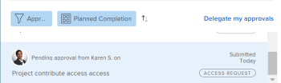

# Recuperar aprovações enviadas

Você pode rechamar qualquer um dos seguintes objetos enviados para aprovação:

* Projetos
* Tarefas
* Problemas
* Planilhas de horas
* Documentos
* Solicitações de Acesso

## Requisitos de acesso

+++ Expanda para visualizar os requisitos de acesso da funcionalidade neste artigo.

<table style="table-layout:auto"> 
 <col> 
 <col> 
 <tbody> 
  <tr> 
   <td role="rowheader">Pacote do Adobe Workfront</td> 
   <td> 
Qualquer
 </td> 
  </tr> 
  <tr> 
   <td role="rowheader">Licença do Adobe Workfront</td> 
   <td>
   
Contribute ou superior

   
Solicitação ou posterior

   </td> 
  </tr> 
  <tr> 
   <td role="rowheader">Configurações de nível de acesso</td> 
   <td> 
Acesso superior ou igual a projetos, tarefas, problemas, planilhas de horas, documentos
</td> 
  </tr> 
  <tr> 
   <td role="rowheader">Permissões de objeto</td> 
   <td> 
Acesso de visualização ou superior ao objeto associado à aprovação 
</td> 
  </tr> 
 </tbody> 
</table>

Para obter informações, consulte [Requisitos de acesso na documentação do Workfront](/help/quicksilver/administration-and-setup/add-users/access-levels-and-object-permissions/access-level-requirements-in-documentation.md).

+++

## Projetos

Quando você recupera uma aprovação de projeto, o projeto retorna ao status em que estava antes do início do processo de aprovação.

Se você cancelar uma aprovação associada ao status inicial do projeto, o processo de aprovação será ignorado e o projeto permanecerá no status inicial.

>[!NOTE]
>
>Você pode associar o primeiro status de um projeto ou tarefa a um processo de aprovação usando um modelo. Para obter mais informações sobre como adicionar aprovações a um modelo, consulte [Editar modelos de projeto](../../manage-work/projects/create-and-manage-templates/edit-templates.md).

Para cancelar uma aprovação de projeto enviada:

1. Clique no ícone **Página inicial** , no canto superior esquerdo do Adobe Workfront.

   >[!NOTE]
   >
   >O administrador do Workfront pode fazer as seguintes alterações no ícone Início do ambiente:
   >
   >* Substitua-a por uma imagem personalizada para ilustrar sua organização. Nesse caso, o ícone será diferente do mostrado neste artigo.
   >* Substituir a página vinculada a ela por uma página diferente. Nesse caso, clique no **Ícone do**  no canto superior direito da página e clique em **Página Inicial**.

1. Na área **Lista de Trabalho**, navegue até o agrupamento **Aprovações que enviei**.

1. Clique em uma aprovação de **Projeto** na Lista de Trabalho.

   Isso abre o projeto à direita da Lista de trabalho.

   

1. Clique em **Cancelar** no canto superior direito do painel direito.

## Tarefas

Quando você cancela a aprovação de uma tarefa, ela retorna ao status em que estava antes do início do processo de aprovação.

Se você cancelar uma aprovação associada ao status inicial da tarefa, o processo de aprovação será ignorado e a tarefa permanecerá no status inicial.

>[!NOTE]
>
>Você pode associar o primeiro status de um projeto ou tarefa a um processo de aprovação usando um modelo. Para obter mais informações sobre como adicionar aprovações a um modelo, consulte [Editar modelos de projeto](../../manage-work/projects/create-and-manage-templates/edit-templates.md).

Para cancelar uma aprovação de tarefa enviada:

1. Clique no ícone **Página inicial** , no canto superior esquerdo do Adobe Workfront.

   >[!NOTE]
   >
   >O administrador do Workfront pode fazer as seguintes alterações no ícone Início do ambiente:
   >
   >* Substitua-a por uma imagem personalizada para ilustrar sua organização. Nesse caso, o ícone será diferente do mostrado neste artigo.
   >* Substituir a página vinculada a ela por uma página diferente. Nesse caso, clique no **Ícone do**  no canto superior direito da página e clique em **Página Inicial**.

1. Na área **Lista de Trabalho**, navegue até o agrupamento **Aprovações que enviei**.

1. Clique em uma aprovação de **Tarefa** na Lista de trabalho.

   Isso abre a tarefa à direita da Lista de trabalho.

   

1. Clique em **Cancelar** no canto superior direito do painel direito.

## Problemas

Quando você cancela uma aprovação de problema, o problema retorna ao status em que estava antes do início do processo de aprovação.

Se você cancelar uma aprovação associada ao status inicial da ocorrência, o processo de aprovação será ignorado e a ocorrência permanecerá no status inicial.

>[!NOTE]
>
>Você pode associar o primeiro status de um problema a um processo de aprovação usando um modelo. Para obter mais informações sobre como criar uma fila de solicitações, consulte [Criar uma fila de solicitações](../../manage-work/requests/create-and-manage-request-queues/create-request-queue.md).

1. Clique no ícone **Página inicial** , no canto superior esquerdo do Adobe Workfront.

   >[!NOTE]
   >
   >O administrador do Workfront pode fazer as seguintes alterações no ícone Início do ambiente:
   >
   >* Substitua-a por uma imagem personalizada para ilustrar sua organização. Nesse caso, o ícone será diferente do mostrado neste artigo.
   >* Substituir a página vinculada a ela por uma página diferente. Nesse caso, clique no **Ícone do**  no canto superior direito da página e clique em **Página Inicial**.

1. Na área **Lista de Trabalho**, navegue até o agrupamento **Aprovações que enviei**.

1. Clique em uma aprovação de **Problema** na Lista de Trabalho.

   Isso abre a ocorrência à direita da Lista de trabalho.

   

1. Clique em **Cancelar** no canto superior direito do painel direito.

## Planilhas de horas

Quando você cancela a aprovação de uma folha de horas, ela retorna ao status em que estava antes de ser enviada para aprovação.

1. Clique no ícone **Página inicial** , no canto superior esquerdo do Adobe Workfront.

   >[!NOTE]
   >
   >O administrador do Workfront pode fazer as seguintes alterações no ícone Início do ambiente:
   >
   >* Substitua-a por uma imagem personalizada para ilustrar sua organização. Nesse caso, o ícone será diferente do mostrado neste artigo.
   >* Substituir a página vinculada a ela por uma página diferente. Nesse caso, clique no **Ícone do**  no canto superior direito da página e clique em **Página Inicial**.

1. Na área **Lista de Trabalho**, navegue até o agrupamento **Aprovações que enviei**.

1. Clique em uma aprovação de **Planilha de horas** na Lista de Trabalho.

   Isso abre a folha de horas à direita da Lista de trabalho.

   

1. Clique em **Cancelar** no canto superior direito do painel direito.

## Documentos

Para cancelar uma aprovação de documento, você deve remover manualmente um ou todos os usuários da aprovação.

1. Clique no ícone **Página inicial** , no canto superior esquerdo do Adobe Workfront.

   >[!NOTE]
   >
   >O administrador do Workfront pode fazer as seguintes alterações no ícone Início do ambiente:
   >
   >* Substitua-a por uma imagem personalizada para ilustrar sua organização. Nesse caso, o ícone será diferente do mostrado neste artigo.
   >* Substituir a página vinculada a ela por uma página diferente. Nesse caso, clique no **Ícone do**  no canto superior direito da página e clique em **Página Inicial**.

1. Na área **Lista de Trabalho**, navegue até o agrupamento **Aprovações que enviei**.

1. Clique em uma aprovação de **Documento** na Lista de Trabalho.

   Isso abre o documento à direita da Lista de trabalho.

   

1. Clique em **Gerenciar aprovações** no canto superior direito do painel direito. Isso abre a caixa Gerenciar aprovações.
1. Clique no ícone **Remover** incorporado com o nome de um usuário dentro da caixa Gerenciar aprovações. Remova todos os usuários para cancelar completamente a aprovação do documento.

   

## Solicitações de Acesso

1. Clique no ícone **Página inicial** , no canto superior esquerdo do Adobe Workfront.

   >[!NOTE]
   >
   >O administrador do Workfront pode fazer as seguintes alterações no ícone Início do ambiente:
   >
   >* Substitua-a por uma imagem personalizada para ilustrar sua organização. Nesse caso, o ícone será diferente do mostrado neste artigo.
   >* Substituir a página vinculada a ela por uma página diferente. Nesse caso, clique no **Ícone do**  no canto superior direito da página e clique em **Página Inicial**.

1. Na área **Lista de Trabalho**, navegue até o agrupamento **Aprovações que enviei**.

1. Clique em uma aprovação de **Solicitação de acesso** na Lista de trabalho.

   Isso abre a solicitação de acesso à direita da Lista de trabalho.

   

1. Clique em **Cancelar** no canto superior direito do painel direito.
