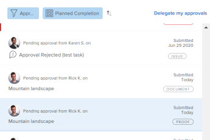

# Exibir aprovações de comprovação enviadas

As aprovações de provas são exibidas na área Página inicial somente se o ambiente do Adobe Workfront estiver integrado a uma conta do Workfront Proof Premium. Se não conseguir usar provas como discutido aqui, entre em contato com o administrador do Workfront.

## Requisitos de acesso

Você deve ter o seguinte acesso para executar as etapas deste artigo:

<table style="table-layout:auto"> 
 <col> 
 <col> 
 <tbody> 
  <tr> 
   <td role="rowheader">plano do Adobe Workfront*</td> 
   <td> 
Qualquer
 </td> 
  </tr> 
  <tr> 
   <td role="rowheader">Licença da Adobe Workfront*</td> 
   <td> 
Revisar ou superior
 </td> 
  </tr> 
  <tr> 
   <td role="rowheader">Configurações de nível de acesso*</td> 
   <td> 
Acesso de visualização ou superior a projetos, tarefas, problemas, modelos, Portfolio, programas, relatórios, painéis e calendários, documentos
 
Observação: se você ainda não tiver acesso, pergunte ao administrador do Workfront se ele definiu restrições adicionais em seu nível de acesso. Para obter informações sobre como um administrador do Workfront pode modificar seu nível de acesso, consulte <a href="../../administration-and-setup/add-users/configure-and-grant-access/create-modify-access-levels.md" class="MCXref xref">Criar ou modificar níveis de acesso personalizados</a>.
 </td> 
  </tr> 
  <tr> 
   <td role="rowheader">Permissões de objeto</td> 
   <td> 
Acesso de visualização ou superior ao objeto associado à solicitação de acesso ou aprovação 
 
Para obter informações sobre como solicitar acesso adicional, consulte <a href="../../workfront-basics/grant-and-request-access-to-objects/request-access.md" class="MCXref xref">Solicitar acesso aos objetos </a>.
 </td> 
  </tr> 
 </tbody> 
</table>

&#42;Para saber qual plano, tipo de licença ou acesso você tem, contate o administrador do Workfront.

## Exibir aprovações de comprovação enviadas

1. Clique no ícone **Página inicial**  no canto superior esquerdo do Adobe Workfront.

   >[!NOTE]
   >
   >O administrador do Workfront pode fazer as seguintes alterações no ícone Início do ambiente:
   >
   >* Substitua-a por uma imagem personalizada para ilustrar sua organização. Nesse caso, o ícone será diferente do mostrado neste artigo.
   >* Substituir a página vinculada a ela por uma página diferente. Nesse caso, clique no **Menu Principal**  no canto superior direito da página e clique em **Página Inicial**.

1. Na área **Lista de Trabalho**, vá para o agrupamento **Aprovações que Enviei**.

1. Clique em uma aprovação **Proof** na Lista de trabalho.

   Isso abre a aprovação da prova à direita da Lista de trabalho.

   >[!NOTE]
   >
   > Se você enviar uma aprovação para um usuário de prova de convidado, a aprovação não será exibida na Página inicial.

   

1. (Opcional) Clique em **Ir para Prova** no canto superior direito do painel direito para iniciar o visualizador de provas.

   <!--
   <note type="note">
   You must have View or Edit access to Documents in your Access Level to launch the proofing viewer.
   </note>
   -->
