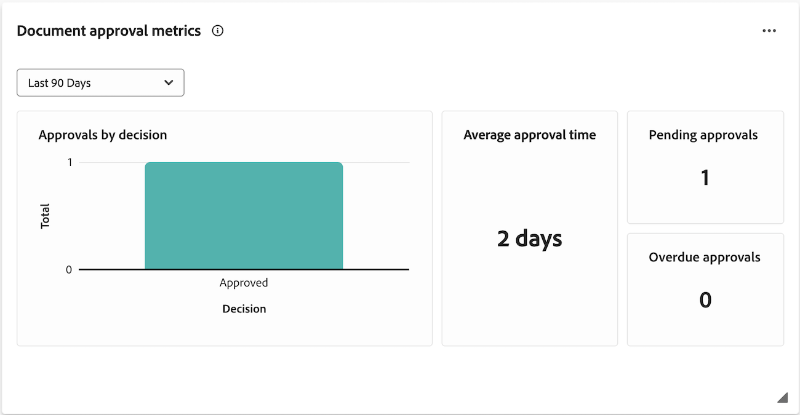

# Introdução à integração do Frame.io

A integração do Workfront e do Frame.io mantém os criadores, profissionais de marketing e participantes alinhados com um fluxo de trabalho contínuo. Acesse atualizações em tempo real, evite trabalhos duplicados e verifique se os ativos estão aprovados antes do lançamento.

Para obter mais informações sobre o Frame.io, consulte [Introdução ao Frame.io](https://support.frame.io/en/collections/49298-getting-started).

## Iniciação e planejamento do trabalho no Workfront

Os coordenadores de projetos podem criar projetos e planejar o trabalho no Workfront. Os projetos criados em uma instância com a integração Frame.io habilitada utilizam o Adobe Enterprise Storage, que permite que os ativos sejam armazenados e gerenciados no ecossistema do Adobe.

Se sua organização tiver uma licença Frame.io Enterprise, os projetos criados no Workfront também estarão visíveis no Frame.io, permitindo que os usuários interajam e façam upload de ativos em qualquer um dos produtos.

Para obter informações sobre o Adobe Enterprise Storage ou projetos no Frame.io, consulte

* [Visão geral do Workspace: Projetos](https://help.frame.io/en/articles/9101001-workspace-overview#h_d9f8654895)
* [Visão geral do armazenamento corporativo da Adobe](/help/quicksilver/review-and-approve-work/esm-overview.md)

## Revisar e aprovar ativos

Quando um ativo é concluído, o coordenador do projeto pode iniciar o processo formal de revisão e aprovação no Workfront.

Depois que o fluxo de trabalho de aprovação é criado, revisores e aprovadores podem usar o visualizador Frame.io para adicionar comentários e marcar o ativo. Eles também podem tomar a decisão de aprovação no visualizador Frame.io.

Para obter mais informações sobre a configuração de projetos, consulte

* [Criar um projeto](/help/quicksilver/manage-work/projects/create-projects/create-project.md)
* [Visão geral da integração do Frame.io](/help/quicksilver/review-and-approve-work/native-integrations/frame-io/frame-int-overview.md)

### Iniciar revisões e aprovações formais no Workfront

Os coordenadores de projetos podem criar revisões e aprovações únicas ou modelos de aprovação reutilizáveis. Eles podem atribuir revisores, aprovadores ou uma combinação de ambos:

* **Os revisores** podem adicionar comentários e marcar ativos. Depois de concluído, eles podem marcar sua revisão como concluída. Não é necessário marcar a revisão como concluída para que o ativo possa avançar no processo de aprovação.
* **Aprovadores** podem adicionar comentários e marcar ativos. Eles devem tomar a decisão de mover o processo de aprovação para frente.

#### Criar um fluxo de trabalho de revisão e aprovação

Revisores e aprovadores podem ser adicionados a um fluxo de trabalho de aprovação de uso único ou a um modelo de aprovação reutilizável:

* **Aprovações de uso único**: no projeto ou tarefa em que o ativo reside, o coordenador do projeto pode atribuir revisores e aprovadores e definir um prazo de conclusão. Revisores e aprovadores são lembrados por email 72 horas antes do prazo final, 24 horas antes do prazo final e, em seguida, sobre o próprio prazo final.

  Para obter mais informações, consulte [Criar uma revisão de documento ou solicitação de aprovação](/help/quicksilver/review-and-approve-work/document-reviews-and-approvals/manage-document-approvals/create-a-document-approval.md).

* **Modelos de aprovação**: na área Configuração do Workfront, os coordenadores de projeto podem criar Modelos de aprovação reutilizáveis. Em um modelo, os usuários podem adicionar revisores e aprovadores e especificar um período de conclusão. Quando o modelo de aprovação é aplicado a um ativo, o prazo é calculado a partir do período especificado.

  Depois que um modelo é criado, ele pode ser aplicado a um ativo para iniciar o processo formal de revisão e aprovação no Workfront.

  Para obter mais informações, consulte [Criar um Modelo de Aprovação](/help/quicksilver/review-and-approve-work/document-reviews-and-approvals/manage-document-approvals/create-approval-template.md).

  

### Revisar e aprovar ativos no visualizador Frame.io

Depois que o fluxo de trabalho de revisão e aprovação é iniciado no Workfront, os revisores e aprovadores podem acessar o visualizador Frame.io para adicionar comentários, marcar o ativo e tomar uma decisão.

Para obter mais informações, consulte [Revisar e aprovar com o visualizador Frame.io](/help/quicksilver/review-and-approve-work/document-reviews-and-approvals/review-with-frame.md).

#### Acessar o visualizador Frame.io

Os usuários podem acessar o visualizador Frame.io das seguintes maneiras:

* Notificações por email do Workfront
* O widget Minha aprovação na área Página inicial do Workfront

>[!NOTE]
>
>Os usuários externos do Workfront são notificados por email e serão solicitados a criar um logon Frame.io para revisar e aprovar ativos.

#### Adicionar comentários e marcar ativos

A marcação de comentários e ativos está visível no visualizador Frame.io. Para obter mais informações sobre como usar o visualizador Frame.io, consulte [Comentários na mídia](https://help.frame.io/en/articles/9105251-commenting-on-your-media).

#### Tomar uma decisão

Quando toda a atividade de revisão estiver concluída, os aprovadores deverão tomar uma das seguintes decisões:

* **Aprovar**: o ativo não precisa de alterações e está pronto para uso.
* **Precisa do trabalho**: o ativo precisa de alterações e não está pronto para uso. Depois que as alterações especificadas forem feitas, o ativo deverá ser carregado como uma nova versão e passar por outra rodada de aprovações. <!--is the same approval workflow automatically applied? Does the coordinator have to do anything to get the approval going? -->

Os revisores podem marcar sua revisão como concluída no Workfront, mas isso não é necessário para que o ativo avance no processo de aprovação.

Para obter mais informações sobre decisões no Workfront, consulte [Visão geral do status da decisão do documento](/help/quicksilver/review-and-approve-work/document-reviews-and-approvals/manage-document-approvals/document-approval-status.md).

### Rastrear métricas de revisão e aprovação

Os coordenadores de projetos podem monitorar o progresso em todas as aprovações em andamento na área da página inicial da Workfront ou com relatórios personalizados em Painéis do Canvas:

* **Painel personalizado**: crie um painel de relatório na área Painéis da Tela para exibir informações detalhadas e de alto nível sobre revisões e aprovações com a funcionalidade Aprovações unificadas. Para obter informações sobre como começar, consulte [Criar um painel de relatório para revisão e aprovações](/help/quicksilver/review-and-approve-work/document-reviews-and-approvals/create-review-and-approval-dashboard.md).
* **Widget inicial das métricas de aprovação de documentos**: exibe dois gráficos com informações sobre o tempo médio de aprovação e decisões, bem como exibições de lista de aprovações pendentes e vencidas.
  