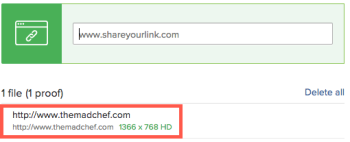

# Criar uma prova estática para um site ou outro conteúdo da Web

Você pode gerar uma nova prova estática ou uma nova versão de uma prova estática existente para conteúdo da Web. O conteúdo da Web pode incluir coisas como anúncios com streaming de vídeo, animações de HTML ou banners interativos, mas ele será recortado em várias capturas de tela para permitir prova estática.

Considere o seguinte ao criar provas estáticas para um site ou outro conteúdo da Web:

## Requisitos de acesso

Você deve ter o seguinte acesso para executar as etapas neste artigo:

<table style="table-layout:auto"> 
 <col> 
 <col> 
 <tbody> 
  <tr> 
   <td role="rowheader">Plano Adobe Workfront*</td> 
   <td> 
Plano atual: Pro ou superior
 
ou
 
Plano herdado: Selecionar ou Premium
 
Para obter mais informações sobre como revisar o acesso com os diferentes planos, consulte <a href="/help/quicksilver/administration-and-setup/manage-workfront/configure-proofing/access-to-proofing-functionality.md" class="MCXref xref">Acesso à funcionalidade de prova no Workfront</a>.
 </td> 
  </tr> 
  <tr> 
   <td role="rowheader">Licença da Adobe Workfront*</td> 
   <td> 
Plano atual: Trabalho ou Plano
 
Plano herdado: Qualquer (É necessário ter a prova ativada para o usuário)
 </td> 
  </tr> 
  <tr> 
   <td role="rowheader">Perfil de Permissões de Prova </td> 
   <td>Gerente ou superior</td> 
  </tr> 
  <tr> 
   <td role="rowheader">Configurações de nível de acesso*</td> 
   <td> 
Editar acesso a documentos
 
Observação: Caso ainda não tenha acesso, pergunte ao administrador do Workfront se ele definiu restrições adicionais em seu nível de acesso. Para obter informações sobre como um administrador do Workfront pode modificar seu nível de acesso, consulte <a href="../../../administration-and-setup/add-users/configure-and-grant-access/create-modify-access-levels.md" class="MCXref xref">Criar ou modificar níveis de acesso personalizados</a>.
 </td> 
  </tr> 
 </tbody> 
</table>

&#42;Para descobrir qual plano, função ou Perfil de permissão de prova você possui, entre em contato com o administrador da Workfront ou da Workfront Proof.

## Criar uma prova estática para um site ou outro conteúdo da Web

Para criar uma prova estática, o site precisa ser acessível publicamente (não atrás de um firewall) ou a  de lista de permissões de sua organização deve incluir o domínio do Workfront. O Workfront não pode capturar um site protegido por senha como prova estática.

>[!TIP]
>
>Recomendamos a prova interativa em vez de prova estática para páginas internas que exigem autorização e páginas protegidas por senha. Para obter mais informações, consulte [Visão geral das provas de conteúdo interativo](../../../review-and-approve-work/proofing/proofing-overview/interactive-content-proofs.md).

1. Vá para o projeto, tarefa ou problema em que deseja criar uma nova prova de site ou uma nova versão de uma existente.
1. Clique em **Documentos** no painel esquerdo .
1. (Condicional) Se estiver criando uma nova prova, clique em **Adicionar novo**, depois clique em **Prova** no menu exibido.
1. (Condicional) Se você estiver criando uma nova versão de uma prova existente:

   1. Passe o mouse sobre a prova de URL para a qual deseja criar uma nova versão, em seguida, selecione-a clicando em no plano de fundo azul claro ao redor.

      

   1. Clique em **Adicionar novo** > **Versão** > **Prova**.

1. Digite o URL do site que você deseja testar na **Adicionar arquivos** e pressione **Enter**.

   O URL é exibido abaixo da caixa onde você digitou.

   

1. Clique no URL adicionado.

   As opções para configurar a prova de site são exibidas.

   

1. (Opcional) Se você quiser alterar o nome da prova do URL do site para outra coisa, digite um **Nome da prova.**
1. Certifique-se de **Capturar captura de tela** for selecionado e use qualquer uma das seguintes opções:

   <table style="table-layout:auto"> 
    <col> 
    <col> 
    <tbody> 
     <tr> 
      <td role="rowheader"><strong>Resolução de captura de tela</strong> </td> 
      <td> 
Ajuste a resolução do seu conteúdo quando os revisores visualizarem a prova, permitindo que eles vejam como ela é exibida em dispositivos de vários tamanhos, como telefones, tablets e monitores.
 
Se você selecionar várias resoluções, uma prova separada será criada para cada resolução selecionada.
 
Observação: Quando um revisor comenta sobre a prova, o comentário inclui a resolução que mostra quando o comentário foi feito para que outros revisores saibam qual resolução está associada ao comentário. 
 </td> 
     </tr> 
     <tr> 
      <td role="rowheader"><strong>Procurar subpáginas</strong> </td> 
      <td> 
Capture as subpáginas do site, bem como suas páginas principais. Você pode clicar em Selecionar tudo para incluir todas as páginas, ou apenas em determinadas páginas que deseja incluir. Os botões de mais e menos permitem expandir e fechar as áreas de subpágina no site.
 </td> 
     </tr> 
    </tbody> 
   </table>

   >[!IMPORTANT]
   >
   >Não é possível alterar a configuração da captura de tela Captura para nenhuma versão subsequente da prova criada.

1. Clique em **Concluído**.

   Se você selecionou várias resoluções de captura de tela na etapa 8, a lista inclui um conjunto de capturas de tela para cada resolução. Você pode gerar essas capturas de tela como provas separadas ou combiná-las em uma única prova (consulte em .). Recomendamos que você as combine, especialmente se estiver criando uma prova estática de site.

   >[!NOTE]
   >
   >Se você estiver adicionando uma nova versão a uma prova de URL existente, todas as opções que foram configuradas na prova original ou na versão anterior serão mantidas nessa versão.

1. Clique em **Criar prova** para criar uma prova simples sem processo de revisão.\
   ou\
   Continue configurando uma prova avançada:

   * [Criar uma prova avançada com um workflow básico](../../../review-and-approve-work/proofing/creating-proofs-within-workfront/configure-basic-proof-workflow.md)
   * [Criar uma prova avançada com um fluxo de trabalho Automatizado](../../../review-and-approve-work/proofing/creating-proofs-within-workfront/create-automated-proof-workflow.md)
