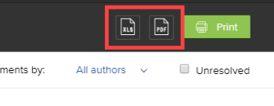

# Imprimir um resumo de prova no Adobe Workfront

Você pode imprimir um resumo de prova, salvá-lo como um PDF ou exportá-lo como um arquivo XLS ou PDF otimizado para o Adobe Reader.

## Requisitos de acesso

Você deve ter o seguinte acesso para executar as etapas deste artigo:

<table style="table-layout:auto"> 
 <col> 
 <col> 
 <tbody> 
  <tr> 
   <td role="rowheader">plano do Adobe Workfront*</td> 
   <td> 
Plano atual: Pro ou Superior
 
ou
 
Plano herdado: Select ou Premium
 
Para obter mais informações sobre acesso de revisão de texto com os diferentes planos, consulte <a href="/help/quicksilver/administration-and-setup/manage-workfront/configure-proofing/access-to-proofing-functionality.md" class="MCXref xref">Acesso à funcionalidade de revisão de texto no Workfront</a>.
 </td> 
  </tr> 
  <tr> 
   <td role="rowheader">Licença da Adobe Workfront*</td> 
   <td> 
Plano atual: Trabalho ou Plano
 
Plano herdado: Qualquer um (Você deve ter a prova ativada para o usuário)
 </td> 
  </tr> 
  <tr> 
   <td role="rowheader">Perfil de Permissões de Prova </td> 
   <td>Gerente ou superior</td> 
  </tr> 
  <tr> 
   <td role="rowheader">Configurações de nível de acesso*</td> 
   <td> 
Editar acesso a documentos
 
Observação: se você ainda não tiver acesso, pergunte ao administrador do Workfront se ele definiu restrições adicionais em seu nível de acesso. Para obter informações sobre como um administrador do Workfront pode modificar seu nível de acesso, consulte <a href="../../../administration-and-setup/add-users/configure-and-grant-access/create-modify-access-levels.md" class="MCXref xref">Criar ou modificar níveis de acesso personalizados</a>.
 </td> 
  </tr> 
 </tbody> 
</table>

&#42;Para saber qual perfil de plano, função ou permissão de prova você tem, contate o administrador do Workfront ou do Workfront Proof.

## Imprima um resumo de prova ou salve-o como um arquivo PDF

É possível imprimir um resumo de prova diretamente na lista de documentos.

>[!NOTE]
>
>Não é possível imprimir vários resumos de prova da lista de documentos ao mesmo tempo.

1. Na lista de documentos que contém a prova, passe o mouse sobre a linha que contém o documento e clique em **Imprimir Resumo**.

   

   Ou

   Ao exibir a prova no visualizador de provas, clique no ícone **Imprimir** na barra de ferramentas esquerda. (Se a barra de ferramentas esquerda não estiver visível, clique no ícone Menu  no canto superior esquerdo do visualizador de provas.)

1. Use qualquer uma das seguintes opções:

   <table style="table-layout:auto"> 
    <col> 
    <col> 
    <tbody> 
     <tr> 
      <td role="rowheader">Apresentar</td> 
      <td> 
Especifique o que deseja imprimir:
 
       <ul> 
        <li>A <strong>versão atual</strong> ou <strong>todas as versões</strong> da prova</li> 
        <li>Somente as <strong>Páginas com comentários</strong> ou <strong>Todas as páginas</strong></li> 
        <li>Somente as <strong>Miniaturas de página</strong> (uma pequena renderização de cada página) ou as <strong>Páginas completas</strong> (uma renderização completa da prova) </li> 
        
Observação: para ver os números de pinos na marcação na saída impressa, é necessário selecionar Páginas inteiras, não Miniaturas de página. 
 
       </ul> </td> 
     </tr> 
     <tr> 
      <td role="rowheader">Classificar comentários por</td> 
      <td> 
(Disponível somente se você tiver selecionado Miniaturas de página acima) Especifique a ordem na qual deseja que os comentários da prova sejam impressos:
 
       <ul> 
        <li><strong>Mais antigo</strong>: do primeiro comentário ao último</li> 
        <li><strong>Mais recentes</strong>: do último comentário até o primeiro</li> 
        <li><strong>Página</strong>: por página, da primeira à última página ou da última à primeira</li> 
        <li><strong>Criador</strong>: pelos nomes dos usuários que os adicionaram, de A-Z ou de Z-A</li> 
       </ul> 
Essas opções não afetam a saída exportada como um arquivo XLS ou PDF.
 </td> 
     </tr> 
     <tr> 
      <td role="rowheader">Filtrar comentários por</td> 
      <td> 
Você pode usar qualquer combinação dessas opções para incluir apenas determinados comentários na saída impressa ou exportada como um arquivo XLS ou PDF:
 
       <ul> 
        <li>Autores selecionados (padrão)</li> 
        <li>Ações selecionadas</li> 
        <li>Status de <strong>não resolvido</strong></li> 
       </ul> </td> 
     </tr> 
     <tr> 
      <td role="rowheader">Fluxo de trabalho (WRK)</td> 
      <td> 
(Disponível somente se a prova tiver um Fluxo de Trabalho Automatizado) Você pode clicar em <strong>Mostrar diagrama</strong> para incluir um diagrama no resultado impresso mostrando os estágios na prova e as decisões tomadas em cada estágio. No diagrama exibido, as cores representam decisões tomadas em um estágio:
 
<strong>Verde</strong>: Aprovado
 
<strong>Azul</strong>: pendente de decisão
 
<strong>Vermelho</strong>: alterações necessárias na decisão
 
<strong>Cinza</strong>: ainda não iniciado
 
<strong>Amarelo</strong>: aprovado com alterações
 </td> 
     </tr> 
    </tbody> 
   </table>

1. Clique em **Imprimir**.
1. No painel direito da janela exibida, para imprimir o resumo, clique no menu **Destino** e clique em **Ver mais**. Clique na impressora que deseja usar na lista exibida e clique em **Imprimir**.

   Ou

   Para salvar o resumo como um arquivo de PDF, clique no menu **Destino**, clique em **Salvar como PDF** e em **Salvar**.

## Exportar um resumo de prova como XLS ou PDF

Você pode exportar um resumo de prova para conteúdo estático como um arquivo XLS ou como um arquivo PDF. As exportações de prova incluem somente o conteúdo da prova.

1. Na lista de documentos que contém a prova, passe o mouse sobre a linha que contém o documento e clique em **Imprimir Resumo**.

   

1. Clique no ícone XLS ou no ícone de PDF próximo ao canto superior direito da página.

   

Quando o arquivo exportado estiver pronto, você receberá um email do qual poderá baixar o arquivo.

Se você tiver exportado o resumo como um arquivo PDF, os comentários na prova aparecerão no leitor de PDF. Se um comentário tiver várias marcações associadas a ele, ele será exibido várias vezes na lista de comentários (uma vez para cada marcação).
