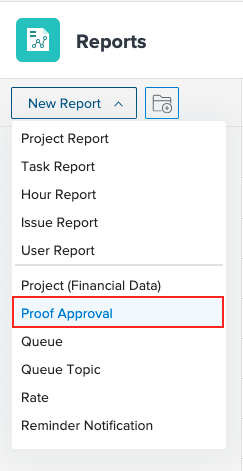

# Usar o relatório de aprovação de prova

Você pode usar o relatório de aprovação de prova para exibir informações sobre provas no seu ambiente.

## Requisitos de acesso

+++ Expanda para visualizar os requisitos de acesso da funcionalidade neste artigo.

<table style="table-layout:auto"> 
 <col> 
 <col> 
 <tbody> 
  <tr> 
   <td role="rowheader"> 
Pacote do Workfront
 </td> 
   <td>Qualquer</td> 
  </tr> 
  <tr> 
   <td role="rowheader"> 
Licença do Adobe Workfront
 </td> 
   <td> 
   
Padrão

   
Plano

   </td> 
  </tr> 
  <tr data-mc-conditions=""> 
   <td role="rowheader"><strong>Configuração de nível de acesso</strong> </td> 
   <td> 
Editar acesso a:
 
    <ul> 
     <li> 
Criar relatórios, painéis e calendários
 </li> 
     <li> 
Criar filtros, visualizações e agrupamentos
 </li> 
    </ul> </td> 
  </tr> 
 </tbody> 
</table>

Para obter informações, consulte [Requisitos de acesso na documentação do Workfront](/help/quicksilver/administration-and-setup/add-users/access-levels-and-object-permissions/access-level-requirements-in-documentation.md).

+++

## Usar o relatório de aprovação de prova

{{step1-to-reports}}

1. Clique em **Novo relatório** e role para selecionar **Aprovação de prova**.

   

1. (Opcional) Adicione quaisquer campos adicionais.
1. Clique em **Salvar + Fechar**.

## Campos adicionais

Você pode adicionar os seguintes campos ao relatório de aprovação de prova:

* **Data da decisão**: exibe a data em que um aprovador toma uma decisão sobre uma prova. Você também pode encontrar essa data no Resumo de impressão da prova.
* **Estágio de Aprovador**: exibe as informações do estágio atual.
* **Modelo de fluxo de trabalho**: exibe todos os modelos de fluxo de trabalho anexados à prova. Se não houver um modelo anexado, a coluna ficará em branco.
* **Aguardando decisão**: exibe verdadeiro para sinalizar que uma decisão não foi atendida na versão mais recente quando os itens a seguir são verdadeiros:

   * A prova não foi arquivada
   * O estágio em que o aprovador está ativo
   * A prova está aguardando aprovação

* **Prazo da prova**: exibe o prazo da prova. Cada estágio deve ter um prazo atribuído para que esse campo seja preenchido. O campo exibe o prazo da etapa ativada mais recentemente.

## Sobre o campo Decisão do aprovador

O campo Decisão do aprovador mostra a decisão que um recipient tomou sobre a prova. Em alguns casos, esse campo exibe um hífen (-) em vez de um valor de decisão, que indica que o recipient não está mais com uma função de tomada de decisão na prova. Para obter mais informações, consulte [A decisão do aprovador mostra um hífen no relatório Aprovação de prova](../tips-tricks-and-troubleshooting/approver-decision-shows-hyphen.md).

 
