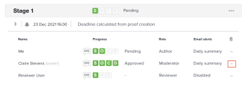

# Enviar mensagens de email para revisores em uma prova

Durante o processo de revisão e aprovação, é possível enviar uma mensagem para um ou todos os revisores em uma prova. As mensagens são uma maneira fácil de lembrar os revisores de concluir a revisão de uma prova ou fornecer outras informações relacionadas à prova.

Você pode escolher entre enviar um email de lembrete genérico ou uma mensagem personalizada para um ou todos os usuários associados a um determinado estágio.

## Requisitos de acesso

Você deve ter o seguinte acesso para executar as etapas deste artigo:

<table style="table-layout:auto"> 
 <col> 
 <col> 
 <tbody> 
  <tr> 
   <td role="rowheader">plano do Adobe Workfront*</td> 
   <td> 
Plano atual: Pro ou Superior
 
ou
 
Plano herdado: Select ou Premium
 
Para obter mais informações sobre acesso de revisão de texto com os diferentes planos, consulte <a href="/help/quicksilver/administration-and-setup/manage-workfront/configure-proofing/access-to-proofing-functionality.md" class="MCXref xref">Acesso à funcionalidade de revisão de texto no Workfront</a>.
 </td> 
  </tr> 
  <tr> 
   <td role="rowheader">Licença da Adobe Workfront*</td> 
   <td> 
Plano atual: Trabalho ou Plano
 
Plano herdado: Qualquer um (Você deve ter a prova ativada para o usuário)
 </td> 
  </tr> 
  <tr> 
   <td role="rowheader">Perfil de Permissões de Prova </td> 
   <td>Gerente ou superior</td> 
  </tr> 
  <tr> 
   <td role="rowheader">Função de prova</td> 
   <td>Autor ou moderador</td> 
  </tr> 
  <tr> 
   <td role="rowheader">Configurações de nível de acesso*</td> 
   <td> 
Editar acesso a documentos
 
Observação: se você ainda não tiver acesso, pergunte ao administrador do Workfront se ele definiu restrições adicionais em seu nível de acesso. Para obter informações sobre como um administrador do Workfront pode modificar seu nível de acesso, consulte <a href="../../../administration-and-setup/add-users/configure-and-grant-access/create-modify-access-levels.md" class="MCXref xref">Criar ou modificar níveis de acesso personalizados</a>.
 </td> 
  </tr> 
 </tbody> 
</table>

&#42;Para saber qual perfil de plano, função ou permissão de prova você tem, contate o administrador do Workfront ou do Workfront Proof.

## Enviar mensagens de email aos usuários em uma prova

1. Localize o documento para a prova que contém os usuários que deseja enviar mensagens.
1. Passe o mouse sobre o documento e clique em **Fluxo de trabalho de revisão**.

   

1. Para enviar uma mensagem a todos os usuários do estágio, clique no menu **Mais** no estágio e escolha **Mensagem para Todos**.

   

1. Para enviar uma mensagem a um usuário individual, clique no menu **Mais** ao lado do usuário e escolha **Mensagem**.

   

1. Na seção **Detalhes da mensagem**, especifique as seguintes informações:

   <table style="table-layout:auto"> 
    <col> 
    <col> 
    <tbody> 
     <tr> 
      <td role="rowheader">Notificar pessoas por e-mail</td> 
      <td>Essa opção não pode ser desmarcada. Todos os usuários recebem a mensagem por email.</td> 
     </tr> 
     <tr> 
      <td role="rowheader">Descartar mensagem personalizada</td> 
      <td> 
Clique em <strong>Descartar mensagem personalizada</strong> se desejar incluir somente o conteúdo de email padrão.
 
O email de lembrete padrão inclui as seguintes informações:
 
       <ul> 
        <li>Link pessoal para a prova Miniatura da imagem de prova </li> 
        <li>Os seguintes detalhes da prova: nome da prova, número da versão, nome da pasta (se aplicável) e uma lista dos revisores e seu progresso na prova.</li> 
       </ul> </td> 
     </tr> 
     <tr> 
      <td role="rowheader">Assunto</td> 
      <td>Digite o assunto da mensagem.</td> 
     </tr> 
     <tr> 
      <td role="rowheader">Mensagem</td> 
      <td>Digite o conteúdo da mensagem.</td> 
     </tr> 
    </tbody> 
   </table>

1. Clique em **Enviar.**
