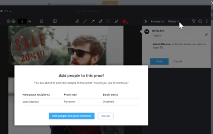

# Adicione tags aos usuários para compartilhar uma prova

Ao comentar em uma prova no visualizador de provas, você pode marcar outros usuários para chamar a atenção para o comentário por email e adicioná-los ao fluxo de trabalho da prova.

Ao marcar usuários em comentários em uma prova, os usuários que você pode marcar podem ser diferentes dependendo de vários fatores, como permissões de usuário individual e sua associação à organização:

* Se você for o criador, o proprietário ou tiver permissões específicas ativadas, será possível adicionar tags aos usuários fora do fluxo de trabalho de prova e compartilhar a prova com eles.
* Se você foi adicionado à prova como um usuário externo e é membro de outro ambiente com uma conta de prova diferente, é possível marcar somente esses usuários do seu ambiente original. <!--For more information, see [Proofing collaboration limitations with people outside of your organization](../../../../review-and-approve-work/proofing/tips-tricks-and-troubleshooting/collaboration-with-members-outside-of-your-organization.md)-->

## Requisitos de acesso {#access-requirements}

+++ Expanda para visualizar os requisitos de acesso para a funcionalidade neste artigo.

<table style="table-layout:auto"> 
 <col> 
 <col> 
 <tbody> 
  <tr> 
   <td role="rowheader">Pacote do Adobe Workfront</td> 
   <td>
Qualquer
 </td> 
  </tr> 
  <tr> 
   <td role="rowheader">Licença do Adobe Workfront</td> 
   <td> 
Qualquer

   </td> 
  </tr> 
  <tr data-mc-conditions=""> 
   <td role="rowheader">Função de prova</td> 
   <td>Autor, Moderador</td> 
  </tr> 
  <tr data-mc-conditions=""> 
   <td role="rowheader">Perfil de Permissões de Prova</td> 
   <td>Supervisor ou Administrador</td> 
  </tr> 
  <tr data-mc-conditions=""> 
   <td role="rowheader">Configurações de nível de acesso</td> 
   <td> 
Editar acesso a documentos
</td> 
  </tr> 
 </tbody> 
</table>

Para obter informações, consulte [Requisitos de acesso na documentação do Workfront](/help/quicksilver/administration-and-setup/add-users/access-levels-and-object-permissions/access-level-requirements-in-documentation.md).

+++

## Adicione tags aos usuários para compartilhar uma prova

Os usuários com a função de Perfil de Permissão de Prova ou Prova descrita na seção [Requisitos de acesso](#access-requirements) acima podem marcar os usuários para compartilhar uma prova por padrão. Você também pode adicionar tags aos usuários para compartilhar uma prova independentemente do Perfil de permissão de prova ou da função de Prova se você for o proprietário ou criador da prova. Você pode permitir que usuários com funções de Perfil de permissão de prova mais baixas ou Funções de prova marquem usuários para compartilhar uma prova ao criar uma prova. Para obter mais informações, consulte a seção [Configurar o fluxo de trabalho e adicionar revisores](../../../../review-and-approve-work/proofing/creating-proofs-within-workfront/configure-basic-proof-workflow.md#configur) no artigo [Criar uma prova avançada com um fluxo de trabalho básico](../../../../review-and-approve-work/proofing/creating-proofs-within-workfront/configure-basic-proof-workflow.md).

>[!NOTE]
>
>Você pode marcar um colaborador externo usando seu endereço de email somente se uma das opções a seguir for verdadeira:
>
>* Um usuário na conta da Workfront de sua organização adicionou o endereço de email do colaborador a uma prova anteriormente.
>* O colaborador usou o endereço de email para assinar uma prova na conta da Workfront de sua organização anteriormente.

Para marcar alguém e compartilhar uma prova em um comentário:

1. Ao comentar em uma prova, digite um sinal de arroba (@) seguido do nome ou endereço de email da pessoa. Quando você começa a digitar, os nomes disponíveis são exibidos em uma lista suspensa.
1. Selecione o nome da pessoa ao visualizá-lo na lista suspensa.

   >[!TIP]
   >
   >Se quiser fechar a lista suspensa sem selecionar ninguém, pressione a tecla **Esc** ou clique em qualquer lugar fora da lista.

1. Repita as etapas 1 a 2 para qualquer outro usuário que desejar marcar no comentário.
1. Termine o comentário e clique em **Postar**.
1. (Condicional) Se você marcou qualquer pessoa que ainda não foi adicionada à prova, especifique uma configuração de **Função de prova** e **Alertas de email** para cada usuário listado na caixa exibida e clique em **Adicionar pessoas e postar comentário**.

   

   Para obter informações sobre funções de prova, consulte. Para obter informações sobre alertas de email de prova, consulte a seção no artigo [Definir configurações de notificação por email no Workfront Proof](../../../../workfront-proof/wp-emailsntfctns/email-alerts/config-email-notification-settings-wp.md).

   Se a prova tiver um fluxo de trabalho automatizado, os usuários marcados serão adicionados ao estágio em que você está. Para obter mais informações, consulte [Visão geral do Fluxo de Trabalho Automatizado](../../../../review-and-approve-work/proofing/proofing-overview/automated-workflow.md).

   Qualquer pessoa que você marcar receberá um email de notificação sobre seu comentário de prova, independentemente das configurações de alerta de email de prova que estiver usando:

   * Se o usuário receber um email de resumo diário ou de resumo por hora, o Workfront enviará a notificação separadamente e incluirá informações sobre o comentário da prova no email de resumo.
   * Se o usuário receber alertas para todas as atividades ou para respostas feitas aos comentários, a notificação substituirá as notificações sobre esses comentários e respostas.

Para obter informações sobre outras maneiras de adicionar usuários a uma prova, consulte [Compartilhar uma prova no Adobe Workfront](../../../../review-and-approve-work/proofing/managing-proofs-within-workfront/share-a-proof-in-workfront.md).
