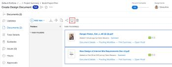

# Comparar provas

Você pode usar o visualizador de provas para comparar duas provas diferentes ou duas versões da mesma prova.

## Requisitos de acesso

+++ Expanda para visualizar os requisitos de acesso para a funcionalidade neste artigo.

Você deve ter o seguinte acesso para executar as etapas deste artigo:

<table style="table-layout:auto"> 
 <col> 
 <col> 
 <tbody> 
  <tr> 
   <td role="rowheader">plano do Adobe Workfront*</td> 
   <td> 
Plano atual: Pro ou Superior
 
ou
 
Plano herdado: Select ou Premium
 
Para obter mais informações sobre acesso de revisão de texto com os diferentes planos, consulte <a href="/help/quicksilver/administration-and-setup/manage-workfront/configure-proofing/access-to-proofing-functionality.md" class="MCXref xref">Acesso à funcionalidade de revisão de texto no Workfront</a>.
 </td> 
  </tr> 
  <tr> 
   <td role="rowheader">Licença da Adobe Workfront*</td> 
   <td> 
Plano atual: revisão
 
Plano herdado: revisão
 </td> 
  </tr> 
  <tr> 
   <td role="rowheader">Perfil de Permissões de Prova </td> 
   <td>Gerente ou superior</td> 
  </tr> 
  <tr> 
   <td role="rowheader">Configurações de nível de acesso*</td> 
   <td> 
Editar acesso a documentos
 
Para obter informações sobre como solicitar acesso adicional, consulte <a href="../../../../workfront-basics/grant-and-request-access-to-objects/request-access.md" class="MCXref xref">Solicitar acesso aos objetos </a>.
 </td> 
  </tr> 
 </tbody> 
</table>

&#42;Para saber qual perfil de plano, função ou permissão de prova você tem, contate o administrador do Workfront ou do Workfront Proof.

+++

## Comparar duas provas diferentes

É possível comparar duas provas em qualquer lista de documentos única, como na guia Documentos de um projeto, tarefa, problema, portfólio ou na área Documentos principal.

1. Vá para a lista de documentos que contém os dois documentos de prova que você deseja comparar.
1. Selecione o primeiro documento que deseja comparar, mantenha pressionada a tecla Command (no Mac) ou a tecla Ctrl (no Windows) e selecione o segundo documento que deseja comparar.

   >[!NOTE]
   >
   >Uma prova já deve ter sido gerada para cada documento selecionado para comparação.

1. Clique em **Comparar Provas**.

   <!--
   
If this button is not visible, ensure that two proofed documents are selected.

   -->

   

   Ambas as provas são exibidas no visualizador de provas em uma visualização lado a lado. Você pode revisar cada documento enquanto os compara.

   Navegações estruturais separadas acima de cada prova permitem exibir e ir para o item de trabalho associado à prova:

   

   Para obter informações sobre as ferramentas que podem ser usadas para comparar as duas provas, consulte  [Use as ferramentas de comparação](../../../../workfront-proof/wp-work-proofsfiles/review-proofs-wpv/compare-proofs.md#using-compare-tools) em [Comparar provas no visualizador de provas](../../../../workfront-proof/wp-work-proofsfiles/review-proofs-wpv/compare-proofs.md).

## Comparar duas versões da mesma prova

Para obter informações sobre como comparar duas versões da mesma prova, consulte [Comparar versões de prova](../../../../workfront-proof/wp-work-proofsfiles/review-proofs-wpv/compare-proofs.md#comparing-proof-versions) em [Comparar provas no visualizador de provas](../../../../workfront-proof/wp-work-proofsfiles/review-proofs-wpv/compare-proofs.md).
