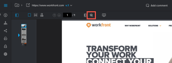
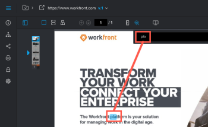

# Pesquisar conteúdo em uma prova

É possível localizar rapidamente o texto em uma prova criada para os seguintes tipos de documentos:

* PDF
* Office (.doc, .docx, .odt)
* Página da Web estática

>[!NOTE]
>
>Provas criadas antes de 26 de abril de 2017 podem não ser pesquisáveis.

## Requisitos de acesso

+++ Expanda para visualizar os requisitos de acesso da funcionalidade neste artigo.

<table style="table-layout:auto"> 
 <col> 
 <col> 
 <tbody> 
  <tr> 
   <td role="rowheader">Pacote do Adobe Workfront</td> 
   <td> 
Qualquer
 </td> 
  </tr> 
  <tr> 
   <td role="rowheader">Licença do Adobe Workfront</td> 
   <td> 
Qualquer
 </td> 
  </tr> 
  <tr> 
   <td role="rowheader">Função de prova </td> 
   <td>Revisor, Revisor e aprovador, Autor, Moderador</td> 
  </tr> 
  <tr> 
   <td role="rowheader">Perfil de Permissões de Prova </td> 
   <td>Gerente ou superior</td> 
  </tr> 
  <tr> 
   <td role="rowheader">Configurações de nível de acesso</td> 
   <td> 
Editar acesso a documentos
 </td> 
  </tr> 
 </tbody> 
</table>

Para obter informações, consulte [Requisitos de acesso na documentação do Workfront](/help/quicksilver/administration-and-setup/add-users/access-levels-and-object-permissions/access-level-requirements-in-documentation.md).

+++

## Pesquisar conteúdo em uma prova

1. Abra a prova que deseja pesquisar.
1. Na barra de ferramentas acima da prova, clique no ícone **Pesquisar documento**.

   

1. Comece a digitar o texto que deseja pesquisar.

   A ferramenta de pesquisa realça o texto no documento à medida que você digita.

   

1. Termine de digitar o texto que deseja pesquisar e clique nas setas **Para cima** e **Para baixo** para examinar os resultados da pesquisa dentro da prova.
