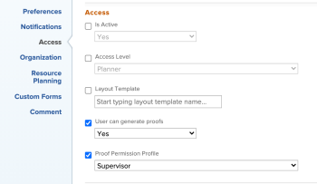

# Edite o campo Perfil de permissão de prova em massa

## Requisitos de acesso

Você deve ter o seguinte acesso para executar as etapas neste artigo:

<table style="table-layout:auto"> 
 <col> 
 <col> 
 <tbody> 
  <tr> 
   <td role="rowheader">Plano Adobe Workfront*</td> 
   <td> 
Plano atual: Pro ou superior
 
ou
 
Plano herdado: Selecionar ou Premium
 
Para obter mais informações sobre como revisar o acesso com os diferentes planos, consulte <a href="/help/quicksilver/administration-and-setup/manage-workfront/configure-proofing/access-to-proofing-functionality.md" class="MCXref xref">Acesso à funcionalidade de prova no Workfront</a>.
 </td> 
  </tr> 
  <tr> 
   <td role="rowheader">Licença da Adobe Workfront*</td> 
   <td> 
Você deve ser um administrador do Workfront. Para obter informações sobre administradores do Workfront, consulte <a href="../../../administration-and-setup/add-users/configure-and-grant-access/grant-a-user-full-administrative-access.md" class="MCXref xref">Conceder ao usuário acesso administrativo total</a>.
 </td> 
  </tr> 
  <tr> 
   <td role="rowheader">Perfil de Permissões de Prova </td> 
   <td>Administrador</td> 
  </tr> 
  <tr> 
   <td role="rowheader">Configurações de nível de acesso*</td> 
   <td> 
Editar acesso a documentos
 
Para obter informações sobre como solicitar acesso adicional, consulte <a href="../../../workfront-basics/grant-and-request-access-to-objects/request-access.md" class="MCXref xref">Solicitar acesso a objetos </a>.
 </td> 
  </tr> 
 </tbody> 
</table>

&#42;Para descobrir qual plano, função ou Perfil de permissão de prova você possui, entre em contato com o administrador da Workfront ou da Workfront Proof.

## Edite o campo Perfil de permissão de prova em massa

1. Clique no botão **Menu principal** ícone  no canto superior direito do Adobe Workfront, em seguida, clique em **Usuários** .

1. Classifique seus usuários por **Nível de acesso**. Recomendamos a edição em lote por Nível de acesso para garantir que a variável **Perfil de permissão de prova** é exibido.

1. Clique na caixa de seleção ao lado dos usuários que deseja selecionar no mesmo nível de acesso. O campo Perfil de Permissão de Prova está disponível somente para níveis de acesso do Trabalhador e superiores.
1. Clique em **Editar** na parte superior da lista.
1. No **Acesso** , encontre a **Perfil de permissão de prova** e faça sua seleção.

   >[!NOTE]
   >
   >Dependendo do seu plano da Workfront, talvez seja necessário ativar o **O usuário pode gerar provas** caixa de seleção para a **Perfil de permissão de prova** para ser exibido.

   

1. Clique em **Salvar alterações**.
