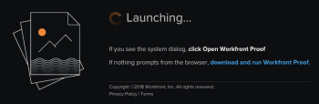

# Perguntas frequentes sobre o visualizador de provas para desktop

## Minha organização não revisa conteúdo interativo. Ainda preciso instalar o Desktop Proofing Viewer?

Não. O Visualizador de provas de desktop é projetado especificamente para a prova de sites em tempo real e para a prova de conteúdo interativo da Web, como anúncios em banners.

No entanto, em sua organização o instala, observe que ele também pode ser usado para revisar qualquer um dos outros tipos de conteúdo estático e de vídeo compatíveis. 

Para obter mais informações, consulte [Diferenças entre o Visualizador de Provas da Web e a visão geral do Visualizador de Provas do Desktop](../../../review-and-approve-work/proofing/proofing-overview/understand-differences-between-web-viewer.md)

## Minha organização não permite que os usuários instalem aplicativos. Existe uma maneira de contornar isso com o Visualizador de provas de desktop?

Infelizmente não. Você precisa trabalhar com o departamento de TI para instalar o Desktop Proofing Viewer localmente. Pergunte a eles sobre o processo de certificação de software para uso interno da sua organização. Podemos fornecer informações sobre como protegemos os produtos da Adobe Workfront.

## Há outra maneira de revisar sites?

Sim. Você pode usar o novo Visualizador de provas da Web para criar uma captura estática da Web de um site. Cada uma das páginas resultantes na prova é uma imagem de uma página no site. Os revisores podem exibir uma ou mais subpáginas em um site maior. O único requisito para isso é que o site seja acessível publicamente pelos nossos servidores.

Para obter mais informações, consulte

## Como instalar o Desktop Viewer no meu sistema local?

Abra uma prova interativa e baixe o aplicativo diretamente da tela do Launch.

 

## As novas versões do Desktop Viewer exigem uma reinstalação?

Não. As atualizações para o Desktop Viewer são automatizadas e não exigem nada de você ou de seus usuários finais.

## O Visualizador de desktop é necessário quando envio a prova para minha parte interessada externa?

Somente se estiver enviando uma prova interativa ou um site em tempo real para a parte interessada externa. Se você precisar carregar o Visualizador de provas de desktop localmente para exibir um conteúdo, todos os outros usuários (internos ou externos) precisarão fazer o mesmo antes de visualizá-lo.

## Qual é o status do visualizador de provas herdadas, que minha organização usou para provas interativas?

Antes da versão 2018.3, o visualizador de provas herdadas era compatível. Com a versão 2018.3 (em novembro de 2018), o visualizador de prova herdada e todos os outros aplicativos que dependem do Flash foram removidos e não estão mais disponíveis. 

Para provas estáticas e de vídeo, o novo Visualizador de provas da Web é o visualizador padrão. Para provas interativas, o Visualizador de provas de desktop é o visualizador padrão.

<!--For more information, see [Legacy proofing viewer removed in 2018.3](../../../workfront-proof/wp-work-proofsfiles/review-proofs-lpv/lpv-removed-2018.md)-->
