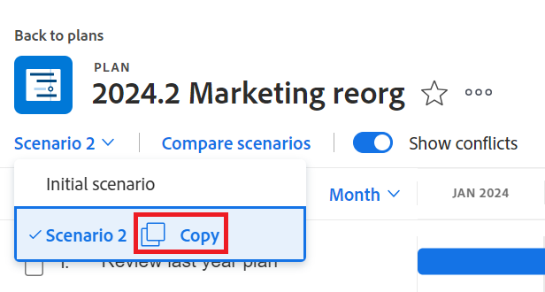

# Criar e comparar cenários de planejamento no [!DNL Scenario Planner]

Quando você está planejando a estratégia de longo prazo de sua empresa, há muitas informações que você pode não ter ou pensar no início. Leva tempo e experimentação para chegar a uma estratégia final que suas partes interessadas possam aceitar. A realização de uma análise de hipóteses para criar vários cenários para o seu plano pode ajudá-lo a prever e avaliar com precisão as circunstâncias potenciais e, em última análise, desenvolver o melhor plano possível.

## Requisitos de acesso

Você deve ter o seguinte:

<table style="table-layout:auto"> 
 <col> 
 <col> 
 <tbody> 
  <tr> 
   <td> 
[!DNL Adobe Workfront]<b> plano*</b> 
 </td> 
   <td>[!UICONTROL Business] ou superior</td> 
  </tr> 
  <tr> 
   <td> 
[!DNL Adobe Workfront]<b> licença*</b> 
 </td> 
   <td> 
[!UICONTROL Review] ou superior
 </td> 
  </tr> 
  <tr> 
   <td><b>Produto</b> </td> 
   <td> 
Você deve comprar uma licença adicional para o [!DNL Adobe Workfront Scenario Planner] acessar a funcionalidade descrita neste artigo.
 
Para obter informações sobre como obter o [!DNL Workfront Scenario Planner], consulte <a href="../scenario-planner/access-needed-to-use-sp.md" class="MCXref xref">Acesso necessário para usar o [!DNL Scenario Planner]</a>. 
 </td> 
  </tr> 
  <tr data-mc-conditions=""> 
   <td><strong>Configurações de nível de acesso*</strong> </td> 
   <td> 
Editar acesso ou superior à [!DNL Scenario Planner]
 
Observação: se você ainda não tiver acesso, pergunte ao administrador do [!DNL Workfront] se ele definiu restrições adicionais no seu nível de acesso. Para obter informações sobre como um administrador do Workfront pode alterar seu nível de acesso, consulte <a href="../administration-and-setup/add-users/configure-and-grant-access/create-modify-access-levels.md" class="MCXref xref">Criar ou modificar níveis de acesso personalizados</a>.
 </td> 
  </tr> 
  <tr data-mc-conditions=""> 
   <td> 
<strong>Permissões de objeto</strong> 
 </td> 
   <td> 
[!UICONTROL Gerenciar] permissões para um plano
 
Para obter informações sobre como solicitar acesso adicional a um plano, consulte <a href="../scenario-planner/request-access-to-plan.md" class="MCXref xref">Solicitar acesso a um plano no [!DNL Scenario Planner]</a>.
 </td> 
  </tr> 
 </tbody> 
</table>

&#42;Para saber qual plano, tipo de licença ou acesso você tem, contate o administrador do [!DNL Workfront].

## Criar cenários

Um cenário é uma cópia de um plano. Você pode criar quantos cenários forem necessários. No entanto, recomendamos que você mantenha o número de cenários no mínimo para que possa compará-los facilmente.

1. Clique no ícone  do **[!UICONTROL Menu principal]** e em [!UICONTROL Cenários].

1. Crie um plano.

   Para obter informações sobre como criar planos, consulte [Criar e editar planos no [!DNL Scenario Planner]](../scenario-planner/create-and-edit-plans.md).

   O primeiro plano que você criar será salvo automaticamente como o &quot;[!UICONTROL Cenário inicial]&quot;.

1. Clique na seta para baixo ao lado de um cenário existente e clique no ícone **[!UICONTROL Copiar]**.

   

   Isso cria um novo cenário com as mesmas informações que o cenário copiado. Ele será automaticamente nomeado como &quot;[!UICONTROL Cenário 2]&quot; se for o segundo cenário do seu plano, &quot;[!UICONTROL Cenário 3]&quot; se for o terceiro e assim por diante. Não é possível renomear os cenários. Não há um limite para o número de cópias que você pode fazer.

   <!--
   <MadCap:conditionalText data-mc-conditions="QuicksilverOrClassic.Draft mode">
   (NOTE:this might change)
   </MadCap:conditionalText>
   -->

1. Atualize o novo cenário de qualquer uma das seguintes maneiras:

   * Criar, atualizar ou excluir iniciativas

     >[!TIP]
     >
     >Ao excluir uma iniciativa em um cenário, ela é removida somente do cenário selecionado, não de todos os cenários.

     Para obter informações sobre como criar iniciativas, consulte [Criar e editar iniciativas no [!DNL Scenario Planner]](../scenario-planner/create-and-edit-initiatives.md).

   * Atualize as prioridades de suas iniciativas
   * Ajustar pessoas ou informações de orçamento
   * Revisar e ajustar conflitos de iniciativa em seu cenário

     Para obter informações sobre como resolver conflitos, consulte [Resolver conflitos de iniciativa no [!DNL Scenario Planner]](../scenario-planner/resolve-conflicts-in-sp.md).

1. Clique em **[!UICONTROL Salvar Plano]** para salvar suas alterações.

## Comparar cenários

Depois de criar seus cenários, você pode compará-los para encontrar o melhor para sua organização.

1. Vá para o plano para o qual deseja comparar cenários.
1. Clique em **[!UICONTROL Comparar cenários]**. A página de comparação de cenários é exibida.

   Todos os cenários existentes para o plano são exibidos lado a lado em formato de cartão. O cenário Inicial é sempre listado primeiro e é estático.

   

1. (Opcional) Role para a direita para exibir todos os cartões de cenário.

   As seguintes informações são exibidas em um cartão de cenário:

   <table style="table-layout:auto"> 
    <col> 
    <col> 
    <tbody> 
     <tr> 
      <td>Nome do cenário</td> 
      <td> 
Um nome gerado automaticamente pelo Workfront e não pode ser editado. Por exemplo, "[!UICONTROL Cenário inicial]", "[!UICONTROL Cenário 2]" e assim por diante. 
 </td> 
     </tr> 
     <tr> 
      <td>Descrição do cenário</td> 
      <td>Uma entrada manual onde você pode descrever informações específicas sobre o cenário. </td> 
     </tr> 
     <tr> 
      <td>Funções de trabalho disponíveis</td> 
      <td>O número de funções de trabalho disponíveis no orçamento do plano durante a duração do plano. </td> 
     </tr> 
     <tr> 
      <td>Funções de trabalho exigidas</td> 
      <td>O número de funções de trabalho necessárias, com base em suas iniciativas. </td> 
     </tr> 
     <tr> 
      <td>Orçamento</td> 
      <td>O orçamento total definido para o plano neste cenário. Para obter informações de orçamento sobre planos, consulte <a href="../scenario-planner/plans-overview.md" class="MCXref xref">Visão geral dos planos no [!DNL Scenario Planner]</a>. </td> 
     </tr> 
     <tr> 
      <td>Custos</td> 
      <td>Os custos associados às iniciativas no cenário. Para obter informações sobre custos, consulte a <a href="../scenario-planner/initiatives-overview.md" class="MCXref xref">Visão geral das iniciativas no [!DNL Scenario Planner]</a>. </td> 
     </tr> 
     <tr> 
      <td>Utilização</td> 
      <td>A porcentagem de [!UICONTROL Utilização de Orçamento] do plano neste cenário. Para obter informações sobre a porcentagem de [!UICONTROL Budget Utilization], consulte Visão geral de <a href="../scenario-planner/plans-overview.md" class="MCXref xref">planos no [!DNL Scenario Planner]</a>. </td> 
     </tr> 
     <tr> 
      <td>Valor líquido</td> 
      <td>O [!UICONTROL Valor de Rede] do plano neste cenário. Para obter informações sobre o [!UICONTROL Valor Líquido] de um plano, consulte a Visão geral dos <a href="../scenario-planner/plans-overview.md" class="MCXref xref">Planos no [!DNL Scenario Planner]</a>. </td> 
     </tr> 
     <tr> 
      <td>Iniciativas</td> 
      <td>O número de iniciativas do plano neste cenário.</td> 
     </tr> 
     <tr> 
      <td>Conflitante</td> 
      <td>O número de iniciativas que mostram qualquer tipo de conflito no plano para este cenário. Para obter informações sobre conflitos de iniciativas, consulte <a href="../scenario-planner/resolve-conflicts-in-sp.md" class="MCXref xref">Resolver conflitos de iniciativa no [!DNL Scenario Planner]</a>. </td> 
     </tr> 
    </tbody> 
   </table>

   >[!NOTE]
   >
   >Quando as informações diferem entre o cenário inicial e os cenários adicionais, uma seta para cima ou para baixo é exibida ao lado do valor que foi alterado para indicar um aumento ou uma diminuição nesse valor em comparação ao cenário inicial.
   >
   >
   >
   >
   >Por exemplo, o orçamento, o número de funções de trabalho e o número de iniciativas podem mudar de um cenário para outro.

1. Clique no nome de um cenário para acessá-lo e alterá-lo.

   Para obter mais informações, consulte a seção [Criar cenários](#create-scenarios) neste artigo.

1. Clique em **[!UICONTROL Adicionar descrição]** para adicionar uma descrição para o cenário

   Ou

   Clique no campo de descrição para atualizá-lo e, em seguida, clique em qualquer lugar na tela para salvar suas alterações.

1. (Opcional) Clique no menu **[!UICONTROL Mais]**  para **[!UICONTROL Copiar]** ou **[!UICONTROL Excluir]** o cenário.

   

   Ao copiar um cenário, ele aparece automaticamente na página do cartão e é renomeado de acordo com este padrão: &quot;[!UICONTROL Cenário] `<next number in order>`.&quot;

1. (Condicional) Se você clicou em **[!UICONTROL Excluir]**, clique em **[!UICONTROL Sim, exclua-o]** para confirmar.

   Os cenários excluídos não podem ser recuperados.

   Para obter informações sobre como excluir cenários, consulte [Excluir planos na [!DNL Scenario Planner]](../scenario-planner/delete-plans.md).

1. Clique em **[!UICONTROL Salvar Plano]** para salvar seus cenários e seu plano.
