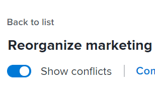
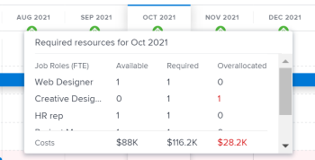

# Resolver conflitos de iniciativa no [!DNL Scenario Planner]

Quando as iniciativas entram em conflito umas com as outras, elas estão competindo pelos mesmos recursos. Os recursos disponíveis para um cenário não são suficientes para cobrir todos os recursos necessários para todas as iniciativas no cenário.

Isso pode acontecer em qualquer um dos seguintes casos:

* O número de funções de trabalho necessárias para a iniciativa é maior do que o número de funções orçadas para o plano.
* Os custos da iniciativa são maiores do que o valor do orçamento disponível para o plano.

## Requisitos de acesso

+++ Expanda para visualizar os requisitos de acesso para a funcionalidade neste artigo.

<table style="table-layout:auto"> 
 <col> 
 <col> 
 <tbody> 
  <tr> 
   <td> 
[!DNL Adobe Workfront] plano*
 </td> 
   <td> <ul></li>
   <li>
Novo: Ultimate 
</li>
   
O Planejador de cenários não está disponível para o novo Workfront Select ou Workfront Plan. 

   <li>
Atual: [!UICONTROL Business] ou superior
</ul>
   </td> 
  </tr> 
  <tr> 
   <td> 
[!DNL Adobe Workfront] licença*
 </td> 
   <td> 
Novo: Claro ou superior
 
   
Atual: [!UICONTROL Review] ou posterior
 </td> 
  </tr> 
  <tr> 
   <td>Produto* </td> 
   <td> <ul><li>
Para os novos planos do Workfront:

 Adobe Workfront</li>

   <li>
Para os planos atuais do Workfront: 

   
Adobe Workfront
 
Planejador de cenários do Adobe Workfront
</li></ul>

Para obter mais informações, consulte <a href="../scenario-planner/access-needed-to-use-sp.md" class="MCXref xref">Acesso necessário para usar o [!DNL Scenario Planner]</a>. 
 </td> 
  </tr> 
  <tr data-mc-conditions=""> 
   <td>Nível de acesso </td> 
   <td> 
[!UICONTROL Editar] acesso à [!DNL Scenario Planner]
 </td> 
  </tr> 
  <tr data-mc-conditions=""> 
   <td> 
Permissões de objeto 
 </td> 
   <td> 
[!UICONTROL Gerenciar] permissões para um plano
 
Para obter informações sobre como solicitar acesso adicional a um plano, consulte <a href="../scenario-planner/request-access-to-plan.md" class="MCXref xref">Solicitar acesso a um plano no [!DNL Scenario Planner]</a>.
 </td> 
  </tr> 
 </tbody> 
</table>

*Para obter informações, consulte [Requisitos de acesso à documentação do Workfront](/help/quicksilver/administration-and-setup/add-users/access-levels-and-object-permissions/access-level-requirements-in-documentation.md).

+++

## Visão geral da resolução de conflitos

* Um conflito também é entendido como uma superalocação das funções de trabalho ou do orçamento de um cenário.
* Quando [!DNL Workfront] detecta um conflito, a barra correspondente ao mês conflitante durante a duração da iniciativa é exibida em vermelho. Isso pode acontecer em qualquer um dos seguintes casos:

   * O número de funções de trabalho necessárias mensalmente para uma iniciativa é maior que o número de funções orçadas para o plano depois que todas as iniciativas anteriores tiverem usado os recursos orçados para o plano.
   * Os custos mensais da iniciativa são maiores do que o orçamento disponível para o plano depois que todas as iniciativas anteriores tiverem usado o orçamento do plano para cobrir seus custos.

>[!TIP]
>
>Por padrão, o [!DNL Scenario Planner] presume que você tenha orçado 0 funções de trabalho e $0 ou o equivalente a $0 na moeda do sistema para um cenário, a menos que você tenha especificado o contrário. O número de funções de trabalho indica o número de FTEs (Equivalentes de Tempo Integral) ou horas orçadas para a função de trabalho.
>
>Para todos os cálculos no Planejador de cenários, o Workfront usa o seguinte valor: 1 FTE = 8 Horas.
>
>Para obter informações sobre como atualizar as funções disponíveis para um plano e um orçamento, consulte [Criar e editar planos no [!DNL Scenario Planner]](../scenario-planner/create-and-edit-plans.md).

* Você pode resolver um conflito seguindo um destes procedimentos:

   * Adicionar os recursos necessários ausentes automaticamente das iniciativas no cenário. Este artigo descreve como resolver conflitos usando essa opção.
   * Ajustar a função de trabalho e os recursos de orçamento para o cenário, editando o plano. Para obter mais informações, consulte [Criar e editar planos no [!DNL Scenario Planner]](../scenario-planner/create-and-edit-plans.md).

## Resolver conflitos entre iniciativas

1. Vá para um plano para o qual deseja resolver conflitos.

   Para obter informações sobre como criar planos, consulte [Criar e editar planos no [!DNL Scenario Planner]](../scenario-planner/create-and-edit-plans.md).

   Para obter informações sobre como criar iniciativas, consulte [Criar e editar iniciativas no [!DNL Scenario Planner]](../scenario-planner/create-and-edit-initiatives.md).

1. (Opcional) No menu suspenso **[!DNL Initial scenario]**, selecione o cenário que deseja revisar.

   >[!TIP]
   >
   >Um plano pode ter vários cenários. Ao analisar os conflitos do plano, [!DNL Workfront] se refere aos recursos disponíveis no momento no cenário selecionado e aos recursos necessários nas iniciativas desse cenário. Para obter informações sobre cenários, consulte [Criar e comparar cenários de planejamento em [!DNL Scenario Planner]](../scenario-planner/create-and-compare-scenarios-for-a-plan.md).

1. Verifique se **[!UICONTROL Mostrar conflitos]** está habilitado. Ela é ativada por padrão.

   

   A primeira iniciativa conflitante exibe os meses com conflitos em vermelho e um ícone de aviso é exibido ao lado do nome da iniciativa.

   O plano de fundo de todas as iniciativas que começam com a primeira conflitante é exibido em vermelho no gráfico do plano.

   Quando uma iniciativa exibe um conflito, significa que o número de funções de trabalho para pelo menos uma função específica, os custos incorridos ou ambos excedem o número de funções de trabalho ou o orçamento definido para o plano para um mês específico.

   

1. Siga um destes procedimentos para entender mais sobre os conflitos que podem existir:

   * Passe o mouse sobre o ícone de aviso ao lado do nome da iniciativa para entender se você tem uma função de trabalho ou um conflito de orçamento.

     

     Dependendo de você ter superalocado funções de trabalho ou superestimado custos para a sua iniciativa, você poderá ver uma das seguintes opções ao passar o mouse sobre o ícone de aviso:

      * Exibir detalhes dos conflitos das funções de trabalho
      * Exibir detalhes dos conflitos do orçamento
      * Mostrar detalhes da função de trabalho e do orçamento

   * Ao exibir o plano por mês, passe o mouse sobre um mês na linha do tempo do plano para exibir os recursos necessários para esse mês e se os conflitos do mês são pessoas ou relacionados ao custo.

     

     Revise as seguintes informações mensais no nível do plano:

      * O número de funções de trabalho disponíveis, necessárias e superalocadas para o mês para todas as iniciativas planejadas para o mês
      * Os custos disponíveis, necessários e superalocados do mês para todas as iniciativas planejadas para esse mês

        >[!TIP]
        >
        >Os custos [!UICONTROL Disponíveis] são o orçamento do cenário para esse mês.

   * Passe o mouse sobre a barra vermelha de uma iniciativa por um mês para exibir a caixa de informações adicionais sobre o conflito que ocorre nesse mês.

     

     Revise os seguintes campos na caixa de informações adicionais no nível da iniciativa:

     <table style="table-layout:auto"> 
      <col> 
      <col> 
      <tbody> 
       <tr> 
        <td role="rowheader">Mês em que o conflito ocorre</td> 
        <td>É exibido no título da caixa de informações adicionais.</td> 
       </tr> 
       <tr> 
        <td role="rowheader">O nome da iniciativa</td> 
        <td>É exibido no título da caixa de informações adicionais.</td> 
       </tr> 
       <tr> 
        <td role="rowheader">[!UICONTROL Funções de Trabalho]</td> 
        <td> 
As funções de trabalho associadas a esta iniciativa que estão superalocadas para o mês selecionado. As seguintes colunas exibem informações para cada função de trabalho que é necessária para o mês selecionado e que está em conflito com o número de funções de trabalho disponíveis para esse mês:
 
         <ul> 
          <li> 
<strong>[!UICONTROL Disponível]</strong>: O número de cada função de trabalho disponível no cenário para o mês selecionado.
 </li> 
          <li> 
<strong>[!UICONTROL Necessário]</strong>: O número de cada função de trabalho necessária para a iniciativa do mês selecionado.
 </li> 
          <li> 
<strong>[!UICONTROL Superalocado]:</strong> A diferença entre o número necessário na iniciativa e o número disponível no cenário. 
 </li> 
         </ul> 
Dica: às vezes, o número de funções [!UICONTROL Disponível] corresponde ou é maior que o número de funções [!UICONTROL Necessário], mas [!DNL Scenario Planner] ainda mostra uma superalocação. Isso significa que há iniciativas com classificação mais alta que já usaram as funções de trabalho disponíveis no plano para o mesmo mês. 
 </td> 
       </tr> 
       <tr> 
        <td role="rowheader">Custos</td> 
        <td> 
Os custos da iniciativa para o mês selecionado. As seguintes colunas exibem informações para os custos necessários e o orçamento disponível do mês selecionado:
 
         <ul> 
          <li> 
<strong>[!UICONTROL Disponível]</strong>: O orçamento disponível do plano para o mês selecionado.
 </li> 
          <li> 
<strong>[!UICONTROL Necessário]</strong>: os custos associados a esta iniciativa para o mês selecionado.
 </li> 
          <li> 
<strong>[!UICONTROL Superalocado]:</strong> A diferença entre os custos da iniciativa e o orçamento disponível no plano. 
 </li> 
         </ul> 
Dica: às vezes, os custos da [!UICONTROL Disponível] correspondem ou são maiores que o custo da iniciativa [!UICONTROL Necessário] para o mês selecionado e o [!DNL Scenario Planner] ainda mostra uma superalocação de custos. Isso significa que há iniciativas com classificação mais alta que já usam o orçamento disponível no plano para o mesmo mês. 
 </td> 
       </tr> 
      </tbody> 
     </table>

1. Siga um destes procedimentos para abrir o painel de detalhes da iniciativa e exibir mais informações sobre onde os conflitos ocorrem e resolvê-los:

   * Clique no ícone de aviso ao lado do nome da iniciativa.
   * Clique na barra de uma iniciativa.
   * Clique no ícone **[!UICONTROL Mais]**  à direita do nome da iniciativa e clique em **[!UICONTROL Editar]**.

     O painel de detalhes da iniciativa é exibido à direita.

     Quando não houver pessoas ou orçamento suficientes disponíveis para a sua iniciativa, um ícone vermelho de aviso será exibido ao lado das seguintes seções:

   * [!UICONTROL Funções de Trabalho Necessárias]
   * [!UICONTROL Custos]

1. (Condicional) Para iniciativas que tenham conflitos de função de trabalho, vá para a seção **[!UICONTROL Funções de Trabalho Necessárias]** para exibir todas as funções de trabalho necessárias para sua iniciativa. Identifique quais funções de trabalho podem estar superalocadas. Revise o número de FTE ou horas necessárias para cada função de trabalho para cada mês da iniciativa. A caixa com o FTE ou o número de horas para meses com superalocações é exibida em um outline vermelho.

   

1. (Opcional) Clique na seta à direita ao lado dos meses na linha do tempo da iniciativa para visualizar quais meses adicionais exibem conflitos de função de trabalho.

   

1. (Opcional) Clique em **[!UICONTROL Mostrar detalhes]** na função de trabalho que exibe um conflito para ver onde os conflitos aparecem e para realçar os meses conflitantes na área do gráfico do plano. Informações adicionais são exibidas para cada função de trabalho.

   Os seguintes campos são exibidos para cada função de trabalho:

   <table style="table-layout:auto"> 
    <col> 
    <col> 
    <tbody> 
     <tr> 
      <td role="rowheader">[!UICONTROL Disponível]</td> 
      <td> 
O número de funções de trabalho disponíveis no plano para cada mês. 
 </td> 
     </tr> 
     <tr> 
      <td role="rowheader">[!UICONTROL Previamente alocado]</td> 
      <td>O número de funções de trabalho já alocadas a partir do orçamento do plano para iniciativas com classificação mais alta para um mês específico. </td> 
     </tr> 
     <tr> 
      <td role="rowheader">[!UICONTROL Superalocado]</td> 
      <td> 
A diferença entre o número de funções de trabalho necessárias na iniciativa e o número disponível no plano após iniciativas com classificação mais alta também usou algumas das funções. O Workfront calcula o número de funções de trabalho [!UICONTROL Overlocated] usando a seguinte fórmula:
 
<code>Overallocated roles = (Roles Previously Allocated to higher initiatives + Required roles for current initiative) - Monthly available roles from the plan</code> 
 </td> 
     </tr> 
    </tbody> 
   </table>

   >[!TIP]
   >
   >No gráfico do plano, os meses em que as funções de trabalho são alocadas exibem o nome e o número de funções necessárias para cada iniciativa em que são necessárias. Você deve selecionar o modo de exibição [!UICONTROL Mês] para ver o nome das funções de trabalho

   

1. Siga um destes procedimentos para resolver conflitos de funções de trabalho:

   * Ajuste manualmente o número de funções de trabalho para cada mês da iniciativa para um número menor.
   * Passe o mouse sobre o nome da função de trabalho e clique no ícone **[!UICONTROL excluir]**  para remover a função de trabalho da iniciativa.
   * Selecione **[!UICONTROL Adicionar funções aos recursos disponíveis do cenário]** e clique em **[!UICONTROL Aplicar]**.

     Isso adiciona o número ausente de FTEs ou horas de funções de trabalho ao campo [!UICONTROL Disponível] do cenário.

     >[!NOTE]
     >
     >As funções adicionadas para resolver conflitos modificam as funções de trabalho [!UICONTROL Disponíveis] para o cenário selecionado e não para todos os cenários no plano.

     Uma seta verde para cima  é exibida para o mês na linha do tempo do plano para indicar que mais recursos foram adicionados ao plano naquele mês. Você deve selecionar o modo de exibição [!UICONTROL Mês] para ver este indicador.

   * (Condicional) Feche o painel de detalhes e dê à iniciativa uma prioridade mais alta para receber recursos do orçamento do plano primeiro, se possível. Para obter informações sobre como atualizar a prioridade da iniciativa, consulte [Atualizar prioridades de iniciativa no Planejador de Cenários](../scenario-planner/prioritize-initiatives.md).

1. (Opcional) Clique em **[!UICONTROL Ocultar detalhes]** para fechar a caixa de detalhes adicionais e em **[!UICONTROL Aplicar]** para salvar as alterações feitas nas funções de trabalho.

1. (Condicional) Para iniciativas que tenham conflitos de custos, vá para a seção **[!UICONTROL Custos]** no painel de detalhes da iniciativa para analisar os custos de cada mês de duração da iniciativa. Identifique quais meses podem não ter dinheiro suficiente no orçamento do plano para cobrir os custos da iniciativa selecionada. A caixa com o orçamento disponível insuficiente é exibida em uma estrutura vermelha.
1. (Opcional) Clique na seta à direita ao lado dos meses na linha do tempo da iniciativa para visualizar os meses adicionais que têm orçamento insuficiente para cobrir os custos.

   

1. (Opcional) Clique em **[!UICONTROL Mostrar detalhes]** nas informações de custo para ver onde o conflito aparece e para realçar os meses conflitantes no gráfico do plano. Os seguintes campos adicionais são exibidos para cada tipo de custo:

   <table style="table-layout:auto"> 
    <col> 
    <col> 
    <tbody> 
     <tr> 
      <td role="rowheader">[!UICONTROL Disponível]</td> 
      <td> 
Os custos disponíveis no Orçamento do plano para cada mês. 
 </td> 
     </tr> 
     <tr> 
      <td role="rowheader">[!UICONTROL Previamente alocado]</td> 
      <td>A quantidade de dinheiro já alocada do orçamento do plano para iniciativas com classificação mais alta. </td> 
     </tr> 
     <tr> 
      <td role="rowheader">[!UICONTROL Superalocado]</td> 
      <td> 
A diferença mensal entre os custos necessários para a iniciativa e a quantidade de dinheiro disponível no orçamento do plano após iniciativas com classificação mais alta também usou parte do orçamento disponível. [!DNL Workfront] calcula o número de Custos superalocados usando a seguinte fórmula:
 
<code>Overallocated costs = (Costs Previously Allocated to higher initiatives + Required costs for the current initiative) - Monthly available budget from the plan</code> 
 
[!DNL Workfront] O calcula os Custos obrigatórios da iniciativa atual para cada mês usando a seguinte fórmula:
 
<code>Required initiative costs = Initiative Fixed Costs + Initiative People Costs</code> 
 </td> 
     </tr> 
    </tbody> 
   </table>

   >[!TIP]
   >
   >No gráfico do plano, os meses em que os custos são insuficientes exibem o nome e o número de funções ainda necessárias para a iniciativa. Você deve selecionar a exibição Mês para exibir os valores de custo.

   

   >[!NOTE]
   >
   >Se você desativou a configuração [!UICONTROL Incluir custo de pessoas] da caixa [!UICONTROL Orçamento] do plano ao criar o plano, a linha [!UICONTROL Custos de Pessoas] não será exibida para nenhuma iniciativa em nenhum cenário. Nesse caso, a Workfront não leva os Custos de pessoas em cálculos para determinar conflitos de custo. Para obter informações sobre como criar um plano, consulte [Criar e editar planos no [!DNL Scenario Planner]](../scenario-planner/create-and-edit-plans.md).

1. Siga um destes procedimentos para resolver conflitos de custos:

   * Ajuste manualmente o número de [!UICONTROL Custos fixos] para cada mês da iniciativa para um número menor.
   * Na seção **[!UICONTROL Funções de trabalho necessárias]**, ajuste manualmente o número de funções de trabalho do mês com um orçamento de Custos de pessoas, se possível. Isso reduz o número de Custos de pessoas.

     >[!TIP]
     >
     >Você não pode ajustar manualmente os Custos de Pessoas.

   * Selecione **[!UICONTROL Adicionar valor ao orçamento do cenário]** e clique em **[!UICONTROL Aplicar]**.

     Isso adiciona o valor insuficiente ao orçamento do cenário para os meses em que estava ausente, o que também atualiza o orçamento geral do cenário.

     >[!NOTE]
     >
     >O valor adicionado para resolver os conflitos de custo modifica o Orçamento para o cenário selecionado e não para todos os cenários no plano.

   * (Condicional) Feche o painel de detalhes e dê à iniciativa uma prioridade mais alta para receber recursos do orçamento do plano primeiro, se possível. Para obter informações sobre como atualizar a prioridade da iniciativa, consulte [Atualizar prioridades da iniciativa no [!DNL Scenario Planner]](../scenario-planner/prioritize-initiatives.md).

1. Clique em **[!UICONTROL Aplicar]** quando fizer alterações na seção Custos.
1. Clique em **[!UICONTROL Salvar plano]** para salvar suas alterações.

