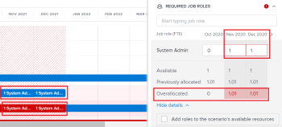

# Resolver conflitos de iniciativa na [!DNL Scenario Planner]

Quando as iniciativas entram em conflito umas com as outras, estão a competir pelos mesmos recursos. Os recursos disponíveis para um cenário não são suficientes para cobrir todos os recursos necessários para todas as iniciativas do cenário.

Isso pode acontecer em qualquer um dos seguintes casos:

* O número de funções necessárias para a iniciativa é superior ao número de funções orçadas para o plano.
* Os custos da iniciativa são superiores ao montante orçamental disponível para o plano.

## Requisitos de acesso

Você deve ter o seguinte:

<table style="table-layout:auto"> 
 <col> 
 <col> 
 <tbody> 
  <tr> 
   <td> 
[!DNL Adobe Workfront]<b> plano*</b> 
 </td> 
   <td>[!UICONTROL Business] ou superior</td> 
  </tr> 
  <tr> 
   <td> 
[!DNL Adobe Workfront]<b> licença*</b> 
 </td> 
   <td> 
[!UICONTROL Review] ou superior
 </td> 
  </tr> 
  <tr> 
   <td><b>Produto</b> </td> 
   <td> 
Você deve comprar uma licença adicional para a [!DNL Adobe Workfront Scenario Planner] para acessar a funcionalidade descrita neste artigo.
 
Para obter informações sobre como obter o [!DNL Workfront Scenario Planner], consulte <a href="../scenario-planner/access-needed-to-use-sp.md" class="MCXref xref">O acesso necessário para usar o [!DNL Scenario Planner]</a>. 
 </td> 
  </tr> 
  <tr data-mc-conditions=""> 
   <td><strong>Configurações de nível de acesso*</strong> </td> 
   <td> 
[!UICONTROL Editar] ou superior à [!DNL Scenario Planner]
 
Observação: Se ainda não tiver acesso, pergunte ao seu [!DNL Workfront] administrador se eles definirem restrições adicionais em seu nível de acesso. Para obter informações sobre como uma [!DNL Workfront] administrador pode alterar seu nível de acesso, consulte <a href="../administration-and-setup/add-users/configure-and-grant-access/create-modify-access-levels.md" class="MCXref xref">Criar ou modificar níveis de acesso personalizados</a>.
 </td> 
  </tr> 
  <tr data-mc-conditions=""> 
   <td> 
<strong>Permissões de objeto</strong> 
 </td> 
   <td> 
Permissões do [!UICONTROL Manager] para um plano
 
Para obter informações sobre como solicitar acesso adicional a um plano, consulte <a href="../scenario-planner/request-access-to-plan.md" class="MCXref xref">Solicitar acesso a um plano na [!DNL Scenario Planner]</a>.
 </td> 
  </tr> 
 </tbody> 
</table>

&#42;Para descobrir qual plano, tipo de licença ou acesso você tem, entre em contato com o administrador da Workfront.

## Visão geral da resolução de conflitos

* Um conflito também é entendido como uma atribuição excessiva das funções do emprego ou do orçamento de um cenário.
* When [!DNL Workfront] detecta um conflito, a barra correspondente ao mês conflitante durante a duração da iniciativa é exibida em vermelho. Isso pode acontecer em qualquer um dos seguintes casos:

   * O número de funções necessárias mensalmente para uma iniciativa é superior ao número de funções orçamentadas para o plano após todas as iniciativas anteriores terem utilizado os recursos orçamentados para o plano.
   * Os custos mensais da iniciativa são superiores ao orçamento disponível para o plano, depois de todas as iniciativas anteriores terem utilizado o orçamento do plano para cobrir os seus custos.

>[!TIP]
>
>Por padrão, a variável [!DNL Scenario Planner] O parte do princípio de que você fez orçamento para 0 funções de trabalho e $0 ou o equivalente a $0 na moeda do seu sistema para um cenário, a menos que você tenha especificado o contrário. O número de funções de cargo indica o número de FTEs (Equivalentes de Tempo Total) ou horas orçadas para a função de cargo.
>
>Para todos os cálculos no Planejador de Cenário, o Workfront usa o seguinte valor: 1 FTE = 8 Horas.
>
>Para obter informações sobre como atualizar as funções disponíveis para um plano e um orçamento, consulte [Crie e edite planos na [!DNL Scenario Planner]](../scenario-planner/create-and-edit-plans.md).

* Você pode resolver um conflito seguindo um destes procedimentos:

   * Adicionar os recursos necessários ausentes automaticamente das iniciativas no cenário. Este artigo descreve como resolver conflitos usando esta opção.
   * Ajustar a função da tarefa e os recursos de orçamento para o cenário, editando o plano. Para obter mais informações, consulte [Crie e edite planos na [!DNL Scenario Planner]](../scenario-planner/create-and-edit-plans.md).

## Resolver conflitos entre iniciativas

1. Vá para um plano para o qual deseja resolver conflitos.

   Para obter informações sobre como criar planos, consulte [Crie e edite planos na [!DNL Scenario Planner]](../scenario-planner/create-and-edit-plans.md).

   Para obter informações sobre como criar iniciativas, consulte [Crie e edite iniciativas na [!DNL Scenario Planner]](../scenario-planner/create-and-edit-initiatives.md).

1. (Opcional) Na **[!DNL Initial scenario]** selecione o cenário que deseja revisar.

   >[!TIP]
   >
   >Um plano pode ter vários cenários. Ao analisar os conflitos do plano, [!DNL Workfront] refere-se aos recursos atualmente disponíveis no cenário selecionado e aos necessários nas iniciativas desse cenário. Para obter informações sobre cenários, consulte [Crie e compare cenários de plano na [!DNL Scenario Planner]](../scenario-planner/create-and-compare-scenarios-for-a-plan.md).

1. Certifique-se de que **[!UICONTROL Mostrar conflitos]** estiver ativado. Está ativada por padrão.

   

   A primeira iniciativa conflitante exibe os meses que têm conflitos em vermelho e um ícone de aviso é exibido ao lado do nome da iniciativa.

   O plano de fundo de todas as iniciativas que começam com a primeira conflitante é exibido em vermelho no gráfico do plano.

   Quando uma iniciativa exibe um conflito, significa que o número de funções de trabalho para pelo menos uma função específica, os custos incorridos ou ambos excedem o número de funções de cargo ou o orçamento definido para o plano para um mês específico.

   

1. Siga um destes procedimentos para entender mais sobre os conflitos que podem existir:

   * Passe o mouse sobre o ícone de aviso ao lado do nome da iniciativa para entender se você tem uma função de trabalho ou um conflito de orçamento.

      

      Dependendo de você ter ou não alocado as funções de cargo em excesso ou os custos sobreestimados para sua iniciativa, você poderá ver uma das seguintes opções ao passar o cursor do mouse sobre o ícone de aviso:

      * Exibir detalhes dos conflitos das funções de trabalho
      * Exibir detalhes dos conflitos do orçamento
      * Mostrar a função da tarefa e os detalhes do orçamento
   * Ao exibir o plano por mês, passe o mouse sobre um mês na linha do tempo do plano para visualizar os recursos necessários para esse mês e se os conflitos para o mês são de pessoas ou relacionados ao custo.

      

      Revise as seguintes informações mensais no nível do plano:

      * O número de funções de cargo disponíveis, necessárias e com alocação excessiva para o mês em todas as iniciativas planejadas para esse mês
      * Os custos disponíveis, necessários e com alocação excessiva do mês para todas as iniciativas planejadas para esse mês

         >[!TIP]
         >
         >O [!UICONTROL Disponível] os custos são o orçamento do cenário para esse mês.
   * Passe o mouse sobre a barra vermelha de uma iniciativa por um mês para exibir a caixa de informações adicionais sobre o conflito que ocorre nesse mês.

      

      Revise os seguintes campos na caixa de informações adicionais no nível da iniciativa:

      <table style="table-layout:auto"> 
      <col> 
      <col> 
      <tbody> 
       <tr> 
        <td role="rowheader">Mês em que o conflito ocorre</td> 
        <td>Exibido no título da caixa de informações adicionais.</td> 
       </tr> 
       <tr> 
        <td role="rowheader">O nome da iniciativa</td> 
        <td>Exibido no título da caixa de informações adicionais.</td> 
       </tr> 
       <tr> 
        <td role="rowheader">[!UICONTROL Funções de trabalho]</td> 
        <td> 
As funções de cargo associadas a esta iniciativa que são sobrealocadas para o mês selecionado. As colunas a seguir exibem informações para cada função de trabalho necessária para o mês selecionado e que está em conflito com o número de funções de trabalho disponíveis para esse mês:
 
         <ul> 
          <li> 
<strong>[!UICONTROL Disponível]</strong>: O número de cada função de trabalho disponível no cenário do mês selecionado.
 </li> 
          <li> 
<strong>[!UICONTROL Obrigatório]</strong>: O número de cada função de cargo necessária para a iniciativa no mês selecionado.
 </li> 
          <li> 
<strong>[!UICONTROL Sobrealocado]:</strong> A diferença entre o número necessário na iniciativa e o número disponível no cenário. 
 </li> 
         </ul> 
Dica: Às vezes, o número de funções [!UICONTROL Disponível] corresponde ou é superior ao número de funções [!UICONTROL Obrigatório], mas a variável [!DNL Scenario Planner] ainda exibe uma atribuição excessiva. Isso significa que existem iniciativas de maior classificação que já utilizaram as funções de emprego disponíveis no plano para o mesmo mês. 
 </td> 
       </tr> 
       <tr> 
        <td role="rowheader">Custos</td> 
        <td> 
Os custos da iniciativa para o mês selecionado. As colunas a seguir exibem informações para os custos necessários e o orçamento disponível do mês selecionado:
 
         <ul> 
          <li> 
<strong>[!UICONTROL Disponível]</strong>: O orçamento disponível do plano para o mês selecionado.
 </li> 
          <li> 
<strong>[!UICONTROL Obrigatório]</strong>: Os custos associados a esta iniciativa para o mês selecionado.
 </li> 
          <li> 
<strong>[!UICONTROL Sobrealocado]:</strong> A diferença entre os custos da iniciativa e o orçamento disponível do plano. 
 </li> 
         </ul> 
Dica: Às vezes, os custos [!UICONTROL Disponível] correspondem ou são maiores que o custo [!UICONTROL Obrigatório] da iniciativa para o mês selecionado e o [!DNL Scenario Planner] ainda exibe uma alocação excessiva de custo. Isso significa que existem iniciativas de maior classificação que já utilizam o orçamento disponível no plano para o mesmo mês. 
 </td> 
       </tr> 
      </tbody> 
     </table>

1. Siga um destes procedimentos para abrir o painel de detalhes da iniciativa e exibir mais informações sobre onde os conflitos ocorrem e para resolvê-los:

   * Clique no ícone de aviso ao lado do nome da iniciativa.
   * Clique na barra de uma iniciativa.
   * Clique no botão **[!UICONTROL Mais]** ícone  à direita do nome da iniciativa, em seguida, clique em **[!UICONTROL Editar]**.

      O painel de detalhes da iniciativa é exibido à direita.

      Quando você não tem pessoas ou orçamento disponíveis suficientes para sua iniciativa, um ícone de aviso vermelho é exibido ao lado das seguintes seções:

   * [!UICONTROL Funções de trabalho exigidas]
   * [!UICONTROL Custos]

1. (Condicional) Para iniciativas que tenham conflitos de função de trabalho, vá para a variável **[!UICONTROL Funções de Trabalho Obrigatórias]** para exibir todas as funções necessárias para sua iniciativa. Identifique quais funções de cargo podem estar sobrealocadas. Revise o número de FTE ou horas necessárias para cada função de emprego para cada mês da iniciativa. A caixa com o FTE ou número de horas para meses com sobrealocações é exibida em um contorno vermelho.

   

1. (Opcional) Clique na seta apontando para a direita ao lado dos meses na linha do tempo da iniciativa para visualizar quais meses adicionais exibem conflitos de função de trabalho.

   

1. (Opcional) Clique em **[!UICONTROL Mostrar detalhes]** na função de trabalho que exibe um conflito para ver onde os conflitos aparecem e destacar os meses conflitantes na área de gráfico do plano. Informações adicionais são exibidas para cada função de trabalho.

   Os seguintes campos são exibidos para cada função de trabalho:

   <table style="table-layout:auto"> 
    <col> 
    <col> 
    <tbody> 
     <tr> 
      <td role="rowheader">[!UICONTROL Disponível]</td> 
      <td> 
O número de funções de cargo disponíveis no plano para cada mês. 
 </td> 
     </tr> 
     <tr> 
      <td role="rowheader">[!UICONTROL Anteriormente alocado]</td> 
      <td>O número de funções já atribuídas a partir do orçamento do plano a iniciativas de maior classificação para um mês específico. </td> 
     </tr> 
     <tr> 
      <td role="rowheader">[!UICONTROL Sobrealocado]</td> 
      <td> 
A diferença entre o número de funções necessárias na iniciativa e o número disponível no plano após iniciativas de classificação mais elevada também utilizou algumas das funções. A Workfront calcula o número de funções de trabalho [!UICONTROL Overallocate] usando a seguinte fórmula:
 
<code>Overallocated roles = (Roles Previously Allocated to higher initiatives + Required roles for current initiative) - Monthly available roles from the plan</code> 
 </td> 
     </tr> 
    </tbody> 
   </table>

   >[!TIP]
   >
   >No gráfico do plano, os meses em que as funções de cargo são alocadas exibem o nome e o número de funções necessárias para cada iniciativa em que são necessárias. Você deve selecionar a variável [!UICONTROL Mês] exibir para ver o nome das funções de trabalho

   

1. Siga um destes procedimentos para resolver conflitos de função de trabalho:

   * Ajuste manualmente o número de funções de trabalho para cada mês da iniciativa para um número menor.
   * Passe o mouse sobre o nome da função de trabalho e clique no botão **[!UICONTROL excluir] ícone**  eliminar o papel do emprego da iniciativa.
   * Selecionar **[!UICONTROL Adicionar funções aos recursos disponíveis do cenário]**, depois clique em **[!UICONTROL Aplicar]**.

      Isso adiciona o número ausente de FTEs ou horas da função de trabalho ao cenário [!UICONTROL Disponível] campo.

      >[!NOTE]
      >
      >As funções adicionadas para resolver conflitos modificam as [!UICONTROL Disponível] funções de trabalho para o cenário selecionado e não para todos os cenários no plano.

      Uma seta verde apontando para cima  é exibido para o mês na linha do tempo do plano para indicar que mais recursos foram adicionados ao plano nesse mês. Você deve selecionar a variável [!UICONTROL Mês] para ver este indicador.

   * (Condicional) Feche o painel de detalhes e dê à iniciativa uma prioridade mais alta para receber recursos do orçamento primeiro, se possível. Para obter informações sobre a atualização da prioridade da iniciativa, consulte [Atualizar as prioridades da iniciativa no Planejador de Cenário](../scenario-planner/prioritize-initiatives.md).

1. (Opcional) Clique em **[!UICONTROL Ocultar detalhes]** para fechar a caixa de detalhes adicionais, clique em **[!UICONTROL Aplicar]** para salvar as alterações feitas nas funções de trabalho.

1. (Condicional) Para iniciativas que tenham conflitos de custos, vá para a variável **[!UICONTROL Custos]** seção no painel de detalhes da iniciativa para analisar os custos de cada mês da duração da iniciativa. Identificar os meses que poderão não ter dinheiro suficiente no orçamento do plano para cobrir os custos da iniciativa selecionada. A caixa com o orçamento disponível insuficiente é exibida em um contorno vermelho.
1. (Opcional) Clique na seta apontando para a direita ao lado dos meses na linha do tempo da iniciativa para visualizar meses adicionais que não têm orçamento suficiente para cobrir os custos.

   

1. (Opcional) Clique em **[!UICONTROL Mostrar detalhes]** nas informações de custo para ver onde o conflito aparece e destacar os meses conflitantes no gráfico do plano. Os seguintes campos adicionais são exibidos para cada tipo de custo:

   <table style="table-layout:auto"> 
    <col> 
    <col> 
    <tbody> 
     <tr> 
      <td role="rowheader">[!UICONTROL Disponível]</td> 
      <td> 
Os custos disponíveis do orçamento do plano para cada mês. 
 </td> 
     </tr> 
     <tr> 
      <td role="rowheader">[!UICONTROL Anteriormente alocado]</td> 
      <td>A quantia já alocada do orçamento do plano para iniciativas de maior classificação. </td> 
     </tr> 
     <tr> 
      <td role="rowheader">[!UICONTROL Sobrealocado]</td> 
      <td> 
A diferença mensal entre os custos necessários para a iniciativa e a quantia disponível do orçamento do plano após iniciativas de classificação mais elevada também utilizou parte do orçamento disponível. [!DNL Workfront] O calcula o número de custos com Alocação Adicional usando a seguinte fórmula:
 
<code>Overallocated costs = (Costs Previously Allocated to higher initiatives + Required costs for the current initiative) - Monthly available budget from the plan</code> 
 
[!DNL Workfront] O calcula os Custos Necessários para a iniciativa atual de cada mês usando a seguinte fórmula:
 
<code>Required initiative costs = Initiative Fixed Costs + Initiative People Costs</code> 
 </td> 
     </tr> 
    </tbody> 
   </table>

   >[!TIP]
   >
   >No gráfico do plano, os meses em que os custos são insuficientes exibem o nome e o número de funções ainda necessárias para a iniciativa. Você deve selecionar a exibição Mês para exibir as quantias de custo.

   

   >[!NOTE]
   >
   >Se você desabilitou o [!UICONTROL Incluir custo de pessoas] definição do plano [!UICONTROL Orçamento] quando você criou o plano, a caixa [!UICONTROL Custos de Pessoas] não é exibida para nenhuma iniciativa em nenhum cenário. Nesse caso, a Workfront não considera os Custos de pessoas nos cálculos para determinar conflitos de custo. Para obter informações sobre como criar um plano, consulte [Crie e edite planos na [!DNL Scenario Planner]](../scenario-planner/create-and-edit-plans.md).

1. Siga um destes procedimentos para resolver conflitos de custos:

   * Ajustar manualmente o número de [!UICONTROL Custos fixos] para cada mês da iniciativa a um número mais baixo.
   * No **[!UICONTROL Funções de Trabalho Obrigatórias]** , ajuste manualmente o número de funções de cargo do mês com um orçamento de Custos de Pessoas, se possível. Isso reduz o número de Custos de pessoas.

      >[!TIP]
      >
      >Não é possível ajustar manualmente os Custos de Pessoas.

   * Selecionar **[!UICONTROL Adicionar valor ao orçamento do cenário]**, depois clique em **[!UICONTROL Aplicar]**.

      Isso adiciona o valor insuficiente ao orçamento do cenário para os meses em que ele estava ausente, o que também atualiza o orçamento geral do cenário.

      >[!NOTE]
      >
      >A quantia adicionada para resolver os conflitos de custo modifica o Orçamento para o cenário selecionado e não para todos os cenários no plano.

   * (Condicional) Feche o painel de detalhes e dê à iniciativa uma prioridade mais alta para receber recursos do orçamento primeiro, se possível. Para obter informações sobre a atualização da prioridade da iniciativa, consulte [Atualizar as prioridades da iniciativa no [!DNL Scenario Planner]](../scenario-planner/prioritize-initiatives.md).

1. Clique em **[!UICONTROL Aplicar]** quando você faz alterações na seção Custos .
1. Clique em **[!UICONTROL Salvar plano]** para salvar as alterações.

