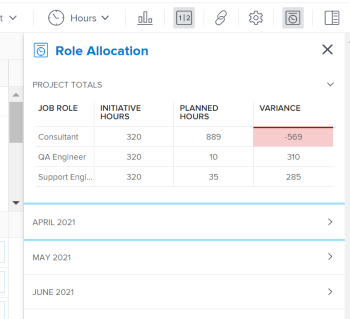

# Mostrar alocação de funções para projetos e iniciativas no [!UICONTROL Balanceador de Carga de Trabalho]

<!--Audited: 07/2024-->

Depois de conectar projetos e iniciativas, é possível gerenciar a alocação de recursos lado a lado para garantir que eles correspondam. Isso evita a superalocação ou a subutilização deles.

Este artigo descreve como reconciliar recursos usando o painel [!UICONTROL Alocação de função] no [!UICONTROL Balanceador de carga de trabalho] de um projeto.

Para obter informações gerais sobre como reconciliar recursos entre projetos e iniciativas, incluindo pré-requisitos, consulte [Visão geral da reconciliação de alocações de recursos entre projetos e iniciativas](../scenario-planner/overview-reconcile-allocations-between-projects-initiatives.md).

## Requisitos de acesso

+++ Expanda para visualizar os requisitos de acesso para a funcionalidade neste artigo.

<table style="table-layout:auto"> 
 <col> 
 <col> 
 <tbody> 
  <tr> 
   <td> 
[!DNL Adobe Workfront] plano*
 </td> 
   <td> <ul></li>
   <li>
Novo: Ultimate 
</li>
   
O Planejador de cenários não está disponível para os novos planos Select ou Prime do Workfront Workfront. 

   <li>
Atual: [!UICONTROL Business] ou superior
</ul>
   </td> 
  </tr> 
  <tr> 
   <td> 
[!DNL Adobe Workfront] licença*
 </td> 
   <td> 
Novo: Claro ou superior
 
   
Atual: [!UICONTROL Review] ou posterior
 </td> 
  </tr> 
  <tr> 
   <td>Produto* </td> 
   <td> <ul><li>
Para os novos planos do Workfront:

 Adobe Workfront</li>

   <li>
Para os planos atuais do Workfront: 

   
Adobe Workfront
 
Planejador de cenários do Adobe Workfront
</li></ul>

Para obter mais informações, consulte <a href="../scenario-planner/access-needed-to-use-sp.md" class="MCXref xref">Acesso necessário para usar o [!DNL Scenario Planner]</a>. 
 </td> 
  </tr> 
  <tr data-mc-conditions=""> 
   <td>Nível de acesso </td> 
   <td> 
Acesso de visualização ou superior aos Projetos.
 </td> 
  </tr> 
  <tr data-mc-conditions=""> 
   <td> 
Permissões de objeto 
 </td> 
   <td> 
 Exibir ou aumentar a permissão para um projeto.
 </td> 
  </tr> 
 </tbody> 
</table>

*Para obter informações, consulte [Requisitos de acesso à documentação do Workfront](/help/quicksilver/administration-and-setup/add-users/access-levels-and-object-permissions/access-level-requirements-in-documentation.md).

+++

## Mostrar alocação de funções para projetos e iniciativas no [!UICONTROL Balanceador de Carga de Trabalho]

Se sua empresa adquiriu uma licença [!DNL Workfront Scenario Planner], é possível reconciliar as alocações de recursos entre a iniciativa e o projeto vinculado a ela no [!UICONTROL Balanceador de carga de trabalho] no nível do projeto.

1. (Condicional) Conecte um projeto a uma iniciativa usando um dos métodos descritos nos seguintes artigos:

   * [Importe projetos para planos no [!DNL Adobe Workfront Scenario Planner]](import-projects-to-plans.md).
   * [Atualize ou crie projetos publicando iniciativas em  [!DNL Adobe Workfront Scenario Planner]](publish-scenarios-update-projects.md).

   >[!IMPORTANT]
   >
   >Se você fizer alterações em recursos da iniciativa, deverá republicar o cenário ao qual a iniciativa pertence para que as informações de recurso mais recentes da iniciativa sejam atualizadas no projeto.

1. Acesse o projeto em que deseja revisar a alocação de funções de trabalho para o projeto, bem como para a iniciativa associada.
1. Clique em [!UICONTROL Balanceador de carga de trabalho] no painel esquerdo.

   Talvez seja necessário clicar em **[!UICONTROL Agendamento]** e em **[!UICONTROL Alternar para Balanceador de Carga de Trabalho]**.

1. Siga um destes procedimentos:

   * Clique em **[!UICONTROL Mês]** para exibir o Balanceador de carga de trabalho por mês, clique no menu suspenso ao lado de um mês na linha do tempo  e clique em **[!UICONTROL Mais]**.
   * Clique no ícone **[!UICONTROL Mostrar alocação de função]**  no canto superior direito da barra de ferramentas.

   O painel [!UICONTROL Alocação de função] é exibido.

   

   >[!CAUTION]
   >
   >Embora você possa exibir o painel [!UICONTROL Alocação de função] mesmo que sua organização não tenha comprado uma licença do [!DNL Workfront Scenario Planner], você não pode exibir informações sobre as funções de trabalho das iniciativas.

   <!--
   
(NOTE: ensure this step stays 5 to match the mention of it in the section below)

   -->

1. Revise as seguintes informações na área **[!UICONTROL Totais do projeto]** do painel Alocação de função:

   <table style="table-layout:auto"> 
    <col> 
    <col> 
    <tbody> 
     <tr> 
      <td role="rowheader">[!UICONTROL Função de Trabalho]</td> 
      <td> 
Os nomes das funções de trabalho associadas a qualquer uma das seguintes opções:
 
       <ul> 
        <li> 
tarefas no projeto
 </li> 
        <li> 
problemas no projeto
 </li> 
        <li> 
iniciativa vinculada ao projeto
 </li> 
       </ul> </td> 
     </tr> 
     <tr> 
      <td role="rowheader">[!UICONTROL Horas da Iniciativa]</td> 
      <td>O número de horas necessárias associadas a cada função de trabalho na iniciativa durante a duração total da iniciativa. </td> 
     </tr> 
     <tr> 
      <td role="rowheader">[!UICONTROL Horas Planejadas]</td> 
      <td>O número de Horas Planejadas associadas a cada função de trabalho nas tarefas ou problemas no projeto pela duração total do projeto. </td> 
     </tr> 
     <tr> 
      <td role="rowheader">[!UICONTROL Variação]</td> 
      <td> 
A diferença entre as horas necessárias para a iniciativa e as horas planejadas associadas ao trabalho no projeto. [!DNL Workfront] calcula a [!UICONTROL Variance] usando esta fórmula:
 
<code>Role Allocation Variance = Initiative Hours - Planned Hours</code> 
 
Quando os recursos são planejados para mais horas do que o necessário na iniciativa, a [!UICONTROL Variance] é negativa e é exibida em vermelho. Isso significa que seus recursos estão superalocados. 
 </td> 
     </tr> 
    </tbody> 
   </table>

   >[!TIP]
   >
   >As horas planejadas do projeto não são exibidas nos seguintes cenários:
   >
   >   
   >   
   >   * Quando tarefas ou problemas não são atribuídos a funções de trabalho ou usuários com uma função de trabalho associada a eles.
   >   * Quando as tarefas ou problemas têm uma [!UICONTROL Duração] de zero.
   >   
   >

1. (Opcional) Se a coluna [!UICONTROL Variação] mostrar que seus recursos estão superalocados, ajuste uma das seguintes opções:

   * Reduza o número de Horas Planejadas para uma função de trabalho que mostra estar superalocada ou adicione mais recursos às tarefas e distribua mais Horas Planejadas para os novos recursos. Você pode atualizar as atribuições ou o número de Horas planejadas nas tarefas ou problemas ao editá-las. Para obter mais informações, consulte os seguintes artigos:

      * [Editar tarefas](../manage-work/tasks/manage-tasks/edit-tasks.md)
      * [Editar problemas](../manage-work/issues/manage-issues/edit-issues.md)

     >[!NOTE]
     >
     >Você deve ter acesso e permissões adicionais para editar tarefas e problemas.

   * Aumente o número de horas necessárias para a função que mostra a superalocação na iniciativa. Para obter mais informações, consulte [Criar e editar iniciativas no [!DNL Adobe Workfront Scenario Planner]](create-and-edit-initiatives.md).

     >[!NOTE]
     >
     >Você deve ter acesso e permissões adicionais para editar planos.

1. (Opcional) Clique no ícone suspenso para expandir um dos meses no painel [!UICONTROL Alocação de função] ou na linha do tempo do [!UICONTROL Balanceador de carga de trabalho].

   

   O mesmo tipo de informação exibida na área [!UICONTROL Totais do Projeto] também é exibido para cada mês.

   >[!TIP]
   >
   >Os meses listados no painel [!UICONTROL Alocação de Função] são os meses na linha do tempo exibida na tela no [!UICONTROL Balanceador de Carga de Trabalho]. Role para trás e para frente na linha do tempo para visualizar os meses adicionais.

   <!--
   <li value="8" data-mc-conditions="QuicksilverOrClassic.Draft mode"> 
 
 </li>
   -->

