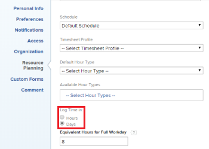

# Configurar se a hora está conectada em horas ou dias

Como um usuário com uma licença do Planner, você pode configurar se deseja registrar horas no Adobe Workfront em horas ou dias. Os administradores do sistema podem definir essa configuração para usuários individuais ou para vários usuários em sua organização. Por padrão, os usuários registram tempo em horas. Para obter informações sobre como registrar horas no Workfront, consulte [Registrar horas](../../timesheets/create-and-manage-timesheets/log-time.md).

>[!NOTE]
>
>Recomendamos registrar o tempo da mesma forma, em horas ou dias, em toda a organização para garantir a precisão dos relatórios.

## Requisitos de acesso

Você deve ter o seguinte acesso para executar as etapas deste artigo:

<table style="table-layout:auto"> 
 <col> 
 </col> 
 <col> 
 </col> 
 <tbody> 
  <tr> 
   <td role="rowheader">plano do Adobe Workfront*</td> 
   <td> 
Qualquer
 </td> 
  </tr> 
  <tr> 
   <td role="rowheader">Licença da Adobe Workfront*</td> 
   <td> 
Plano 
 </td> 
  </tr> 
  <tr data-mc-conditions=""> 
   <td role="rowheader">Configurações de nível de acesso*</td> 
   <td> 
Os planejadores podem configurar o tempo para si mesmos. Somente um administrador do Workfront pode configurar o horário para outros usuários.
 </td> 
  </tr> 
 </tbody> 
</table>

&#42;Para saber qual plano, tipo de licença ou acesso você tem, contate o administrador do Workfront.

1. Siga um destes procedimentos, dependendo do objetivo e do nível de acesso no sistema:

   * **Usuário do planejador configurando o log de tempo para você mesmo:** Clique no **ícone do Menu Principal**  no canto superior direito do Adobe Workfront e clique no seu nome de usuário ao lado da imagem do perfil. Em seguida, clique no ícone **Mais** ao lado do seu nome e selecione **Editar**.

   * **Administrador do sistema configurando o log de tempo para outras pessoas:** comece a editar uma ou mais contas de usuário, conforme descrito em [Editar perfil de usuário](../../administration-and-setup/add-users/create-and-manage-users/edit-a-users-profile.md).

1. Na caixa de diálogo resultante, na seção **Planejamento de Recursos**, localize a opção **Registrar Tempo em**.

   

1. (Condicional) Se você for um administrador do sistema editando vários usuários simultaneamente, selecione **Fazer logon**.
1. Selecione entre as seguintes opções para registro de tempo:

   | Opção | Descrição |
   |---|---|
   | **Horas** | Os usuários especificam horas ao fazer logon no Workfront. |
   | **Dias** | Os usuários especificam dias ao registrar horas no Workfront. |

1. (Condicional) Se você optou por registrar horas em dias, no campo **Horas Equivalentes para Workday Completo**, digite o número de horas que equivalem a um dia inteiro. Um dia na planilha de horas de um usuário é o equivalente ao número de horas inserido aqui.

   Leve em consideração o seguinte ao definir essa configuração:

   * Esta opção não está disponível ao configurar o para registrar tempo em horas.
   * Essa opção é usada somente para fins de registro de tempo. Esta opção não está relacionada à opção **Agendar**, que também está disponível ao editar um usuário. A opção **Agendar** é usada ao calcular linhas do tempo e em outras áreas do Workfront. (Para obter mais informações sobre como usar a opção **Agendar**, consulte [Criar um agendamento](../../administration-and-setup/set-up-workfront/configure-timesheets-schedules/create-schedules.md).) 

1. Clique em **Salvar alterações**.
