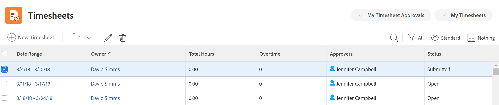

# Editar informações da folha de horas

Como um usuário com acesso administrativo a Folhas de horas, você pode editar informações em folhas de horas existentes no Adobe Workfront. Por exemplo, você pode editar o Proprietário, os Aprovadores ou o intervalo de tempo da folha de horas.

Você pode editar informações em uma única folha de horas ou pode editar várias folhas de horas em massa.

>[!IMPORTANT]
>
>Se os usuários estiverem associados a Perfis de Planilha de Horas e as planilhas de horas forem geradas automaticamente, as alterações feitas nas planilhas existentes não serão refletidas nas planilhas de horas que serão geradas para datas futuras. Todas as folhas de horas geradas automaticamente têm as configurações estabelecidas nos Perfis de folha de horas. Para obter mais informações, consulte [Criar perfis de planilha de horas](../create-and-manage-timesheets/create-timesheet-profiles.md)

## Requisitos de acesso

+++ Expanda para visualizar os requisitos de acesso para a funcionalidade neste artigo.

<table style="table-layout:auto">
 <col> 
 <col>
 <tbody> 
  <tr> 
   <td>Pacote do Adobe Workfront</td> 
   <td>
Qualquer
</td> 
  </tr> 
  <tr> 
   <td>Licença do Adobe Workfront</td> 
   <td>
   
Standard

   
Plano
</td>
  </tr> 
  <tr> 
   <td>Configurações de nível de acesso</td> 
   <td>
Acesso administrativo a planilhas de horas
 </td> 
  </tr> 
 </tbody> 
</table>

Para obter informações, consulte [Requisitos de acesso na documentação do Workfront](/help/quicksilver/administration-and-setup/add-users/access-levels-and-object-permissions/access-level-requirements-in-documentation.md).

+++

## Editar planilhas de horas

1. Clique no ícone **do** Menu principal no canto superior direito do Adobe Workfront e em **Folhas de horas**.

   O filtro **Todos** é selecionado por padrão, o que exibe todas as planilhas de horas que você tem acesso para visualizar.

   

1. (Opcional) Clique no ícone **de** pesquisa, digite uma palavra-chave e procure uma planilha de horas específica. Por exemplo, você pode procurar um intervalo de tempo de planilha de horas ou nome de proprietário.

1. (Opcional) Siga um destes procedimentos para atualizar o filtro na lista de folhas de horas:

   * Selecione **Minhas planilhas de horas aprovadas** no canto superior direito da página para exibir somente as planilhas de horas aprovadas por você

     Ou

     Selecione **Minhas Planilhas de Horas** para exibir apenas suas planilhas de horas.

     Isso aplica os filtros Minhas planilhas de horas ou Minha planilha de horas à lista de planilhas de horas.

     

   * Clique no ícone Filtro  para aplicar um filtro diferente ou criar um novo. Para obter informações sobre como criar ou atualizar filtros, consulte [Criar ou editar filtros no Adobe Workfront](../../reports-and-dashboards/reports/reporting-elements/create-filters.md).

   >[!NOTE]
   >
   >As opções Minhas aprovações de folha de horas e Minhas folhas de horas não são exibidas na parte superior da lista de folha de horas ou na lista de filtros se o administrador do Workfront ou um administrador de grupo removeu os filtros Minhas aprovações de folha de horas e Minhas folhas de horas dos Controles de lista na área Configuração ou do Modelo de layout. Para obter mais informações, consulte os seguintes artigos:
   >
   >   
   >   
   >   * [Personalizar Filtros, Modos de Exibição e Agrupamentos usando um modelo de layout](../../administration-and-setup/customize-workfront/use-layout-templates/customize-fvg-list-controls-layout-template.md)
   >   
   >

1. (Opcional) Clique nos ícones **Exibir**  ou **Agrupamento**  para aplicar uma exibição ou agrupamento diferente ou para criar um novo.

   Para obter informações sobre como criar filtros, visualizações ou agrupamentos, consulte os seguintes artigos:

   * [Criar ou editar filtros no Adobe Workfront](../../reports-and-dashboards/reports/reporting-elements/create-filters.md)
   * [Criar ou editar exibições no Adobe Workfront](../../reports-and-dashboards/reports/reporting-elements/create-edit-views.md)
   * [Criar agrupamentos no Adobe Workfront](../../reports-and-dashboards/reports/reporting-elements/create-groupings.md)

1. Selecione uma ou várias planilhas de horas e clique no ícone **de** Editar na parte superior da lista de planilhas de horas.
1. Exiba ou especifique as seguintes informações:

   <table style="table-layout:auto"> 
    <col> 
    <col> 
    <tbody> 
     <tr> 
      <td role="rowheader"><strong>Proprietário</strong> </td> 
      <td> 
Esse é o nome do usuário para o qual a folha de horas foi criada. Não é possível editar esse campo. 
 
O campo não é exibido quando você seleciona várias folhas de horas. 
 </td> 
     </tr> 
     <tr> 
      <td role="rowheader"><strong>Data de Início</strong> </td> 
      <td>Esta é a data de início da folha de horas.</td> 
     </tr> 
     <tr> 
      <td role="rowheader"><strong>Data de término</strong> </td> 
      <td> Esta é a data de término da folha de horas.</td> 
     </tr> 
     <tr> 
      <td role="rowheader"><strong>Status</strong> </td> 
      <td> Este é o status da folha de horas.
      A seguir estão opções possíveis de status da folha de horas: 
      <ul><li><b>Abrir</b>: a folha de horas está aberta e as entradas de horas podem ser editadas.</li>
      <li><b>Enviado</b>: a planilha de horas é enviada para aprovação dos aprovadores designados.</li>
      <li><b>Rejeitada</b>: a folha de horas não foi aprovada pelos aprovadores e agora está disponível novamente para o usuário editar as entradas de horas.</li>
      <li><b>Fechado</b>: a folha de horas foi fechada pelo usuário ou aprovada pelo aprovador e, como resultado, agora está fechada. Não é possível adicionar horas a uma folha de horas fechada.</li>
      </td> 
     </tr> 
     <tr> 
      <td role="rowheader"><strong>Aprovadores</strong> </td> 
      <td> 
Os aprovadores são usuários que aprovam a folha de horas para os usuários associados à folha de horas. Somente usuários com acesso administrativo a Planilhas de Horas podem ser definidos como aprovadores. 
 
Para obter mais informações sobre direitos administrativos de planilha de horas, consulte <a href="../../administration-and-setup/add-users/configure-and-grant-access/grant-users-admin-access-certain-areas.md" class="MCXref xref">Conceder aos usuários acesso administrativo a determinadas áreas</a>.
 
Comece a inserir os nomes dos aprovadores de folha de horas e selecione-os quando eles aparecerem na lista.
 
Você pode ter múltiplos aprovadores em uma planilha de horas. Nesse caso, depois que um dos aprovadores aprovar a folha de horas, ela será marcada como <strong>Fechada</strong> e desaparecerá da lista de aprovações da folha de horas de todos os aprovadores restantes.
 </td> 
     </tr> 
     <tr> 
      <td role="rowheader"><strong>Pode editar as horas</strong> </td> 
      <td> 
Selecione esta opção se quiser permitir que os aprovadores editem horas na folha de horas.
 
Essa opção não está disponível quando você seleciona várias folhas de horas. 
 </td> 
     </tr> 
     <tr data-mc-conditions=""> 
      <td role="rowheader">Hora extra </td> 
      <td> 
Você pode optar por ocultar a caixa Horas extras na folha de horas.
 
Essa opção está desabilitada por padrão.
 </td> 
     </tr> 
    </tbody> 
   </table>

1. Clique em **Salvar**.
