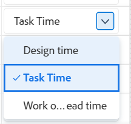
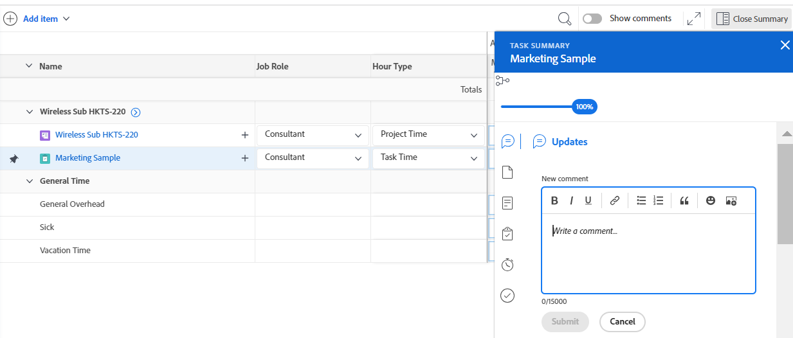

# Registrar de tempo

<!--Audited: 12/2023-->

<!--remove all preview and production references from this article with 23.3 release-->

<!--
The highlighted information on this page refers to functionality not yet generally available. It is available only in the Preview environment for all customers. After the monthly releases to Production, the same features are also available in the Production environment for customers who enabled fast releases.   
For information about fast releases, see [Enable or disable fast releases for your organization](../../administration-and-setup/set-up-workfront/configure-system-defaults/enable-fast-release-process.md). 

For information about the current release schedule, see [Fourth Quarter 2023 release overview](../../product-announcements/product-releases/23-q4-release-activity/23-q4-release-overview.md) 
-->

Você pode registrar o tempo para itens de trabalho no Adobe Workfront para indicar o número de horas que você gasta trabalhando neles. Você também pode registrar horas que não estejam relacionadas ao trabalho, como férias, licença médica ou tempo gasto em reuniões. O horário registrado é exibido em sua folha de horas.

Para obter mais informações sobre o tipo de horas em que você pode fazer logon no Workfront, consulte [Gerenciar tipos de horas](../../administration-and-setup/set-up-workfront/configure-timesheets-schedules/hour-types.md).

## Requisitos de acesso

+++ Expanda para visualizar os requisitos de acesso para a funcionalidade neste artigo.

Você deve ter o seguinte acesso para executar as etapas deste artigo e registrar as horas específicas do projeto:

<table style="table-layout:auto"> 
 <col> 
 <col> 
 <tbody> 
  <tr> 
   <td role="rowheader">plano do Adobe Workfront</td> 
   <td> 
Qualquer
 </td> 
  </tr> 
  <tr> 
   <td role="rowheader">Licença da Adobe Workfront*</td> 
   <td> 
Novo:

   <ul><li>
 Leve ou superior para registrar horas em uma tarefa, problema ou Horas gerais em uma folha de horas

   <li>
Padrão para registrar horas em projetos
</li></ul>
   

   
Atual: 
   <ul><li>Revise ou registre horas gerais em uma planilha de horas</li>
   <li>Trabalhar ou mais para registrar horas em um projeto, tarefa ou problema</li></ul> </td> 
  </tr> 
  <tr> 
   <td role="rowheader">Configurações de nível de acesso</td> 
   <td> 
Editar o acesso ao tipo de item de trabalho para o qual você registra horas 
 
Por exemplo, você precisa ter acesso de Edição a Problemas para registrar o tempo de ocorrências
 </td> 
  </tr> 
  <tr> 
   <td role="rowheader">Permissões de objeto</td> 
   <td> 
Permissões do Contribute ou superiores no item de trabalho para o qual você registra horas, que incluem permissões para Registrar horas
 </td> 
  </tr> 
 </tbody> 
</table>

*Para obter mais informações, consulte [Requisitos de acesso na documentação do Workfront](/help/quicksilver/administration-and-setup/add-users/access-levels-and-object-permissions/access-level-requirements-in-documentation.md).

+++

## Considerações ao registrar tempo no Workfront

* Você pode registrar horas para projetos, tarefas ou problemas, ou pode registrar horas diretamente em sua folha de horas.

  Para obter informações sobre como criar folhas de horas, consulte [Criar uma folha de horas de uso único](../../timesheets/create-and-manage-timesheets/create-tmshts.md).

* Todo o tempo registrado em ferramentas diferentes da folha de horas aparece na folha de horas para o período correspondente.
* Tarefas e problemas em um projeto que não é atual não são pré-preenchidos em uma folha de horas.
* As horas registradas na folha de horas são aplicadas imediatamente à tarefa, problema ou projeto.
* As planilhas de horas incluem o tempo total para todas as datas registradas. Os finais de semana são sempre incluídos, mesmo quando os cálculos da linha do tempo foram configurados para excluí-los (conforme descrito em [Configurar preferências de projeto do sistema](../../administration-and-setup/set-up-workfront/configure-system-defaults/set-project-preferences.md)).
* O número máximo de itens exibidos em uma folha de horas é 45. Se houver mais de 45 itens cujas datas correspondam ao período da folha de horas, apenas os itens atualizados mais recentemente serão exibidos.
* As entradas de horas incluídas nos registros de cobrança são esmaecidas e não podem ser editadas na folha de horas. Para obter mais informações, consulte [Criar registros de cobrança](../../manage-work/projects/project-finances/create-billing-records.md).
* Por padrão, as tarefas pessoais não são exibidas na folha de horas. As tarefas pessoais são exibidas na folha de horas somente quando têm tempo registrado. Depois de registrar as horas em uma tarefa pessoal, você pode fixar a tarefa na folha de horas e ela permanecerá na folha de horas se permanecer fixada. Para obter mais informações, consulte [Criar itens de trabalho e projetos a partir da Área inicial](../../workfront-basics/using-home/using-the-home-area/create-work-items-in-home.md).

## Registrar de tempo {#log-time-section}

Você pode registrar horas nas seguintes áreas no Workfront:

* [Planilha de horas](#timesheet)
* [Página inicial](#home)
* [Projeto, tarefa ou problema](#project-task-or-issue)
* [Painel de resumo](#summary-panel)
* [Quadros](#boards)
* [Aplicativo móvel](#mobile-app)

### Planilha de horas {#timesheet}

#### Registrar horas em uma folha de horas {#log-time-on-a-timesheet}

Você pode registrar horas nos seguintes itens da folha de horas:

* Tarefas, problemas e projetos pré-preenchidos são exibidos automaticamente com base em como o administrador do Workfront define as preferências da folha de horas. Para obter informações sobre como as folhas de horas são preenchidas previamente, consulte [Configurar preferências de hora e folha de horas](../../administration-and-setup/set-up-workfront/configure-timesheets-schedules/timesheet-and-hour-preferences.md).

  Somente as tarefas e problemas atribuídos a você são preenchidas previamente em sua planilha de horas. Tarefas e problemas atribuídos às suas equipes ou funções de trabalho não preenchem sua folha de horas automaticamente.

  Clicar em Trabalhar nisso em um item atribuído às suas equipes atribui o item a você e o item será exibido em sua folha de horas.

* Tarefas, problemas ou projetos adicionados manualmente.
* Tarefas, problemas ou projetos para os quais você já fez logon em outro lugar na Workfront.
* Tempo geral (férias, treinamento, horas extras).

>[!NOTE]
>
>Revise os usuários atribuídos a um Perfil de folha de horas. Você pode ver a área Folhas de horas e registrar as horas gerais. No entanto, eles não podem registrar horas em nenhuma tarefa ou problema atribuído a eles que apareçam na folha de horas.

Para registrar horas em uma folha de horas:

{{step1-click-main-menu}}

1. Clique em [!UICONTROL **Folhas de horas**]. Sua Planilha de Horas atual é exibida por padrão.
   

1. (Opcional) Clique no ícone  de **tela cheia** para exibir a folha de horas no modo de tela cheia, em seguida, clique no ícone **sair-tela cheia**  para retornar à folha de horas.

   <!-- drafted for the resize columns in timesheet story: 1. (optional) Click on the separator lines between weeks or between the time frame area and the work item area to resize the columns of the timesheet.-->

1. (Opcional) Para adicionar um projeto, tarefa ou problema à folha de horas, clique no menu suspenso **Adicionar item** no canto superior esquerdo da folha de horas e, em seguida, clique em **Adicionar projetos**, **Adicionar tarefas** ou **Adicionar problemas**.

   Uma lista de projetos, tarefas ou problemas é exibida.

   <!--drafted for full screen mode for add projects story - align it with the rest of the steps when you enable this:: 1. (Optional) Click the **full-screen** icon  to display the list of objects in full-screen mode.-->

1. (Opcional) Clique no ícone de pesquisa  para procurar um item específico usando uma palavra-chave para adicionar à folha de horas.

1. (Opcional) Expanda os menus suspensos filtro, exibição ou agrupamento para aplicar ou personalizar um e exibir as informações de item desejadas.

1. Selecione um ou vários itens na lista e clique em **Adicionar**.

   Se você tiver adicionado menos de 50 itens de uma vez, os itens serão adicionados à folha de horas. Tarefas e problemas são listados sob o nome do projeto.

   >[!NOTE]
   >
   >Quando você adiciona tarefas ou problemas à folha de horas, o projeto também é adicionado.

1. (Condicional) Se você adicionar 50 ou mais itens de uma vez, uma mensagem de confirmação exibindo o número de itens adicionados à sua folha de horas será exibida.

   Clique em **Adicionar tudo** para adicionar todos os itens
Ou
Clique em **Cancelar** para interromper a adição dos itens selecionados e em **Cancelar** para fechar a lista de itens.

   Tarefas e problemas são listados sob o nome do projeto.

   >[!NOTE]
   >
   >Os itens adicionados manualmente à folha de horas são fixados e permanecerão na folha de horas atual e futura até que você os desafixe manualmente para removê-los. Para obter informações sobre como desafixar itens para removê-los da folha de horas, continue com a Etapa 10.

   <!--(ensure this stays accurate)-->

1. (Opcional) Clique nos ícones **Recolher**  ou **Expandir**  ao lado do nome do projeto para exibir ou ocultar a lista de tarefas e problemas do projeto.

   >[!TIP]
   >
   >   Ao usar um teclado QWERTY padrão e depois de clicar no nome de um projeto na folha de horas, pressione o seguinte conjunto de teclas para recolher ou expandir o projeto:
   >   * Para expandir o projeto e exibir seus itens de trabalho:
   >     * Shift + Alt + seta para cima para computadores com Windows
   >     * Shift + Option + seta para cima para computadores Mac
   >   * Para recolher o projeto e ocultar seus itens de trabalho:
   >     * Shift + Alt + seta para baixo para computadores com Windows
   >     * Shift + Option + seta para baixo para computadores Mac.

1. (Opcional) Para fixar manualmente um item que é exibido automaticamente na folha de horas, passe o mouse sobre o nome do item e clique no ícone **fixar** .

   >[!TIP]
   >
   >   Ao usar um teclado QWERTY padrão depois de clicar em um item na folha de horas, pressione o seguinte conjunto de teclas para fixar um item:
   >   * Option + P para computadores com Windows e Mac.

1. (Opcional) Clique no ícone de pesquisa  e comece a digitar uma palavra-chave para localizar um projeto, tarefa ou um problema na folha de horas.

1. (Condicional) Se o administrador do Workfront ou do grupo tiver habilitado a configuração **Atribuir funções de trabalho a entradas de hora manualmente**, selecione uma função de trabalho no menu suspenso. A função especificada quando você está atribuído ao item de trabalho é exibida por padrão. Se uma função não for atribuída a você no objeto, sua função principal será exibida como padrão. Para obter mais informações sobre essa configuração, consulte o artigo [Configurar preferências de horas e folha de horas](../../administration-and-setup/set-up-workfront/configure-timesheets-schedules/timesheet-and-hour-preferences.md).

   

1. (Opcional) Clique no ícone **+** para adicionar outra linha e, em seguida, selecione um novo tipo de hora no menu suspenso na coluna [!UICONTROL Tipo de Hora] para registrar horas para um tipo de hora diferente.

   

   >[!TIP]
   >
   >   Dependendo do seu sistema operacional ou navegador e ao usar um teclado QWERTY padrão, pressione o seguinte conjunto de teclas para adicionar outra linha:
   >   * Ctrl + Option + + para computadores com Windows
   >   * Cmd + Option + + para computadores Mac

   Os tipos de horas estão disponíveis dependendo do que foi definido nos níveis de sistema, projeto e usuário, conforme descrito em [Definir tipos de horas e disponibilidade](define-hour-types-and-availability.md).

   O tipo de hora não pode ser alterado depois que uma folha de horas é fechada.

   >[!TIP]
   >
   >Se você tiver registrado o tempo anteriormente e o tipo de hora selecionado estiver desativado, a linha inteira para o tempo registrado ficará esmaecida. Selecionar outro tipo de hora e atualizar a página remove a opção de tipo de hora desativado da lista suspensa para que você não possa adicionar horas extras a esse tipo de hora.
   >
   >Considere adicionar uma nova linha para o item de trabalho para o qual você deseja registrar mais tempo e selecione um novo tipo de hora se desejar manter o tipo de hora desativado associado ao tempo registrado passado.

1. Clique no ícone **excluir**  ao lado da função de trabalho para removê-lo. As horas registradas para a função também são removidas.

   >[!TIP]
   >
   >   Dependendo do seu sistema operacional ou navegador e ao usar um teclado QWERTY padrão, pressione o seguinte conjunto de teclas para excluir uma linha:
   >   * Ctrl + Option + - para computadores Windows
   >   * Cmd + Option + - para computadores Mac

1. Especifique por quanto tempo você deseja fazer logon em um determinado dia na seção linha do tempo da folha de horas e, em seguida, clique fora da caixa horas para salvar a entrada de horas. As horas são salvas automaticamente. A linha para a qual você registra horas é destacada em azul claro e a caixa de entrada de horas é contornada em azul escuro.

   

   Você registra horas em horas ou dias. Esta configuração é definida por usuários com uma licença de Plano ou pelo administrador do sistema, conforme descrito em [Configurar se o horário será conectado em horas ou dias](../../timesheets/config-timesheet-prefs/config-time-logged-hrs-days.md).

   >[!IMPORTANT]
   >
   >Você deve salvar a folha de horas manualmente se qualquer um dos seguintes cenários ocorrer:
   >
   >* A função de trabalho associada a tempo registrado anteriormente foi alterada e a configuração **Atribuir funções de trabalho a entradas de hora manualmente** foi desabilitada. O registro de tempo para novas datas associará esse tempo a uma função de trabalho diferente.
   >   
   >   Se a função tiver sido alterada e a configuração **Atribuir funções de trabalho a entradas de hora manualmente** estiver habilitada, você poderá registrar horas ou atualizar a função, e suas alterações serão salvas automaticamente.
   >
   >* A função de trabalho atribuída a uma tarefa ou problema é diferente da função de trabalho com a qual o proprietário da folha de horas está registrando horas com <!--or assigned to them_ this last  piece came from a Support note but but sure what role it's referring to. Leaving it out for now.-->.
   >
   >A folha de horas salvará novamente o tempo automaticamente quando não houver mais entradas conflitantes entre as duas funções.
   >

1. (Opcional) Especifique a quantidade de horas extras no campo Horas extras no cabeçalho da folha de horas.

   >[!TIP]
   >
   >Você não pode registrar um número de horas extras maior que o total de horas atual na folha de horas. Por exemplo, se você registrou 7 horas na folha de horas até agora, não é possível registrar 8 horas extras.

1. (Opcional) Clique em **Comentário** para adicionar um comentário à sua entrada de hora.

   

   >[!TIP]
   >
   >   Ao usar um teclado QWERTY padrão depois de clicar na caixa de entrada de hora, pressione o seguinte conjunto de teclas para abrir a caixa de comentário:
   >   * Shift + F2 para computadores Windows e Mac.

1. Clique em **Concluído** para salvar o comentário.

   >[!TIP]
   >
   >   Ao usar um teclado QWERTY padrão, de dentro da caixa de comentário, pressione o seguinte conjunto de teclas para salvar o comentário:
   >   * Ctrl + Enter para computadores Windows.
   >   * Cmd + Return para computadores Mac.

1. (Opcional) Clique em **Mostrar comentários** na barra de ferramentas para exibir comentários de entrada de horas sob o item de trabalho.

   

   >[!TIP]
   >
   >   Todas as alterações feitas na folha de horas são salvas automaticamente.

1. (Opcional) Clique na linha de uma tarefa ou problema e em **Abrir resumo** no canto superior direito da folha de horas para adicionar uma atualização ou atualizar informações sobre a tarefa ou problema. O painel Resumo é aberto à direita.

   

   A atualização é exibida na área Atualizações do item de trabalho associado ao tempo registrado.

   >[!TIP]
   >
   >Não é possível comentar em projetos ou entradas de horas em Tempo geral.

1. Clique em [!UICONTROL **Fechar Resumo**] para fechar o painel Resumo e retornar à folha de horas.

1. (Opcional) Clique em [!UICONTROL **Atualizações**] no painel esquerdo e adicione uma atualização à folha de horas. Para obter mais informações sobre atualizações do Workfront, consulte [Trabalho de atualização](../../workfront-basics/updating-work-items-and-viewing-updates/update-work.md).

   

1. (Opcional) Retorne à área **Planilha de horas** para fechar ou enviar sua planilha de horas.

   * **Fechar**: feche a folha de horas quando terminar de atualizá-la. Essa opção só está disponível quando sua folha de horas não está associada a um aprovador.

   * **Enviar para aprovação:** esta opção só estará disponível se houver um aprovador na planilha de horas. Salve as alterações e envie para aprovação. Você pode abrir a folha de horas depois de fechá-la clicando em **Cancelar**, se uma aprovação ainda não tiver sido concedida. Para obter mais informações, consulte [Enviar uma folha de horas para aprovação](../../timesheets/create-and-manage-timesheets/submit-timesheet-for-approval.md).

   * **Rejeitar**: esta opção é exibida quando você é um aprovador de planilha de horas e a planilha de horas foi enviada a você para aprovação. Clicar nela altera o status da folha de horas para Rejeitada e a folha de horas permanece aberta.

   * **Aprovar**: esta opção é exibida quando você é um aprovador de planilha de horas e a planilha de horas foi enviada a você para aprovação. Clicar nela altera o status da folha de horas para Aprovado e fecha a folha de horas.

   >[!TIP]
   >
   >As opções Rejeitar e Aprovar também são exibidas em sua folha de horas quando você é um administrador do sistema e a folha de horas é associada a um aprovador.

1. (Condicional) Se tiver fechado ou enviado sua planilha de horas para aprovação, clique em uma das seguintes opções:

   * **Reabrir**: esta opção está disponível para planilhas de horas que você já fechou e que não têm aprovadores, ou planilhas de horas que já foram aprovadas. Reabra a folha de horas para modificar entradas de horas.
   * **Retroceder**: esta opção está disponível para planilhas de horas que foram enviadas para aprovação, mas ainda não foram aprovadas ou rejeitadas. Clique em **Cancelar** para reabrir a folha de horas e modificar as entradas de horas.

#### Remover um item da folha de horas

Você pode remover uma entrada de horas ou um item (projeto, tarefa ou problema) de uma planilha de horas.

Para remover uma entrada de horas de uma folha de horas:

1. Vá para a folha de horas e localize a entrada de horas que deseja remover.
1. Substituir as horas digitadas por 0
Ou
Remova as horas e substitua-as por 0 e pressione Enter.

   As horas são removidas e a folha de horas é salva automaticamente.

Você pode remover um item (projeto, tarefa ou problema) da folha de horas desfixando-o, se ainda não tiver registrado tempo para ele e se tiver adicionado manualmente o item (conforme descrito nas Etapas 4-8 na seção [Registrar tempo em uma folha de horas](#log-time-on-a-timesheet) deste artigo). <!--ensure this stays accurate-->

Você não pode remover automaticamente os itens incluídos na folha de horas de acordo com as preferências de folha de horas no sistema ou grupo do Workfront que estão configuradas para preencher previamente a folha de horas (conforme descrito em [Configurar preferências de folha de horas e horas](../../administration-and-setup/set-up-workfront/configure-timesheets-schedules/timesheet-and-hour-preferences.md)). Os itens param de preencher previamente a folha de horas quando as datas dos itens estão fora do período da folha de horas.

Para remover um item da folha de horas que foi adicionado manualmente:

1. Certifique-se de que nenhuma hora seja registrada em relação ao item.
1. Clique no ícone **desafixar**  ao lado do item para desafixar o item da folha de horas.

   >[!TIP]
   >
   >   Ao usar um teclado QWERTY padrão depois de clicar em um item na folha de horas, pressione o seguinte conjunto de teclas para desafixar um item:
   > * Option + P para computadores com Windows e Mac.

   O item é removido da folha de horas após você atualizar a página.

### Início {#home}

Você pode registrar horas específicas do projeto na Página inicial.

Para obter informações gerais sobre o uso da área Página Inicial, consulte [Usar a área Página Inicial](../../workfront-basics/using-home/using-the-home-area/use-the-home-area.md).

<!--#### Log time on a work item from the new Home area-->

Você pode registrar horas para tarefas e problemas em qualquer um dos widgets usando o painel Resumo na área Página inicial. Para obter informações, consulte a seção [Painel de resumo](#summary-panel) neste artigo.

Além disso, para registrar o tempo para um item no widget Meu trabalho:

1. Vá para a área **Início**.
1. Adicione o widget **Meu Trabalho** à sua Página Inicial.
1. (Opcional) Selecione uma tarefa, problema ou solicitação em uma lista e clique em **Trabalhar nela**.
1. Passe o mouse sobre a tarefa ou problema para o qual deseja registrar o tempo, em seguida, clique no ícone **Registrar Tempo**  à direita das informações da tarefa.

   

1. Clique em **Log time**.

   O tempo registrado é exibido na seção Horas do objeto e em sua folha de horas.

<!--#### Log time on a work item from the legacy Home area

1. In the **Work List** area, select the item where you want to log time.
1. In the right panel, click **Log Time**.  
  
     

1. In the **Enter Hours** drop-down menu, select the appropriate hour type.  
   Hour types are available depending on what has been defined at the system, project, and user levels, as described in [Define hour types and availability](../../timesheets/create-and-manage-timesheets/define-hour-types-and-availability.md).
1. (Conditional) If your Workfront or group administrator has enabled the **Assign job roles to hour entries manually** setting, select a job role from the drop-down menu. The role specified when you are assigned to the work item displays by default. If you are not assigned a role on the object, your Primary Role displays as the default. For more information on this setting, see the article [Configure timesheet and hour preferences](../../administration-and-setup/set-up-workfront/configure-timesheets-schedules/timesheet-and-hour-preferences.md).
1. Specify the time you want to log, then click **Log Time**.

   The logged time displays in the object's Hours section, nad in your timesheet. -->

### Projeto, tarefa ou problema {#project-task-or-issue}

Você pode registrar o tempo específico do projeto em um projeto, tarefa ou problema nas seguintes seções:

* [Atualiza a seção](#updates-section)
* [seção Horas](#hours-section)

#### Atualiza a seção{#updates-section}

Para registrar horas na seção Atualizações de um projeto, tarefa ou problema, você deve ter o seguinte:

* O acesso e as permissões corretos, conforme descrito na seção [Requisitos de acesso](#access-requirements) deste artigo.

* O administrador do Workfront deve habilitar a configuração Registrar horas diretamente nos projetos em [!UICONTROL **Planilha de horas**]> [!UICONTROL **Preferências**] na área Sistema, se desejar registrar horas diretamente em um projeto.

  Para obter mais informações sobre como permitir que os usuários registrem horas diretamente nos projetos, consulte [Configurar preferências de horas e folha de horas](../../administration-and-setup/set-up-workfront/configure-timesheets-schedules/timesheet-and-hour-preferences.md).

Para registrar horas na seção Atualizações de um projeto, tarefa ou problema:

1. Ir para um projeto, tarefa ou problema.
1. No painel esquerdo, selecione **Atualizações**.
1. Clique em **Log de Tempo**. <!-- did Anna B change the casing for this button? If yes and if she changed it for the other areas, update screen shot too-->

   A caixa de diálogo Log time é exibida.

   >[!TIP]
   >
   >   Se a preferência do seu perfil estiver definida para registrar horas em dias, a caixa Inserir dias será exibida.
   >   
   >   Há uma indicação no canto superior direito da caixa Inserir dias de quantas horas são incluídas em um dia.

   

1. Especifique as seguintes informações:

   * **Tipo de Hora**: Selecione um Tipo de Hora no menu suspenso, se ele for diferente do exibido por padrão.

     Dependendo dos tipos de horas configurados em seu sistema, as opções aqui podem variar. Para obter mais informações sobre como configurar tipos de horas, consulte [Definir tipos de horas e disponibilidade](../../timesheets/create-and-manage-timesheets/define-hour-types-and-availability.md).

   * **Função de trabalho**: (condicional) se a Workfront ou o administrador de grupo tiver habilitado a configuração **Atribuir funções de trabalho a entradas de hora manualmente**, selecione uma **Função de trabalho** no menu suspenso. A Função especificada quando você está atribuído ao objeto é exibida por padrão. Se uma Função não for atribuída a você, sua Função principal é exibida como padrão. Para obter mais informações sobre essa configuração, consulte o artigo [Configurar preferências de horas e folha de horas](../../administration-and-setup/set-up-workfront/configure-timesheets-schedules/timesheet-and-hour-preferences.md).

   * **Horas**: insira o número de horas do projeto, tarefa ou problema.

1. Clique em **Log time**.

   O tempo reportado é exibido na seção Horas do objeto e em sua folha de horas.

#### seção Horas{#hours-section}

Você deve ser um administrador do Workfront para registrar horas para projetos, tarefas e problemas na seção Horas,

Ou

Você deve ter todos os itens a seguir:

* Uma licença de Plano com acesso administrativo a Planilhas de Horas e horas. Para obter mais informações sobre como conceder acesso administrativo a Planilhas de Horas e horas, consulte [Conceder acesso administrativo a determinadas áreas aos usuários](../../administration-and-setup/add-users/configure-and-grant-access/grant-users-admin-access-certain-areas.md).
* Contribute ou permissões mais altas para o projeto com acesso a Registrar horas. Para obter mais informações sobre como conceder permissões em projetos, consulte [Compartilhar um projeto no Adobe Workfront](../../workfront-basics/grant-and-request-access-to-objects/share-a-project.md).
* O administrador do Workfront deve habilitar a configuração Registrar horas diretamente nos projetos na seção **Folhas de horas e horas > Preferências** da área Configuração, se desejar registrar horas diretamente em um projeto. Para obter mais informações sobre como permitir que os usuários registrem horas diretamente nos projetos, consulte [Configurar preferências de horas e folha de horas](../../administration-and-setup/set-up-workfront/configure-timesheets-schedules/timesheet-and-hour-preferences.md).

Para registrar horas na seção Horas de um projeto, tarefa ou problema:

1. Ir para um projeto, tarefa ou problema.
1. No painel esquerdo, clique em **Horas**.
1. Clique em **Log Time**.

   A caixa de diálogo Log Hours é exibida.

1. Especifique as seguintes informações:

   * **Proprietário:** seu nome é exibido neste campo, por padrão.\
     Se você estiver registrando as horas de outro usuário, especifique o nome dele.

   * **Tipo de Hora**: Selecione um Tipo de Hora no menu suspenso, se ele for diferente do exibido por padrão.

     Dependendo dos tipos de horas configurados em seu sistema, as opções aqui podem variar. Para obter mais informações sobre como configurar tipos de horas, consulte [Definir tipos de horas e disponibilidade](../../timesheets/create-and-manage-timesheets/define-hour-types-and-availability.md).

   * **Função de trabalho**: (condicional) se a Workfront ou o administrador de grupo tiver habilitado a configuração **Atribuir funções de trabalho a entradas de hora manualmente**, selecione uma **Função de trabalho** no menu suspenso. A Função especificada quando você está atribuído ao objeto é exibida por padrão. Se uma Função não for atribuída a você, sua Função principal é exibida como padrão. Para obter mais informações sobre essa configuração, consulte o artigo [Configurar preferências de horas e folha de horas](../../administration-and-setup/set-up-workfront/configure-timesheets-schedules/timesheet-and-hour-preferences.md).

     
   * **Horas**: insira o número de horas do projeto, tarefa ou problema.

1. Clique em **Log Time**.

### Painel de resumo

Você pode registrar o tempo para tarefas e problemas no painel Resumo.
Para obter mais informações, consulte [Resumo geral](../../workfront-basics/the-new-workfront-experience/summary-overview.md).

### Quadros {#boards}

É possível registrar o tempo em cartões conectados em uma placa Workfront. Esse é o mesmo processo que registrar o tempo em uma tarefa ou problema, e as horas registradas no cartão são salvas na tarefa ou problema conectado.
Para obter mais informações, consulte [Usar cartões conectados em quadros](/help/quicksilver/agile/get-started-with-boards/connected-cards.md).

### Aplicativo móvel {#mobile-app}

Você pode registrar horas no aplicativo móvel do Workfront.
Para obter mais informações, consulte [Adobe Workfront para Android](/help/quicksilver/workfront-basics/mobile-apps/using-the-workfront-mobile-app/workfront-for-android.md) ou [Adobe Workfront para iOS](/help/quicksilver/workfront-basics/mobile-apps/using-the-workfront-mobile-app/workfront-for-ios.md).

## Editar horas reportadas em listas e relatórios

>[!CAUTION]
>
>* Você não pode modificar as entradas de horas que pertencem a uma planilha de horas fechada. Primeiro, você deve reabrir a folha de horas e depois alterar as informações de entrada de horas.
>* Quando você altera o Tipo de Hora de um tipo que não conta como receita para outro tipo que conta como receita, também ocorrem alterações nas finanças do projeto. Alterar os Tipos de Hora de um tipo que conta como receita para um tipo que não conta como receita também atualiza as finanças do projeto.
>
>Para obter informações, consulte [Gerenciar tipos de horas](/help/quicksilver/administration-and-setup/set-up-workfront/configure-timesheets-schedules/hour-types.md).
>

Você pode editar as horas reportadas nas seguintes áreas:

* Todas as áreas em que você adicionou as horas, incluindo folhas de horas abertas
* Listas de horas e relatórios.

Você pode editar os seguintes elementos de uma entrada de hora ao editar uma entrada de hora em uma lista ou relatório:

* Número de horas
* Tipo de hora
* Função de trabalho associada à entrada de horas

Dependendo do tipo de entrada de hora que você editar, os seguintes campos estarão disponíveis para edição:

* Ao editar horas específicas do projeto:

   * Você pode editar o número de horas.
   * Você pode alterar o Tipo de Hora somente para tipos específicos do projeto.
   * Você só poderá alterar a atribuição de função de Trabalho de hora se ela tiver sido habilitada na Configuração. Para obter informações, consulte [Configurar preferências de horas e folha de horas](/help/quicksilver/administration-and-setup/set-up-workfront/configure-timesheets-schedules/timesheet-and-hour-preferences.md)

* Ao editar o horário geral:

   * Você pode editar o número de horas.
   * Você pode alterar o Tipo de Hora somente para tipos gerais.
   * Não é possível alterar a atribuição de função de Trabalho de hora, pois as horas gerais não podem ser associadas às funções.

* Ao editar uma combinação de horas gerais e específicas do projeto, em massa:

   * Você pode editar o número de horas.
   * Não é possível alterar o Tipo de Hora, pois os tipos de hora gerais não podem ser alterados para tipos específicos de projeto e os tipos de hora específicos de projeto não podem ser alterados para tipos gerais.
   * Não é possível alterar a atribuição de Função de trabalho, pois o horário geral não pode ser associado às funções.
