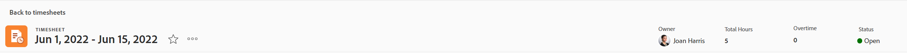
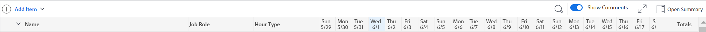

# Visão geral do layout da folha de horas

<!-- Audited: 12/2023 -->

<!--The highlighted information on this page refers to functionality not yet generally available. It is available only in the Preview environment for all customers or in Production for customers who enabled fast releases. 

For information about fast releases, see [Enable or disable fast releases for your organization](/help/quicksilver/administration-and-setup/set-up-workfront/configure-system-defaults/enable-fast-release-process.md).

For information about the current release schedule, see [Second Quarter 2024 release overview](/help/quicksilver/product-announcements/product-releases/24-q2-release-activity/24-q2-release-overview.md).-->

Este artigo descreve o layout das folhas de horas no Adobe Workfront, permitindo que você entenda melhor como personalizar e utilizar folhas de horas para gravar tempo.

As preferências de horas e folha de horas controlam o que aparece em uma folha de horas. Este artigo fornece uma visão geral de todas as opções disponíveis. Para obter informações sobre como selecionar as opções, consulte [Configurar preferências de horas e folha de horas](../../administration-and-setup/set-up-workfront/configure-timesheets-schedules/timesheet-and-hour-preferences.md).

Para obter informações sobre como registrar horas em uma planilha de horas, consulte [Registrar horas](../../timesheets/create-and-manage-timesheets/log-time.md).

Estas são as áreas de uma planilha de horas:

* [Cabeçalho da planilha de horas](#timesheet-header)
* [O painel esquerdo](#the-left-panel)
* [Itens de trabalho](#work-items)
* [Barra de Ferramentas](#toolbar)
* [Rodapé da folha de horas](#timesheet-footer)
* [Função de trabalho](#job-role)
* [Tipo de hora](#hour-type)
* [Área Atualizações no painel esquerdo](#updates-area-in-the-left-panel)
* [Painel de resumo](#summary-panel)
* [Intervalo de tempo e área de entrada de horas](#time-frame-and-hour-entry-area)
* [Comentários de entrada de hora](#hour-entry-comments)
* [Horas](#hours)
* [Totais](#totals)

## Cabeçalho da planilha de horas

O cabeçalho da folha de horas inclui as seguintes informações:

* O período da folha de horas.
* A área Ações que inclui o seguinte:
   * Um ícone de estrela para adicionar as folhas de horas à lista de Favoritos.
   * O ícone Mais com uma opção Excluir que permite excluir a folha de horas.
* O nome do proprietário da folha de horas.
* O número Total de Horas para horas registradas para itens exibidos na folha de horas.
* O número de horas extras. Esta é uma entrada manual e é visível somente quando a configuração **Hora extra** está habilitada em uma folha de horas. Para obter mais informações, consulte [Editar informações da folha de horas](../create-and-manage-timesheets/edit-timesheets.md).

>[!TIP]
>
>Você não pode registrar um número de horas extras maior que o total de horas atual na folha de horas. Por exemplo, se você registrou 7 horas na folha de horas até agora, não é possível registrar 8 horas extras.

* O status da folha de horas.

## O painel esquerdo

Você pode acessar as seguintes seções no painel esquerdo:

* **Folha de horas**: exibe a folha de horas real.
* **Atualizações**: exibe comentários e atualizações de sistema para a folha de horas. Para obter mais informações, consulte a seção [Área de atualizações no painel esquerdo](#updates-area-in-the-left-panel) neste artigo.

## Itens de trabalho

Os itens de trabalho são os projetos, tarefas e problemas para os quais você deseja registrar horas. Clicar na seta para baixo na linha de cabeçalho recolhe os projetos e as tarefas e problemas listados abaixo. Clicar na seta para baixo ao lado do nome de um projeto recolhe os itens de trabalho desse projeto.

Tarefas, problemas e projetos em que o tempo é registrado fora da folha de horas ou itens planejados durante o período da folha de horas aparecem aqui automaticamente.

## Barra de Ferramentas

A barra de ferramentas inclui as seguintes opções:

* O botão **Adicionar item**, que permite adicionar projetos, tarefas ou problemas.
* O ícone de filtro rápido para procurar tarefas ou problemas na folha de horas.
* A configuração **Mostrar comentários**, que permite exibir ou ocultar comentários de horas registrados para entradas de horas de projetos, tarefas ou problemas.
* O ícone de tela cheia para exibir a folha de horas no modo de tela cheia.
* O botão **Abrir Resumo** (ou **Fechar Resumo**) para abrir ou fechar o painel Resumo para ver informações adicionais sobre tarefas ou problemas. Este botão não está disponível para projetos.

Para obter mais informações, consulte [Log time](../create-and-manage-timesheets/log-time.md).

## Rodapé da folha de horas

Você pode clicar nos botões **Enviar para Aprovação**, **Fechar**, **Aprovar** e **Rejeitar** nesta área para fechar ou rejeitar uma aprovação de planilha de horas.

Esta área também contém informações sobre quando a folha de horas foi salva pela última vez. Todas as alterações feitas nas informações na folha de horas são salvas automaticamente.

## Função no trabalho

Você pode selecionar uma função de trabalho diferente para associar às entradas de hora. O administrador do Workfront deve habilitar manualmente a configuração **Atribuir funções a entradas de hora**. A função de trabalho especificada para você quando está atribuído à tarefa ou o problema é exibido por padrão. Se você não recebeu uma função de trabalho na tarefa ou no problema, sua Função principal é exibida como padrão. Para obter mais informações, consulte [Configurar preferências de horas e folha de horas](../../administration-and-setup/set-up-workfront/configure-timesheets-schedules/timesheet-and-hour-preferences.md).

Você pode registrar várias entradas de horas para o mesmo item de trabalho para diferentes funções. Para obter mais informações, consulte [Log time](../create-and-manage-timesheets/log-time.md).

## Tipo de hora

Você pode selecionar diferentes tipos de horas para associar às suas entradas de horas em cada item. Esse campo é exibido somente quando ativado pelo administrador do Workfront para o seu ambiente. Para obter informações, consulte [Configurar preferências de horas e folha de horas](../../administration-and-setup/set-up-workfront/configure-timesheets-schedules/timesheet-and-hour-preferences.md).

Você pode registrar várias entradas de horas para o mesmo item de trabalho para diferentes tipos de horas. Para obter mais informações, consulte [Log time](../create-and-manage-timesheets/log-time.md).

## Área Atualizações no painel esquerdo

Você pode fazer comentários em uma folha de horas para se comunicar com seus aprovadores de folha de horas ou outros usuários na seção Atualizações no painel esquerdo da folha de horas.

Quaisquer comentários feitos na folha de horas são exibidos nesta área.

## Painel de resumo

Você pode acessar o painel Resumo para tarefas ou problemas exibidos em uma folha de horas. Aqui, você pode comentar em tarefas e problemas ou atualizar suas informações. Para obter mais informações, consulte [Resumo geral](../../workfront-basics/the-new-workfront-experience/summary-overview.md).

Os comentários inseridos para itens de trabalho no painel Resumo da folha de horas são exibidos na área Atualizações da tarefa ou do problema. O painel Resumo não está disponível para projetos.

## Intervalo de tempo e área de entrada de horas

O período da folha de horas é exibido à direita dos itens de trabalho.

Você pode criar folhas de horas para uma, duas ou quatro semanas.

O intervalo de tempo é exibido em incrementos de semana inteira. Os dias fora do período da folha de horas especificado estão esmaecidos. Você não pode registrar horas de dias que estejam fora do período da folha de horas.

Para obter informações, consulte [Criar uma folha de horas de uso único](../create-and-manage-timesheets/create-tmshts.md) ou [Criar, editar e atribuir perfis de folha de horas](../create-and-manage-timesheets/create-timesheet-profiles.md).

<!--drafted for the resize columns in timesheets story - make this blurb a TIP when the story is released: 
You can resize the columns that display different weeks, the time frame, or the work item areas by dragging and dropping the vertical lines that separate them.-->

## Comentários de entrada de hora

Você pode adicionar um comentário para cada entrada de hora adicionada à folha de horas.

Os comentários inseridos na caixa de comentário de entrada de horas são exibidos na folha de horas, em cada item de trabalho em que você registrou a hora quando a configuração **Mostrar comentários** está habilitada na barra de ferramentas.

## Horas

A folha de horas fornece campos de entrada para cada item de trabalho e dia do intervalo da folha de horas para registrar o tempo gasto trabalhando no item. À medida que você registra horas, o item para o qual você registra horas é destacado em azul claro e a caixa de horas é contornada em azul escuro.

## Totais

Revise a soma de todas as horas inseridas na folha de horas, resumidas por dia (no cabeçalho da folha de horas) e por objeto (na última coluna).
