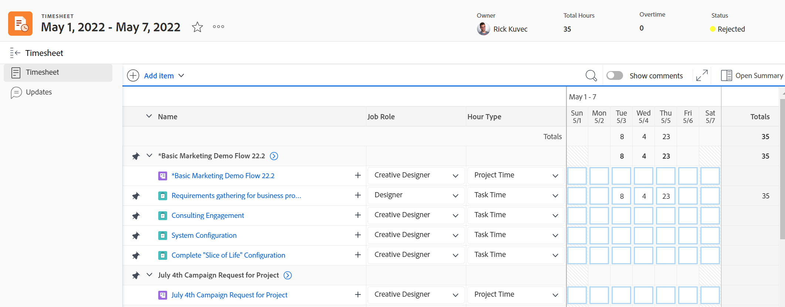

# Visão geral das planilhas de horas

Você pode usar folhas de horas para rastrear o tempo que você gasta no trabalho no Adobe Workfront.

Como administrador de grupo ou da Workfront, você pode criar folhas de horas e associá-las aos usuários. Para obter informações sobre como criar planilhas de horas, consulte [Criar e gerenciar planilhas de horas](../create-and-manage-timesheets/create-and-manage-timesheets.md).

Uma folha de horas é uma tabela semelhante a uma grade que exibe itens de trabalho e uma área de calendário. Você pode registrar horas para itens e associá-las ao dia em que o trabalho foi executado. Rastreia seu tempo de trabalho real no Workfront. Há também uma área na planilha de horas em que você pode registrar horas para itens não relacionados ao trabalho, como reuniões, treinamento ou tempo fora do escritório.

Para obter informações sobre o layout da folha de horas no Adobe Workfront, consulte [Entender o layout de Planilha de Horas](../../timesheets/timesheets/timesheet-layout.md).

Você pode registrar horas no Workfront de várias maneiras, geralmente no nível do projeto, tarefa ou problema em que o trabalho é executado. As horas reportadas em tarefas, problemas e projetos também são exibidas em sua Planilha de Horas.

Você também pode registrar horas para trabalho fora do projeto, em Horas Gerais. As horas gerais podem ser registradas somente em sua folha de horas.

Para obter mais informações sobre onde você pode registrar horas no Workfront, consulte [Registrar tempo](../../timesheets/create-and-manage-timesheets/log-time.md).

>[!TIP]
>
>O aplicativo móvel Workfront também permite publicar atualizações, alterar o tempo registrado, inserir comentários e fechar sua folha de horas.

## Requisitos de acesso

Você deve ter o seguinte para executar as etapas deste artigo:

<table style="table-layout:auto"> 
 <col> 
 <col> 
 <tbody> 
  <tr> 
   <td role="rowheader">plano do Adobe Workfront</td> 
   <td> 
Qualquer Um
 </td> 
  </tr> 
  <tr> 
   <td role="rowheader">Licença do Adobe Workfront</td> 
   <td> 
Plano 
 </td> 
  </tr> 
  <tr> 
   <td role="rowheader">Configurações de nível de acesso*</td> 
   <td> 
Você deve ter acesso administrativo a Planilhas de Horas. 
 
Para obter mais informações, consulte <a href="../../administration-and-setup/add-users/configure-and-grant-access/grant-users-admin-access-certain-areas.md" class="MCXref xref">Conceder aos usuários acesso administrativo a determinadas áreas</a>.
 
<b>Nota</b>

Se você ainda não tiver acesso, pergunte ao administrador do Workfront se ele definiu restrições adicionais em seu nível de acesso. Para obter informações sobre como um administrador do Workfront pode modificar seu nível de acesso, consulte <a href="../../administration-and-setup/add-users/configure-and-grant-access/create-modify-access-levels.md" class="MCXref xref">Criar ou modificar níveis de acesso personalizados</a>.
 </td>
</tr> 
 </tbody> 
</table>

&#42;Para descobrir seu plano, tipo de licença ou acesso, entre em contato com o administrador do Workfront.

## Entender o tempo do projeto e o tempo não relacionado ao projeto

As planilhas de horas fornecem aos usuários uma forma simples de monitorar o tempo de trabalho de projetos e não projetos:

* **Hora do Projeto:** Diretamente da tarefa ou projeto no qual você deseja rastrear o tempo.

  Horas registradas para tarefas, problemas e projetos por meio de uma folha de horas são associadas aos respectivos itens de trabalho para fornecer uma representação precisa do esforço gasto em projetos e tarefas. Sem a inserção de horas precisas, os dados podem não ser precisos se destinados a fins de faturamento.

  Além disso, quando um recurso registra horas diretamente em tarefas, problemas e projetos aparecem automaticamente quando o usuário acessa a folha de horas. Isso pressupõe que o intervalo de datas da folha de horas abrange as datas em que as horas foram registradas.

* **Hora Não Relacionada ao Projeto:** Diretamente na planilha de horas do usuário. Para obter mais informações sobre como rastrear o tempo no Workfront, consulte   [Registrar tempo](../../timesheets/create-and-manage-timesheets/log-time.md).

  Em uma folha de horas, um recurso pode registrar horas de férias, horas de licença médica, horas gastas em trânsito, horas gastas reparando ou mantendo equipamentos ou quaisquer tipos de horas gerais de licença que você deseja criar.

## Acessar folhas de horas na área Folhas de horas

Para obter informações sobre todas as áreas do Workfront em que você pode registrar horas, consulte [Registrar tempo](../../timesheets/create-and-manage-timesheets/log-time.md).

Para acessar uma planilha de horas:

1. Clique em **Menu principal** ícone  no canto superior direito, ou na guia **Menu principal** ícone  no canto superior esquerdo do Workfront, se disponível, clique em Folhas de horas.

   A área Folhas de horas é exibida e todas as folhas de horas que pertencem a você ou que você tem acesso para visualizar são exibidas, por padrão.

   

1. Clique em uma das seguintes opções no canto superior direito para exibir um número limitado de folhas de horas:

   * **Minhas Planilhas de Horas** para exibir somente suas planilhas de horas.

   

   * **Minhas planilhas de horas aprovadas** para exibir somente as planilhas de horas que você aprova.

     

   Uma lista filtrada de folhas de horas é exibida.

1. (Opcional) Atualize a exibição, o filtro e o agrupamento na parte superior da lista de folhas de horas. Para obter mais informações, consulte [Elementos de relatórios: filtros, visualizações e agrupamentos](../../reports-and-dashboards/reports/reporting-elements/reporting-elements-overview.md).

1. Clique em **Intervalo de datas** de uma folha de horas para abri-la.

   Cada planilha de horas exibe todas as tarefas, problemas e projetos para os quais você fez logon. Uma folha de horas também exibe até 45 tarefas, problemas ou projetos que são atribuídos a você com datas dentro do período da folha de horas, mas para os quais você pode não ter registrado tempo ainda.

   Para obter mais informações, consulte [Configurar preferências de horas e planilha de horas](../../administration-and-setup/set-up-workfront/configure-timesheets-schedules/timesheet-and-hour-preferences.md).

