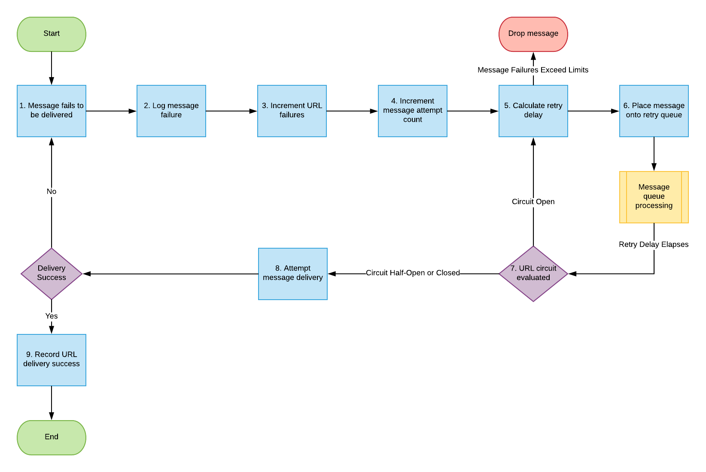

# Tentativas de assinatura do evento

Ao implementar um sistema de entrega de mensagens, há algumas limitações que devem ser abordadas para garantir a estabilidade, consistência e boa experiência do usuário. Uma das deficiências de um sistema de entrega de mensagens é garantir que as mensagens cheguem ao destino com sucesso e saber o que fazer quando as mensagens não chegarem.

Algumas integrações podem aceitar a falha de entrega e, em seguida, soltar a mensagem e mover para a próxima mensagem.  Em outras integrações, a falha no delivery de uma mensagem não pode ser ignorada. Por exemplo, uma integração financeira pode tentar entregar uma mensagem, mas ao invés disso recebe um código de status HTTP 404, indicando que o servidor não conseguiu encontrar o terminal para o qual a mensagem seria entregue. Em tais casos, uma mensagem ausente poderia significar que alguém não seria pago pelo seu tempo ou por uma organização que ultrapassasse o orçamento com recursos contratados.

## Estratégia Adobe Workfront para tentativas de assinatura de evento

Como os clientes usam a plataforma Workfront como parte essencial do seu trabalho diário de conhecimento, a estrutura Workfront Event Subscription fornece um mecanismo para garantir que o delivery de cada mensagem seja tentado o mais possível.

Mensagens de saída acionadas por evento que não são entregues aos endpoints do cliente são reenviadas até que o delivery seja bem-sucedido por até um período de 48 horas. Durante esse tempo, as tentativas ocorrem em uma frequência cada vez menor até que o delivery seja bem-sucedido ou até que 48 horas tenham decorrido.

Os clientes precisam garantir que todos os endpoints que consumem mensagens de saída das Assinaturas de eventos do Workfront sejam configurados para retornar uma mensagem de resposta de nível 200 para o Workfront quando a entrega for bem-sucedida.

## Lidar com mensagens de saída com falha acionadas por eventos

O fluxograma a seguir mostra a estratégia para tentar recriar deliveries de mensagem com assinaturas de evento do Workfront:

As explicações a seguir correspondem às etapas descritas no fluxograma:

1. A mensagem não é entregue.
1. As informações de falha do delivery de mensagens são registradas.

   Todas as tentativas com falha de entregar uma mensagem são registradas para que a depuração possa ser executada para determinar a causa raiz de uma determinada falha ou série de falhas.

1. Falhas de URL aumentadas.
1. A contagem de tentativas de mensagem é aumentada.
1. Calcule o atraso até que o delivery desta mensagem seja tentado novamente.
1. A mensagem é colocada na fila de tentativas de mensagem.

   Conforme mostrado no fluxograma anterior, a fila de mensagens usada para processar novas tentativas de delivery de mensagens é uma fila separada da que processa a tentativa de delivery inicial de cada mensagem. Isso permite que o fluxo quase em tempo real de mensagens continue desimpedido pela falha de qualquer subconjunto de mensagens.

1. O status do circuito de URL é avaliado. Um dos seguintes ocorre:

   * Se o circuito estiver aberto e não permitir deliveries no momento, reinicie o processo na etapa 5.
   * Se o circuito estiver meio aberto, isso implica que nosso circuito está aberto no momento, mas foi passado tempo suficiente para permitir que o teste do URL verifique se o problema com o delivery foi resolvido.
   * Se os limites da tentativa de delivery de mensagem tiverem sido atingidos (48 horas após a tentativa), a mensagem será ignorada

1. Se o circuito do URL estiver fechado e permitir entregas, tente entregar a mensagem. Se esse delivery falhar, a mensagem será reiniciada na etapa 1

1. Se o circuito do URL estiver fechado e permitir entregas, tente entregar a mensagem. Se esse delivery falhar, a mensagem será reiniciada na etapa 1.

   <!--
   <li value="10" data-mc-conditions="QuicksilverOrClassic.Draft mode">Workfront disables Event Subscriptions when both of the following criteria are met:
   <ul>
   <!--
   <li data-mc-conditions="QuicksilverOrClassic.Draft mode">The Event Subscription has failed 1000 delivery attempts consecutively</li>
   <li data-mc-conditions="QuicksilverOrClassic.Draft mode">48 hours have passed since the last successful delivery</li>
   </ul></li>
   -->
