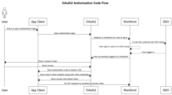

# Configure e use os aplicativos OAuth 2 personalizados de sua organização usando o fluxo do código de autorização

Para se integrar ao Workfront e permitir que seu aplicativo cliente se comunique com o Workfront em nome do usuário, é necessário:

* Criar um aplicativo OAuth2
* Configurar o aplicativo de terceiros
* Link para a página Autorizar para seus usuários
* Configurar Fluxo do Código de Autorização: Os usuários fazem logon na instância do Workfront e consentiram que o aplicativo do cliente se conecte ao Workfront em seu nome. Como resultado, você obtém um código de autorização que será trocado com tokens de acesso e atualização.
* Configurar Fluxo de Token de Atualização: Nesse fluxo, você usa o token de atualização para obter um novo token de acesso quando o antigo expirar.

## Criar um aplicativo OAuth2

Para obter instruções sobre como criar o aplicativo OAuth2, consulte [Criar um aplicativo OAuth2 usando credenciais do usuário (fluxo do código de autorização)](../../administration-and-setup/configure-integrations/create-oauth-application.md#create3) em [Criar aplicativos OAuth2 para integrações do Workfront](../../administration-and-setup/configure-integrations/create-oauth-application.md)

## Link para a página Autorizar para seus usuários

Seus usuários precisam fazer logon para autorizar essa integração em suas próprias contas. A página para que eles autorizem tem um formato específico, descrito aqui. Use essas informações para determinar o endereço da página de autorização do aplicativo e fornecer aos usuários esse endereço ou link para ele.

* O URL completo do domínio de sua organização. Exemplo:

   ```
   https://myorganization.my.workfront.com
   ```


* `client_id`: Essa é a ID do cliente gerada ao criar o aplicativo OAuth2 no Workfront.

* `redirect_uri`: Este é o URL de redirecionamento inserido ao criar o aplicativo. Seus usuários serão direcionados a esta página depois que autorizarem o aplicativo para sua conta.

* `response_type`: Isso deve ter o valor `code`.

Portanto, o URL da página de autorização é:

```
https://<URL of your organization's domain>/integrations/oauth2/authorize?client_id=<Your ClientID>&redirect_uri=<Your redirect URL>&response_type=code
```

>[!NOTE]
>
>Recomendamos criar um botão ou outro link em que os usuários possam clicar para ser direcionado para essa página.

## Configurar o aplicativo de terceiros

O aplicativo de terceiros pode exigir configuração. A tabela a seguir contém informações sobre campos que podem ser necessários ao configurar o aplicativo de terceiros.

<table style="table-layout:auto"> 
 <col> 
 <col> 
 <tbody> 
  <tr> 
   <td role="rowheader">URI de autorização</td> 
   <td> <p><code>https://&lt;the full URL of your organization's domain&gt;/integrations/oauth2/authorize</code> </p> <p class="example" data-mc-autonum="<b>Example: </b>"><span class="autonumber"><span><b>Exemplo: </b></span></span><code> https://myorganization.my.workfront.com/integrations/oauth2/authorize</code> </p> </td> 
  </tr> 
  <tr> 
   <td role="rowheader">URL do token</td> 
   <td> <p><code>https://&lt;the full URL of your organization's domain&gt;/integrations/oauth2/api/v1/token</code> </p> <p class="example" data-mc-autonum="<b>Example: </b>"><span class="autonumber"><span><b>Exemplo: </b></span></span><code>https://myorganization.my.workfront.com/integrations/oauth2/api/v1/token</code> </p> </td> 
  </tr> 
  <tr> 
   <td role="rowheader">Escopos</td> 
   <td>Não é necessário especificar escopos. </td> 
  </tr> 
 </tbody> 
</table>

## Configurar Fluxo do Código de Autorização



Para fazer logon de seus usuários com o OAuth2, use o seguinte processo:

1. Quando o usuário abre a página de autorização, ele redireciona para a página de logon da Workfront, para que possa fazer logon no Workfront. Se o usuário tiver uma configuração de SSO, a página de logon do provedor de identidade será aberta.

   Se o usuário já estiver conectado ao Workfront nesse mesmo navegador, ou se o usuário fizer logon com êxito no Workfront, o usuário será redirecionado para a tela de consentimento:

   

1. Se o usuário Permitir o acesso, a página será redirecionada para a `redirect_url`. O redirecionamento deve incluir os seguintes parâmetros de consulta:

* `code`: O código de autorização necessário para obter o token de acesso/atualização.
* `domain`: Domínio de sua organização. Exemplo: em `myorganization.my.workfront.com`, o domínio é `myorganization`.
* `lane`: a faixa da solicitação. Exemplo: em `myorganization.preview.workfront.com`, a faixa é `preview`.

   >[!IMPORTANT]
   >
   >O `code` é válido apenas por 2 minutos. Portanto, você deve obter os tokens de atualização e acesso dentro desse tempo.

1. Quando você tem um código, pode solicitar atualização e acessar tokens, enviando o código junto com as credenciais do aplicativo do cliente para o `/integrations/oauth2/api/v1/token` endpoint .

   O URL de solicitação de token completo é

   ```
   https://<URL of your organization's domain></span>/integrations/oauth2/api/v1/token
   ```

   **Exemplos:**  Exemplo de chamada de CURL para o endpoint do token:

   Exemplo 1

   ```
      curl --location --request POST '**<workfront host>**/integrations/oauth2/api/v1/token' \
      --header 'Authorization: Basic **<base64(client_id:client_secret)>**' \
      --header 'Content-Type: application/json' \
      --data-raw '{
      "code": "**<code>**",
      "grant_type": "**authorization_code**",
      "redirect_uri": "**<redirect_url>**"
      }'
   ```

   Exemplo 2

   ```
      curl --location --request POST '**<workfront host>**/integrations/oauth2/api/v1/token' \
      --header 'Content-Type: application/x-www-form-urlencoded' \
      --data-urlencode 'grant_type=**authorization_code**' \
      --data-urlencode 'redirect_uri=**<redirect_url>**' \
      --data-urlencode 'code=**<code>**' \
      --data-urlencode 'client_id=**<client_id>**' \
      --data-urlencode 'client_secret=**<client_secret>**'  
   ```


   >[!IMPORTANT]
   >
   > O segredo do cliente foi gerado ao registrar o aplicativo no Workfront. Você deve armazená-lo em um local seguro, pois ele não pode ser recuperado se for perdido.

   Quando todos os parâmetros transmitidos estão corretos, o ponto de extremidade do token retorna a seguinte carga:

   ```
   {
      "token_type": "sessionID",
      "access_token": "string", // the value of sessionID
      "refresh_token": "string",
      "expires_in": 0,
      "wid": "string"
   }
   ```

   O token de acesso é igual ao ```sessionID```e expira da mesma forma que o regular ```sessionID```

   >[!IMPORTANT]
   >
   > Armazene o token de atualização em um local seguro. Você precisará dele para obter um novo token de atualização quando o antigo expirar. O Workfront não armazena o token de atualização.

1. Agora, quando você tem um token de acesso, é possível fazer chamadas de API para o Workfront

   ```
   curl --request GET 'https://<workfront host>/attask/api/v14.0/proj/search \
   --header 'sessionID: <access_token>'
   ```

## Configurar o token de acesso de atualização


Para atualizar o access_token, precisamos fazer uma chamada &#39;POST&#39; para o endpoint do token. Desta vez, enviamos dados de formulário diferentes da seguinte maneira:

```
curl --location --request POST '<workfront host>/integrations/oauth2/api/v1/token' \
--header 'Authorization: Basic <base64(client_id:client_secret)>' \
--header 'Content-Type: application/json' \
--data-raw '{
   "grant_type": "refresh_token",
   "refresh_token": "<refresh_token>"
}'

###### OR

curl --location --request POST '<workfront host>/integrations/oauth2/api/v1/token' \
--header 'Content-Type: application/x-www-form-urlencoded' \
--data-urlencode 'grant_type=refresh_token' \
--data-urlencode 'redirect_uri=<redirect_url>' \
--data-urlencode 'refresh_token=<refresh_token>' \
--data-urlencode 'client_id=<client_id>' \
--data-urlencode 'client_secret=<client_secret>'
```

Ele retornará o seguinte resultado:

```
{
  "token_type": "sessionID",
  "access_token": "string", // the value of sessionID
  "refresh_token": "string",
  "expires_in": 0,
  "wid": "string"
}
```

E novamente, o token de acesso é o `sessionID` que pode ser usada para fazer uma solicitação de API ao Workfront.
