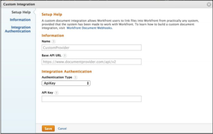

# Registrar uma integração do Webhook

Os administradores do Adobe Workfront podem adicionar uma integração de webhook personalizada para a empresa navegando até Configuração > Documentos > Integrações personalizadas no Workfront. Na página Integração personalizada da Configuração, os administradores podem exibir uma lista de integrações existentes do Webhook. Nessa página, as integrações podem ser adicionadas, editadas, ativadas e desativadas.

Para adicionar uma integração, clique em **Adicionar Integração Personalizada**.

## Campos disponíveis

Ao adicionar uma integração, o administrador inserirá valores nos seguintes campos.

<table style="table-layout:auto"> 
 <col> 
 <col> 
 <thead> 
  <tr> 
   <th>Nome do Campo</th> 
   <th>Descrição</th> 
  </tr> 
 </thead> 
 <tbody> 
  <tr> 
   <td>Nome</td> 
   <td>O nome dessa integração.</td> 
  </tr> 
  <tr> 
   <td>URL da API base</td> 
   <td> 
O local da API de retorno de chamada. Ao fazer chamadas para o sistema externo, o Workfront simplesmente anexará o nome do endpoint a esse endereço. Por exemplo, se o administrador inseriu o URL da API de base, " https://www.mycompany.com/api/v1 ", o Workfront usaria o seguinte URL para obter os metadados de um documento: https://www.mycompany.com/api/v1/metadata?id=1234.
 </td> 
  </tr> 
  <tr> 
   <td>Parâmetros de solicitação</td> 
   <td> 
Valores opcionais a serem acrescentados à querystring de todas as chamadas para a API. Por exemplo, access_type 
 </td> 
  </tr> 
  <tr> 
   <td>Tipo de autenticação</td> 
   <td>OAuth2 ou ApiKey</td> 
  </tr> 
  <tr> 
   <td>URL de autenticação</td> 
   <td> 
(Somente OAuth2) O URL completo usado para autenticação de usuário. O Workfront navegará os usuários para esse endereço como parte do processo de provisionamento do OAuth. Observação: o Workfront anexará um parâmetro de "estado" à cadeia de caracteres de consulta. O provedor deve transmitir isso de volta para o Workfront, anexando-o ao URI de redirecionamento do Workfront.
 </td> 
  </tr> 
  <tr> 
   <td>URL token da extremidade final</td> 
   <td> 
(Somente OAuth2) O URL completo da API usado para recuperar tokens OAuth2. Ele é hospedado pelo provedor de webhook ou pelo provedor de documento externo
 </td> 
  </tr> 
  <tr> 
   <td>ID do cliente</td> 
   <td>(Somente OAuth2) A ID do cliente OAuth2 para essa integração</td> 
  </tr> 
  <tr> 
   <td>Segredo do cliente</td> 
   <td> 
(Somente OAuth2) O segredo do cliente OAuth2 para essa integração
 </td> 
  </tr> 
  <tr> 
   <td>URL de redirecionamento do Workfront</td> 
   <td>(Somente OAuth2) Esse é um campo somente leitura gerado pelo Workfront. Esse valor é usado para registrar essa integração com o provedor de documentos externos. Observação: Conforme descrito acima para o URL de Autenticação, o provedor deve anexar o parâmetro "state" e seu valor à querystring ao executar o redirecionamento.</td> 
  </tr> 
  <tr> 
   <td>ApiKey</td> 
   <td> 
(Somente ApiKey) Usado para fazer chamadas de API autorizadas para o provedor de webhook. A chave da API emitida pelo provedor do webhook.
 </td> 
  </tr> 
 </tbody> 
</table>
