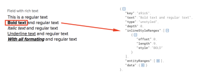

# Campos de rich text na API do Adobe Workfront

Alguns objetos no Adobe Workfront permitem o armazenamento de texto com formatação Rich Text. Na API do Workfront, o rich text é armazenado como JSON usando a estrutura de código aberto Draft.js.

## Exemplo de visão geral

Um campo personalizado com formatação Rich Text é chamado **Campo com rich text** e podem ter os seguintes valores associados a ela:

**Exemplo:** Uma solicitação básica do GET para recuperar o valor do campo de formulário personalizado **Campo com rich text**:

<!-- [Copy](javascript:void(0);) -->
<pre><OBJ Code><OBJ ID><OBJ Code><OBJ ID></pre>

**Exemplo:** Essa solicitação retornará o valor de **Campo com rich text** no JSON armazenado na **parameterValue** **DE:Campo com rich text**

<!-- [Copy](javascript:void(0);) -->
<pre></pre>

**Exemplo:** Esta é uma versão formatada da resposta mostrada na figura logo acima

<!-- [Copy](javascript:void(0);) -->
<pre></pre>

## Blocos

Os objetos JSON que armazenam o conteúdo rich text são compostos de duas partes principais: **blocos** e **entityMaps**.

Um bloco é um objeto JSON que representa uma única linha de texto formatado. Como um único campo personalizado pode ter mais de uma linha de texto, cada linha de texto tem seu próprio bloco e cada bloco é representado como um elemento em uma matriz principal chamada **blocos**.

**Exemplo:** Aqui, cada linha de texto de um campo personalizado mapeia para um elemento de bloco nos blocos de matriz

Como cada elemento de bloco também é um objeto JSON, cada bloco é composto pelos elementos : **key**, **texto**, **type**, **profundidade**, **inlineStyleRanges**, **entityRanges** e **dados**. Cada um desses elementos funciona como o seguinte:

* **Chave** é o identificador exclusivo para esse bloco. A chave é usada para mapear uma linha de texto via entityMaps. Detalhes sobre entityMaps podem ser encontrados na seção entityMaps deste documento.
* **Texto** é a linha de conteúdo de texto que está sendo armazenada a partir do campo personalizado.
* **Tipo** descreve o tipo de texto que está sendo representado. Por exemplo, uma linha de texto que está sendo armazenada em um bloco pode ser parte de uma lista. Se essa linha de texto fizesse parte de uma lista não ordenada, seu tipo seria definido como: item de lista não ordenado.
* No momento, as listas não são compatíveis, mas devem estar disponíveis em breve.
* **Profundidade** Esse parâmetro define a profundidade da linha quando ela é uma parte aninhada de uma lista ordenada ou não ordenada.
* **inlineStyleRanges** É uma matriz que descreve os tipos de formatação aplicados à linha de texto representada pelo bloco atual.

**Exemplo:** Esta é uma matriz inlineStyleRanges que descreve cada estilo no nível do caractere. Nesse caso: 9 caracteres (comprimento: 9) a partir do índice 0 (deslocamento: 0) tinha o estilo **Negrito** aplicada:

No caso de vários tipos de formatação terem sido aplicados a uma única linha, os estilos serão mapeados para elementos adicionais na matriz** inlineStyleRanges**.

**Exemplo:** Esta é a aparência de um bloco ao armazenar uma linha de texto que contém a formatação mista: **Texto negrito e itálico**

<!-- [Copy](javascript:void(0);) -->
<pre></pre>

>[!NOTE]
>
>Todas as versões após a versão 20.3 oferecerão suporte às opções de formatação em negrito, itálico e sublinhado.

## entityMaps e entityRanges

Um bloco de dados pode conter entidades como hiperlinks ou outros tipos de formatação estilizada que estão conectados a fontes de dados localizadas fora do campo de texto personalizado.

## Exemplos

### Recuperação de texto simples do JSON

Quando um campo personalizado com formatação Rich Text é enviado, todo o texto é armazenado na matriz **blocos**. No entanto, cada linha do texto completo é armazenada no **parâmetro de texto** dentro de cada um dos elementos de bloco separados que compõem a matriz principal **blocos**. Assim, para recuperar o texto completo, cada linha de texto separada precisa ser extraída e separada. Isso pode ser feito fazendo o loop sobre todos os elementos em blocos e concatenando cada parâmetro de texto junto com um delimitador de linha (\n).

**Exemplo:** Esta é a aparência do seu JS:

<!-- [Copy](javascript:void(0);) -->
<pre></pre>

### Salvar um valor de campo de rich text usando a API do Workfront

Para salvar os seguintes valores de um campo rich text usando a API do Workfront:
<pre>
		Hello <strong>World</strong>!!
		Este é o meu primeiro <strong>Texto formatado</strong></pre>

1. Construa o JSON que representa o valor do campo rich text que você está tentando capturar organizando cada linha de texto em um elemento de bloco, na matriz **blocos**

   <!-- [Copy](javascript:void(0);) -->
   <pre></pre>

1. Capture a formatação Rich Text usando o **inlineStyleRanges** parâmetro

   <!-- [Copy](javascript:void(0);) -->
   <pre></pre>

1. Para capturar a segunda linha, o texto &quot;Rich Text&quot; deve ser formatado em negrito e itálico.

   <!-- [Copy](javascript:void(0);) -->
   <pre></pre>

   >[!NOTE]
   >
   >Embora a funcionalidade do entityMap não seja suportada durante a versão inicial, ainda é um campo obrigatório para transmitir esse JSON em uma solicitação

1. Use o **stringify** no JSON descrito acima para criar um **PUT** solicitar e enviar atualizações

   <!-- [Copy](javascript:void(0);) -->
   <pre><OBJ Code><OBJ ID></pre>
