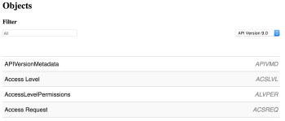
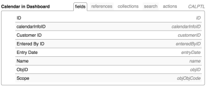
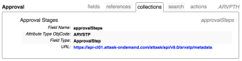

# Uso do API Explorer

Ao usar a API principal do Adobe Workfront, o API Explorer é uma ferramenta de referência herdada que cataloga as relações entre recursos, parâmetros e variáveis compatíveis.

## Acesse o API Explorer:

1. Use um navegador da Web para navegar até o [API Explorer](https://one.workfront.com/s/api-explorer)\
   

1. No canto superior direito do API Explorer, selecione a opção desejadaWorkfront **Versão da API** por padrão, a versão mais atual é selecionada automaticamente
1. O **Filtro** , pode ser usado para filtrar os objetos listados por nome e truncará a lista de objetos exibidos adequadamente:

   

   * **Campos**: Campos disponíveis no objeto especificado.
   * **Referências**: Variáveis de referência disponíveis para o objeto especificado. Uma referência é um alias para uma variável. Uma vez inicializada, uma referência pode ser usada alternadamente com o nome da variável. Uma referência usa memória inicializada.
   * **Coleções**: Coleções disponíveis para o objeto. As coleções são variáveis que representam uma relação um para muitos entre o objeto e o recurso.
   * **Pesquisar**: Recursos de pesquisa disponíveis para o objeto. Os resultados de uma pesquisa são baseados nos parâmetros de consulta especificados pelo recurso de pesquisa na solicitação da API.
   * **Ações**: Ações compatíveis com o objeto. As ações podem ser procedimentos simples ou complexos que são executados em relação a um recurso ou conjunto de recursos. Uma determinada ação também pode afetar os recursos relacionados.

1. Abra uma guia e clique na ID do objeto para exibir as variáveis aplicáveis.\
   \
   Dependendo do objeto selecionado, as seguintes variáveis podem se aplicar:

   | Variável | Definição |
   |---|---|
   | Nome do Campo | O nome de um campo usado em uma operação dentro da API do Workfront. |
   | Tipo de campo | O tipo de valor que pode ser inserido em um campo específico em uma tabela de dados. Os possíveis valores do tipo de campo incluem string, double, int, dateTime. |
   | Tipo Enumerado | O tipo de valor que pode ser usado para identificar um tipo de dados. |
   | Valores possíveis | Valores aceitáveis para o objeto. |
   | Tipo de atributo ObjCode | Atributos que podem ser usados para modificar a classe de objetos. |
   | URL | O caminho de entrada que permite ao aplicativo se comunicar com a API do Workfront. |
   | Argumentos | As variáveis do objeto que podem ser passadas entre seu aplicativo e o Workfront. |
   | Tipo de resultado | Tipos de dados permitidos que podem ser retornados de um método. |
